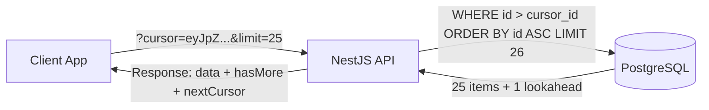

# API & Contract Conventions Guide

This document establishes the official REST API design standards, routing structure, error envelope specifications, cursor pagination mechanics, and Zod contract ownership for VYNOR CRM.

---

## 1. Route & Resource Naming Conventions (FND-036)

All VYNOR CRM HTTP APIs are hosted under a strict global versioned prefix:

```text
/api/v1/<resource-collection>
```

### 1.1 Resource Naming Rules

1. **Plural Nouns:** Endpoints represent collections of resources named using lowercase plural nouns:
   - `/api/v1/workspaces`
   - `/api/v1/conversations`
   - `/api/v1/messages`
   - `/api/v1/contacts`
   - `/api/v1/campaigns`
   - `/api/v1/teams`
2. **Hierarchy & Nesting Limit:** Nesting is limited to a maximum of **one level deep**:
   - ✅ Allowed: `/api/v1/conversations/:id/messages` (sub-collection directly owned by conversation)
   - ❌ Prohibited: `/api/v1/workspaces/:wid/conversations/:cid/messages/:mid/attachments`
   - **Alternative:** Use top-level collections with query parameter filtering:
     - `/api/v1/messages?conversationId=:cid`
3. **Custom Actions on Resources:**
   When an operation cannot be expressed as a standard CRUD verb, use a controller action sub-path via `POST`:
   - `POST /api/v1/conversations/:id/assign`
   - `POST /api/v1/conversations/:id/close`
   - `POST /api/v1/campaigns/:id/launch`

---

## 2. HTTP Methods & Status Codes (FND-036)

| Method       | Target                  | Primary Status Codes          | Semantic Meaning                                                |
| :----------- | :---------------------- | :---------------------------- | :-------------------------------------------------------------- |
| **`GET`**    | Collection / Entity     | `200 OK`                      | Safe, idempotent read operation.                                |
| **`POST`**   | Collection              | `201 Created`, `202 Accepted` | Create a new entity or trigger an asynchronous background task. |
| **`PATCH`**  | Specific Entity (`:id`) | `200 OK`                      | Partial update of entity attributes.                            |
| **`PUT`**    | Specific Entity (`:id`) | `200 OK`                      | Full replacement (discouraged; prefer `PATCH`).                 |
| **`DELETE`** | Specific Entity (`:id`) | `204 No Content`, `200 OK`    | Delete or soft-delete an entity.                                |

### Standard Error Status Codes

- `400 Bad Request`: Malformed syntax, invalid query parameters, or missing mandatory headers.
- `401 Unauthorized`: Missing, expired, or cryptographically invalid Bearer JWT.
- `403 Forbidden`: Authenticated user lacks required permissions or membership in workspace.
- `404 Not Found`: Targeted resource does not exist or user lacks permission to know it exists.
- `409 Conflict`: Concurrency conflict or duplicate request (`IDEMPOTENCY_CONFLICT`).
- `422 Unprocessable Entity`: Request body failed schema validation (`VALIDATION_FAILED`).
- `429 Too Many Requests`: Rate limit threshold exceeded.
- `500 Internal Server Error`: Unexpected unhandled server exception.

---

## 3. Standard API Error Envelope (FND-037)

All error responses return an RFC-7807 compliant JSON envelope:

```typescript
export interface ApiErrorResponse {
  statusCode: number; // HTTP status code (e.g. 422, 403)
  code: string; // Machine-readable SCREAMING_SNAKE_CASE error code
  message: string; // Safe, human-readable description
  details?: Record<string, unknown>; // Optional structured diagnostics (e.g. validation issues)
  correlationId: string; // Unique request tracking identifier
  timestamp: string; // ISO 8601 UTC timestamp
}
```

### Example Validation Error (`422 Unprocessable Entity`)

```json
{
  "statusCode": 422,
  "code": "VALIDATION_FAILED",
  "message": "Request validation failed on one or more fields.",
  "details": {
    "issues": [
      {
        "field": "email",
        "message": "Invalid email address format",
        "code": "invalid_string"
      }
    ]
  },
  "correlationId": "req_1727161200_a8f92b",
  "timestamp": "2026-09-24T06:30:00.000Z"
}
```

---

## 4. Cursor Pagination, Filtering & Sorting (FND-038)

Offset pagination (`OFFSET n LIMIT m`) degrades to $O(N)$ scanning on large PostgreSQL tables. VYNOR CRM standardizes on **opaque cursor-based pagination** for high-volume collections.



### 4.1 Query Parameters

- `cursor`: Opaque URL-safe Base64 string encoding record identifiers (e.g. `{ id: '...', createdAt: '...' }`).
- `limit`: Number of items to return (`1` to `100`, default `25`).
- `direction`: `'forward'` (default) or `'backward'`.

### 4.2 Paginated Response Envelope

```json
{
  "data": [{ "id": "msg_01", "content": "Hello", "createdAt": "2026-09-24T06:00:00.000Z" }],
  "pagination": {
    "limit": 25,
    "hasMore": true,
    "nextCursor": "eyJpZCI6Im1zZ18yNSIsImNyZWF0ZWRBdCI6IjIwMjYtMDktMjRUMDY6MjU6MDAuMDAwWiJ9",
    "prevCursor": null,
    "totalCount": 1420
  }
}
```

### 4.3 Filtering Conventions

- **Exact Match:** `GET /api/v1/contacts?status=ACTIVE`
- **Multi-Value (In):** `GET /api/v1/contacts?status=ACTIVE,INVITED` (comma-separated values)
- **Boolean:** `GET /api/v1/conversations?isArchived=false`

### 4.4 Sorting Conventions

- `sortBy`: Field name to sort on (e.g. `createdAt`, `updatedAt`, `displayName`).
- `sortOrder`: Direction, either `asc` or `desc` (default `desc`).
- Example: `GET /api/v1/conversations?sortBy=updatedAt&sortOrder=desc`

### 4.5 Date-Range Filtering

- Strictly formatted as ISO 8601 UTC strings:
  - `startDate`: `2026-09-01T00:00:00Z`
  - `endDate`: `2026-09-24T23:59:59Z`
- Example: `GET /api/v1/analytics?startDate=2026-09-01T00:00:00Z&endDate=2026-09-24T23:59:59Z`

---

## 5. Zod Contract Ownership & OpenAPI Generation (FND-039)

Conforming to **AD-013**:

1. **Contract Ownership:** All boundary schemas (requests, queries, responses, and error envelopes) are owned by the shared package `packages/contracts/src/`.
2. **Single Source of Truth:**
   - `apps/api`: Validates incoming HTTP payloads via `ZodValidationPipe` and uses inferred types for controllers and services.
   - `apps/web`: Uses identical Zod schemas for form validation and typed TanStack Query fetchers.
3. **OpenAPI Specification Approach:**
   - Zod schemas are augmented with `@asteasolutions/zod-to-openapi` metadata (descriptions, examples, status codes).
   - An automated build script generates `openapi.json` from the centralized contract registry, ensuring documentation never drifts from runtime validation code.
