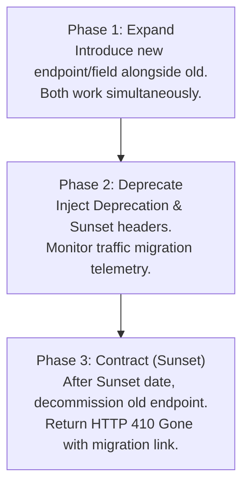

# API Deprecation & Contract Versioning Policy

This document establishes the official API versioning strategy, definitions of breaking vs non-breaking changes, standard RFC 8594 deprecation headers, deprecation timelines, and the "Expand and Contract" migration pattern for VYNOR CRM.

---

## 1. API Versioning Strategy (FND-042)

VYNOR CRM utilizes **URI Path Versioning** for all public and internal REST API surfaces:

```text
https://api.vynor.com/api/v1/<resource>
```

### Why URI Versioning?

- **Predictability & Traceability:** API versions are visible in logs, metrics, reverse proxy routing rules, and browser network inspectors without parsing headers.
- **Cache Compatibility:** CDN and edge proxies can partition cache keys naturally without inspecting custom negotiation headers.
- **Client Clarity:** SDK generators and OpenAPI tools provide direct, explicit client binding to stable versions.

---

## 2. Breaking vs Non-Breaking Changes

To maintain client stability across updates, engineering teams must evaluate all schema and behavioral modifications against the following classification:

### 2.1 Non-Breaking Changes (Safe within `/api/v1`)

These changes do **not** require an API version bump or deprecation cycle:

- ✅ Adding new resource endpoints (e.g. `POST /api/v1/audiences`).
- ✅ Adding new optional query parameters or request body fields with safe default values.
- ✅ Adding new fields to response payloads (client consumers must adhere to Postel's Law and ignore unknown fields).
- ✅ Adding new optional HTTP request or response headers.
- ✅ Adding new enum variants to output fields, provided clients implement fallback handling.

### 2.2 Breaking Changes (Prohibited within `/api/v1`)

These changes **strictly require** either an RFC 8594 deprecation cycle or a major version bump (e.g. `/api/v2`):

- ❌ Renaming, deleting, or altering the HTTP method of an existing endpoint.
- ❌ Renaming, deleting, or altering the type of an existing field in request or response contracts.
- ❌ Making a previously optional request field or query parameter mandatory.
- ❌ Changing HTTP status codes for existing domain responses (e.g. changing `200 OK` to `204 No Content`).
- ❌ Altering the standard error envelope structure (`ApiErrorResponse`) or renaming machine-readable error codes.
- ❌ Changing authentication requirements or reducing permission scopes.

---

## 3. Deprecation Headers (RFC 8594 & RFC 7231)

When an endpoint, resource, or parameter is marked for deprecation, the API Gateway or NestJS Interceptor injects standardized response headers to inform client SDKs and developers at runtime:

```http
HTTP/1.1 200 OK
Content-Type: application/json
Deprecation: @1790726400
Sunset: Wed, 31 Dec 2026 23:59:59 GMT
Link: <https://docs.vynor.com/api/migrations/v2>; rel="sunset"; type="text/html"
x-correlation-id: req_1727161200_a8f92b

{
  "data": { ... }
}
```

### 3.1 Header Definitions

1. **`Deprecation` (RFC 8594):**
   - Value: Unix timestamp in seconds preceded by `@` indicating the effective deprecation date (e.g. `@1790726400`) or boolean `true`.
2. **`Sunset` (RFC 8594 / RFC 7231):**
   - Value: Explicit HTTP-date in GMT specifying the exact date and time after which the endpoint will be decommissioned and return `410 Gone`.
3. **`Link` (RFC 8288):**
   - Value: Hyperlink pointing directly to migration guides and documentation with `rel="sunset"`.

---

## 4. Deprecation Timeline & Notice Policies

VYNOR CRM enforces minimum advance notice windows before any decommission:

| Scope                                               | Minimum Notice Period | Notification Channels                                              |
| :-------------------------------------------------- | :-------------------- | :----------------------------------------------------------------- |
| **Minor Deprecation** (Specific field or sub-route) | **90 days**           | API Response Headers, Changelog, Developer Dashboard               |
| **Major API Version Sunset** (`v1` to `v2`)         | **180 days**          | Direct Email to Workspace Admins, Response Headers, Portal Banners |

### Emergency Vulnerability Exceptions

In the rare event of a severe zero-day security vulnerability or provider compliance violation, an endpoint or parameter may be disabled earlier with immediate notification and direct engineering outreach.

---

## 5. Migration Strategy: Expand and Contract

All breaking transitions must follow the **Expand and Contract** pattern to allow zero-downtime client migrations:



1. **Expand (Day 0):** Introduce the new schema, parameter, or `/api/v2` endpoint. Ensure bidirectional compatibility in services and worker consumers.
2. **Deprecate (Day 1 - 90/180):** Mark the old endpoint as deprecated in `@vynor/contracts` and OpenAPI specs. Enable RFC 8594 headers. Track telemetry of remaining callers.
3. **Contract (Post-Sunset):** Decommission the retired endpoint. Unhandled requests to the decommissioned endpoint return `410 Gone` with structured migration metadata:
   ```json
   {
     "statusCode": 410,
     "code": "ENDPOINT_GONE",
     "message": "This endpoint has been decommissioned. Please refer to migration documentation.",
     "details": {
       "migrationUrl": "https://docs.vynor.com/api/migrations/v2"
     },
     "correlationId": "req_1727161200_a8f92b",
     "timestamp": "2027-01-01T00:00:00.000Z"
   }
   ```
