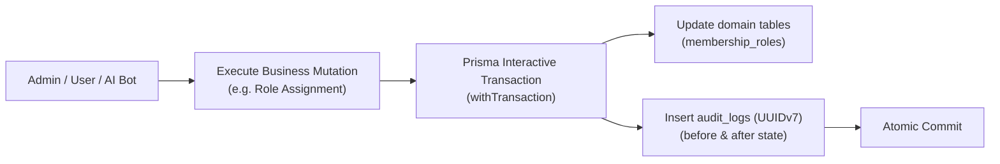

# Immutable Audit Logging Architecture

This document establishes the official immutable audit log architecture, database schema, action catalog, and recording helper contracts for VYNOR CRM (conforming to **FND-048**, **FND-019**, and **FND-031**).

---

## 1. Compliance & Security Tenets

Administrative operations, security configurations, permission grants, and data deletion in VYNOR CRM are subject to regulatory compliance and forensic auditability.



### Core Principles

1. **Append-Only Immutability:** Once written to the `audit_logs` table, records can **never** be updated or deleted. There are no `updated_at` or `deleted_at` columns.
2. **UUIDv7 Sequential Locality:** IDs are 128-bit time-sortable UUIDv7 tokens. The 48-bit millisecond timestamp ensures high-throughput B-tree insertion locality without index fragmentation (**AD-019**).
3. **Transactional Atomicity:** Audit records are committed in the same database transaction as the domain state change, guaranteeing that an audit record cannot exist without its corresponding mutation, and vice-versa.
4. **Tenant Isolation:** Every record is partitioned by `workspace_id` (**AD-008**).

---

## 2. Database Schema (`audit_logs`)

```prisma
model AuditLog {
  id            String   @id @default(uuid())
  workspaceId   String   @map("workspace_id")
  actorId       String   @map("actor_id")
  actorType     String   @map("actor_type") @db.VarChar(50)
  action        String   @db.VarChar(100)
  resourceType  String   @map("resource_type") @db.VarChar(100)
  resourceId    String   @map("resource_id")
  correlationId String   @map("correlation_id") @db.VarChar(128)
  causationId   String?  @map("causation_id") @db.VarChar(128)
  ipAddress     String?  @map("ip_address") @db.VarChar(64)
  userAgent     String?  @map("user_agent") @db.VarChar(512)
  beforeState   Json?    @map("before_state")
  afterState    Json?    @map("after_state")
  metadata      Json?
  createdAt     DateTime @default(now()) @map("created_at") @db.Timestamptz(6)

  workspace Workspace @relation(fields: [workspaceId], references: [id], onDelete: Cascade)

  @@index([workspaceId, createdAt], map: "idx_audit_logs_workspace_created_at")
  @@index([workspaceId, action], map: "idx_audit_logs_workspace_action")
  @@index([correlationId], map: "idx_audit_logs_correlation_id")
  @@index([resourceType, resourceId], map: "idx_audit_logs_resource")
  @@map("audit_logs")
}
```

---

## 3. Standard Audit Action Catalog (`AuditActionCatalog`)

Actions follow the canonical `resource.action` dot-delimited format:

| Category        | Action Key             | Action String          | Description                           |
| :-------------- | :--------------------- | :--------------------- | :------------------------------------ |
| **Workspace**   | `WORKSPACE_CREATE`     | `workspace.create`     | Workspace provisioning                |
|                 | `WORKSPACE_UPDATE`     | `workspace.update`     | Name, slug, or timezone modifications |
|                 | `WORKSPACE_DELETE`     | `workspace.delete`     | Workspace deactivation                |
| **Membership**  | `MEMBER_INVITE`        | `member.invite`        | User invited to workspace             |
|                 | `MEMBER_ACCEPT`        | `member.accept`        | User accepted invitation              |
|                 | `MEMBER_REMOVE`        | `member.remove`        | User membership revoked               |
|                 | `MEMBER_STATUS_CHANGE` | `member.status_change` | User suspended or activated           |
| **IAM & Roles** | `ROLE_CREATE`          | `role.create`          | Custom role created                   |
|                 | `ROLE_UPDATE`          | `role.update`          | Permissions added/removed from role   |
|                 | `ROLE_ASSIGN`          | `role.assign`          | Role granted to member                |
|                 | `ROLE_REVOKE`          | `role.revoke`          | Role stripped from member             |
| **Messages**    | `MESSAGE_DELETE`       | `message.delete`       | Message recalled or deleted           |
|                 | `MESSAGE_EXPORT`       | `message.export`       | Bulk conversation export              |
| **Campaigns**   | `CAMPAIGN_LAUNCH`      | `campaign.launch`      | Broadcast campaign launched           |
|                 | `CAMPAIGN_PAUSE`       | `campaign.pause`       | Campaign paused                       |
| **Security**    | `SECRET_ROTATE`        | `secret.rotate`        | Provider token or key rotated         |

---

## 4. Usage in Application Services

Services inject `AuditService` (`apps/api/src/audit/audit.service.ts`) and record events during mutations:

```typescript
import { AuditService } from '../audit/audit.service.js';
import { AuditActionCatalog } from '@vynor/contracts';
import { withTransaction } from '@vynor/database';

@Injectable()
export class RolesService {
  constructor(private readonly auditService: AuditService) {}

  async assignRole(actor: ActorContext, membershipId: string, roleId: string) {
    return withTransaction(async (tx) => {
      // 1. Domain mutation
      const assignment = await tx.membershipRole.create({
        data: { membershipId, roleId },
      });

      // 2. Atomic immutable audit entry
      await this.auditService.record(
        {
          workspaceId: actor.workspace.id,
          actorId: actor.user.id,
          actorType: 'USER',
          action: AuditActionCatalog.ROLE_ASSIGN,
          resourceType: 'membership_role',
          resourceId: `${membershipId}:${roleId}`,
          correlationId: actor.correlationId,
          afterState: { membershipId, roleId },
        },
        tx, // Pass transaction client
      );

      return assignment;
    });
  }
}
```
