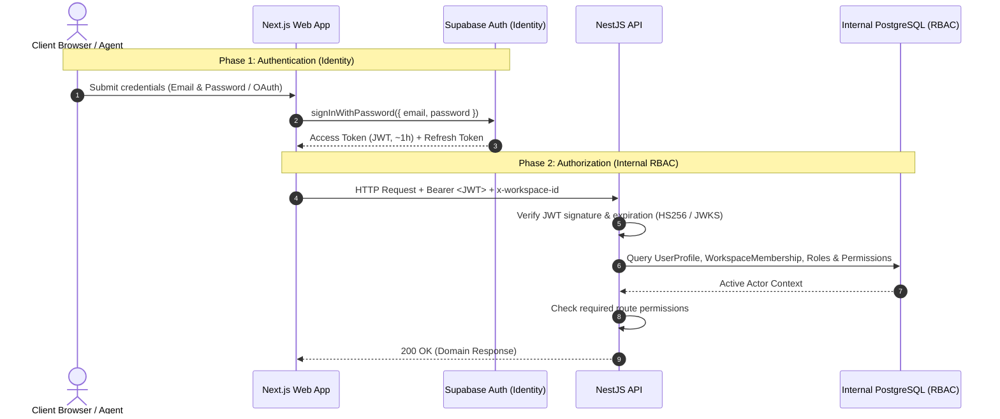
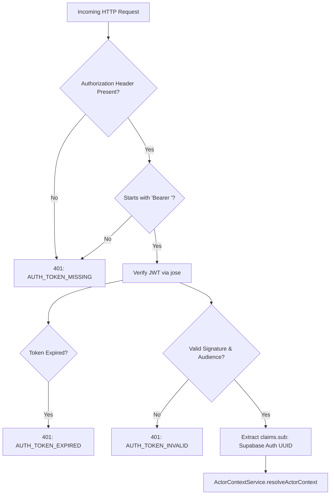

# Supabase Authentication & Token Lifecycle Guide

This guide documents the authentication architecture, token lifecycle, session refresh, logout mechanics, and backend token verification flows for VYNOR CRM, conforming to **AD-009** (Identity in Supabase Auth, Authorization in Internal Tables).

---

## 1. Architectural Architecture: Decoupled Identity & RBAC

### Key Principles

1. **Supabase Auth Owns Identity:** Manages credentials, MFA, password hashing, password resets, and session issuance.
2. **VYNOR Internal Tables Own Authorization:** Internal PostgreSQL tables (`user_profiles`, `workspaces`, `workspace_memberships`, `roles`, `permissions`, `teams`) define what actions a user can execute within a specific tenant workspace.
3. **Instant Access Revocation:** Deactivating a user or suspending a workspace membership in PostgreSQL immediately revokes access on their subsequent HTTP request, without waiting for the external 1-hour Supabase JWT to expire.

---

## 2. Authentication Lifecycle Flows

### 2.1 Login Flow

1. User enters email and password into the frontend client.
2. Frontend calls `@supabase/supabase-js` `supabase.auth.signInWithPassword()` or SSR cookie exchange.
3. Supabase Auth validates credentials against `auth.users`.
4. Supabase Auth returns:
   - `access_token`: Short-lived JSON Web Token (typically 3600 seconds / 1 hour).
   - `refresh_token`: Opaque string stored securely in HTTP-only cookies or encrypted local storage.
5. Frontend establishes session and redirects the user to the requested workspace.

### 2.2 Token Refresh Flow

When an access token approaches expiration:

1. Supabase client SDK automatically schedules refresh ~60 seconds before expiration.
2. SDK issues POST request to `${SUPABASE_URL}/auth/v1/token?grant_type=refresh_token`.
3. Supabase invalidates the old refresh token (refresh token rotation) and issues a new `access_token` and `refresh_token` pair.
4. If an HTTP request receives a `401 Unauthorized` with error code `AUTH_TOKEN_EXPIRED`, the frontend intercepts the response, triggers immediate token refresh, and retries the original request.

### 2.3 Logout Flow

1. User triggers logout in the UI.
2. Client calls `supabase.auth.signOut({ scope: 'global' })`.
3. Supabase invalidates the active refresh token and server session.
4. Client purges all local auth tokens and cached Actor Context.
5. Client redirects the browser to `/login`.

---

## 3. Backend Token Verification (`apps/api`)

Every incoming HTTP request to protected endpoints is intercepted by `AuthGuard` in `apps/api`:

### 3.1 Verification Modes

The NestJS API supports two cryptographic verification methods via `JwtVerifierService`:

1. **Symmetric Secret (`SUPABASE_JWT_SECRET` via HS256):**
   - High-performance local verification using Node crypto / Web Crypto API.
   - Zero network latency: eliminates remote HTTP roundtrips to Supabase for every API request.
2. **Asymmetric Remote JWKS (`.well-known/jwks.json`):**
   - Fallback verification using public keys fetched from `${SUPABASE_URL}/auth/v1/.well-known/jwks.json`.
   - Used in federated or multi-region setups where signing keys are rotated dynamically.

### 3.2 Required JWT Claims

The API verifies the following standard claims:

- `sub`: Must be a valid UUID corresponding to `auth.users.id`.
- `aud`: Must match `'authenticated'`.
- `exp`: Expiration timestamp in epoch seconds must be in the future.
- `role`: Must be `'authenticated'`.
