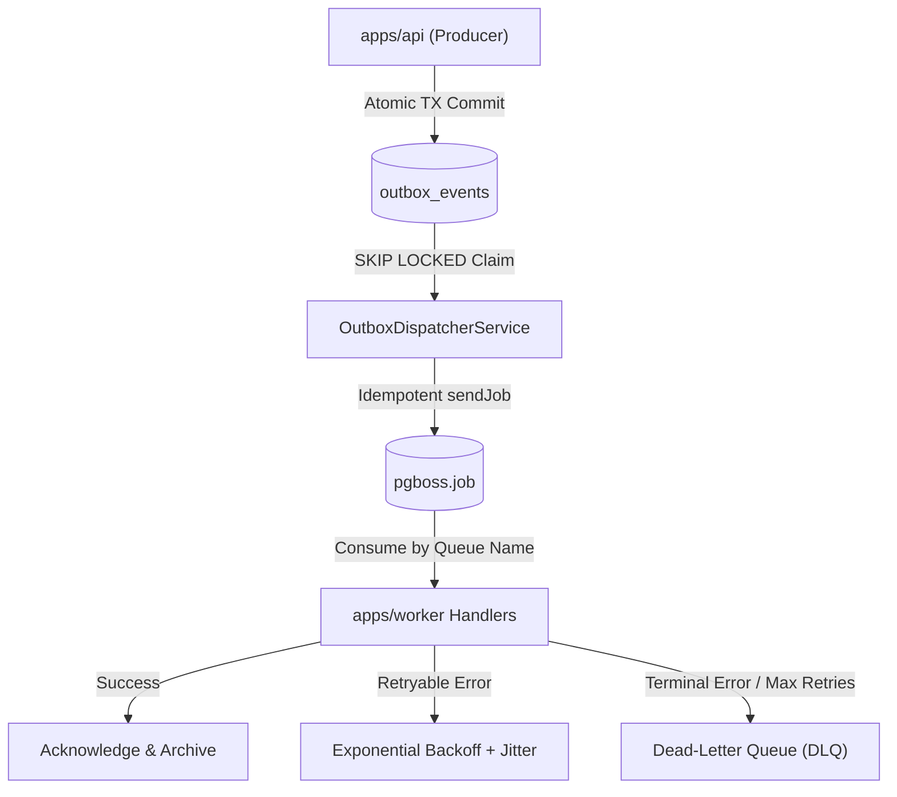
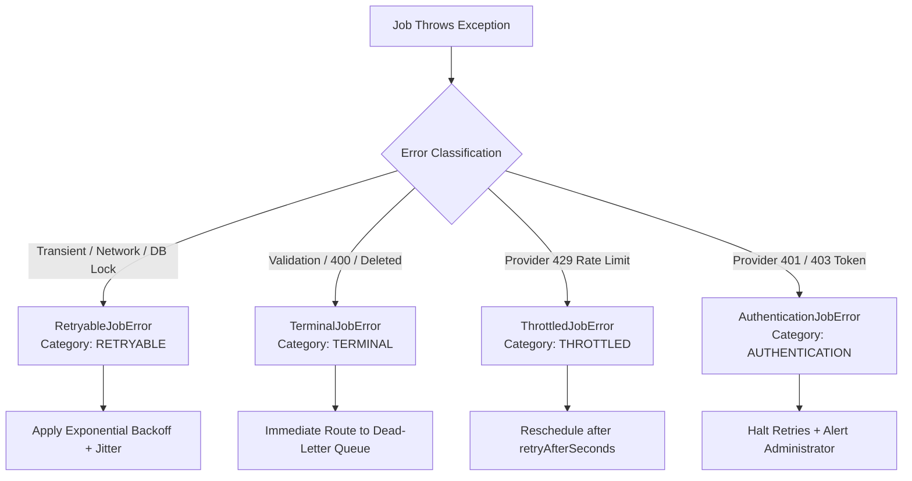

# Background Jobs, Queue Conventions & Failure Governance

This document establishes the official PostgreSQL-backed `pg-boss` queue architecture, named queue taxonomy, versioned job envelope contracts, failure classifications, exponential backoff policies, dead-letter queue (DLQ) operations, and worker lifecycle standards for VYNOR CRM (conforming to **FND-051** through **FND-055** and **FND-060**).

---

## 1. Queue Architecture & pg-boss Configuration (FND-051)

Conforming to **AD-001** and **AD-002**, VYNOR CRM consolidates background job handling within `apps/worker` backed by PostgreSQL using `pg-boss`.



### 1.1 Named Queue Taxonomy

All queue names are strictly namespaced under `vynor.<domain>.<action>` (`QUEUE_NAMES`):

| Queue Name                            | Default Concurrency | Retention | Max Attempts | Purpose                                                         |
| :------------------------------------ | :------------------ | :-------- | :----------- | :-------------------------------------------------------------- |
| **`vynor.messages.outbound`**         | 10                  | 14 days   | 5            | Delivering outbound messages via external channel adapters      |
| **`vynor.webhooks.process`**          | 20                  | 7 days    | 5            | Asynchronous parsing and ingestion of journaled provider events |
| **`vynor.campaigns.dispatch`**        | 5                   | 30 days   | 3            | Broadcast campaign batch scheduling and recipient dispatch      |
| **`vynor.conversations.route`**       | 10                  | 7 days    | 3            | AI assignment and skill-based agent routing                     |
| **`vynor.ai.generate`**               | 5                   | 14 days   | 3            | RAG retrieval, prompt assembly, and LLM completions             |
| **`vynor.audit.export`**              | 2                   | 3 days    | 3            | Compliance audit log CSV/JSON exports                           |
| **`vynor.maintenance.outbox-prune`**  | 1                   | 1 day     | 2            | Scheduled deletion of aged, completed outbox rows               |
| **`vynor.maintenance.lease-recover`** | 1                   | 1 day     | 2            | Periodic recovery of expired worker leases                      |

---

## 2. Versioned Job Envelope Contract (FND-052)

Every background job is wrapped in a strongly-typed, versioned envelope (`JobEnvelopeSchema`):

```typescript
export interface JobEnvelope<T = Record<string, unknown>> {
  jobId: string; // Unique job identifier (UUIDv7)
  queue: QueueName; // Target queue
  version: number; // Schema version (default: 1)
  context: EventContext; // Correlation, causation, workspace, and actor context
  attempt: number; // Current attempt count (1-indexed)
  maxAttempts: number; // Maximum allocated attempts
  enqueuedAt: string; // ISO 8601 UTC timestamp
  payload: T; // Strongly-typed domain payload
}
```

---

## 3. Failure Classification Hierarchy (FND-053)

To avoid naive retry loops on invalid data or unauthenticated credentials, failures are categorized into four explicit classes:



### 3.1 Failure Classes

1. **`RetryableJobError`:** Transient network glitches, 503 Service Unavailable, and database serialization conflicts (`40001`). Safe to retry.
2. **`TerminalJobError`:** Schema validation failures, malformed JSON, or references to deleted entities. Immediately routed to DLQ without wasting compute.
3. **`ThrottledJobError`:** External API rate limit exceeded (HTTP 429). Postpones retry by `retryAfterSeconds`.
4. **`AuthenticationJobError`:** Provider API key revoked or OAuth token expired. Halts retries to prevent account lockout until token refresh occurs.

---

## 4. Exponential Backoff & Jitter Policy (FND-054)

Retry intervals use **Full Jitter Exponential Backoff** to prevent thundering herds:

$$\text{BaseDelay} = \min\left(\text{maxDelaySeconds},\; \text{initialDelaySeconds} \times \text{backoffFactor}^{(\text{attempt} - 1)}\right)$$

$$\text{ActualDelay} = \text{BaseDelay} \times \left(0.5 + 0.5 \times \text{random}()\right)$$

### Defaults (`DEFAULT_JOB_RETRY_POLICY`)

- **`maxAttempts`:** 5
- **`initialDelaySeconds`:** 5 seconds
- **`backoffFactor`:** 2
- **`maxDelaySeconds`:** 300 seconds (5 minutes)
- **`timeoutSeconds`:** 60 seconds

---

## 5. Dead-Letter Queue (DLQ) Operations (FND-055)

When a job exceeds `maxAttempts` or encounters a `TerminalJobError`, it transitions to `DEAD_LETTER`.

### DLQ Governance Operations

1. **Inspection (`DeadLetterQuery`):** Query dead-letter items filtered by `workspaceId`, `queue`, and `eventType`.
2. **Retry (`RETRY`):** Reset attempt count to 0, update `scheduledAt` to now, and reset status to `PENDING`.
3. **Replay (`REPLAY`):** Bulk re-dispatch of dead-letter jobs matching a specific error code or affected provider window.
4. **Abandon (`ABANDON`):** Mark permanently discarded with audit logging of the administrator reason.

---

## 6. Worker Lifecycle & Heartbeat Governance (FND-060)

### 6.1 Graceful Shutdown Protocol

When `SIGTERM` or `SIGINT` is received:

1. Stop accepting new outbox claiming cycles (`isShuttingDown = true`).
2. Signal `pg-boss` to cease polling.
3. Allow up to 15 seconds for in-flight jobs to finish active operations.
4. Close database pool connections cleanly.

### 6.2 Job Heartbeats & Stuck Job Recovery

- For long-running batch jobs (e.g. 50,000-contact campaign dispatch), handlers periodically ping the heartbeat to extend their lease.
- If a worker crashes hard (OOM, container kill), the background recovery loop (`recoverExpiredOutboxLeases`) reclaims any lease where `claim_lease_expires_at < NOW()` and returns it to `PENDING`.
