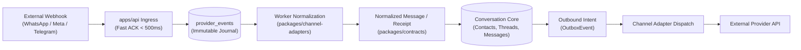
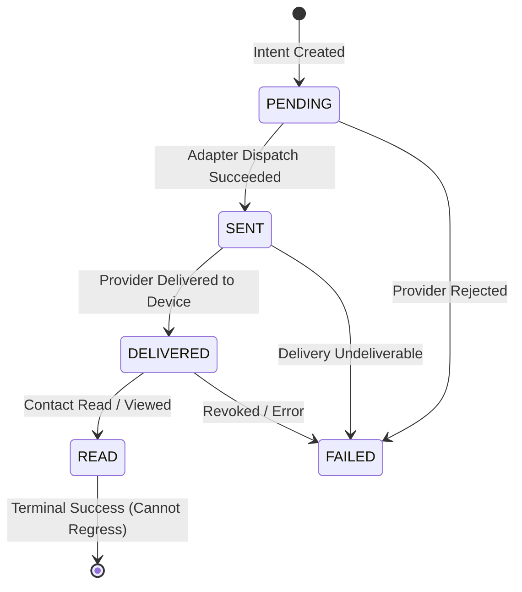

# Channel Architecture, Normalized Contracts, and Adapter Registry

This document defines the omnichannel architecture, standardized message contracts, and adapter interface for VYNOR CRM according to [AD-003](file:///home/acgix/vynor-crm/docs/adr/0003-channel-agnostic-conversation-core.md) and [AD-014](file:///home/acgix/vynor-crm/docs/adr/0014-incremental-channel-adapter-development.md).

---

## 1. Architectural Overview

VYNOR CRM communicates with diverse external platforms (WhatsApp Cloud API, Instagram Direct, Facebook Messenger, Telegram Bot, Email, LINE, Webchat). Storing external vendor payload structures directly in core CRM models creates tight coupling, brittle business logic, and schema churn.

To maintain a channel-agnostic core:

1. **Raw Webhook Ingress:** External webhooks are validated and committed to the immutable `provider_events` journal before side effects ([AD-004](file:///home/acgix/vynor-crm/docs/adr/0004-durable-state-before-side-effects.md)).
2. **Adapter Normalization:** The adapter for the specific channel/provider translates raw payloads into canonical `NormalizedInboundMessage` or `NormalizedDeliveryReceipt` contracts.
3. **Conversation Core:** Core services consume only normalized contracts. The Conversation Core never imports vendor SDKs or concrete adapter implementations.
4. **Outbound Dispatch:** Core services emit `OutboundMessageIntent` objects. The adapter converts these into vendor-specific HTTP payloads.



---

## 2. Channel Types and Provider Matrix (FND-061)

### Canonical Channel Types (`ChannelType`)

- `WHATSAPP` — WhatsApp Business / Cloud API
- `INSTAGRAM` — Instagram Messaging via Meta Graph API
- `MESSENGER` — Facebook Messenger via Meta Graph API
- `TELEGRAM` — Telegram Bot API
- `EMAIL` — SMTP / IMAP / SendGrid
- `LINE` — LINE Messaging API
- `WEBCHAT` — Self-hosted embedded live chat widget

### Provider Identity (`ChannelProviderType`)

- `WHATSAPP_CLOUD`
- `META_MESSENGER`
- `META_INSTAGRAM`
- `TELEGRAM_BOT`
- `EMAIL_SMTP_IMAP`
- `LINE_MESSAGING`
- `WEBCHAT_EMBED`
- `CUSTOM_WEBHOOK`

### Granular Capability Flags (`ChannelCapabilities`)

Each provider account advertises its supported capabilities via `ChannelCapabilities`:

| Capability Flag       | Description                          | WhatsApp | Telegram | Instagram | Email |
| :-------------------- | :----------------------------------- | :------: | :------: | :-------: | :---: |
| `text`                | Standard UTF-8 plain text            |   Yes    |   Yes    |    Yes    |  Yes  |
| `media.images`        | Image attachments (JPEG, PNG, WebP)  |   Yes    |   Yes    |    Yes    |  Yes  |
| `media.audio`         | Audio attachments (MP3, AAC)         |   Yes    |   Yes    |    Yes    |  Yes  |
| `media.video`         | Video attachments (MP4)              |   Yes    |   Yes    |    Yes    |  Yes  |
| `media.documents`     | Document attachments (PDF, DOCX)     |   Yes    |   Yes    |    Yes    |  Yes  |
| `media.stickers`      | Animated or static stickers          |   Yes    |   Yes    |    Yes    |  No   |
| `media.voiceNotes`    | Push-to-talk voice recordings        |   Yes    |   Yes    |    Yes    |  No   |
| `location`            | Latitude/Longitude coordinates       |   Yes    |   Yes    |    No     |  No   |
| `contacts`            | VCard / contact cards                |   Yes    |   Yes    |    No     |  No   |
| `interactive.buttons` | Reply buttons / quick replies        |   Yes    |   Yes    |    Yes    |  No   |
| `interactive.lists`   | Interactive dropdown selection lists |   Yes    |    No    |    No     |  No   |
| `reactions`           | Message emoji reactions              |   Yes    |   Yes    |    Yes    |  No   |
| `readReceipts`        | Sent / Delivered / Read tracking     |   Yes    |    No    |    Yes    |  No   |
| `deliveryReceipts`    | Sent / Delivered status tracking     |   Yes    |    No    |    Yes    |  No   |
| `typingIndicators`    | Live "typing..." indicators          |   Yes    |   Yes    |    Yes    |  No   |
| `replyContext`        | Quoted reply context                 |   Yes    |   Yes    |    Yes    |  Yes  |

---

## 3. Normalized Inbound Message Contract (FND-062)

All inbound messages conform to `NormalizedInboundMessageSchema` (`packages/contracts/src/channels/inbound.ts`):

```typescript
export interface NormalizedInboundMessage {
  messageId: string;
  workspaceId: string;
  channelType: ChannelType;
  provider: ChannelProviderType;
  providerAccountId: string;
  providerMessageId: string;
  sender: InboundParticipant;
  recipient: InboundParticipant;
  timestamp: string; // ISO 8601 UTC
  content: InboundMessageContent;
  replyContext?: InboundReplyContext;
  rawEventRef: {
    providerEventId: string;
    providerEventKey: string;
  };
  metadata?: Record<string, unknown>;
}
```

### Supported Content Types (Discriminated Union)

1. **TEXT:** `{ type: 'TEXT', text: string }`
2. **MEDIA:** `{ type: 'MEDIA', mediaType: 'image' | 'audio' | 'video' | 'document' | 'sticker' | 'voice', mimeType: string, url?: string, providerMediaId?: string, caption?: string, sha256?: string }`
3. **LOCATION:** `{ type: 'LOCATION', latitude: number, longitude: number, name?: string, address?: string }`
4. **CONTACT:** `{ type: 'CONTACT', contacts: Array<{ name: { formattedName: string }, phones?: Array<{ phone: string }>, emails?: Array<{ email: string }> }> }`
5. **INTERACTIVE:** `{ type: 'INTERACTIVE', interactiveType: 'button_reply' | 'list_reply' | 'quick_reply', id: string, title: string, description?: string }`
6. **REACTION:** `{ type: 'REACTION', emoji: string, targetProviderMessageId: string, action: 'react' | 'unreact' }`
7. **UNSUPPORTED:** `{ type: 'UNSUPPORTED', rawType: string, description?: string, rawPayload?: Record<string, unknown> }`

---

## 4. Normalized Outbound Message Intent (FND-063)

Outbound messages from agents, bots, or automations are modeled as intents before dispatch (`packages/contracts/src/channels/outbound.ts`):

```typescript
export interface OutboundMessageIntent {
  intentId: string;
  workspaceId: string;
  channelType: ChannelType;
  providerAccountId: string;
  recipient: {
    destination: string;
    contactId?: string;
  };
  content: OutboundMessageContent;
  replyContext?: {
    targetProviderMessageId: string;
  };
  idempotencyKey?: string;
  correlationId?: string;
  causationId?: string;
  actorId?: string;
  metadata?: Record<string, unknown>;
}
```

Synchronous response from the provider is captured via `ProviderSendResult`:

- `status`: `'ACCEPTED' | 'REJECTED' | 'QUEUED'`
- `providerMessageId`: Vendor-assigned message ID
- `providerTimestamp`: Timestamp acknowledged by provider
- `error`: Structured vendor failure code and retryable status

---

## 5. Monotonic Delivery Status Rules (FND-064)

External delivery receipts frequently arrive out-of-order due to network jitter (e.g., a "read" receipt processed before a delayed "delivered" receipt). To prevent state regression:



### Monotonic Progression Rules:

1. **Ordinal Ranks:** `PENDING (0) -> SENT (1) -> DELIVERED (2) -> READ (3)`.
2. **Strict Forward Progression:** A receipt can never downgrade an entity's status to a lower ordinal rank.
3. **Idempotence:** Duplicate delivery receipts for the current status are accepted as harmless no-ops.
4. **Terminal `READ` Protection:** Once a message is confirmed `READ`, delayed `SENT` or `DELIVERED` webhooks are rejected as no-ops.

The helper `applyDeliveryStatusTransition` (`packages/channel-adapters/src/normalization/monotonic-delivery.ts`) evaluates these rules:

```typescript
const result = applyDeliveryStatusTransition(currentStatus, incomingStatus);
if (result.accepted && !result.isNoop) {
  await updateMessageStatus(messageId, result.finalStatus);
}
```

---

## 6. Channel Adapter Interface and Registry (FND-065, FND-066)

Each provider adapter implements `ChannelAdapter` (`packages/channel-adapters/src/interfaces/channel-adapter.interface.ts`):

```typescript
export interface ChannelAdapter<TAccountConfig = Record<string, unknown>> {
  readonly channelType: ChannelType;
  readonly provider: ChannelProviderType;
  readonly capabilities: ChannelCapabilities;

  validateWebhook(request: WebhookValidationRequest): Promise<WebhookValidationResult>;
  extractEvents(
    rawPayload: unknown,
    headers: Record<string, string>,
    context: EventContext,
  ): Promise<ExtractedProviderEvent[]>;
  normalizeInbound(event: ExtractedProviderEvent): Promise<NormalizedInboundResult>;
  sendMessage(
    intent: OutboundMessageIntent,
    accountConfig: TAccountConfig,
  ): Promise<ProviderSendResult>;
  downloadMedia(
    request: MediaDownloadRequest,
    accountConfig: TAccountConfig,
  ): Promise<MediaDownloadResult>;
  healthCheck(accountConfig: TAccountConfig): Promise<ChannelHealthResult>;
  mapError(error: unknown): Error;
}
```

### Adapter Discovery via Registry (`ChannelAdapterRegistry`)

Adapters are registered during application bootstrapping:

```typescript
const registry = new ChannelAdapterRegistry();
registry.register(new WhatsAppCloudAdapter());
registry.register(new TelegramBotAdapter());

// Look up adapter for a given channel account
const adapter = registry.getOrThrow(account.channelType, account.provider);
```
