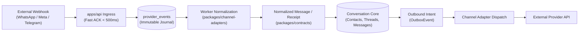
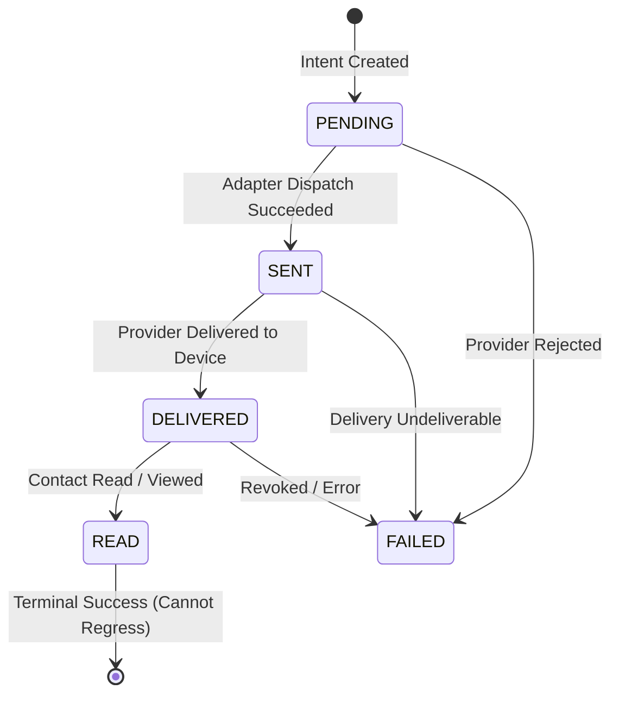

# Channel Architecture, Normalized Contracts, and Adapter Registry

This document defines the omnichannel architecture, standardized message contracts, and adapter interface for VYNOR CRM according to [AD-003](adr/0003-channel-agnostic-conversation-core.md) and [AD-014](adr/0014-incremental-channel-adapter-development.md). How to connect each platform is described in the [Channel Setup Guide](channel-setup-guide.md).

---

## 1. Architectural Overview

VYNOR CRM communicates with diverse external platforms (WhatsApp Cloud API, Instagram Direct, Facebook Messenger, Telegram Bot, Email, LINE, Webchat). Storing external vendor payload structures directly in core CRM models creates tight coupling, brittle business logic, and schema churn.

To maintain a channel-agnostic core:

1. **Raw Webhook Ingress:** External webhooks are validated and committed to the immutable `provider_events` journal before side effects ([AD-004](adr/0004-durable-state-before-side-effects.md)).
2. **Adapter Normalization:** The adapter for the specific channel/provider translates raw payloads into canonical `NormalizedInboundMessage` or `NormalizedDeliveryReceipt` contracts.
3. **Conversation Core:** Core services consume only normalized contracts. The Conversation Core never imports vendor SDKs or concrete adapter implementations.
4. **Outbound Dispatch:** Core services emit `OutboundMessageIntent` objects. The adapter converts these into vendor-specific HTTP payloads.


```mermaid
flowchart LR
    A["External Webhook<br/>(WhatsApp / Meta / Telegram)"] --> B["apps/api Ingress<br/>(Fast ACK &lt; 500ms)"]
    B --> C[("provider_events<br/>(Immutable Journal)")]
    C --> D["Worker Normalization<br/>(packages/channel-adapters)"]
    D --> E["Normalized Message / Receipt<br/>(packages/contracts)"]
    E --> F[("Conversation Core<br/>(Contacts, Threads, Messages)")]
    F --> G["Outbound Intent<br/>(OutboxEvent)"]
    G --> H["Channel Adapter Dispatch"]
    H --> I["External Provider API"]
```

---

## 2. Channel Types and Provider Matrix (FND-061)

### Canonical Channel Types (`ChannelType`)

- `WHATSAPP` — WhatsApp Business / Cloud API
- `INSTAGRAM` — Instagram Messaging via Meta Graph API
- `MESSENGER` — Facebook Messenger via Meta Graph API
- `TELEGRAM` — Telegram Bot API
- `EMAIL` — SMTP / IMAP mailbox
- `LINE` — LINE Messaging API
- `WEBCHAT` — Self-hosted embedded live chat widget
- `API` — Custom API: the customer's own system exchanges signed messages with VYNOR

### Provider Identity (`ChannelProviderType`)

- `WHATSAPP_CLOUD`
- `META_MESSENGER`
- `META_INSTAGRAM`
- `TELEGRAM_BOT`
- `EMAIL_SMTP_IMAP`
- `LINE_MESSAGING`
- `WEBCHAT_EMBED`
- `CUSTOM_WEBHOOK`

### Granular Capability Flags (`ChannelCapabilities`)

Each provider account advertises its supported capabilities via `ChannelCapabilities`:

| Capability Flag       | Description                          | WhatsApp | Telegram | Instagram | Email |
| :-------------------- | :----------------------------------- | :------: | :------: | :-------: | :---: |
| `text`                | Standard UTF-8 plain text            |   Yes    |   Yes    |    Yes    |  Yes  |
| `media.images`        | Image attachments (JPEG, PNG, WebP)  |   Yes    |   Yes    |    Yes    |  Yes  |
| `media.audio`         | Audio attachments (MP3, AAC)         |   Yes    |   Yes    |    Yes    |  Yes  |
| `media.video`         | Video attachments (MP4)              |   Yes    |   Yes    |    Yes    |  Yes  |
| `media.documents`     | Document attachments (PDF, DOCX)     |   Yes    |   Yes    |    Yes    |  Yes  |
| `media.stickers`      | Animated or static stickers          |   Yes    |   Yes    |    Yes    |  No   |
| `media.voiceNotes`    | Push-to-talk voice recordings        |   Yes    |   Yes    |    Yes    |  No   |
| `location`            | Latitude/Longitude coordinates       |   Yes    |   Yes    |    No     |  No   |
| `contacts`            | VCard / contact cards                |   Yes    |   Yes    |    No     |  No   |
| `interactive.buttons` | Reply buttons / quick replies        |   Yes    |   Yes    |    Yes    |  No   |
| `interactive.lists`   | Interactive dropdown selection lists |   Yes    |    No    |    No     |  No   |
| `reactions`           | Message emoji reactions              |   Yes    |   Yes    |    Yes    |  No   |
| `readReceipts`        | Sent / Delivered / Read tracking     |   Yes    |    No    |    Yes    |  No   |
| `deliveryReceipts`    | Sent / Delivered status tracking     |   Yes    |    No    |    Yes    |  No   |
| `typingIndicators`    | Live "typing..." indicators          |   Yes    |   Yes    |    Yes    |  No   |
| `replyContext`        | Quoted reply context                 |   Yes    |   Yes    |    Yes    |  Yes  |

---

## 3. Normalized Inbound Message Contract (FND-062)

All inbound messages conform to `NormalizedInboundMessageSchema` (`packages/contracts/src/channels/inbound.ts`):

```typescript
export interface NormalizedInboundMessage {
  messageId: string;
  workspaceId: string;
  channelType: ChannelType;
  provider: ChannelProviderType;
  providerAccountId: string;
  providerMessageId: string;
  sender: InboundParticipant;
  recipient: InboundParticipant;
  timestamp: string; // ISO 8601 UTC
  content: InboundMessageContent;
  replyContext?: InboundReplyContext;
  rawEventRef: {
    providerEventId: string;
    providerEventKey: string;
  };
  metadata?: Record<string, unknown>;
}
```

### Supported Content Types (Discriminated Union)

1. **TEXT:** `{ type: 'TEXT', text: string }`
2. **MEDIA:** `{ type: 'MEDIA', mediaType: 'image' | 'audio' | 'video' | 'document' | 'sticker' | 'voice', mimeType: string, url?: string, providerMediaId?: string, caption?: string, sha256?: string }`
3. **LOCATION:** `{ type: 'LOCATION', latitude: number, longitude: number, name?: string, address?: string }`
4. **CONTACT:** `{ type: 'CONTACT', contacts: Array<{ name: { formattedName: string }, phones?: Array<{ phone: string }>, emails?: Array<{ email: string }> }> }`
5. **INTERACTIVE:** `{ type: 'INTERACTIVE', interactiveType: 'button_reply' | 'list_reply' | 'quick_reply', id: string, title: string, description?: string }`
6. **REACTION:** `{ type: 'REACTION', emoji: string, targetProviderMessageId: string, action: 'react' | 'unreact' }`
7. **UNSUPPORTED:** `{ type: 'UNSUPPORTED', rawType: string, description?: string, rawPayload?: Record<string, unknown> }`

---

## 4. Normalized Outbound Message Intent (FND-063)

Outbound messages from agents, bots, or automations are modeled as intents before dispatch (`packages/contracts/src/channels/outbound.ts`):

```typescript
export interface OutboundMessageIntent {
  intentId: string;
  workspaceId: string;
  channelType: ChannelType;
  providerAccountId: string;
  recipient: {
    destination: string;
    contactId?: string;
  };
  content: OutboundMessageContent;
  replyContext?: {
    targetProviderMessageId: string;
  };
  idempotencyKey?: string;
  correlationId?: string;
  causationId?: string;
  actorId?: string;
  metadata?: Record<string, unknown>;
}
```

Synchronous response from the provider is captured via `ProviderSendResult`:

- `status`: `'ACCEPTED' | 'REJECTED' | 'QUEUED'`
- `providerMessageId`: Vendor-assigned message ID
- `providerTimestamp`: Timestamp acknowledged by provider
- `error`: Structured vendor failure code and retryable status

---

## 5. Monotonic Delivery Status Rules (FND-064)

External delivery receipts frequently arrive out-of-order due to network jitter (e.g., a "read" receipt processed before a delayed "delivered" receipt). To prevent state regression:


```mermaid
stateDiagram-v2
    [*] --> PENDING: Intent Created
    PENDING --> SENT: Adapter Dispatch Succeeded
    SENT --> DELIVERED: Provider Delivered to Device
    DELIVERED --> READ: Contact Read / Viewed
    PENDING --> FAILED: Provider Rejected
    SENT --> FAILED: Delivery Undeliverable
    DELIVERED --> FAILED: Revoked / Error
    READ --> [*]: Terminal Success (Cannot Regress)
```

### Monotonic Progression Rules:

1. **Ordinal Ranks:** `PENDING (0) -> SENT (1) -> DELIVERED (2) -> READ (3)`.
2. **Strict Forward Progression:** A receipt can never downgrade an entity's status to a lower ordinal rank.
3. **Idempotence:** Duplicate delivery receipts for the current status are accepted as harmless no-ops.
4. **Terminal `READ` Protection:** Once a message is confirmed `READ`, delayed `SENT` or `DELIVERED` webhooks are rejected as no-ops.

The helper `applyDeliveryStatusTransition` (`packages/channel-adapters/src/normalization/monotonic-delivery.ts`) evaluates these rules:

```typescript
const result = applyDeliveryStatusTransition(currentStatus, incomingStatus);
if (result.accepted && !result.isNoop) {
  await updateMessageStatus(messageId, result.finalStatus);
}
```

---

## 6. Channel Adapter Interface and Registry (FND-065, FND-066)

Each provider adapter implements `ChannelAdapter` (`packages/channel-adapters/src/interfaces/channel-adapter.interface.ts`). Adapters are stateless: every call receives the decrypted `AdapterAccount` (credentials, generated secrets, identifiers) for the channel it acts on.

```typescript
export interface ChannelAdapter<TCredentials = unknown> {
  readonly provider: ChannelProviderType;
  readonly channelType: ChannelType;
  readonly capabilities: ChannelCapabilities;
  readonly credentialsSchema: ZodType<TCredentials>;
  readonly inbound: 'WEBHOOK' | 'POLLING' | 'WEBHOOK_OR_POLLING' | 'WIDGET';
  readonly webhookPath?: string; // segment in /api/v1/webhooks/:provider/:webhookKey
  readonly replyWindowHours?: number; // e.g. 24 for WhatsApp, Messenger and Instagram
  readonly generatedSecrets: readonly (keyof GeneratedChannelSecrets)[];

  verifyCredentials(credentials: TCredentials): Promise<VerifiedAccount>;
  registerWebhook?(account, request): Promise<WebhookRegistrationResult>;
  unregisterWebhook?(account): Promise<void>;
  validateWebhook?(request, account): WebhookValidationResult;
  extractEvents?(payload: unknown): ExtractedProviderEvent[];
  normalizeInbound(payload, context, account): Promise<NormalizedInboundResult[]>;
  pollInbound?(account, cursor): Promise<PollResult>;
  sendMessage(intent: OutboundMessageIntent, account): Promise<ProviderSendResult>;
  downloadMedia?(reference: MediaReference, account): Promise<MediaDownloadResult>;
  healthCheck(account): Promise<ChannelHealthResult>;
}
```

Provider failures are thrown as `ChannelProviderError` with a category (`AUTHENTICATION`, `PERMISSION`, `RATE_LIMITED`, `TRANSIENT`, `INVALID_REQUEST`, `CONFIGURATION`, …), a `retryable` flag and `requiresReconnect` for credentials the provider no longer accepts. Messages are written for the admin or agent who will read them.

| Provider          | Adapter                | Inbound                       | Webhook signature / verification                        |
| :---------------- | :--------------------- | :---------------------------- | :------------------------------------------------------ |
| `WHATSAPP_CLOUD`  | `WhatsAppCloudAdapter` | Webhook                       | `X-Hub-Signature-256` (app secret), `hub.challenge`     |
| `TELEGRAM_BOT`    | `TelegramBotAdapter`   | Webhook, or `getUpdates` poll | `X-Telegram-Bot-Api-Secret-Token`                       |
| `EMAIL_SMTP_IMAP` | `EmailAdapter`         | IMAP poll                     | —                                                       |
| `META_MESSENGER`  | `MessengerAdapter`     | Webhook                       | `X-Hub-Signature-256` (app secret), `hub.challenge`     |
| `META_INSTAGRAM`  | `InstagramAdapter`     | Webhook                       | `X-Hub-Signature-256` (app secret), `hub.challenge`     |
| `LINE_MESSAGING`  | `LineMessagingAdapter` | Webhook                       | `x-line-signature` (channel secret, base64)             |
| `WEBCHAT_EMBED`   | `WebchatAdapter`       | Widget API                    | Signed visitor token                                    |
| `CUSTOM_WEBHOOK`  | `CustomApiAdapter`     | Webhook                       | `X-Vynor-Signature` over `timestamp.body`, 5 min window |

### Adapter Discovery via Registry (`ChannelAdapterRegistry`)

The API and the worker build the same registry at startup from the validated environment:

```typescript
const registry = createChannelAdapterRegistry(adapterRuntimeFromEnv(env));

registry.getByProvider(channel.provider); // stored channels
registry.getByWebhookPath(request.params.provider); // /api/v1/webhooks/:provider/:webhookKey
```

---

## 7. Runtime Flow (Issue #37)

### 7.1 Connecting a Channel

1. `POST /api/v1/channels` validates the input against `ChannelConnectionInputSchema` (`packages/contracts/src/channels/connection.ts`).
2. The adapter's `verifyCredentials` calls the provider. Nothing is stored when it fails; the provider's reason is returned (`422 CHANNEL_VERIFICATION_FAILED`, or `502 CHANNEL_PROVIDER_UNREACHABLE`).
3. Secrets are sealed with the `CredentialCipher` (`packages/shared/src/crypto/credential-cipher.ts`): AES-256-GCM, a random IV per value, the provider account ID as additional authenticated data, and the key ID stored next to the ciphertext for rotation. Non-secret fields and masked hints are kept for display.
4. Generated secrets (webhook verify token, Telegram secret token, Custom API signing secret) and an unguessable `webhookKey` are created per channel.
5. `registerInbound` points the provider at `https://<PUBLIC_WEBHOOK_BASE_URL>/api/v1/webhooks/<provider>/<webhookKey>` where the provider supports it, or switches Telegram to polling. Failures do not undo the connection; they become the setup note shown to the admin.
6. Updates re-verify before replacing credentials, so a rejected token never breaks a working channel. Deletes are soft: history stays, the `webhookKey` is cleared and polling stops.

### 7.2 Webhook Ingress

`apps/api/src/webhooks` receives `GET|POST /api/v1/webhooks/:provider/:webhookKey` with the raw body preserved:

1. Resolve the channel by `webhookKey`; unknown keys get `404`.
2. `validateWebhook` checks the signature (or answers the verification handshake) against the channel's secrets; failures get `401` and nothing is written.
3. `extractEvents` splits the payload into events with a provider event key. Events for another account of the same provider in the workspace (one Meta app or LINE callback URL serving several numbers) are filed under that channel.
4. In one transaction the events are inserted into `provider_events` (`skipDuplicates` on the provider event key) and a `webhook.received` outbox event is written. The response is sent immediately ([Webhook Response & Security](webhook-response-and-security.md)).

### 7.3 Polling

`ChannelPollingService` in the worker polls IMAP mailboxes and Telegram bots that have no webhook. A lease column (`provider_accounts.sync_lease_expires_at`) guarantees that only one worker polls a channel at a time, and the cursor (`sync_state`: IMAP UID validity and last UID, Telegram update offset) is saved with the journaled events. A new mailbox starts after its newest message, so old mail is not imported.

### 7.4 Inbound Processing and the Conversation Core

The outbox dispatcher hands `webhook.received` to the `vynor.webhooks.process` queue. `InboundProcessorService` loads each journaled event, calls `normalizeInbound` and passes the result to `ConversationIngestService`:

- **Messages:** inside a transaction holding `pg_advisory_xact_lock` for the channel and sender, find or create the `Contact` and `ContactIdentity`, reuse the open `Conversation` or open a new one (auto-assigned to the least busy or next round-robin member of the channel's human agents), then insert the `Message`. `(provider_account_id, provider_message_id)` is unique, so redelivered events are no-ops.
- **Delivery receipts:** applied monotonically (`PENDING → SENT → DELIVERED → READ`; `FAILED` from any state before `READ`). Messenger read watermarks mark every earlier outbound message. Receipts that arrive before the send result are retried a few times.
- **Media** is not copied: messages keep the provider media reference, and `GET /api/v1/media/:messageId` streams it through the adapter's `downloadMedia` behind an HMAC-signed, expiring URL.

### 7.5 Outbound Replies

`POST /api/v1/conversations/:id/messages` stores the reply as `PENDING` together with a `message.outbound.requested` outbox event. `OutboundDispatcherService` (queue `vynor.messages.outbound`) decrypts the channel credentials, calls `sendMessage` and records `SENT` with the provider message ID. Retryable provider errors are retried by pg-boss; permanent errors mark the message `FAILED` with a readable reason, and `requiresReconnect` errors mark the channel `DISCONNECTED`. The API refuses replies for deleted or disconnected channels. Outside a provider's reply window the Inbox warns before sending, and the provider's rejection is shown on the message. Messages still pending after 15 minutes are failed so agents can retry them (`POST /api/v1/messages/:id/retry`).

### 7.6 Realtime

Domain writes call `pg_notify('vynor_realtime', …)` inside their transaction. `RealtimeRelayService` in the API listens on a direct connection and emits `conversation.*` and `channel.*` events to the workspace and conversation rooms over Socket.IO. The web app invalidates the matching React Query caches and also polls as a fallback.

### 7.7 Web Live Chat

`GET /api/v1/webchat/:widgetKey/widget.js` serves a dependency-free widget (no `innerHTML`, CORS open only for the webchat routes). Visitors get an HMAC-signed visitor token from `POST …/sessions`, post messages to `POST …/messages` (journaled like webhooks) and fetch replies from `GET …/messages`. Sessions and messages are rate limited per IP and widget.
