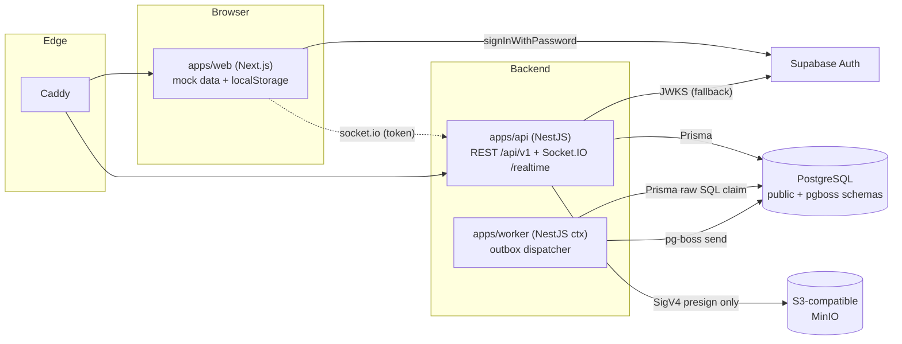

# 01 — Architecture Map (Phases 1–2)

Derived from imports, module registrations, configuration, and runtime observation — not from folder
names alone.

## 1. Repository structure (actual)

```text
vynor-crm-system/
├── apps/
│   ├── api/                 NestJS HTTP API + Socket.IO gateway (deployable)
│   │   ├── src/
│   │   │   ├── main.ts                     bootstrap: env validation, prefix api/v1, global pipe/filter/interceptors, CORS
│   │   │   ├── app.module.ts               imports Iam, Health, Audit, Storage, Realtime, OpenApi; CorrelationIdMiddleware on '*'
│   │   │   ├── common/{filters,interceptors,middleware,pipes}/   cross-cutting HTTP infrastructure
│   │   │   ├── iam/                        JWT verification, actor resolution, AuthGuard + PermissionGuard (APP_GUARD), decorators
│   │   │   ├── audit/                      AuditService (global module)
│   │   │   ├── health/                     liveness/readiness/system health controller
│   │   │   ├── storage/                    signed attachment download endpoint
│   │   │   ├── realtime/                   Socket.IO gateway (namespace /realtime) + publisher
│   │   │   ├── openapi/                    hand-written OpenAPI document + error catalog
│   │   │   └── verify-backend-core.ts      assertion script (compiled into dist)
│   │   └── tests/                          Vitest unit tests (IAM matrix)
│   ├── worker/              NestJS application context (deployable)
│   │   ├── src/{main.ts, worker.module.ts, queue/, outbox/}
│   │   └── tests/                          Vitest integration test (outbox concurrency)
│   └── web/                 Next.js 16 App Router (deployable)
│       ├── src/
│       │   ├── app/                        21 routes; most pages are client components holding mock data
│       │   ├── components/{ui,common,layout,shell,sidebar,navigation,providers}/   design system + app chrome
│       │   ├── components/{inbox,channels,ai-agent,broadcast,blast}/              feature UI
│       │   ├── hooks/                      global + inbox keyboard shortcuts
│       │   ├── lib/{api,auth,query,realtime,store,supabase,ai-agents}/            client infrastructure
│       │   ├── middleware.ts               cookie-heuristic route protection + correlation header
│       │   ├── env.ts                      validated NEXT_PUBLIC_* env
│       │   └── verify-*.ts                 4 assertion scripts (source/string checks)
│       └── tests/{unit,e2e}/
├── packages/
│   ├── contracts/  database/  observability/  storage/  channel-adapters/  ai/  shared/
├── infrastructure/
│   ├── caddy/Caddyfile
│   ├── docker/              byte-identical copies of docker-compose.yml and apps/*/Dockerfile
│   └── scripts/verify-infrastructure.ts
├── docs/                    30 topical docs + 14 ADRs (+ this workspace)
├── docker-compose.yml       local topology (postgres, minio "rustfs", api, worker, web, caddy)
├── issue.md                 181 KB UI/UX design specification
└── root configs             turbo.json, pnpm-workspace.yaml, tsconfig.*.json, eslint.config.mjs, vitest.config.mts
```

## 2. System components



Key fact: **the web app does not call the REST API today.** `lib/api/api-client.ts` defines an
`api` namespace that no component imports; only `ApiClientError` is used. All module pages render
in-file mock data; AI agents persist to `localStorage` through a repository interface
(`lib/ai-agents/repository.ts`). The only live backend link from the browser is the realtime
socket, which connects with the Supabase access token.

## 3. Workspace dependency graph (from imports)

```text
@vynor/contracts        ← observability, storage, database, channel-adapters, api, worker, web
@vynor/observability    ← api, worker          (+ test-only reverse edge from contracts/tests)
@vynor/database         ← api, worker
@vynor/storage          ← api
@vynor/channel-adapters ← (none)
@vynor/ai               ← (none)
@vynor/shared           ← (none; declared as dependency of observability but never imported)
```

No production-level circular dependency exists between workspaces. One **test-level** cycle exists:
`packages/contracts/tests/config-and-redaction.spec.ts` imports `@vynor/observability`, which
depends on `@vynor/contracts`.

ESLint enforces three boundary rules (`eslint.config.mjs`): packages must not import apps; api/worker
must not import web; web must not import api/worker. There is **no** rule preventing the browser
app from importing Node-only packages (`@vynor/database`, `@vynor/storage`, `@vynor/observability`).

## 4. API internal module map

| Module                 | Registers                                                                                                    | Depends on                                                            |
| ---------------------- | ------------------------------------------------------------------------------------------------------------ | --------------------------------------------------------------------- |
| `IamModule` (global)   | `JwtVerifierService`, `ActorContextService`, `PolicyService`, `APP_GUARD` `AuthGuard` then `PermissionGuard` | `@vynor/database` (`prisma`), `AuditService`                          |
| `AuditModule` (global) | `AuditService`                                                                                               | `@vynor/database`                                                     |
| `HealthModule`         | `HealthController`                                                                                           | `@vynor/database`, `@vynor/observability`                             |
| `StorageModule`        | `StorageController`, `StorageService`                                                                        | `@vynor/storage`, `@vynor/database`, `AuditService`                   |
| `RealtimeModule`       | `RealtimeGateway`, `RealtimePublisherService`                                                                | `JwtVerifierService`, `ActorContextService`                           |
| `OpenApiModule`        | `OpenApiController`                                                                                          | static document + `ERROR_CATALOG`                                     |
| `common/*`             | middleware, filter, interceptors, pipe                                                                       | filter imports `IamException` from `iam/` (common → feature coupling) |

Services use the `prisma` singleton imported from `@vynor/database` directly (no DI provider), and
most read `process.env` directly instead of the validated env object.

## 5. Control and data flows

### 5.1 HTTP request

```text
Caddy (/api/*) → Express
  → CorrelationIdMiddleware        validates x-correlation-id (regex) or generates req_<sec>_<hex>
  → AuthGuard (APP_GUARD)          @Public() bypass | Bearer → JwtVerifierService (HS256 secret → JWKS fallback)
                                   overwrites request.correlationId with RAW header (see SEC-03)
                                   → ActorContextService (user_profiles → workspaces → memberships+roles+permissions+teams)
  → PermissionGuard (APP_GUARD)    @RequirePermissions metadata; denial → audit_logs row → 403
  → CorrelationIdInterceptor       re-applies request.correlationId to response header
  → IdempotencyInterceptor         POST/PATCH/DELETE + Idempotency-Key → in-memory Map (per process)
  → ZodValidationPipe              schema from constructor or metatype.schema
  → Controller → Service → Prisma
  ← ApiExceptionFilter             every exception → {statusCode, code, message, details?, correlationId, timestamp}
```

### 5.2 Transactional outbox → queue

```text
domain transaction (withTransactionalOutbox)  → outbox_events (PENDING)      [no producer exists yet]
worker poll every 1 s → claimPendingOutboxEvents(limit 50, lease 60 s, FOR UPDATE SKIP LOCKED) → PROCESSING
  → resolveQueueName(eventType prefix) → createJobEnvelope → pg-boss send(singletonKey "outbox:<id>")
  → success: COMPLETED (+processedAt, dispatchedAt)
  → failure: PENDING, retryCount+1, lastError; DEAD_LETTER when retryCount+1 >= 5
worker every 30 s → recoverExpiredOutboxLeases(max 5): expired PROCESSING → PENDING or DEAD_LETTER
```

No pg-boss **consumers** (`work()` handlers) exist; jobs are produced but never processed.

### 5.3 Realtime

```text
client io(<SOCKET_URL>/realtime, auth {accessToken, workspaceId, lastSeenEventId?})
  → RealtimeHandshakeAuthSchema → JwtVerifierService.verify → ActorContextService.resolve
  → join "workspace:<client-supplied workspaceId>" → emit "resync"
  message "join:conversation" {conversationId} → requires conversation:read → join "conversation:<id>"
RealtimePublisherService.publish(input) → server.to(rooms).emit(eventType, envelope)   [no caller yet]
```

### 5.4 Attachment download

```text
GET /api/v1/attachments/:id/download-url?ttl=  (@RequirePermissions('message:read'))
  → prisma.attachment.findUnique → workspace check → authorizeSignedDownload (zone, scan, expiry, TTL 10–300 s)
  → RustFsStorageAdapter.createSignedDownload (SigV4 query presign) → audit_logs row → {data: …}
```

### 5.5 Web authentication (client-side only)

```text
/login → supabase.auth.signInWithPassword  (or signInDemo → fabricated session)
AuthProvider builds ActorContext locally: roles ['SUPER_ADMIN'], fixed permission list,
  workspace from user_metadata; writes access token to cookie vynor_session (7 days, JS-readable)
middleware.ts → treats any cookie containing "auth-token"/"access-token" or named vynor_session as signed-in
```

## 6. External integrations

| Integration        | Where                                                       | Status                                   |
| ------------------ | ----------------------------------------------------------- | ---------------------------------------- |
| Supabase Auth      | web `lib/supabase/client.ts`; api `jwt-verifier.service.ts` | Active                                   |
| PostgreSQL         | Prisma (`packages/database`), pg-boss (worker)              | Active                                   |
| S3 / MinIO         | `packages/storage/src/s3-adapter.ts`                        | Presign used; put/get/stat/delete unused |
| WhatsApp Cloud API | env vars + contracts only                                   | Not implemented                          |
| Sentry             | scrub/config helpers only, no SDK                           | Not integrated                           |
| Redis              | optional `REDIS_URL` in env schema                          | Not used                                 |

## 7. Cross-cutting concerns

| Concern         | Implementation                                                                                                         |
| --------------- | ---------------------------------------------------------------------------------------------------------------------- |
| Logging         | Pino via `createLogger` instantiated per class (5 places); Nest's built-in `Logger` in `ApiExceptionFilter`            |
| Correlation     | Middleware (validated) + interceptor/guard/filter fallbacks with a different ID format; web middleware; web api-client |
| Error handling  | Global `ApiExceptionFilter`; exception payloads built inline in 5 places                                               |
| Caching         | TanStack Query (web); in-memory idempotency Map (api)                                                                  |
| Background jobs | Outbox poller + lease recovery (worker `setInterval`)                                                                  |
| Config          | Zod-validated at boot; most consumers re-read `process.env` with their own defaults                                    |

## 8. Architectural contracts that must survive refactoring

1. Workspace boundary (ADR-008): every workspace-scoped row carries `workspace_id` with cascade FK.
2. Backend-owned authorization (ADR-007): `AuthGuard` + `PermissionGuard` as global guards, deny-by-token,
   permission metadata via `@RequirePermissions`, `@Public()` opt-out.
3. Transactional outbox semantics (ADR-006): SKIP LOCKED claim, lease recovery, singleton key `outbox:<id>`.
4. Error envelope shape and correlation header on every API response.
5. `/api/v1` prefix and route paths.
6. Package public surfaces (`exports["."]` barrels) and ESM `.js` specifiers.
7. Prisma schema, migration history, constraint/index names (checked by `db:verify`).
8. Browser storage keys holding user data (`vynor.ai-agents.v1`, theme, sidebar width, auth).
