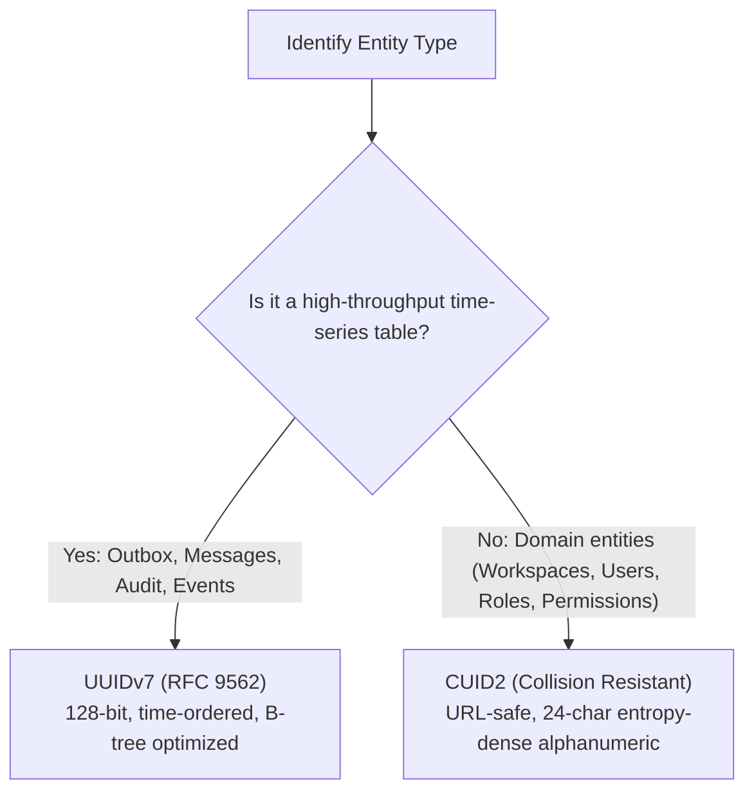

# Database Conventions & Schema Standards

This document establishes the official database design conventions, ID strategies, timestamp/timezone standards, soft-deletion semantics, and enum policies for VYNOR CRM, governed by Prisma ORM and Supabase PostgreSQL.

---

## 1. Naming Conventions

All database entities conform strictly to standardized naming patterns to ensure consistency across the API, Prisma client, and underlying PostgreSQL catalog.

| Entity Type                 | Prisma Schema Name         | PostgreSQL Database Name           | Example                                                                        |
| :-------------------------- | :------------------------- | :--------------------------------- | :----------------------------------------------------------------------------- |
| **Model / Table**           | PascalCase (singular)      | snake_case (plural) via `@@map`    | `model Workspace` -> `@@map("workspaces")`                                     |
| **Field / Column**          | camelCase                  | snake_case via `@map`              | `createdAt` -> `@map("created_at")`                                            |
| **Foreign Key Field**       | camelCase (`<relation>Id`) | snake_case (`<table_singular>_id`) | `workspaceId` -> `@map("workspace_id")`                                        |
| **Indexes**                 | N/A                        | `idx_<table_name>_<columns>`       | `@@index([status, scheduledAt], map: "idx_outbox_events_status_scheduled_at")` |
| **Unique Constraints**      | N/A                        | `uq_<table_name>_<columns>`        | `@@unique([workspaceId, name], map: "uq_roles_workspace_name")`                |
| **Foreign Key Constraints** | N/A                        | `fk_<table_name>_<target>`         | `ALTER TABLE workspace_memberships ADD CONSTRAINT ...`                         |
| **Enums**                   | PascalCase                 | PascalCase (in PostgreSQL)         | `enum MembershipStatus` -> `CREATE TYPE "MembershipStatus"`                    |
| **Enum Values**             | SCREAMING_SNAKE_CASE       | SCREAMING_SNAKE_CASE               | `SUPER_ADMIN`, `DEAD_LETTER`                                                   |

---

## 2. Identifier (ID) Strategy

VYNOR CRM employs two distinct primary key generation strategies depending on the write profile and query characteristics of each table.



### 2.1 CUID2 for Domain Entities

- **Scope:** `workspaces`, `user_profiles`, `workspace_memberships`, `roles`, `permissions`.
- **Properties:** 24-character, URL-safe, entropy-dense alphanumeric identifiers generated without central coordination. Resilient against brute-force guessing and distributed collisions.
- **Prisma Schema:** `id String @id @default(cuid())`
- **Helper:** `generateId(prefix?: string)` from `@vynor/database` (supports optional domain prefixes like `ws_`, `usr_`).

### 2.2 UUIDv7 for High-Throughput & Event Streams

- **Scope:** `outbox_events`, `messages`, `audit_logs`, `provider_events`.
- **Properties:** Time-sortable 128-bit UUIDs conforming to RFC 9562. The 48-bit millisecond timestamp prefix ensures sequential B-tree insertion locality, avoiding index fragmentation under heavy insert loads.
- **Prisma Schema:** `id String @id @default(uuid())` or populated via `@vynor/database` helper `generateUuidV7()`.

---

## 3. Timestamp & Timezone Standards

### 3.1 UTC Timestamps

All timestamp columns **must** be stored as UTC in PostgreSQL using `TIMESTAMPTZ(6)`:

```prisma
createdAt DateTime  @default(now()) @map("created_at") @db.Timestamptz(6)
updatedAt DateTime  @updatedAt @map("updated_at") @db.Timestamptz(6)
deletedAt DateTime? @map("deleted_at") @db.Timestamptz(6)
```

- **Rule:** Never use `TIMESTAMP WITHOUT TIME ZONE` (`@db.Timestamp`).
- **Rule:** The database connection timezone is set to `'UTC'`.

### 3.2 Workspace Timezone Presentation

- Each `Workspace` entity records an IANA timezone string in its `timezone` column (default `'UTC'`, e.g., `'Asia/Jakarta'`, `'America/New_York'`).
- The database stores only raw UTC. Conversion to localized business hours and display formatting is performed strictly at the application presentation layer.

---

## 4. Soft-Deletion Conventions

To protect against accidental data loss and fulfill audit/retention requirements, domain entities use timestamp-based soft-deletion.

### 4.1 Schema Definition

- Column: `deletedAt DateTime? @map("deleted_at") @db.Timestamptz(6)`
- **Rule:** Do **not** use boolean `isDeleted`. A nullable timestamp provides both the deletion flag (`deletedAt != null`) and the exact audit time of removal.

### 4.2 Query Semantics

- Domain application queries must explicitly filter active records:
  ```ts
  where: {
    deletedAt: null;
  }
  ```
- Soft-deleted entities retain relationships to maintain referential integrity.
- **Hard Delete Exception:** Hard deletion (`DELETE FROM ...`) is strictly reserved for GDPR/compliance erasure requests, automated test cleanup, or ephemeral scratch tables.

### 4.3 Unique Constraints with Soft Deletes

When a unique constraint applies to a table with soft deletes (e.g., `slug` or `email`), compound unique indexes should be scoped or managed via partial unique indexes:

```sql
CREATE UNIQUE INDEX "uq_workspaces_active_slug" ON "workspaces"("slug") WHERE "deleted_at" IS NULL;
```

---

## 5. Enum Conventions

- Enums are defined in Prisma in PascalCase.
- Values use `SCREAMING_SNAKE_CASE`.
- Enums map directly to PostgreSQL native `CREATE TYPE ... AS ENUM (...)`.
- Enums are reserved for stable, closed state machines (e.g., `SystemRoleName`, `MembershipStatus`, `OutboxEventStatus`).
- For dynamic or user-customizable collections (e.g., custom tags, dynamic categories), use relational lookup tables rather than native database enums.

---

## 6. Table Boundary Constraints

- **No Binary Data in Database (AD-010):** Never store raw binary data, files, images, or audio in `BYTEA` columns. All attachments are streamed to S3/RustFS object storage; the database stores only metadata, S3 bucket keys, MIME types, and size metrics.
- **Multi-Tenant Workspace Scoping (AD-008):** Every domain query, mutation, and index must include `workspaceId` as a mandatory partitioning attribute.
