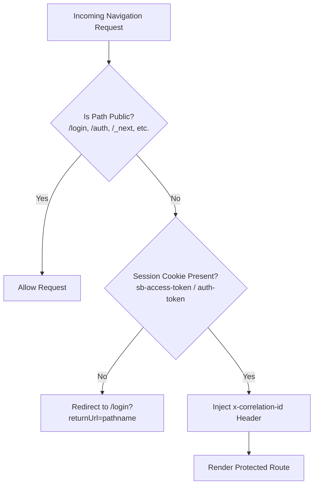
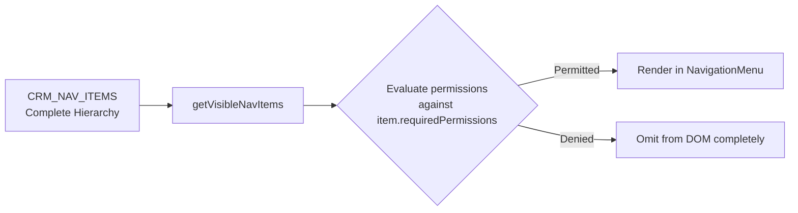

# Frontend Protected Routes & Permission-Aware Navigation

This document specifies the route protection architecture, authentication context, permission hooks, and navigation menu filtering for `apps/web`.

---

## 1. Route Protection Architecture (Next.js Middleware)

Protected CRM routes are guarded at the edge by Next.js middleware in `apps/web/src/middleware.ts`:



### 1.1 Unauthenticated Redirects

- When an unauthenticated visitor attempts to access any protected CRM route (e.g. `/inbox`, `/settings`, `/contacts`), the middleware intercepts the request and issues a `307 Temporary Redirect` to `/login?returnUrl=<encoded_path>`.
- Upon successful login, the application redirects the user directly back to their intended destination.

---

## 2. Client Authentication Context & Hooks

Frontend components access the current session and permissions through `AuthProvider`:

```tsx
import { AuthProvider, useActor, usePermission } from '@/lib/auth/auth-context';

export function AgentStatusWidget() {
  const actor = useActor();
  const canWriteConversation = usePermission('conversation:write');

  if (!actor) {
    return <div>Loading session...</div>;
  }

  return (
    <div>
      <p>Logged in as: {actor.user.displayName}</p>
      <p>Active Workspace: {actor.workspace.name}</p>
      {canWriteConversation && <button>Reply to Customer</button>}
    </div>
  );
}
```

### 2.1 Available Hooks

| Hook                         | Return Type            | Description                                                              |
| :--------------------------- | :--------------------- | :----------------------------------------------------------------------- |
| `useAuth()`                  | `AuthContextValue`     | Full auth state (`actor`, `isLoading`, `error`).                         |
| `useActor()`                 | `ActorContext \| null` | Active request actor context (user, workspace, membership, permissions). |
| `usePermission(action)`      | `boolean`              | Checks if the current actor possesses the specified permission.          |
| `useAllPermissions(actions)` | `boolean`              | Checks if the current actor possesses all specified permissions.         |

---

## 3. Declarative UI Protection (`<PermissionGate />`)

To prevent unauthorized UI elements (buttons, forms, action drawers) from rendering for agents without appropriate permissions:

```tsx
import { PermissionGate } from '@/components/navigation/PermissionGate';

export function CampaignControls() {
  return (
    <div>
      <h2>Broadcast Campaign</h2>

      {/* Renders Launch button only for actors with campaign:launch permission */}
      <PermissionGate
        permission="campaign:launch"
        fallback={
          <p className="text-muted">You do not have permission to trigger this broadcast.</p>
        }
      >
        <button onClick={handleLaunch} className="btn-primary">
          Launch Blast Now
        </button>
      </PermissionGate>
    </div>
  );
}
```

---

## 4. Permission-Aware Navigation Menu

Navigation links are filtered dynamically based on the actor's permissions:



### 4.1 Route to Permission Mapping

| Navigation Link               | Path                     | Required Permission  |
| :---------------------------- | :----------------------- | :------------------- |
| **Dashboard**                 | `/`                      | None (Authenticated) |
| **Inbox**                     | `/inbox`                 | `conversation:read`  |
| **Contacts**                  | `/contacts`              | `contact:read`       |
| **Campaigns**                 | `/campaigns`             | `campaign:read`      |
| **Analytics**                 | `/analytics`             | `analytics:read`     |
| **Settings**                  | `/settings`              | `workspace:read`     |
| **↳ Team Members**            | `/settings/teams`        | `team:read`          |
| **↳ Roles & Access**          | `/settings/roles`        | `role:read`          |
| **↳ Channels & Integrations** | `/settings/integrations` | `integration:read`   |
| **↳ Audit Logs**              | `/settings/audit`        | `audit:read`         |
