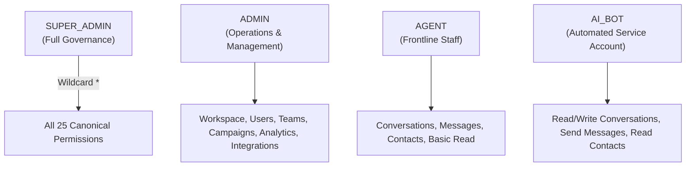

# Identity & Access Management (IAM) Policies & Rejection Matrix

This document defines the canonical permission catalog, actor context lifecycle, role-based authorization policies, rejection status codes, and the bootstrap administrator procedure for VYNOR CRM.

---

## 1. Canonical Permission Catalog (FND-029)

Permissions are immutable, fine-grained access capabilities formatted strictly as `resource:action`.

| Resource           | Action                | Category       | Description                                                |
| :----------------- | :-------------------- | :------------- | :--------------------------------------------------------- |
| **`workspace`**    | `workspace:read`      | `workspace`    | View workspace profile, configurations, and settings.      |
|                    | `workspace:update`    | `workspace`    | Modify workspace name, timezone, or business hours.        |
|                    | `workspace:delete`    | `workspace`    | Archive or delete a workspace (SuperAdmin only).           |
| **`user`**         | `user:read`           | `user`         | List and view workspace members and user profiles.         |
|                    | `user:invite`         | `user`         | Generate invitations for new workspace collaborators.      |
|                    | `user:manage`         | `user`         | Update membership status, assign roles, or remove members. |
| **`role`**         | `role:read`           | `role`         | Inspect role definitions and assigned permissions.         |
|                    | `role:manage`         | `role`         | Create, customize, and edit custom workspace roles.        |
| **`team`**         | `team:read`           | `team`         | View teams and department structures.                      |
|                    | `team:manage`         | `team`         | Create, update, and manage team member assignments.        |
| **`conversation`** | `conversation:read`   | `conversation` | Access and read customer conversation threads.             |
|                    | `conversation:write`  | `conversation` | Send agent replies, assign tickets, and change status.     |
|                    | `conversation:assign` | `conversation` | Reassign conversations to specific agents or teams.        |
|                    | `conversation:close`  | `conversation` | Resolve and close active customer conversations.           |
| **`message`**      | `message:read`        | `message`      | View message payloads, transcripts, and attachments.       |
|                    | `message:send`        | `message`      | Dispatch outbound omnichannel messages (WhatsApp, etc.).   |
|                    | `message:delete`      | `message`      | Recall or delete messages (subject to audit policies).     |
| **`contact`**      | `contact:read`        | `contact`      | View customer CRM contacts, attributes, and tags.          |
|                    | `contact:write`       | `contact`      | Create or update customer profiles and custom fields.      |
|                    | `contact:delete`      | `contact`      | Delete customer contact records.                           |
| **`campaign`**     | `campaign:read`       | `campaign`     | View broadcast marketing campaigns and metrics.            |
|                    | `campaign:write`      | `campaign`     | Author, edit, and schedule broadcast campaigns.            |
|                    | `campaign:launch`     | `campaign`     | Trigger execution of queued broadcast blasts.              |
| **`analytics`**    | `analytics:read`      | `analytics`    | View executive dashboards, SLA KPIs, and reports.          |
|                    | `analytics:export`    | `analytics`    | Export raw analytical datasets.                            |
| **`integration`**  | `integration:read`    | `integration`  | View channel provider accounts and API configurations.     |
|                    | `integration:manage`  | `integration`  | Configure webhooks, app secrets, and credentials.          |
| **`audit`**        | `audit:read`          | `audit`        | View compliance and security audit logs.                   |

---

## 2. Least-Privilege Default Roles (FND-034)

VYNOR CRM provisions four canonical system roles with least-privilege permissions:



1. **`SUPER_ADMIN`:** Root tenant governor. Granted root wildcard `*` satisfying all current and future permissions.
2. **`ADMIN`:** Operational manager. Capable of managing users, teams, campaigns, and channel integrations without tenant deletion rights.
3. **`AGENT`:** Frontline support and sales representative. Can view and reply to customer conversations, edit contact details, and view basic analytics.
4. **`AI_BOT`:** Machine service account for AI agents and worker automations. Scoped to inbound triage, automated replies, and routing.

---

## 3. Request Actor Context (FND-031)

Every authenticated API request is resolved into a strongly typed `ActorContext`:

```typescript
export interface ActorContext {
  user: {
    id: string; // Internal UserProfile.id (CUID2)
    supabaseAuthId: string; // Supabase Auth UUID (sub claim)
    email: string;
    displayName: string;
    isActive: boolean;
  };
  workspace: {
    id: string; // Workspace.id (CUID2)
    name: string;
    slug: string;
    timezone: string;
  };
  membership: {
    id: string; // WorkspaceMembership.id
    status: 'ACTIVE' | 'INVITED' | 'SUSPENDED' | 'DEACTIVATED';
    roles: string[]; // e.g. ['ADMIN', 'AGENT']
    teams: Array<{ id: string; name: string }>;
  };
  permissions: string[]; // e.g. ['conversation:read', 'conversation:write']
  correlationId: string; // Unique request tracking ID
  ipAddress?: string;
  userAgent?: string;
}
```

---

## 4. Rejection Matrix & Error Response Envelopes (FND-033)

When authorization fails, the API returns a structured RFC 7807 compliant error envelope:

| Failure Scenario             | HTTP Status        | Error Code (`code`)        | Default Message                                                            |
| :--------------------------- | :----------------- | :------------------------- | :------------------------------------------------------------------------- |
| **Missing Bearer Token**     | `401 Unauthorized` | `AUTH_TOKEN_MISSING`       | Authentication required. Bearer token missing from Authorization header.   |
| **Expired JWT Token**        | `401 Unauthorized` | `AUTH_TOKEN_EXPIRED`       | Authentication token has expired. Please refresh your session.             |
| **Invalid JWT Signature**    | `401 Unauthorized` | `AUTH_TOKEN_INVALID`       | Authentication token is invalid or signature verification failed.          |
| **Deactivated User Profile** | `403 Forbidden`    | `USER_ACCOUNT_DISABLED`    | Your user account has been deactivated or disabled.                        |
| **User Not in Workspace**    | `403 Forbidden`    | `MEMBERSHIP_NOT_FOUND`     | You do not have an active membership in the requested workspace.           |
| **Suspended Membership**     | `403 Forbidden`    | `MEMBERSHIP_INACTIVE`      | Your membership in this workspace has been suspended or deactivated.       |
| **Missing Workspace Header** | `400 Bad Request`  | `WORKSPACE_HEADER_MISSING` | Workspace context header (x-workspace-id or x-workspace-slug) is required. |
| **Wrong / Denied Workspace** | `403 Forbidden`    | `WORKSPACE_ACCESS_DENIED`  | Access to the specified workspace is denied.                               |
| **Missing Route Permission** | `403 Forbidden`    | `PERMISSION_DENIED`        | You do not have the required permission to perform this action.            |

### Standard JSON Error Payload

```json
{
  "statusCode": 403,
  "code": "PERMISSION_DENIED",
  "message": "Forbidden: Lacking required permission(s) [campaign:launch].",
  "details": {
    "required": ["campaign:launch"],
    "missing": ["campaign:launch"],
    "granted": ["campaign:read", "campaign:write"]
  },
  "correlationId": "req_1727161200_abc123",
  "timestamp": "2026-09-24T06:15:00.000Z"
}
```

---

## 5. Bootstrap Administrator Path (FND-034)

To initialize the first `SUPER_ADMIN` in a fresh deployment:

1. **Step 1: Create Supabase Auth User:**
   Register the primary administrator account in Supabase Auth (via Supabase Studio or CLI). Record the generated `id` (e.g. `auth_dev_admin_001`).
2. **Step 2: Run Seed Script:**
   ```bash
   pnpm --filter @vynor/database db:seed
   ```
   The seed script creates the default workspace `vynor-dev`, seeds the canonical permission catalog, creates the `SUPER_ADMIN` system role, and assigns the user's membership to the `SUPER_ADMIN` role.
3. **Step 3: Verification:**
   Invoke any protected API route with the administrator's JWT and `x-workspace-slug: vynor-dev`. The `AuthGuard` validates that root wildcard `*` is active on the `ActorContext`.
