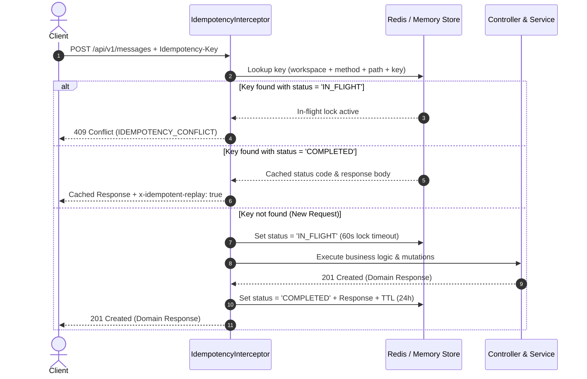

# Idempotency Policy & Replay Mechanics

This document establishes the official idempotency standards, header requirements, locking state machines, and replay behavior for mutating command endpoints across VYNOR CRM.

---

## 1. Overview & RFC Standard Compliance

Network retries, client double-clicks, and webhook delivery retries can cause non-idempotent operations (such as sending messages, launching campaigns, or billing transactions) to execute multiple times.

To guarantee that duplicate requests produce exactly one state mutation, VYNOR CRM implements the IETF Idempotency-Key HTTP header standard (`draft-ietf-httpapi-idempotency-key-header`).

---

## 2. Header Specification

Clients send the idempotency identifier in the `Idempotency-Key` header:

```http
POST /api/v1/messages HTTP/1.1
Host: api.vynor.local
Authorization: Bearer <token>
x-workspace-id: ws_12345
Idempotency-Key: 9b1deb4d-3b7d-4bad-9bdd-2b0d7b3dcb6d
Content-Type: application/json

{
  "conversationId": "conv_987",
  "text": "Your order has shipped."
}
```

### Constraints (`IdempotencyKeyHeaderSchema`)

- **Length:** Between 8 and 128 characters.
- **Allowed Characters:** Alphanumeric (`a-z`, `A-Z`, `0-9`), dashes (`-`), and underscores (`_`).
- **Uniqueness:** Generated by client (UUIDv4/UUIDv7 or unique CUID2).

---

## 3. Idempotency State Machine & Execution Flow



### 3.1 States

| State           | TTL / Timeout      | Behavior                                                                                                           |
| :-------------- | :----------------- | :----------------------------------------------------------------------------------------------------------------- |
| **`IN_FLIGHT`** | `60 seconds`       | Temporary distributed lock preventing concurrent execution of identical keys. Returns `409 Conflict`.              |
| **`COMPLETED`** | `24 hours`         | Request executed successfully. Subsequent matching requests receive the identical cached status and response body. |
| **`FAILED`**    | Immediate eviction | If the handler throws an unhandled error, the key is evicted, permitting safe immediate retry by client.           |

---

## 4. Replay Response Headers

When an idempotent replay occurs, the API returns the exact response body and status code generated by the original execution, accompanied by the tracking header:

```http
HTTP/1.1 201 Created
Content-Type: application/json
x-correlation-id: req_1727161200_a8f92b
x-idempotent-replay: true

{
  "data": {
    "id": "msg_01",
    "text": "Your order has shipped."
  }
}
```

---

## 5. Scope & Key Partitioning

Idempotency keys are partitioned by multi-tenant context to prevent cross-workspace key collisions:

$$\text{StorageKey} = \text{"idemp:"} + \text{workspaceId} + \text{":"} + \text{HTTP\_Method} + \text{":"} + \text{Path} + \text{":"} + \text{IdempotencyKey}$$

This guarantees that:

1. Two different workspaces using identical UUIDs do not collide.
2. An idempotency key sent to `POST /api/v1/messages` cannot inadvertently suppress a request to `POST /api/v1/campaigns`.
