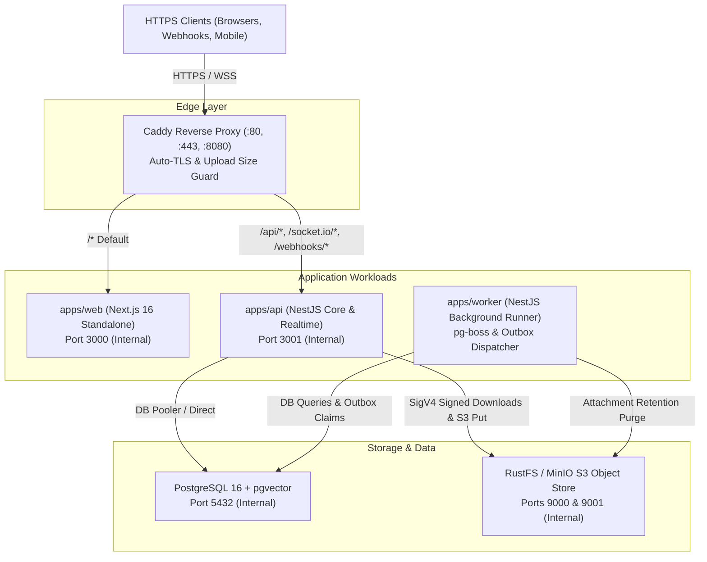
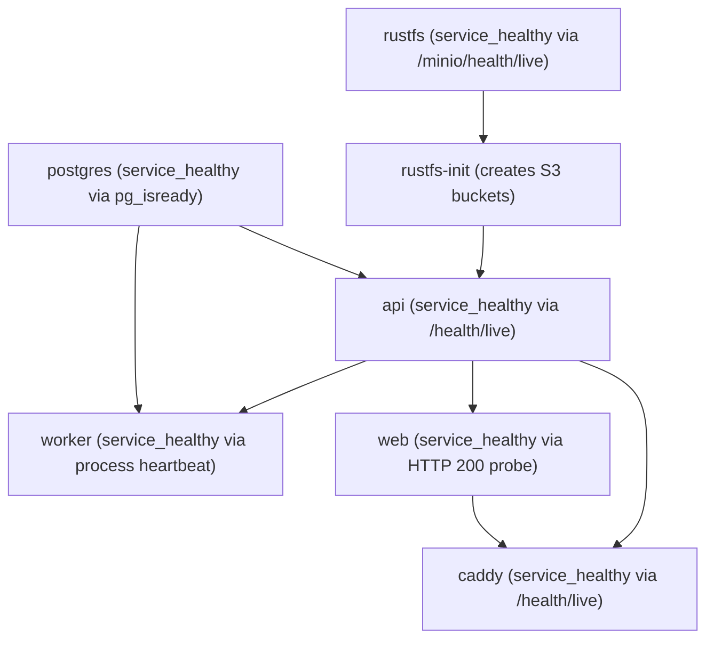

# Infrastructure & Deployment Guide

This document details the container architecture, Docker Compose service topology, edge reverse proxy configuration, health checks, and zero-sleep startup ordering for VYNOR CRM (**FND-INF-001 through FND-INF-005**).

---

## 1. System Topology Overview

VYNOR CRM runs as a modular monolith plus worker architecture backed by PostgreSQL, S3-compatible object storage (RustFS / MinIO), and edge routing via Caddy.



---

## 2. Service Catalog & Port Allocation

| Service       | Container Name      | Image / Build Context    | Exposed Ports                   | Internal Port | Description                                                |
| :------------ | :------------------ | :----------------------- | :------------------------------ | :------------ | :--------------------------------------------------------- |
| `caddy`       | `vynor-caddy`       | `caddy:2.8-alpine`       | `80:80`, `443:443`, `8080:8080` | `80, 443`     | Reverse proxy, TLS termination, request filtering.         |
| `web`         | `vynor-web`         | `apps/web/Dockerfile`    | `3000:3000`                     | `3000`        | Next.js App Router standalone web shell.                   |
| `api`         | `vynor-api`         | `apps/api/Dockerfile`    | `3001:3001`                     | `3001`        | NestJS REST API, Webhooks, Socket.IO gateway.              |
| `worker`      | `vynor-worker`      | `apps/worker/Dockerfile` | None (Internal)                 | N/A           | pg-boss background jobs & transactional outbox dispatcher. |
| `postgres`    | `vynor-postgres`    | `pgvector/pgvector:pg16` | `5432:5432`                     | `5432`        | Relational database with vector search extensions.         |
| `rustfs`      | `vynor-rustfs`      | `minio/minio:latest`     | `9000:9000`, `9001:9001`        | `9000, 9001`  | S3-compatible binary storage & admin console.              |
| `rustfs-init` | `vynor-rustfs-init` | `minio/mc:latest`        | None                            | N/A           | Ephemeral job initializing storage buckets.                |

---

## 3. Health Checks & Zero-Sleep Startup Ordering (FND-INF-005)

Startup race conditions and flaky environments are eliminated by enforcing **explicit health check dependencies** (`condition: service_healthy`). No arbitrary `sleep` commands are used anywhere in the codebase or container entrypoints.

### Startup Dependency Chain



### Health Check Probes Definition

1. **PostgreSQL:**
   ```yaml
   healthcheck:
     test: ['CMD-SHELL', 'pg_isready -U postgres -d vynor']
     interval: 5s
     timeout: 5s
     retries: 5
     start_period: 10s
   ```
2. **RustFS / S3 Object Store:**
   ```yaml
   healthcheck:
     test: ['CMD-SHELL', 'curl -f http://localhost:9000/minio/health/live || exit 1']
     interval: 5s
     timeout: 5s
     retries: 5
     start_period: 10s
   ```
3. **NestJS API (`/health/live` endpoint):**
   ```yaml
   healthcheck:
     test:
       [
         'CMD-SHELL',
         'wget --no-verbose --tries=1 --spider http://localhost:3001/health/live || exit 1',
       ]
     interval: 5s
     timeout: 5s
     retries: 5
     start_period: 15s
   ```
4. **Next.js Web (`/` endpoint):**
   ```yaml
   healthcheck:
     test: ['CMD-SHELL', 'wget --no-verbose --tries=1 --spider http://localhost:3000/ || exit 1']
     interval: 5s
     timeout: 5s
     retries: 5
     start_period: 15s
   ```
5. **Caddy Edge Proxy:**
   ```yaml
   healthcheck:
     test:
       [
         'CMD-SHELL',
         'wget --no-verbose --tries=1 --spider http://localhost:80/health/live || exit 1',
       ]
     interval: 5s
     timeout: 5s
     retries: 5
     start_period: 5s
   ```

---

## 4. Edge Reverse Proxy Routing (FND-INF-004)

Caddy acts as the perimeter ingress gateway. All external client traffic enters via Caddy:

### Route Dispatch Rules

- `/api/v1/attachments/*` -> `api:3001` (Bounded by `max_size 50MB` for binary uploads).
- `/webhooks/*` -> `api:3001` (Bounded by `max_size 5MB` and low timeouts for <500ms webhook ACK).
- `/socket.io/*` & `/realtime/*` -> `api:3001` (WebSocket connection upgrade support).
- `/api/*` & `/health/*` -> `api:3001` (General REST APIs and probes).
- `/*` (Default) -> `web:3000` (Next.js frontend user interface).

### TLS & Environment Profiles

- **Local Development:** `TLS_MODE=internal`. Caddy generates an internal trusted CA and issues self-signed TLS certificates for `localhost` with zero manual configuration.
- **Staging / Production:** `TLS_MODE=ops@vynor.io`. Caddy provisions and renews production certificates via Let's Encrypt and ZeroSSL automatically over ACME.

---

## 5. Security & Isolation Invariants

1. **Non-Root Runtime Users (FND-INF-001):**
   - `apps/api`: Runs as system user `vynor` (`uid: 1001`, `gid: 1001`).
   - `apps/worker`: Runs as system user `vynor` (`uid: 1001`, `gid: 1001`).
   - `apps/web`: Runs as system user `nextjs` (`uid: 1001`, `gid: 1001`).
   - No container process has root or sudo privileges.
2. **Least Privilege Network:**
   - All internal inter-service communication takes place across the private bridge network `vynor-network`.
   - Only Caddy (and optionally Postgres/RustFS for local development) expose external ports.
3. **Data Persistence:**
   - Database files are stored in volume `postgres_data`.
   - S3 objects are stored in volume `rustfs_data`.
   - TLS certificates and runtime keys are preserved in `caddy_data` and `caddy_config`.
