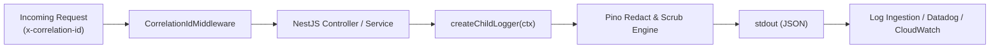
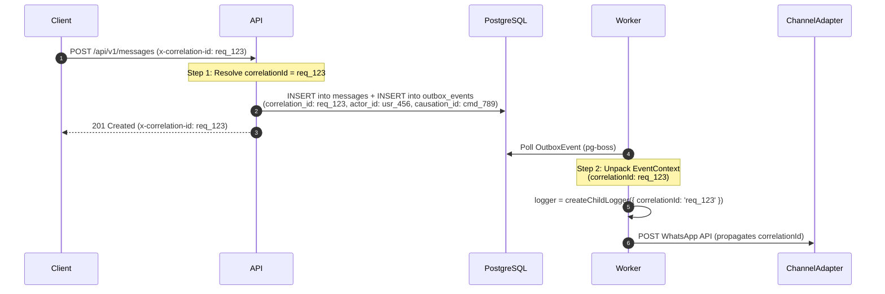

# Logging & Observability Standards

This document establishes the official structured logging standards, Pino JSON schema, mandatory context fields, distributed tracing propagation, and sensitive-field redaction rules across VYNOR CRM, conforming to **AD-001**, **AD-004**, **AD-005**, and **AD-007**.

---

## 1. Structured Logging Architecture (FND-043)

VYNOR CRM standardizes on **Pino** for all backend services (`apps/api`, `apps/worker`). All log lines emitted by processes are single-line, valid JSON records conforming to `PinoLogRecordSchema` (`@vynor/contracts`).



### 1.1 Mandatory Fields

Every production log line **must** contain the following fields:

| Field               | Type                | Description                                                            | Example                                      |
| :------------------ | :------------------ | :--------------------------------------------------------------------- | :------------------------------------------- |
| **`level`**         | `string` / `number` | RFC-5424 severity (`trace`, `debug`, `info`, `warn`, `error`, `fatal`) | `"info"`                                     |
| **`time`**          | `string` (ISO 8601) | UTC timestamp of log event                                             | `"2026-09-24T06:30:00.000Z"`                 |
| **`service`**       | `string`            | Originating application or service                                     | `"vynor-api"`, `"vynor-worker"`              |
| **`environment`**   | `string`            | Deployment environment profile                                         | `"production"`, `"staging"`, `"development"` |
| **`correlationId`** | `string`            | Unique request/job correlation identifier                              | `"req_1727161200_a8f92b7c4d"`                |
| **`workspaceId`**   | `string?`           | Multi-tenant workspace ID partition (if in request context)            | `"ws_clt1234567890"`                         |
| **`actorId`**       | `string?`           | Internal UserProfile ID or system identity                             | `"usr_clt9876543210"`                        |
| **`msg`**           | `string`            | High-level human-readable event message                                | `"Message dispatched to channel adapter"`    |

### 1.2 Example Log Output

```json
{
  "level": "info",
  "time": "2026-09-24T06:30:00.000Z",
  "pid": 4120,
  "service": "vynor-api",
  "environment": "production",
  "correlationId": "req_1727161200_a8f92b7c4d",
  "workspaceId": "ws_clt1234567890",
  "actorId": "usr_clt9876543210",
  "actorType": "user",
  "context": "MessagesController",
  "msg": "Outbound message created and committed to transactional outbox"
}
```

---

## 2. Correlation ID Generation & Acceptance (FND-044)

Traceability begins at the edge HTTP boundary:

1. **Header Name:** `x-correlation-id` (case-insensitive).
2. **Acceptance Rule:** If the incoming client request presents an `x-correlation-id` matching `^[a-zA-Z0-9_-]{8,128}$`, the server adopts that value.
3. **Generation Rule:** If the header is absent or invalid, the boundary generates a fresh cryptographically strong ID:
   $$\text{correlationId} = \text{"req\_"} + \lfloor\text{now}() / 1000\rfloor + \text{"\_"} + \text{randomHex}(6)$$
4. **Response Injection:** The resolved correlation ID is always echoed back in the response header `x-correlation-id` for client-side diagnostics and support ticket reconciliation.
5. **Next.js & API Alignment:** Both `apps/web` (Edge middleware) and `apps/api` (`CorrelationIdMiddleware`) enforce this rule.

---

## 3. Distributed Context Propagation (FND-045)

Async processing (Transactional Outbox and `pg-boss` queues) must not sever the trace chain. When a database mutation occurs:



### Context Schema (`EventContextSchema`)

All outbox events and worker jobs serialize the `EventContext`:

```typescript
export interface EventContext {
  correlationId: string;
  causationId?: string;
  workspaceId: string;
  actorId?: string;
  actorType?: 'USER' | 'SYSTEM' | 'AI_BOT' | 'API_KEY';
  traceparent?: string;
}
```

---

## 4. Sensitive-Field Redaction (FND-046)

To prevent data leakage into logs, Datadog, Sentry, or third-party log viewers, redaction is enforced at the logger and serialization layers.

### 4.1 Redacted Keys

Any property key matching the following patterns is replaced with `"[REDACTED]"`:

- **Authentication & Secrets:** `password`, `token`, `secret`, `authorization`, `cookie`, `apiKey`, `api_key`, `accessToken`, `refreshToken`, `signingSecret`, `privateKey`, `SUPABASE_SERVICE_ROLE_KEY`, `WEBHOOK_VERIFY_TOKEN`.
- **Financial & Identity:** `creditCard`, `cardNumber`, `cvv`, `pan`, `nationalId`, `ssn`.

### 4.2 PII Masking Utilities

When customer identifiers are needed for operational debugging, use partial masking instead of logging raw values:

- **Email:** `maskEmail('contact@vynor.com')` $\rightarrow$ `c***t@vynor.com`
- **Phone:** `maskPhone('+6281234567890')` $\rightarrow$ `+6281****7890`

### 4.3 Zero-Overhead Pino Engine

Pino's native C/V8 fast path uses `PINO_REDACT_PATHS` to redact nested and top-level fields during serialization with negligible CPU overhead.
