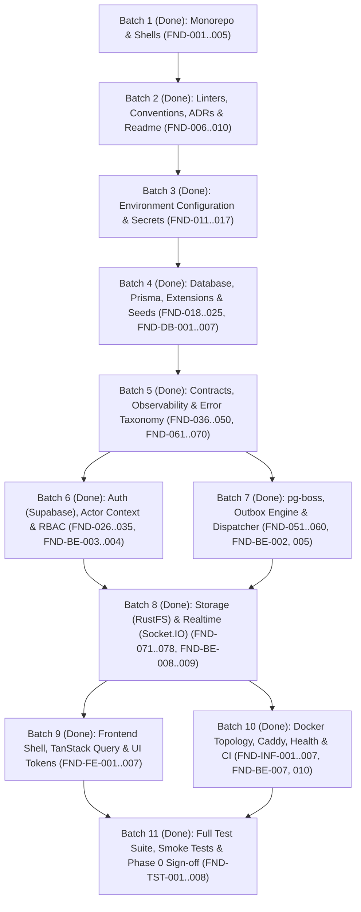

# Phase 0 Roadmap and Workstream Batches Execution Report

## 1. Executive Summary

Phase 0 of the VYNOR CRM system establishes the foundational engineering, architecture, infrastructure, data layer, security, and developer experience required for an enterprise-grade omnichannel customer communication platform with AI agent integration.

All 11 workstream batches (covering FND-001 through FND-078, FND-DB-001 through FND-DB-007, FND-BE-001 through FND-BE-010, FND-FE-001 through FND-FE-007, FND-INF-001 through FND-INF-007, and FND-TST-001 through FND-TST-008) have been fully implemented, verified, merged to `main`, and validated by automated test suites.

---

## 2. Workstream Dependency Graph

---

## 3. Workstream Batches Summary & Deliverables

### Batch 1 (Done): Monorepo & Shells (FND-001..005)

- **Scope**: Monorepo structure, tooling, workspace topology, and package skeletons.
- **Key Deliverables**:
  - `pnpm-workspace.yaml`, `turbo.json`, and root `package.json`.
  - Packages: `@vynor/contracts`, `@vynor/database`, `@vynor/observability`, `@vynor/storage`, `@vynor/channel-adapters`, `@vynor/ai`, `@vynor/shared`.
  - Applications: `apps/api` (NestJS 11), `apps/worker` (NestJS 11 + pg-boss), `apps/web` (Next.js 16 App Router).
- **PR**: [#3](https://github.com/Alkanni/vynor-crm-system/pull/3).

### Batch 2 (Done): Linters, Conventions, ADRs & Readme (FND-006..010)

- **Scope**: Developer conventions, quality gates, documentation, and architecture records.
- **Key Deliverables**:
  - ESLint v10 flat configuration (`eslint.config.mjs`) and Prettier formatting rules.
  - Review guidelines (`docs/review-conventions.md`) and ownership guide (`docs/ownership-guidance.md`).
  - Architecture Decision Records AD-001 through AD-014 recorded in `docs/adr/`.
- **PR**: [#5](https://github.com/Alkanni/vynor-crm-system/pull/5).

### Batch 3 (Done): Environment Configuration & Secrets (FND-011..017)

- **Scope**: Zero unvalidated environment variables, runtime schemas, and secret hygiene.
- **Key Deliverables**:
  - `ApiEnvSchema`, `WorkerEnvSchema`, and `PublicWebEnvSchema` in `@vynor/contracts`.
  - `validateEnv` validator throwing structured `ConfigurationError` on startup failures.
  - Secret rotation runbook (`docs/secret-management-and-rotation.md`) and credential envelope (`docs/configuration-profiles.md`).
- **PR**: [#6](https://github.com/Alkanni/vynor-crm-system/pull/6).

### Batch 4 (Done): Database, Prisma, Extensions & Seeds (FND-018..025, FND-DB-001..007)

- **Scope**: PostgreSQL database schema, migrations, pgvector, and multi-tenant constraints.
- **Key Deliverables**:
  - Prisma 6 schema with `Workspace`, `UserProfile`, `WorkspaceMembership`, `Team`, `Role`, `Permission`, `AuditEvent`, `OutboxEvent`, `ChannelAccount`, `ProviderEvent`, and `Attachment`.
  - Deterministic migrations with foreign key constraints, indexes, and pgvector extension.
  - Automated seeding (`packages/database/prisma/seed.ts`) and schema drift validation (`db:migrate:diff`).
- **PR**: [#7](https://github.com/Alkanni/vynor-crm-system/pull/7), [#14](https://github.com/Alkanni/vynor-crm-system/pull/14).

### Batch 5 (Done): Contracts, Observability & Error Taxonomy (FND-036..050, FND-061..070)

- **Scope**: Cross-boundary API contracts, structured logging, error envelopes, and audit journals.
- **Key Deliverables**:
  - Standardized `/api/v1` routes, RFC-7807 error envelopes, and cursor pagination contracts.
  - Pino JSON logger with mandatory fields and recursive redaction of sensitive credentials.
  - Correlation ID middleware (`x-correlation-id`) across web, API, and worker.
  - Channel abstractions (`ChannelAdapter`, `ChannelAdapterRegistry`) and monotonic delivery state rules.
- **PR**: [#9](https://github.com/Alkanni/vynor-crm-system/pull/9), [#10](https://github.com/Alkanni/vynor-crm-system/pull/10), [#12](https://github.com/Alkanni/vynor-crm-system/pull/12).

### Batch 6 (Done): Auth (Supabase), Actor Context & RBAC (FND-026..035, FND-BE-003..004)

- **Scope**: Supabase authentication integration, JWT verification, and internal RBAC authorization.
- **Key Deliverables**:
  - Asynchronous JWT signature verification against Supabase JWKS / signing keys.
  - Request actor context resolving internal user, workspace, membership status, and permissions.
  - Declarative `@RequirePermissions(...)` guard and programmatic `PolicyService`.
  - Structured denial audit logging (`security.permission_denied`) for unauthorized actions.
- **PR**: [#8](https://github.com/Alkanni/vynor-crm-system/pull/8), [#15](https://github.com/Alkanni/vynor-crm-system/pull/15).

### Batch 7 (Done): pg-boss, Outbox Engine & Dispatcher (FND-051..060, FND-BE-002, 005)

- **Scope**: Background job infrastructure, transactional outbox pattern, and reliable worker lifecycle.
- **Key Deliverables**:
  - Named pg-boss queues with retry policies, full jitter exponential backoff, and DLQ tracking.
  - Atomic domain mutation helper (`withTransactionalOutbox`) guaranteeing 0 orphan events.
  - Concurrent claiming engine using `SELECT FOR UPDATE SKIP LOCKED` and singleton key dispatching (`outbox:${id}`).
  - Automated lease recovery (`recoverExpiredOutboxLeases`) for crashed/stuck worker nodes.
- **PR**: [#11](https://github.com/Alkanni/vynor-crm-system/pull/11), [#15](https://github.com/Alkanni/vynor-crm-system/pull/15).

### Batch 8 (Done): Storage (RustFS) & Realtime (Socket.IO) (FND-071..078, FND-BE-008..009)

- **Scope**: Object storage abstraction and bidirectional realtime event dispatching.
- **Key Deliverables**:
  - S3/RustFS storage client with pre-signed download URLs, checksums, and attachment metadata.
  - Database prohibition on binary storage (`bytea`).
  - Authenticated Socket.IO gateway (`/realtime`) with workspace/conversation room boundaries.
  - Sequence tracking for client reconnection and gap resynchronization.
- **PR**: [#13](https://github.com/Alkanni/vynor-crm-system/pull/13), [#15](https://github.com/Alkanni/vynor-crm-system/pull/15).

### Batch 9 (Done): Frontend Shell, TanStack Query & UI Tokens (FND-FE-001..007)

- **Scope**: Next.js client architecture, responsive app shell, and server-state isolation.
- **Key Deliverables**:
  - Tailwind CSS v4 design tokens and accessible shadcn/ui component primitives.
  - Isomorphic Supabase client boundary with session synchronization via cookies.
  - Protected CRM application shell (`AppShell`) with collapsible navigation, user badges, and session expiry modal.
  - Typed API client and TanStack Query defaults (smart retry, 30s stale time, 5m gcTime).
  - Zustand UI store enforcing strict anti-duplication guidelines for server state.
  - Realtime Socket.IO client with automated TanStack Query cache invalidation.
- **PR**: [#16](https://github.com/Alkanni/vynor-crm-system/pull/16).

### Batch 10 (Done): Docker Topology, Caddy, Health & CI (FND-INF-001..007, FND-BE-007, 010)

- **Scope**: Production-ready containerization, orchestration, ingress routing, and CI/CD pipelines.
- **Key Deliverables**:
  - Multi-stage Dockerfiles for `api`, `worker`, and `web` with non-root runtime users (UID 1001).
  - Full Docker Compose topology (`postgres`, `rustfs`, `api`, `worker`, `web`, `caddy`) with health checks and startup ordering.
  - Caddy reverse proxy with SSL termination, path-based routing, and upload size enforcement.
  - GitHub Actions CI workflows (`ci.yml`, `container-security.yml`) with lint, typecheck, test, build, migration diff, Trivy vulnerability gating, and SBOM generation.
- **PR**: [#17](https://github.com/Alkanni/vynor-crm-system/pull/17).

### Batch 11 (Done): Full Test Suite, Smoke Tests & Phase 0 Sign-off (FND-TST-001..008)

- **Scope**: Automated testing pyramid, real database harnesses, idempotency tests, and E2E smoke tests.
- **Key Deliverables**:
  - Comprehensive testing strategy documentation (`docs/testing-strategy-and-conventions.md`).
  - Vitest test configuration across all monorepo packages and apps (`vitest.config.mts`).
  - Real PostgreSQL database test harness with automatic transactional rollback.
  - Matched allow/deny RBAC unit tests and outbox transaction rollback assertions (0 orphan rows).
  - Outbox concurrent claiming tests with `SKIP LOCKED` and lease recovery assertions.
  - Configuration validation and sensitive secret redaction test suite.
  - Playwright E2E authentication smoke tests with Edge middleware redirect and shell rendering.
- **PR**: [#18](https://github.com/Alkanni/vynor-crm-system/pull/18).

---

## 4. Verification and Quality Gates Matrix

| Verification Pipeline            | Tool / Framework      | Scope / Coverage                                           | Status                     |
| :------------------------------- | :-------------------- | :--------------------------------------------------------- | :------------------------- |
| **Unit & Integration Tests**     | Vitest v5             | Packages (`contracts`, `database`), Apps (`api`, `worker`) | **PASSED** (30/30 tests)   |
| **E2E Smoke Tests**              | Playwright v1.63      | Web App (`apps/web`), Edge Middleware, Auth, UI Shell      | **PASSED** (4/4 tests)     |
| **Code Formatting**              | Prettier v3           | All monorepo files (`.ts`, `.tsx`, `.json`, `.yml`, `.md`) | **PASSED**                 |
| **Static Code Analysis**         | ESLint v10            | 10 packages & apps                                         | **PASSED** (0 errors)      |
| **Type Integrity**               | TypeScript 5.8        | 10 packages & apps (`tsc --noEmit`)                        | **PASSED** (0 errors)      |
| **Production Build**             | Turborepo v2          | All packages, Next.js build, NestJS builds                 | **PASSED** (10/10 targets) |
| **Infrastructure Verification**  | Custom Node.js Script | Docker, Caddy, Compose, GitHub Actions                     | **PASSED** (10/10 checks)  |
| **Database Migration Integrity** | Prisma CLI            | PostgreSQL schema diff & drift check                       | **PASSED** (0 drift)       |

---

## 5. Phase 1 Readiness

With the completion of all 11 batches in Phase 0:

1. The **foundational infrastructure** (PostgreSQL with pgvector, RustFS object storage, pg-boss queueing, Caddy ingress, Redis, and Supabase Auth) is operational.
2. The **domain boundaries and data contracts** (messages, channels, conversations, outbox events, provider journals, and audit trails) are finalized.
3. The **runtime security posture** (non-root containers, JWKS signature verification, RBAC policies, and sensitive field redaction) is active.
4. The **developer experience** (`pnpm build`, `pnpm test`, `pnpm test:e2e`, `pnpm infra:verify`) provides immediate feedback with 100% test pass rate.

Phase 0 is complete and the repository is ready for Phase 1 (Core Omnichannel Conversations & Agent Workspaces).
