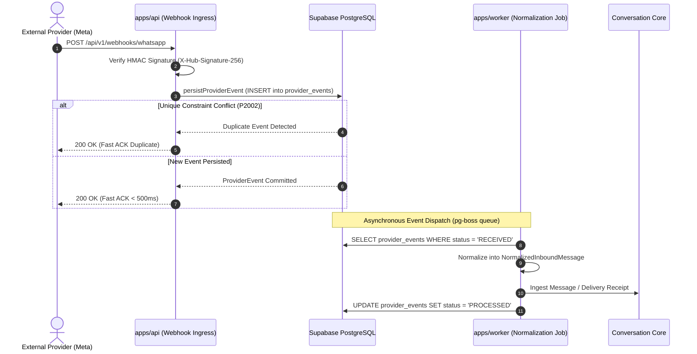
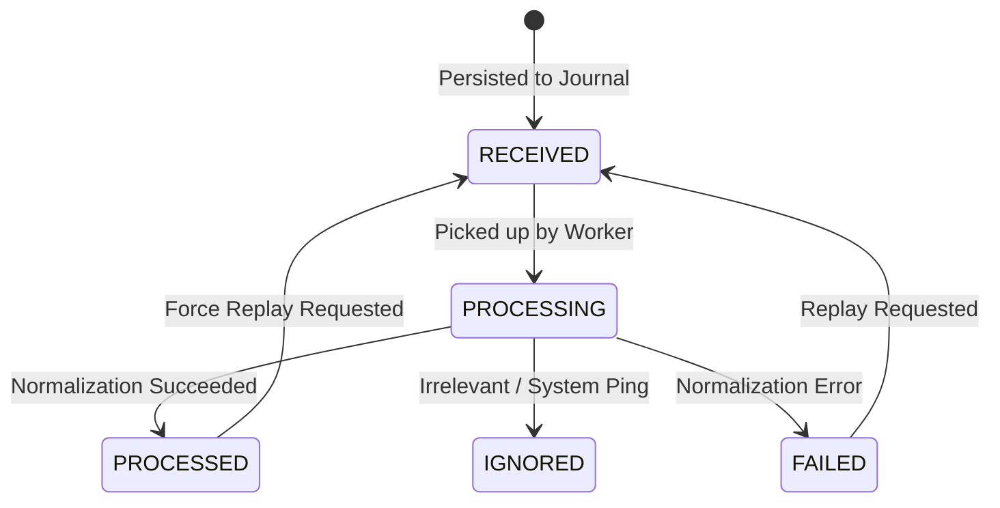

# Provider Event Journal, Deduplication, and Replay Semantics

This document details the immutable raw webhook journal, deterministic deduplication fingerprinting, and event lifecycle state machine for VYNOR CRM according to [AD-004](file:///home/acgix/vynor-crm/docs/adr/0004-durable-state-before-side-effects.md) and [AD-005](file:///home/acgix/vynor-crm/docs/adr/0005-at-least-once-processing-and-idempotency.md).

---

## 1. Durable State Before Side Effects (AD-004)

External webhook endpoints (e.g. Meta WhatsApp, Telegram, SendGrid) require HTTP responses within strict timeouts (typically < 3–5 seconds, recommended < 500ms). Heavy payload processing, media fetching, AI intent classification, or ticket routing during the synchronous HTTP request risks timeout failures, triggering aggressive provider retry storms.

Furthermore, if the application crashes or restarts while processing an in-flight webhook, unpersisted data is lost permanently.

**Guiding Architectural Rule:**

> _Every inbound webhook is parsed, validated, and persisted into the immutable `provider_events` table before HTTP acknowledgement and before triggering any downstream side effects._



---

## 2. Inbound Event Identity and Fallback Deduplication (FND-067, FND-068)

### External Provider Event Key

When an external platform provides a native top-level event ID (e.g., Telegram `update_id`, Meta `entry[].id` or message `id`), that string is used directly as `provider_event_key`.

### Fallback Deterministic SHA-256 Fingerprint (FND-068)

Certain providers or delivery status webhooks do not supply a unique top-level event ID. In such cases, the system generates a deterministic SHA-256 hash using the canonical payload structure:

```typescript
import { generateEventFingerprint } from '@vynor/channel-adapters';

const eventKey = rawPayload.id ?? generateEventFingerprint(providerAccountId, rawPayload);
```

#### Canonicalization Algorithm (`canonicalizePayload`):

1. **Sorted Keys:** Recursively sorts all object keys alphabetically.
2. **Normalized Nullability:** Ignores `undefined` fields to mirror JSON output deterministically.
3. **Array Order Preservation:** Preserves sequential ordering of array elements.
4. **Account Scoping:** Concatenates `providerAccountId` to ensure cross-tenant uniqueness.
5. **Fingerprint Format:** Prefixes the 64-character hex hash with `fp_sha256:` so internal diagnostics clearly identify synthetic keys.

---

## 3. Database Constraints and Concurrency Control (FND-069)

Deduplication is enforced at the database level by strict unique constraints in `packages/database/prisma/schema.prisma`:

### Provider Account Constraint

Ensures that a single workspace cannot configure the same external phone number, bot, or handle twice:

```prisma
@@unique([workspaceId, channelType, accountIdentifier], map: "uq_provider_accounts_workspace_channel_identifier")
```

### Provider Event Constraint

Guarantees absolute idempotency for incoming webhook deliveries:

```prisma
@@unique([providerAccountId, providerEventKey], map: "uq_provider_events_account_event_key")
```

### Ingestion Behavior (`persistProviderEvent`)

When an external provider retries a webhook delivery (at-least-once semantics):

1. `persistProviderEvent` executes `prisma.providerEvent.create(...)`.
2. If `P2002` (unique key conflict) occurs on `uq_provider_events_account_event_key`, the function catches the error, fetches the existing record, and returns `{ isDuplicate: true, event: existingRecord }`.
3. The API controller safely returns `200 OK` to the provider without initiating duplicate processing.

---

## 4. Processing Lifecycle States and Replay Semantics (FND-070)

The `ProviderEventStatus` enum models the lifecycle of every recorded event:



| Status       | Description                                                                                 |
| :----------- | :------------------------------------------------------------------------------------------ |
| `RECEIVED`   | Webhook recorded and committed; waiting for normalization worker.                           |
| `PROCESSING` | Worker has claimed the event and is actively transforming payload.                          |
| `PROCESSED`  | Successfully normalized and dispatched to Conversation Core.                                |
| `IGNORED`    | Valid payload that requires no downstream processing (e.g. system echo, verification ping). |
| `FAILED`     | Normalization failed due to malformed payload or unrecoverable error.                       |

### Event Replay Operation (`replayProviderEvent`)

Operators or automated dead-letter handlers can replay any failed or contested event:

```typescript
import { replayProviderEvent } from '@vynor/database';

const result = await replayProviderEvent({
  eventId: '018f3a8b-1234-7000-8000-000000000001',
  reason: 'Schema patch deployed to handle new WhatsApp interactive button format',
  force: true,
});
```

**Replay Properties:**

1. Resets status back to `RECEIVED`.
2. Clears `lastError`.
3. Does not alter the original `payload` or `headers` (maintaining journal immutability).
4. Because downstream Conversation Core ingestion is idempotent (keyed on `providerMessageId`), replaying a previously processed event is completely safe and will not create duplicate messages.

---

## 5. Retention and Purge Policy (FND-067)

Raw webhook payloads can consume considerable storage over time. To balance auditability and database efficiency:

- **Default Retention:** 90 days (`retentionDays: 90`).
- **Purge Timestamp:** `purgeAfter = createdAt + (retentionDays * INTERVAL '1 day')`.
- **Scheduled Archival:** A background worker runs daily during off-peak hours to archive or delete events where `status IN ('PROCESSED', 'IGNORED')` and `purgeAfter < NOW()`.
