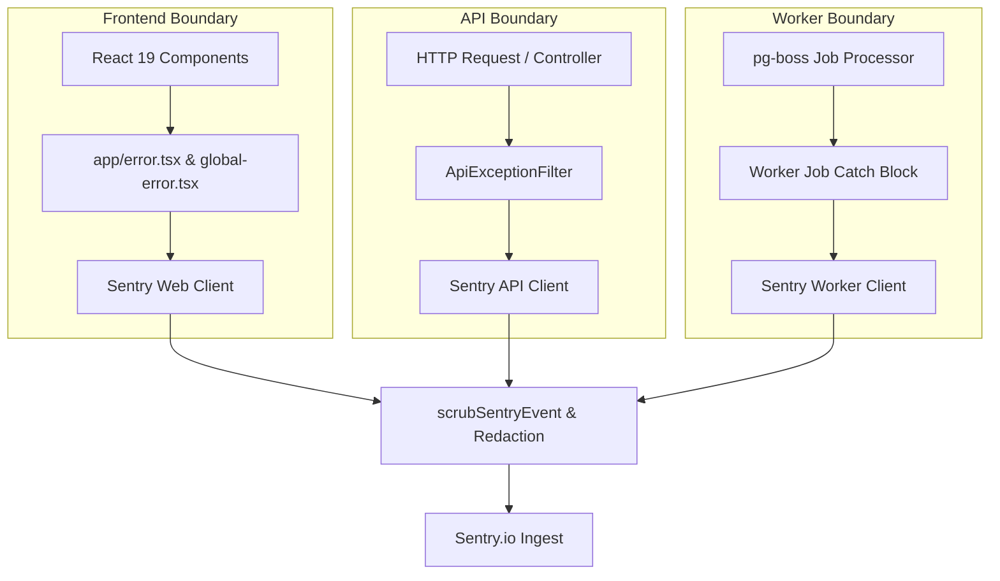

# Sentry Error Boundaries & Telemetry Governance

This document establishes the error capture boundaries, sensitive data scrubbing rules, sampling rates, and tag taxonomy for Sentry integration across `apps/web`, `apps/api`, and `apps/worker` in VYNOR CRM (conforming to **FND-047** and **FND-046**).

---

## 1. Architectural Error Boundaries

To prevent silent failures while insulating customers from raw infrastructure crashes, Sentry instrumentation is partitioned across three core execution surfaces:



### 1.1 Web Boundary (`apps/web`)

- **React Error Boundaries:** Implemented in `app/error.tsx` (route segment level) and `app/global-error.tsx` (root application level).
- **Behavior:** Catches rendering crashes and TanStack Query unhandled network errors, renders an empathetic user fallback UI, and reports the exception with the active `x-correlation-id`.
- **Sensitive Guard:** Strips localStorage tokens and auth cookie state from breadcrumbs before transmission.

### 1.2 API Boundary (`apps/api`)

- **NestJS Exception Filter:** Implemented in `ApiExceptionFilter`.
- **Behavior:**
  - Client errors (`4xx`, such as `422 VALIDATION_FAILED` or `403 FORBIDDEN`) are domain outcomes and are **not** sent to Sentry to prevent noise.
  - Internal server errors (`5xx`, such as unhandled exceptions, database deadlocks, or syntax errors) are captured and reported.
  - Automatically tags the event with `correlationId`, `workspaceId`, `actorId`, and `route`.

### 1.3 Worker Boundary (`apps/worker`)

- **Queue Job Failure Interceptor:**
  - Standard retries (e.g. transient network timeouts on attempt 1 or 2) are logged locally via Pino at `warn` level.
  - Exhausted retries transitioning a job to the Dead Letter Queue (`DEAD_LETTER`) trigger an immediate Sentry alert tagged with `queueName`, `jobId`, `correlationId`, and `retryCount`.

---

## 2. Sensitive Data Scrubbing (`beforeSend` & `beforeBreadcrumb`)

Under no circumstances may plain-text customer secrets, tokens, or PII be transmitted to Sentry. All environments configure `scrubSentryEvent()` (`@vynor/observability`):

```typescript
import { scrubSentryEvent } from '@vynor/observability';

Sentry.init({
  dsn: env.SENTRY_DSN,
  environment: env.NODE_ENV,
  beforeSend(event) {
    return scrubSentryEvent(event);
  },
  beforeBreadcrumb(breadcrumb) {
    if (breadcrumb.data) {
      breadcrumb.data = redactObject(breadcrumb.data);
    }
    return breadcrumb;
  },
});
```

### 2.1 Scrubbed Elements

1. **HTTP Headers:** `Authorization`, `Cookie`, `Set-Cookie`, `x-api-key` are scrubbed with `[REDACTED]`.
2. **Payload Bodies:** Deep recursion scrubs any key matching `password`, `token`, `secret`, `cvv`, `creditCard`.
3. **User Profiles:** The `user` object in Sentry retains only `id` and `workspaceId`. Raw emails and phone numbers are stripped or masked.

---

## 3. Sampling Rates & Configuration

| Environment       | Error Capture Rate | Traces Sample Rate | Profiles Sample Rate | Notes                          |
| :---------------- | :----------------- | :----------------- | :------------------- | :----------------------------- |
| **`development`** | 0% (Disabled)      | 0%                 | 0%                   | Logged to console only         |
| **`test`**        | 0% (Disabled)      | 0%                 | 0%                   | Silent in CI/test suites       |
| **`staging`**     | 100%               | 100% (`1.0`)       | 100% (`1.0`)         | Full diagnostic fidelity       |
| **`production`**  | 100%               | 10% (`0.1`)        | 0%                   | Cost and performance optimized |

---

## 4. Standard Tag Taxonomy

Every captured event must carry standard tags to allow instant correlation with backend Pino JSON logs:

- `correlationId`: Matches `x-correlation-id` and backend log lines.
- `workspaceId`: Identifies the multi-tenant workspace context.
- `actorId`: Identifies the acting user or service account.
- `service`: `vynor-api`, `vynor-worker`, or `vynor-web`.
- `release`: Git commit SHA or version tag (e.g. `1.0.0`).
