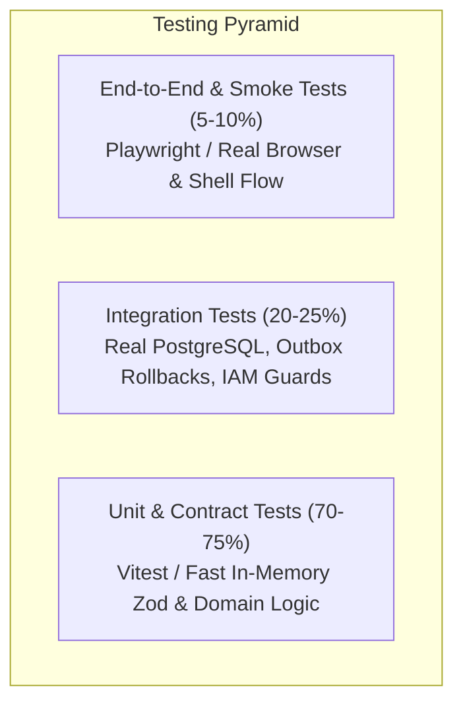

# Testing Strategy, Pyramid & Conventions

This document establishes the test pyramid architecture, file naming conventions, deterministic clock/ID standards, and test fixture guidelines for VYNOR CRM (**FND-TST-001**).

---

## 1. Test Pyramid Architecture

VYNOR CRM enforces a standard three-tier testing pyramid to maximize feedback velocity, determinism, and maintainability while minimizing flakiness and operational costs.



### 1.1 Level 1: Unit & Contract Tests (70–75%)

- **Scope:** Pure functions, Zod schema validation, data mappers, calculation utilities, state transitions (Zustand), error envelope mappings, and policy decision matrices.
- **Characteristics:**
  - In-memory execution; zero external network, disk, or database dependencies.
  - Execution speed: <5ms per test file.
  - Target: High branch coverage on business rules and contract boundaries.

### 1.2 Level 2: Database & Subsystem Integration Tests (20–25%)

- **Scope:** Real PostgreSQL database transactions, `SELECT FOR UPDATE SKIP LOCKED` concurrent outbox claiming, transactional rollback guarantees, NestJS Guards with `ActorContext`, and S3 storage adapters.
- **Characteristics:**
  - Executes against a real PostgreSQL instance (via Docker Compose `postgres` service or test database).
  - Uses `cleanDatabase` (TRUNCATE CASCADE) or `withTestTransaction` rollback to maintain complete isolation between test cases.
  - Execution speed: 10–50ms per test file.

### 1.3 Level 3: End-to-End (E2E) & Smoke Tests (5–10%)

- **Scope:** Browser rendering, Supabase session boundary, protected application shell (`AppShell`), permission-aware navigation, and session-expiry dialogs.
- **Characteristics:**
  - Automated via Playwright in headless Chromium/Firefox/WebKit.
  - Focuses on critical user journeys (smoke coverage) rather than exhaustive edge cases.

---

## 2. File Naming & Organization Conventions

All test files must strictly adhere to the canonical naming conventions:

| Category              | File Pattern            | Location                                                       | Runner     |
| :-------------------- | :---------------------- | :------------------------------------------------------------- | :--------- |
| **Unit Tests**        | `*.spec.ts`             | Colocated in `tests/` or alongside source (`src/**/*.spec.ts`) | Vitest     |
| **Integration Tests** | `*.integration.spec.ts` | `packages/*/tests/` or `apps/*/tests/`                         | Vitest     |
| **E2E Smoke Tests**   | `*.spec.ts`             | `apps/web/tests/e2e/`                                          | Playwright |

---

## 3. Deterministic Clock & ID Conventions

Non-deterministic tests are strictly prohibited. Flaky tests caused by race conditions, non-deterministic random IDs, or changing system times degrade developer trust.

### 3.1 Deterministic Clock Standard

1. Never call `new Date()` inside business logic asserting time-sensitive properties (e.g. lease expiration, backoff retry delays, or audit timestamps) without an injectable clock or fixed timestamp.
2. Standard test epoch reference:
   ```typescript
   export const TEST_CLOCK_EPOCH = new Date('2026-09-24T12:00:00.000Z');
   ```
3. Use Vitest's fake timers (`vi.useFakeTimers()`) to freeze time or fast-forward through backoff schedules and timeouts deterministically:
   ```typescript
   vi.useFakeTimers();
   vi.setSystemTime(new Date('2026-09-24T12:00:00.000Z'));
   // ... run assertions ...
   vi.useRealTimers();
   ```

### 3.2 Deterministic ID Generation

1. In unit and contract tests, avoid randomized cuid2 or uuidv7 generations when asserting exact payload structures.
2. Use predictable prefixed test IDs:
   - Workspaces: `ws_test_01`, `ws_test_02`
   - Users: `usr_test_01`, `usr_test_02`
   - Memberships: `mem_test_01`
   - Teams: `team_test_01`
   - Outbox Events: `outbox_test_01`
   - Attachments: `att_test_01`
   - Correlation IDs: `corr_test_01`

---

## 4. Test Fixtures & Factories

Test fixtures must be modular, strongly typed, and overrideable:

### 4.1 Mock Actor Context Factory

```typescript
export function createMockActorContext(overrides?: Partial<ActorContext>): ActorContext {
  return {
    user: {
      id: 'usr_test_01',
      supabaseAuthId: 'sub_test_01',
      email: 'agent@vynor.local',
      displayName: 'Test Agent',
      isActive: true,
      ...overrides?.user,
    },
    workspace: {
      id: 'ws_test_01',
      name: 'VYNOR HQ',
      slug: 'vynor-hq',
      timezone: 'UTC',
      ...overrides?.workspace,
    },
    membership: {
      id: 'mem_test_01',
      status: 'ACTIVE',
      roles: ['AGENT'],
      teams: [],
      ...overrides?.membership,
    },
    permissions: ['conversation:read', 'message:send'],
    correlationId: 'corr_test_01',
    ...overrides,
  };
}
```

---

## 5. Continuous Integration Gating Rules

1. **Unit & Contract Suite:** Must execute in under 15 seconds across the monorepo and pass with 100% success before any PR can be merged.
2. **Database Integration Suite:** Runs in GitHub Actions against a real `postgres:16` service container with `pgvector` enabled. Tests verify migration parity (`db:migrate:diff`), schema rules (`db:verify`), and transactional rollback invariants.
3. **E2E Smoke Suite:** Runs against the built standalone Next.js container, verifying authentication barriers and navigation integrity.
