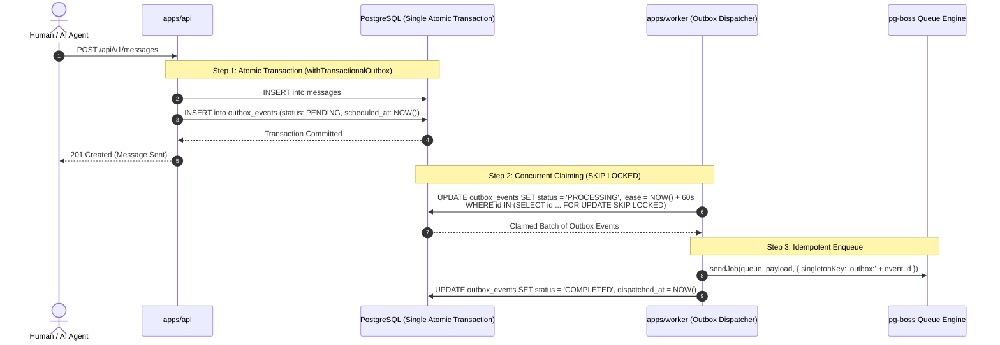

# Transactional Outbox Pattern & Idempotent Dispatch

This document establishes the official database model, atomic transaction helpers, concurrent outbox claiming mechanics, and idempotent `pg-boss` dispatch architecture for VYNOR CRM (conforming to **FND-056** through **FND-059** and **AD-006**).

---

## 1. Architectural Overview (AD-006)

In a distributed CRM system, updating domain data (such as inserting a message) and notifying external systems (such as dispatching via WhatsApp API) must never suffer from partial write failures.



---

## 2. OutboxEvent Database Model (FND-056)

```prisma
model OutboxEvent {
  id                  String            @id @default(uuid())
  workspaceId         String            @map("workspace_id")
  eventType           String            @map("event_type") @db.VarChar(100)
  payload             Json
  status              OutboxEventStatus @default(PENDING)
  correlationId       String?           @map("correlation_id") @db.VarChar(128)
  causationId         String?           @map("causation_id") @db.VarChar(128)
  actorId             String?           @map("actor_id") @db.VarChar(64)
  traceparent         String?           @db.VarChar(128)
  retryCount          Int               @default(0) @map("retry_count")
  lastError           String?           @map("last_error") @db.Text
  claimedAt           DateTime?         @map("claimed_at") @db.Timestamptz(6)
  claimLeaseExpiresAt DateTime?         @map("claim_lease_expires_at") @db.Timestamptz(6)
  claimedBy           String?           @map("claimed_by") @db.VarChar(128)
  dispatchedAt        DateTime?         @map("dispatched_at") @db.Timestamptz(6)
  scheduledAt         DateTime          @default(now()) @map("scheduled_at") @db.Timestamptz(6)
  processedAt         DateTime?         @map("processed_at") @db.Timestamptz(6)
  createdAt           DateTime          @default(now()) @map("created_at") @db.Timestamptz(6)
  updatedAt           DateTime          @updatedAt @map("updated_at") @db.Timestamptz(6)

  workspace Workspace @relation(fields: [workspaceId], references: [id], onDelete: Cascade)

  @@index([status, scheduledAt], map: "idx_outbox_events_status_scheduled_at")
  @@index([status, claimLeaseExpiresAt], map: "idx_outbox_events_status_lease")
  @@index([workspaceId, eventType], map: "idx_outbox_events_workspace_event_type")
  @@index([correlationId], map: "idx_outbox_events_correlation_id")
  @@map("outbox_events")
}
```

---

## 3. Atomic Transaction Helper (FND-057)

Application services use `withTransactionalOutbox` from `@vynor/database`:

```typescript
import { withTransactionalOutbox } from '@vynor/database';

const { result, outboxEvents } = await withTransactionalOutbox(prisma, async (tx) => {
  // 1. Perform domain mutations
  const message = await tx.message.create({
    data: { conversationId, content, senderId },
  });

  // 2. Return domain result and accompanying outbox intent
  return {
    result: message,
    outbox: [
      {
        workspaceId: actor.workspace.id,
        eventType: 'message.created',
        payload: { messageId: message.id, conversationId },
        correlationId: actor.correlationId,
        actorId: actor.user.id,
      },
    ],
  };
});
```

If any domain constraint fails or the transaction rolls back, **zero** outbox events are persisted.

---

## 4. Concurrent Claiming: `FOR UPDATE SKIP LOCKED` (FND-058)

To support multiple horizontally scaled worker replicas without row lock contention, the outbox dispatcher executes:

```sql
UPDATE outbox_events
SET status = 'PROCESSING',
    claimed_by = $1,
    claimed_at = NOW(),
    claim_lease_expires_at = NOW() + ($2 * INTERVAL '1 second'),
    updated_at = NOW()
WHERE id IN (
  SELECT id FROM outbox_events
  WHERE status = 'PENDING'
    AND scheduled_at <= NOW()
  ORDER BY scheduled_at ASC
  LIMIT $3
  FOR UPDATE SKIP LOCKED
)
RETURNING *;
```

### Why `SKIP LOCKED`?

- Replicas do not wait for another worker's locked rows; they simply skip them and claim the next available records.
- Prevents database deadlocks and serialization failures under high load.

---

## 5. Outbox-to-pg-boss Idempotent Dispatch (FND-059)

If a network blip occurs between enqueuing to `pg-boss` and updating the `outbox_events` table, duplicate deliveries could occur.

To guarantee **exactly-once enqueue semantics**:

1. All jobs dispatched from outbox use a deterministic singleton key:
   $$\text{singletonKey} = \text{"outbox:"} + \text{outboxEvent.id}$$
2. Even if a worker retries dispatching the identical outbox row, `pg-boss` recognizes the existing singleton key and rejects duplicate insertion.
3. The outbox row transitions to `status = 'COMPLETED'` with `dispatchedAt = NOW()`.
