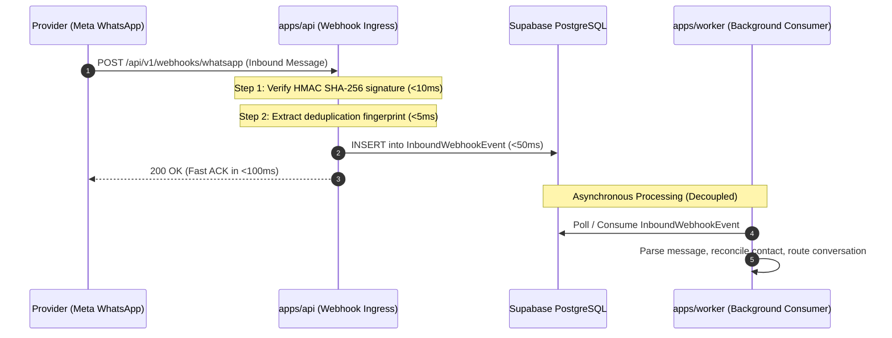

# Inbound Webhook Response Timing & Safe Disclosure Rules

This guide defines the response timing requirements, durable buffering architecture, and safe error disclosure policies for inbound provider webhooks (Meta WhatsApp Cloud API, Twilio, SendGrid, etc.) in VYNOR CRM, conforming to **AD-004** (Durable State Before Side Effects) and **AD-005** (At-Least-Once Processing and Idempotency).

---

## 1. The 500ms Fast-ACK Rule (FND-041)

External webhook providers enforce strict acknowledgment timeouts. For example, Meta WhatsApp Cloud API triggers automatic exponential retries if a webhook endpoint fails to return a `200 OK` response within 3 to 5 seconds.

### Rule

All inbound webhook controllers in `apps/api` must respond with HTTP `200 OK` or `202 Accepted` in **under 500 milliseconds**.

---

## 2. Durable Buffering Before Side Effects (AD-004)

Under no circumstances may an inbound webhook endpoint execute downstream operations (such as notifying WebSocket clients, dispatching AI agents, or making external HTTP calls) prior to committing the raw webhook payload to persistent storage.

### Ingress Flow

1. **Cryptographic Verification:** Validate HMAC signature using provider app secret (`x-hub-signature-256`).
2. **Deduplication Check:** Check composite unique constraint on `(providerAccountId, providerEventId)` or SHA-256 payload hash (**AD-005**).
3. **Persist Raw Event:** Commit the unparsed JSON payload into the PostgreSQL `InboundWebhookEvent` table.
4. **Immediate Response:** Return `200 OK` with lightweight JSON payload `{ "received": true }`.
5. **Worker Delegation:** The `apps/worker` daemon asynchronously ingests the event from the database for domain transformation.

---

## 3. Safe Error Disclosure Rules (FND-041)

Webhook endpoints are internet-facing ingress boundaries. They must adhere to strict information disclosure limits to prevent attackers from probing system internals.

### 3.1 Verification Failures

If an inbound request fails cryptographic signature validation or contains malformed headers:

- Return `401 Unauthorized` or `400 Bad Request`.
- **Allowed Message:** Generic error description (e.g. `"Invalid webhook signature."` or `"Malformed request payload."`).
- **Strictly Prohibited:**
  - Never disclose expected vs received signature hashes.
  - Never reveal provider secret keys or environment variable names.
  - Never return database connection errors or SQL syntax snippets.
  - Never disclose server internal file paths or stack traces.

### 3.2 Duplicate Deliveries

When a provider delivers a duplicate webhook that was already processed:

- Return `200 OK` immediately.
- The system recognizes duplicate delivery via database unique constraints or idempotency keys and safely ignores redundant processing without signaling an error to the provider.
