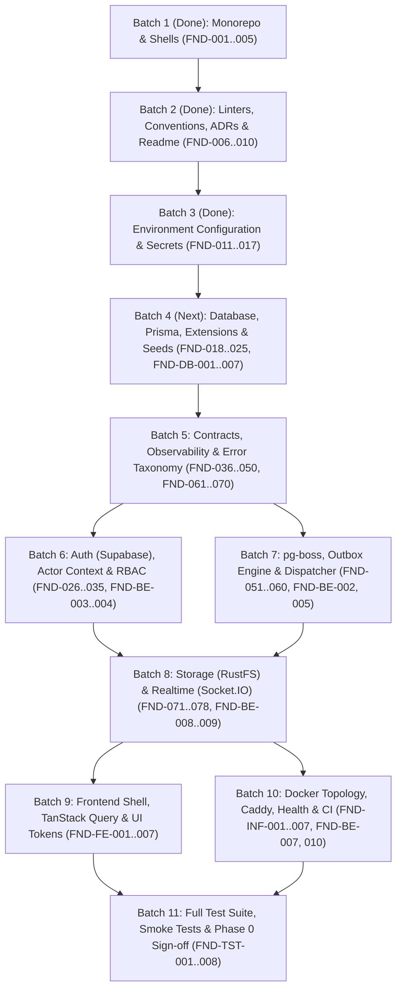

# VYNOR CRM — Engineering Implementation Plan (Phase 0)

> **Status:** In Progress (Batch 1 & Batch 2 Completed)  
> **Source Issue:** [GitHub Issue #4: Phase 0 — Engineering Foundation](https://github.com/Alkanni/vynor-crm-system/issues/4)  
> **Intended Delivery Model:** One developer assisted by AI coding agents  
> **Current Focus:** Phase 0 — Engineering Foundation

---

## 1. Executive Summary & Progress Snapshot

### Completed Tasks:

- [x] **FND-001 [P0]** Pinned Node.js `24.19.0` and pnpm `11.25.0` (`.node-version`, `.nvmrc`, `package.json`).
- [x] **FND-002 [P0]** Initialized pnpm workspace (`pnpm-workspace.yaml`) and Turborepo pipeline (`turbo.json`).
- [x] **FND-003 [P0]** Created application shells:
  - `apps/web` (Next.js App Router + TypeScript)
  - `apps/api` (NestJS REST API shell)
  - `apps/worker` (NestJS background worker shell)
- [x] **FND-004 [P0]** Created 7 shared packages with explicit public exports and standard package manifests:
  - `packages/ai`
  - `packages/channel-adapters`
  - `packages/contracts`
  - `packages/database`
  - `packages/observability`
  - `packages/shared`
  - `packages/storage`
- [x] **FND-005 [P0]** Enabled strict TypeScript configuration (`tsconfig.base.json`, `tsconfig.package.json`, and per-project configs).
- [x] **FND-006 [P0]** Configured linting (ESLint v10), code formatting (Prettier), import boundaries (`no-restricted-imports`), and unused-code checks (`eslint.config.mjs`, `.prettierrc.json`, `.prettierignore`, `turbo run lint`).
- [x] **FND-007 [P0]** Defined branch, commit, pull-request, and migration review conventions (`docs/review-conventions.md`, `.github/pull_request_template.md`).
- [x] **FND-008 [P1]** Added ownership guidance for security-sensitive and migration files (`docs/ownership-guidance.md`, `.github/CODEOWNERS`).
- [x] **FND-009 [P0]** Created comprehensive root README with local setup, commands, architecture summary, and links to docs (`README.md`).
- [x] **FND-010 [P0]** Added ADR template and recorded AD-001 through AD-014 in `docs/adr/` (`docs/adr/template.md`, `docs/adr/README.md`, `docs/adr/0001-...` through `0014-...`).
- [x] **FND-011 [P0]** Defined Zod-validated environment schemas for web, API, and worker (`packages/contracts/src/env/`).
- [x] **FND-012 [P0]** Separated public browser configuration (`NEXT_PUBLIC_*`) from server-only secrets (`packages/contracts/src/env/web.ts`, `apps/web/src/env.ts`, `apps/web/.env.example`).
- [x] **FND-013 [P0]** Added safe `.env.example` files containing names and descriptions, never credentials (`.env.example`, `apps/api/.env.example`, `apps/worker/.env.example`, `apps/web/.env.example`).
- [x] **FND-014 [P0]** Defined local, test, staging, and production configuration profiles (`docs/configuration-profiles.md`, `packages/contracts/src/env/common.ts`).
- [x] **FND-015 [P0]** Defined provider credential envelope and secret-reference contract (`packages/contracts/src/security/credential-envelope.ts`).
- [x] **FND-016 [P0]** Selected production secret storage and documented access/rotation procedure (`docs/secret-management-and-rotation.md` resolving OPEN QUESTION with Doppler/Infisical/Vault and step-by-step zero-downtime rotation).
- [x] **FND-017 [P0]** Added startup failure on missing or invalid required configuration (`packages/contracts/src/env/validator.ts`, wired to `apps/api/src/main.ts`, `apps/worker/src/main.ts`, `apps/web/src/env.ts`).

### Quality Gate Status:

- `pnpm install --frozen-lockfile` (Deterministic lockfile verified)
- `pnpm format:check` (100% Prettier compliant)
- `pnpm lint` (10/10 workspaces passed)
- `pnpm typecheck` (10/10 workspaces passed)
- `pnpm build` (10/10 workspaces passed)

---

## 2. Objective & System Architecture

VYNOR CRM is an internal, web-based Omnichannel Communication & AI Engagement System. Its primary objective is to combine customer communication from multiple external channels into one Unified Inbox, allow Human Agents and AI Agents to collaborate seamlessly within the same conversation lifecycle, and provide controlled Broadcast and Blast capabilities.

```text
External Provider (e.g. WhatsApp Cloud API)
  -> Channel Adapter (Journaling, Signature Verify, Normalization)
  -> Normalized Message Contract
  -> Conversation Core (Unified Inbox, Contacts, Assignment, Outbox)
  -> Realtime & Agent UI / AI Copilot
```

The first major milestone is an end-to-end production-shaped slice where an inbound WhatsApp message is received, deduplicated, normalized, persisted, displayed in realtime, claimed by an agent, replied to, delivered, reconciled, and audited.

---

## 3. Technical Baseline & Conventions

| Area                  | Baseline                                                | Standards & Decisions                                                   |
| --------------------- | ------------------------------------------------------- | ----------------------------------------------------------------------- |
| **Language & Engine** | TypeScript 5.8+, Node.js `24.19.0`, pnpm `11.25.0`      | Strict TypeScript mode, isolated declarations, clean build boundaries   |
| **Monorepo**          | pnpm Workspaces + Turborepo                             | Shared pipelines (`build`, `typecheck`, `lint`, `test`, `dev`)          |
| **Frontend**          | Next.js (App Router), React 19, Tailwind CSS, shadcn/ui | Desktop-first operational UI with responsive fallbacks                  |
| **Frontend State**    | TanStack Query + Zustand                                | Server state strictly owned by Query; Zustand for ephemeral UI only     |
| **Backend API**       | NestJS REST API                                         | Versioned under `/api/v1`; OpenAPI generated from Zod contracts         |
| **Validation**        | Zod                                                     | Runtime validation for HTTP, webhooks, jobs, env vars, and contracts    |
| **Database & ORM**    | Supabase PostgreSQL + Prisma ORM                        | Forward-only migrations, connection pooling, typed models               |
| **Auth & RBAC**       | Supabase Auth + Server-side RBAC                        | Token verification in NestJS; internal membership, roles & permissions  |
| **Queue & Outbox**    | PostgreSQL-backed `pg-boss` + Transactional Outbox      | At-least-once delivery, idempotent processing, DLQ management           |
| **Object Storage**    | RustFS / S3-compatible API                              | Metadata & keys in PostgreSQL; raw binaries never stored in database    |
| **Realtime**          | Socket.IO / WebSocket                                   | Ephemeral projection; authoritative state recovered via REST            |
| **AI Integration**    | Provider Adapters + pgvector + RAG                      | Logged runs, permission boundaries, human-in-the-loop control           |
| **Observability**     | Pino JSON logs + Sentry                                 | Structured logging, trace/correlation context, sensitive data redaction |
| **Testing**           | Jest / Vitest + Playwright                              | Unit, integration, outbox/worker contracts, and E2E smoke tests         |
| **Infra & Deploy**    | Docker, Docker Compose, Caddy                           | Non-root containers, TLS termination, clean startup health checks       |

---

## 4. Architecture Decisions Summary (AD-001 to AD-014)

- **[AD-001](docs/adr/0001-modular-monolith-and-worker.md) — Modular monolith plus separate worker:** NestJS API and worker share domain packages and database.
- **[AD-002](docs/adr/0002-worker-owned-scheduling.md) — No dedicated scheduler initially:** Scheduled jobs run through `apps/worker` via `pg-boss`.
- **[AD-003](docs/adr/0003-channel-agnostic-conversation-core.md) — Channel-agnostic Conversation Core:** Provider payloads normalized into neutral contracts before core handling.
- **[AD-004](docs/adr/0004-durable-state-before-side-effects.md) — Durable state before side effects:** Provider events, messages, intents, and outbox committed before external dispatch.
- **[AD-005](docs/adr/0005-at-least-once-processing-and-idempotency.md) — At-least-once processing & idempotency:** Deduplication constraints and idempotent job handlers everywhere.
- **[AD-006](docs/adr/0006-transactional-outbox-pattern.md) — Transactional outbox:** Atomic commit of domain mutations and outbox records in a single database transaction.
- **[AD-007](docs/adr/0007-backend-owned-authorization.md) — Backend-owned authorization:** Actor context and permissions verified server-side on every request.
- **[AD-008](docs/adr/0008-workspace-boundary-from-day-one.md) — Workspace boundary from day one:** All domain entities carry `workspaceId` partition boundaries.
- **[AD-009](docs/adr/0009-supabase-auth-identity-internal-rbac.md) — Supabase Auth is identity, not authorization:** Authentication handles credentials; CRM tables own permissions.
- **[AD-010](docs/adr/0010-s3-compatible-storage-outside-database.md) — Attachments outside PostgreSQL:** Stored in S3/RustFS; only metadata and keys live in DB.
- **[AD-011](docs/adr/0011-ai-participants-within-conversation-core.md) — AI participates in conversations:** AI interacts via Conversation Core use cases with audit trails and human guardrails.
- **[AD-012](docs/adr/0012-asynchronous-provider-status-reconciliation.md) — Provider status reconciliation:** Outbound HTTP responses are acknowledgements; callbacks drive final delivery state.
- **[AD-013](docs/adr/0013-api-first-zod-contracts.md) — API-first contracts:** Versioned Zod schemas define all boundary exchanges.
- **[AD-014](docs/adr/0014-incremental-channel-adapter-development.md) — Incremental adapters:** Focus on WhatsApp Cloud API first; extract shared abstraction after second channel.

---

## 5. Phase 0 Detailed Checklist & Execution Plan

### 5.1 Workspace & Engineering Conventions

- [x] **FND-001 [P0]** Record supported Node.js and pnpm versions in the repository.  
      _Completed in Batch 1 (`.node-version`, `.nvmrc`, `package.json` pinned to Node 24.19.0, pnpm 11.25.0)._
- [x] **FND-002 [P0]** Initialize pnpm workspace and Turborepo pipeline.  
      _Completed in Batch 1 (`pnpm-workspace.yaml`, `turbo.json` with pipeline targets)._
- [x] **FND-003 [P0]** Create `apps/web`, `apps/api`, and `apps/worker` project shells.  
      _Completed in Batch 1 (Next.js, NestJS API, NestJS worker shells)._
- [x] **FND-004 [P0]** Create initial packages listed in Section 5 with explicit public exports.  
      _Completed in Batch 1 (7 packages: `ai`, `channel-adapters`, `contracts`, `database`, `observability`, `shared`, `storage`)._
- [x] **FND-005 [P0]** Enable strict TypeScript configuration and shared compiler defaults.  
      _Completed in Batch 1 (`tsconfig.base.json`, `tsconfig.package.json`, per-app tsconfigs)._
- [x] **FND-006 [P0]** Configure linting (ESLint), formatting (Prettier), import boundaries, and unused-code checks.  
      _Completed (`eslint.config.mjs`, `.prettierrc.json`, `.prettierignore`, root & workspace lint scripts, Prettier check clean)._
- [x] **FND-007 [P0]** Define branch, commit, pull-request, and migration review conventions.  
      _Completed (`docs/review-conventions.md`, `.github/pull_request_template.md`)._
- [x] **FND-008 [P1]** Add ownership guidance for security-sensitive and migration files.  
      _Completed (`docs/ownership-guidance.md`, `.github/CODEOWNERS`)._
- [x] **FND-009 [P0]** Create root README with local setup, commands, architecture summary, and links to docs.  
      _Completed (`README.md`)._
- [x] **FND-010 [P0]** Add an ADR template and record AD-001 through AD-014 in `docs/adr/`.  
      _Completed (`docs/adr/template.md`, `docs/adr/README.md`, `docs/adr/0001-...` through `0014-...`)._

### 5.2 Configuration and Secrets

- [x] **FND-011 [P0]** Define a Zod-validated environment schema for web, API, and worker.  
      _Completed in `packages/contracts/src/env/` (`ApiEnvSchema`, `WorkerEnvSchema`, `WebEnvSchema`)._
- [x] **FND-012 [P0]** Separate public browser configuration (`NEXT_PUBLIC_*`) from server-only secrets.  
      _Completed via `PublicWebEnvSchema` and `ServerWebEnvSchema` in `packages/contracts/src/env/web.ts` and `apps/web/src/env.ts`._
- [x] **FND-013 [P0]** Add safe `.env.example` files containing names and descriptions, never credentials.  
      _Completed across root `.env.example`, `apps/api/.env.example`, `apps/worker/.env.example`, and `apps/web/.env.example`._
- [x] **FND-014 [P0]** Define local, test, staging, and production configuration profiles.  
      _Completed in `docs/configuration-profiles.md` with explicit variable matrix and defaults._
- [x] **FND-015 [P0]** Define the provider credential envelope and secret-reference contract.  
      _Completed in `packages/contracts/src/security/credential-envelope.ts` (`ProviderCredentialEnvelopeSchema`, `SecretReferenceSchema`)._
- [x] **FND-016 [P0]** Select production secret storage and document access/rotation procedure.  
      _Completed in `docs/secret-management-and-rotation.md` resolving hosting platform OPEN QUESTION and zero-downtime procedures._
- [x] **FND-017 [P0]** Add startup failure on missing or invalid required configuration.  
      _Completed via `validateEnv` in `packages/contracts/src/env/validator.ts` and enforced at startup in API, worker, and web._

### 5.3 Database and Migrations

- [x] **FND-018 [P0]** Configure Prisma for Supabase PostgreSQL with distinct runtime and migration connection guidance.  
      _Completed in `packages/database/prisma/schema.prisma` and `docs/migration-workflow.md` separating runtime pooler (`DATABASE_URL`, port 6543) and migration session (`DIRECT_URL`, port 5432)._
- [x] **FND-019 [P0]** Define database naming, ID (`cuid2` / `uuidv7`), timestamp (UTC), timezone, soft-delete, and enum conventions.  
      _Completed in `docs/database-conventions.md` and `packages/database/src/id.ts` with CUID2 domain IDs, UUIDv7 time-sortable IDs, UTC `TIMESTAMPTZ(6)`, soft-delete `deletedAt`, and native enums._
- [x] **FND-020 [P0]** Establish forward-only migration workflow and migration review checklist.  
      _Completed in `docs/migration-workflow.md` detailing forward-only policy, expand-and-contract breaking schema transitions, and review checklist._
- [x] **FND-021 [P0]** Add database seed strategy for local roles, permissions, and a development workspace.  
      _Completed in `packages/database/prisma/seed.ts` providing idempotent seeding for canonical permissions, default system roles (`SUPER_ADMIN`, `ADMIN`, `AGENT`, `AI_BOT`), dev workspace, and bootstrap users._
- [x] **FND-022 [P0]** Add isolated test database creation and cleanup strategy.  
      _Completed in `packages/database/src/test-utils.ts` and `docs/database-testing-and-seeding.md` providing fast `TRUNCATE CASCADE` and seed-preserving isolation._
- [x] **FND-023 [P0]** Enable required PostgreSQL extensions, including `pgvector` before Phase 2.  
      _Completed in `packages/database/prisma/schema.prisma` and initial migration `20260924130000_init` enabling `vector` (`pgvector`) and `uuid-ossp`._
- [x] **FND-024 [P0]** Define transaction helper and retry rules for serialization/deadlock errors.  
      _Completed in `packages/database/src/transaction.ts` (`withTransaction`) implementing automated exponential backoff with jitter for SQLSTATE `40001`, `40P01`, and Prisma `P2034`._
- [x] **FND-025 [P0]** Add migration drift check to CI design.  
      _Completed in `packages/database/package.json` (`db:migrate:diff`) and documented in `docs/migration-workflow.md`._

### 5.4 Authentication and Authorization (IAM)

- [x] **FND-026 [P0]** Document Supabase Auth login, refresh, logout, and token verification flows.  
      _Completed in `docs/auth-flows.md` detailing decoupled identity vs authorization (AD-009), token refresh, session revocation, and backend JWT verification._
- [x] **FND-027 [P0]** Define internal `UserProfile`, `Workspace`, and `WorkspaceMembership` models in Prisma schema.  
      _Completed in `packages/database/prisma/schema.prisma` with CUID2 IDs, UTC timestamps, soft-deletes, and status enums._
- [x] **FND-028 [P0]** Define `Team`, `Role`, `Permission`, role-permission, and membership-role models.  
      _Completed in `packages/database/prisma/schema.prisma` and migrations `20260924130000_init` and `20260924131500_add_teams`._
- [x] **FND-029 [P0]** Create the canonical permission catalog and naming convention (`resource:action`).  
      _Completed in `packages/contracts/src/iam/permissions.ts` establishing 28 canonical permissions across 11 categories with typed evaluation helpers._
- [x] **FND-030 [P0]** Implement NestJS JWT verification against Supabase signing keys/JWKS.  
      _Completed in `apps/api/src/iam/jwt-verifier.service.ts` supporting symmetric HS256 secret and asymmetric JWKS verification via `jose`._
- [x] **FND-031 [P0]** Define request actor context with auth user, internal member, workspace, team, and correlation ID.  
      _Completed in `packages/contracts/src/iam/actor.ts` and `apps/api/src/iam/actor-context.service.ts` assembling verified request `ActorContext`._
- [x] **FND-032 [P0]** Define permission guard and policy service behavior.  
      _Completed in `apps/api/src/iam/permission.guard.ts` (`@RequirePermissions(...)`) and `apps/api/src/iam/policy.service.ts` for programmatic authorization._
- [x] **FND-033 [P0]** Define disabled-user, removed-membership, expired-token, and wrong-workspace rejection behavior.  
      _Completed across `AuthGuard`, `PermissionGuard`, `packages/contracts/src/iam/errors.ts`, and documented in `docs/iam-policies-and-rejections.md`._
- [x] **FND-034 [P0]** Seed least-privilege default roles (SuperAdmin, Admin, Agent, AI Bot) and a bootstrap admin path.  
      _Completed in `packages/database/prisma/seed.ts` seeding canonical roles, teams, test users, and documented in `docs/iam-policies-and-rejections.md`._
- [x] **FND-035 [P0]** Define frontend protected-route and permission-aware navigation behavior.  
      _Completed in `apps/web/src/middleware.ts`, `apps/web/src/lib/auth/`, `PermissionGate.tsx`, `NavigationMenu.tsx`, and `docs/frontend-auth-and-navigation.md`._

### 5.5 API and Contract Conventions

- [x] **FND-036 [P0]** Define `/api/v1` route, resource naming, HTTP method, and status-code conventions.  
      _Completed in `docs/api-conventions.md` establishing global `/api/v1` prefix, lowercase plural collection naming, single-level sub-resource limit, and HTTP method/status standards._
- [x] **FND-037 [P0]** Define a stable API error envelope with machine code, safe message, details, and correlation ID.  
      _Completed in `packages/contracts/src/api/envelope.ts` and `apps/api/src/common/filters/api-exception.filter.ts` providing RFC-7807 compliant error envelope, production information masking, and correlation ID propagation._
- [x] **FND-038 [P0]** Define cursor pagination, filtering, sorting, and date-range conventions.  
      _Completed in `packages/contracts/src/api/pagination.ts` and `docs/api-conventions.md` providing URL-safe base64 opaque cursor pagination, sort order, and ISO 8601 UTC date-range contracts._
- [x] **FND-039 [P0]** Define Zod request/response contract ownership and OpenAPI generation approach.  
      _Completed in `packages/contracts/src/api/`, `apps/api/src/common/pipes/zod-validation.pipe.ts`, and `docs/api-conventions.md` conforming to AD-013 with single-source Zod schemas and OpenAPI generation architecture._
- [x] **FND-040 [P0]** Define idempotency-key behavior for applicable command endpoints.  
      _Completed in `packages/contracts/src/api/idempotency.ts`, `apps/api/src/common/interceptors/idempotency.interceptor.ts`, and `docs/idempotency-policy.md` implementing IETF `Idempotency-Key` header, in-flight 409 locks, and 24h replay caching (`x-idempotent-replay: true`)._
- [x] **FND-041 [P0]** Define webhook response timing and safe error disclosure rules.  
      _Completed in `docs/webhook-response-and-security.md` mandating <500ms fast-ACK rule, durable event journaling before side effects (AD-004, AD-005), and generic error disclosure._
- [x] **FND-042 [P1]** Define API deprecation and contract versioning policy.  
      _Completed in `docs/api-versioning-and-deprecation.md` defining URI versioning, breaking vs non-breaking rules, RFC 8594 `Deprecation` and `Sunset` headers, 90-day minimum notice, and expand-and-contract migrations._

### 5.6 Observability, Audit, and Health

- [x] **FND-043 [P0]** Define Pino JSON log schema and mandatory fields (correlation ID, actor, workspace, level).  
      _Completed in `packages/contracts/src/observability/log.ts`, `packages/observability/src/logger/logger.ts`, and `docs/logging-and-observability.md` defining mandatory structured fields and child logger binding._
- [x] **FND-044 [P0]** Generate or accept a correlation ID (`x-correlation-id`) at every HTTP boundary.  
      _Completed in `packages/observability/src/correlation/`, `apps/api/src/common/middleware/correlation-id.middleware.ts`, `apps/web/src/middleware.ts`, and `docs/logging-and-observability.md` ensuring ubiquitous correlation ID validation, generation, and response echo._
- [x] **FND-045 [P0]** Propagate correlation, causation, actor, workspace, and trace context to outbox events and jobs.  
      _Completed in `packages/contracts/src/observability/events.ts`, `packages/database/prisma/schema.prisma` (`outbox_events` context columns), and `docs/logging-and-observability.md`._
- [x] **FND-046 [P0]** Define sensitive-field redaction (tokens, passwords, PII, payload secrets) for logs and Sentry.  
      _Completed in `packages/contracts/src/observability/redaction.ts`, `packages/observability/src/redact/redactor.ts`, and `docs/logging-and-observability.md` with zero-overhead Pino redaction paths and masking helpers._
- [x] **FND-047 [P0]** Configure Sentry boundaries for web, API, and worker environments.  
      _Completed in `packages/observability/src/sentry/sentry.ts` and `docs/sentry-error-boundaries.md` defining boundary taxonomy, scrubbing hooks, and environment sampling profiles._
- [x] **FND-048 [P0]** Define immutable audit event schema and audit helper contract.  
      _Completed in `packages/contracts/src/audit/`, `packages/database/prisma/schema.prisma` (`audit_logs` model and migration), `apps/api/src/audit/`, and `docs/audit-logging.md`._
- [x] **FND-049 [P0]** Define liveness and readiness checks for API and worker dependencies.  
      _Completed in `packages/observability/src/health/health-check.ts`, `apps/api/src/health/health.controller.ts` (`/liveness`, `/readiness`), and `docs/health-checks-and-probes.md`._
- [x] **FND-050 [P0]** Define queue, webhook, outbox, and provider health indicators.  
      _Completed in `packages/observability/src/health/health-check.ts`, `apps/api/src/health/health.controller.ts` (`/health`, `/indicators`), and `docs/health-checks-and-probes.md`._

### 5.7 Background Jobs and Transactional Outbox

- [x] **FND-051 [P0]** Configure `pg-boss` connection and named queue conventions. **Depends:** FND-018.  
      _Completed in `packages/contracts/src/jobs/queues.ts`, `apps/worker/src/queue/pg-boss.service.ts`, and `docs/background-jobs-and-queues.md` with named queues (`outbox-dispatcher`, `channel-ingress`, `message-delivery`, `ai-inference`, `audit-archival`) and standard connection profiles._
- [x] **FND-052 [P0]** Define versioned Zod job envelopes with job ID, attempt, correlation, causation, workspace, and payload version. **Depends:** FND-039, FND-045, FND-051.  
      _Completed in `packages/contracts/src/jobs/envelope.ts` with `JobEnvelopeSchema` and `createJobEnvelope` carrying event context (correlation, causation, actor, workspace, and traceparent)._
- [x] **FND-053 [P0]** Define retryable, terminal, throttled, and authentication failure classes. **Depends:** FND-037, FND-052.  
      _Completed in `packages/contracts/src/jobs/errors.ts` defining `RetryableJobError`, `TerminalJobError`, `ThrottledJobError`, `AuthenticationJobError`, and `classifyJobError` classifier._
- [x] **FND-054 [P0]** Define exponential backoff, jitter, max-attempt, and timeout defaults. **Depends:** FND-053.  
      _Completed in `packages/contracts/src/jobs/retry.ts` with `DEFAULT_JOB_RETRY_POLICY` and `calculateJobRetryDelay` implementing Full Jitter exponential backoff._
- [x] **FND-055 [P0]** Define dead-letter queue (DLQ) inspection, retry, replay, and abandon operations. **Depends:** FND-053.  
      _Completed in `packages/contracts/src/jobs/dlq.ts` (`DeadLetterQuerySchema`, `DeadLetterActionRequestSchema`) and documented in `docs/background-jobs-and-queues.md`._
- [x] **FND-056 [P0]** Define `OutboxEvent` model, claim state, attempts, timestamps, and error fields. **Depends:** FND-019, FND-052.  
      _Completed in `packages/database/prisma/schema.prisma` with `claimLeaseExpiresAt`, `claimedAt`, `claimedBy`, `dispatchedAt`, and migration `20260924140000_outbox_claiming_and_leases`._
- [x] **FND-057 [P0]** Define domain transaction helper that persists outbox events atomically with domain mutations. **Depends:** FND-024, FND-056.  
      _Completed in `packages/database/src/outbox.ts` (`withTransactionalOutbox`, `createOutboxEvent`) and documented in `docs/transactional-outbox-and-dispatch.md`._
- [x] **FND-058 [P0]** Define safe concurrent outbox claiming (`SELECT FOR UPDATE SKIP LOCKED`) and lease recovery. **Depends:** FND-056.  
      _Completed in `packages/database/src/outbox.ts` (`claimPendingOutboxEvents`, `recoverExpiredOutboxLeases`) and verified with PostgreSQL locking semantics._
- [x] **FND-059 [P0]** Define outbox-to-pg-boss dispatch idempotency. **Depends:** FND-051, FND-058.  
      _Completed in `apps/worker/src/outbox/outbox-dispatcher.service.ts` using deterministic singleton keys (`outbox:${event.id}`) and documented in `docs/transactional-outbox-and-dispatch.md`._
- [x] **FND-060 [P0]** Define worker shutdown, job heartbeat, and stuck-job recovery. **Depends:** FND-051, FND-054.  
      _Completed in `apps/worker/src/queue/pg-boss.service.ts`, `apps/worker/src/outbox/outbox-dispatcher.service.ts`, and documented in `docs/background-jobs-and-queues.md`._

### 5.8 Channel, Normalized Message, and Provider Event Foundation

- [x] **FND-061 [P0]** Define channel types, provider account identity, and capability flags. **Depends:** FND-039.  
      _Completed in `packages/contracts/src/channels/types.ts` defining `ChannelType`, `ChannelProviderType`, `ChannelCapabilities`, and `ProviderAccountIdentity`._
- [x] **FND-062 [P0]** Define normalized inbound message contract for text, media, location, contact, interactive, reaction, reply context, and unsupported content. **Depends:** FND-061.  
      _Completed in `packages/contracts/src/channels/inbound.ts` with discriminated content union (`TEXT`, `MEDIA`, `LOCATION`, `CONTACT`, `INTERACTIVE`, `REACTION`, `UNSUPPORTED`) and `NormalizedInboundMessage`._
- [x] **FND-063 [P0]** Define normalized outbound message intent and provider acknowledgement contracts. **Depends:** FND-061.  
      _Completed in `packages/contracts/src/channels/outbound.ts` with `OutboundMessageIntent` and `ProviderSendResult`._
- [x] **FND-064 [P0]** Define normalized delivery status contract and monotonic status rules (sent -> delivered -> read). **Depends:** FND-063.  
      _Completed in `packages/contracts/src/channels/delivery-status.ts` and `packages/channel-adapters/src/normalization/monotonic-delivery.ts` with `isDeliveryStatusMonotonic` and `applyDeliveryStatusTransition`._
- [x] **FND-065 [P0]** Define `ChannelAdapter` interface: validate, normalize, send, download media, health, and error mapping. **Depends:** FND-062, FND-063, FND-064.  
      _Completed in `packages/channel-adapters/src/interfaces/channel-adapter.interface.ts` defining standard `ChannelAdapter` lifecycle and methods._
- [x] **FND-066 [P0]** Define adapter registry keyed by provider and account type. **Depends:** FND-065.  
      _Completed in `packages/channel-adapters/src/registry/adapter-registry.ts` with `ChannelAdapterRegistry`._
- [x] **FND-067 [P0]** Define immutable `ProviderEvent` journal model with payload, headers subset, provider event key, processing state, and retention metadata. **Depends:** FND-019, FND-061.  
      _Completed in `packages/database/prisma/schema.prisma` (`ProviderAccount`, `ProviderEvent`) and migration `20260924143000_channel_and_provider_events`._
- [x] **FND-068 [P0]** Define deterministic fallback deduplication fingerprint when a provider event ID is absent. **Depends:** FND-067.  
      _Completed in `packages/channel-adapters/src/deduplication/fingerprint.ts` implementing `canonicalizePayload` and SHA-256 `generateEventFingerprint`._
- [x] **FND-069 [P0]** Define unique constraints for provider account and provider event identity/fingerprint. **Depends:** FND-067, FND-068.  
      _Completed in `packages/database/prisma/schema.prisma` (`uq_provider_accounts_workspace_channel_identifier`, `uq_provider_events_account_event_key`) and `persistProviderEvent` helper._
- [x] **FND-070 [P0]** Define provider event processing states (received, processing, processed, ignored, failed) and replay semantics. **Depends:** FND-053, FND-067.  
      _Completed in `packages/contracts/src/channels/provider-event.ts` and `packages/database/src/provider-events.ts` (`transitionProviderEventStatus`, `replayProviderEvent`)._

### 5.9 Storage and Realtime Foundation

- [x] **FND-071 [P0]** Define S3-compatible storage interface for put, get, stat, signed download, delete, and health. **Depends:** FND-011.

  _Completed in `packages/storage/src/storage-client.ts` with abortable provider-neutral operations, typed object locations/results, byte ranges, signed downloads, and health status._

- [x] **FND-072 [P0]** Define object key convention by workspace, purpose, date, and opaque object ID. **Depends:** FND-071.

  _Completed in `packages/storage/src/object-key.ts` with strict builder/parser for `workspaces/{workspaceId}/{purpose}/{yyyy}/{mm}/{dd}/{opaqueObjectId}` and no customer filename leakage._

- [x] **FND-073 [P0]** Define attachment metadata, checksum, content-type, size, provider reference, scan state, and retention fields. **Depends:** FND-019, FND-071.

  _Completed in `packages/contracts/src/storage/attachment.ts`, Prisma `Attachment` metadata model, and migration `20260924150000_storage_and_realtime_foundation` with no binary database column._

- [x] **FND-074 [P0]** Define maximum size, allowed media type, quarantine, and malware-scanning policy. **Depends:** FND-073. _(OPEN QUESTION: Scanning engine)._

  _Completed in `packages/storage/src/upload-policy.ts` and `docs/storage-and-attachment-security.md`; policy is fail-closed and scanner-vendor-neutral while the scanning-engine selection remains explicitly open._

- [x] **FND-075 [P0]** Define signed-URL authorization and short-expiry rules. **Depends:** FND-032, FND-071.

  _Completed in `packages/storage/src/signed-download-policy.ts` with workspace/RBAC/retention/zone/scan checks, 60-second default, and 300-second hard maximum._

- [x] **FND-076 [P0]** Define Socket.IO authentication and workspace/actor context. **Depends:** FND-030, FND-031.

  _Completed in `packages/contracts/src/realtime/authentication.ts` and `docs/realtime-contracts-and-resynchronization.md`; client tokens are verified server-side and never retained in socket context._

- [x] **FND-077 [P0]** Define room names (`workspace:{id}`, `conversation:{id}`) and versioned realtime event envelopes. **Depends:** FND-039, FND-076.

  _Completed in `packages/contracts/src/realtime/rooms.ts` and `events.ts` with canonical room helpers, schema version 1, correlation/causation context, unique targets, and resource versions._

- [x] **FND-078 [P0]** Define reconnect and REST resynchronization behavior; realtime events must not be treated as durable truth. **Depends:** FND-077.

  _Completed in `packages/contracts/src/realtime/resynchronization.ts` and `docs/realtime-contracts-and-resynchronization.md` with mandatory REST invalidation/refetch after initial connection, reconnect, or detected gaps._

---

## 6. Implementation Deliverables & Target Modules

### 6.1 Database Schema & Migrations (`packages/database`)

- [x] **FND-DB-001 [P0]** Add initial workspace, user profile, membership, team, role, permission, and join-table migration. **Depends:** FND-027 through FND-029.  
      _Completed in `packages/database/prisma/schema.prisma` and migrations `20260924130000_init` and `20260924131500_add_teams` with models for Workspace, UserProfile, WorkspaceMembership, Team, TeamMember, Role, Permission, RolePermission, and MembershipRole._
- [x] **FND-DB-002 [P0]** Add audit event table with append-only application policy. **Depends:** FND-048.  
      _Completed in `packages/database/prisma/schema.prisma` and migration `20260924133000_observability_audit_health` (`audit_logs` table), with strict append-only application policy in `apps/api/src/audit/audit.service.ts` and `docs/audit-logging.md`._
- [x] **FND-DB-003 [P0]** Add outbox event table and claim indexes. **Depends:** FND-056, FND-058.  
      _Completed in `packages/database/prisma/schema.prisma` and migrations `20260924130000_init` and `20260924140000_outbox_claiming_and_leases` with `claimed_at`, `claim_lease_expires_at`, `claimed_by`, `dispatched_at`, and index `idx_outbox_events_status_lease`._
- [x] **FND-DB-004 [P0]** Add channel account and provider event journal tables with unique deduplication constraints. **Depends:** FND-067 through FND-069.  
      _Completed in `packages/database/prisma/schema.prisma` and migration `20260924143000_channel_and_provider_events` with `provider_accounts` and `provider_events` unique constraints `uq_provider_accounts_workspace_channel_identifier` and `uq_provider_events_account_event_key`._
- [x] **FND-DB-005 [P0]** Add attachment metadata table without binary columns. **Depends:** FND-073.  
      _Completed in Prisma schema and migration `20260924150000_storage_and_realtime_foundation` with workspace/provider relations, checksum/size constraints, scan/retention fields, and operational indexes._
- [x] **FND-DB-006 [P0]** Add `pgvector` extension migration or documented provider enablement step. **Depends:** FND-023.  
      _Completed in `packages/database/prisma/schema.prisma` and initial migration `20260924130000_init` enabling `vector` (`pgvector`) and `uuid-ossp`, with documented provider enablement steps for Supabase, AWS RDS, and Docker in `docs/migration-workflow.md`._
- [x] **FND-DB-007 [P0]** Verify all workspace-scoped foreign keys and high-frequency indexes. **Depends:** FND-DB-001 through FND-DB-005.  
      _Completed via automated verification script `packages/database/src/verify-schema.ts` (`pnpm --filter @vynor/database db:verify`) validating 40/40 checks across workspace foreign keys, cascade rules, append-only invariants, deduplication constraints, and high-frequency indexes._

### 6.2 Backend Core (`apps/api` & `apps/worker`)

- [x] **FND-BE-001 [P0]** Bootstrap NestJS API with global validation pipe, error filter, request context, and graceful shutdown. **Depends:** FND-011, FND-037, FND-039, FND-044.
- [x] **FND-BE-002 [P0]** Bootstrap worker with `pg-boss` lifecycle and graceful shutdown. **Depends:** FND-051, FND-060.
- [x] **FND-BE-003 [P0]** Implement auth verification and internal membership resolution. **Depends:** FND-030, FND-031, FND-DB-001.
- [x] **FND-BE-004 [P0]** Implement permission guard, permission service, and denied-access audit behavior. **Depends:** FND-032, FND-BE-003.
- [x] **FND-BE-005 [P0]** Implement outbox persistence and dispatcher foundation. **Depends:** FND-DB-003, FND-057 through FND-060.
- [x] **FND-BE-006 [P0]** Implement audit writer and actor context integration. **Depends:** FND-DB-002, FND-048, FND-BE-003.
- [x] **FND-BE-007 [P0]** Implement liveness, readiness, and dependency health endpoints (`/health/live`, `/health/ready`). **Depends:** FND-049, FND-050.
- [x] **FND-BE-008 [P0]** Implement RustFS/S3 adapter and authorized signed-download service. **Depends:** FND-071 through FND-075, FND-DB-005.
- [x] **FND-BE-009 [P0]** Implement authenticated Socket.IO gateway and versioned event publisher boundary. **Depends:** FND-076 through FND-078.
- [x] **FND-BE-010 [P0]** Publish initial OpenAPI document and error catalog. **Depends:** FND-BE-001, FND-039.

### 6.3 Frontend Foundation (`apps/web`)

- [x] **FND-FE-001 [P0]** Bootstrap Next.js layout, Tailwind CSS configuration, and shadcn/ui design tokens. **Depends:** FND-003.  
      _Completed in `apps/web/postcss.config.mjs`, `apps/web/src/app/globals.css`, and `apps/web/src/lib/utils.ts` configuring Tailwind v4 with shadcn/ui HSL color tokens, typography, dark mode CSS variables, and `cn` helper._
- [x] **FND-FE-002 [P0]** Implement Supabase Auth client and session boundary. **Depends:** FND-026.  
      _Completed in `apps/web/src/lib/supabase/client.ts` and `apps/web/src/lib/auth/auth-context.tsx` with isomorphic client initialization, auth state change subscription, cookie syncing (`vynor_session`), and actor context resolution._
- [x] **FND-FE-003 [P0]** Implement protected application shell and session-expiry handling. **Depends:** FND-FE-002, FND-BE-003.  
      _Completed in `apps/web/src/components/shell/AppShell.tsx`, `apps/web/src/components/shell/SessionExpiryDialog.tsx`, and `apps/web/src/components/navigation/` with responsive workspace header, realtime indicator, collapsible navigation, permission gates, and session expiry modal._
- [x] **FND-FE-004 [P0]** Configure typed API client and TanStack Query defaults. **Depends:** FND-039, FND-BE-010.  
      _Completed in `apps/web/src/lib/api/api-client.ts`, `apps/web/src/lib/query/query-client.ts`, and `apps/web/src/components/providers/QueryProvider.tsx` with RFC-7807 error parsing, correlation ID header propagation, 30s stale time, 5m gcTime, and smart retry policies (skip 4xx, retry 5xx)._
- [x] **FND-FE-005 [P0]** Configure Zustand store for shell/UI state and document prohibited server-state duplication. **Depends:** FND-FE-001, FND-FE-004.  
      _Completed in `apps/web/src/lib/store/ui-store.ts` managing sidebar collapse, theme, dialogs, and session expiry status, accompanied by strict anti-duplication guidelines in `docs/frontend-state-management.md`._
- [x] **FND-FE-006 [P0]** Add global loading, error boundary, permission-denied, offline, and empty-state patterns. **Depends:** FND-FE-003, FND-FE-004.  
      _Completed in `apps/web/src/components/common/` (`LoadingSpinner`, `ErrorBoundary`, `PermissionDenied`, `OfflineBanner`, `EmptyState`) and Next.js App Router hooks (`loading.tsx`, `error.tsx`)._
- [x] **FND-FE-007 [P0]** Add Socket.IO client authentication, reconnect, and query invalidation strategy. **Depends:** FND-BE-009, FND-FE-004.  
      _Completed in `apps/web/src/lib/realtime/realtime-client.ts` and `apps/web/src/lib/realtime/use-realtime.ts` connecting to `/realtime` namespace with JWT handshake, backoff reconnection, room subscription, and automated TanStack Query invalidation on realtime domain events._

### 6.4 Infrastructure & DevOps (`infrastructure/` & `.github/`)

- [ ] **FND-INF-001 [P0]** Create Dockerfiles for web, API, and worker with non-root runtime users. **Depends:** FND-003.
- [ ] **FND-INF-002 [P0]** Create Docker Compose topology for applications, RustFS, and support services. **Depends:** FND-INF-001.
- [ ] **FND-INF-003 [P0]** Document connection to local or hosted Supabase PostgreSQL/Auth. **Depends:** FND-018, FND-INF-002. _(OPEN QUESTION: Local Supabase requirement)._
- [ ] **FND-INF-004 [P0]** Configure Caddy routes, TLS assumptions, API/web reverse proxy separation, webhook path, and upload limits. **Depends:** FND-INF-001.
- [ ] **FND-INF-005 [P0]** Add health checks and startup ordering without relying on arbitrary sleeps. **Depends:** FND-BE-007, FND-INF-002.
- [ ] **FND-INF-006 [P0]** Draft GitHub Actions CI workflows for install, lint, typecheck, test, build, and migration validation. **Depends:** FND-006, FND-020.
- [ ] **FND-INF-007 [P1]** Add container image build, vulnerability scan, SBOM, and provenance plan. **Depends:** FND-INF-001, FND-INF-006.

### 6.5 Quality Assurance & Testing Suite

- [ ] **FND-TST-001 [P0]** Define test pyramid, naming, fixture, and deterministic clock/ID conventions. **Depends:** FND-006.
- [ ] **FND-TST-002 [P0]** Add unit-test configuration (Vitest/Jest) for packages, API, worker, and web utilities. **Depends:** FND-TST-001.
- [ ] **FND-TST-003 [P0]** Add database integration test harness with real PostgreSQL. **Depends:** FND-022, FND-TST-001.
- [ ] **FND-TST-004 [P0]** Test authentication failure and permission matrix paths. **Depends:** FND-BE-003, FND-BE-004.
- [ ] **FND-TST-005 [P0]** Test transaction rollback leaves no orphan outbox event. **Depends:** FND-BE-005.
- [ ] **FND-TST-006 [P0]** Test concurrent outbox claiming and repeated dispatch idempotency. **Depends:** FND-BE-005.
- [ ] **FND-TST-007 [P0]** Test configuration validation and secret redaction. **Depends:** FND-017, FND-046.
- [ ] **FND-TST-008 [P0]** Add a Playwright authentication smoke test. **Depends:** FND-FE-003.

---

## 7. Next Workstream Batches (Roadmap to Complete Phase 0)



---

## 8. Phase 0 Definition of Done (Gate Checklist)

- [ ] A new developer can start the documented environment from a clean clone with `pnpm install && pnpm build`.
- [ ] Web, API, and worker build, start, expose health state, and shut down cleanly.
- [ ] Prisma migrations apply cleanly to PostgreSQL and are validated in CI without drift.
- [ ] Supabase authentication maps reliably to an active internal workspace membership.
- [ ] Server-side RBAC permission checks are proven by automated allow/deny test suites.
- [ ] Outbox and pg-boss processing survive worker retries without duplicate side-effects.
- [ ] Pino logs carry correlation IDs across API, outbox, and worker boundaries with sensitive fields redacted.
- [ ] RustFS access is abstracted and authorized; no binary payload is stored in PostgreSQL.
- [ ] Normalized message, provider event, job, realtime, and adapter contracts are documented in `packages/contracts`.
- [ ] All Phase 0 P0 tasks are complete or explicitly waived in an ADR with risk ownership.
