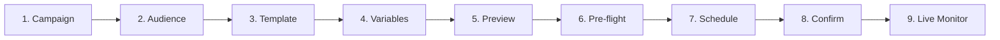
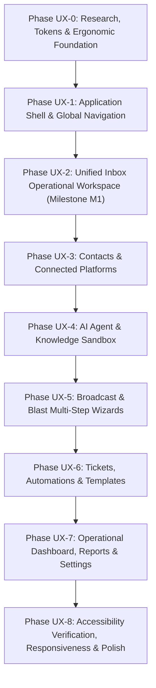

# VYNOR CRM — UI/UX Design Plan & Product Interface Specification

> **Module Identity:** UI/UX Design System & Operational Product Interface  
> **Status:** Planning & Specification Phase (Ready for Review)  
> **Source of Truth:** Phase 0 Engineering Foundation completed (certified in [`docs/phase-0-definition-of-done.md`](docs/phase-0-definition-of-done.md))  
> **Target Audience:** Internal Operations (Human Agents, Supervisors, Administrators, Analysts)  
> **Guiding Principle:** Mission-critical internal operational software — optimized for speed, dense readability, zero context loss, and sovereign human-AI control.

---

## 1. Design Objective

VYNOR CRM is purpose-built as an **internal operational platform** for high-volume customer communication, AI-assisted triage, and multi-channel engagement. It is emphatically **not** a marketing website, public SaaS showcase, template admin dashboard, Dribbble concept, or visual playground.

Human operators spend 6 to 10 consecutive hours inside this software daily. Consequently, the interface prioritizes ergonomics, psychological calm, predictability, and ruthless efficiency over superficial visual novelty.

### Core Design Priorities

1. **Speed of Operation:** Actions require minimal clicks and have zero unnecessary modal interruptions. High-frequency actions (navigate, claim, reply, transfer, resolve) are instantly triggerable via keyboard shortcuts or persistent inline controls.
2. **Information Clarity:** Crisp contrast, clear typography, and unambiguous visual hierarchy ensure that critical operational data (customer identity, channel, unread count, delivery status, SLA timer) can be absorbed in under 2 seconds.
3. **Low Cognitive Load:** Eliminates visual noise, excessive borders, layered cards, and gratuitous animations that cause cognitive fatigue over extended shifts.
4. **High Information Density with Structural Calm:** Displays rich conversational and customer context in dense, compact grids without creating clutter, using clean 1px structural dividers rather than multiple drop-shadows.
5. **Clear Hierarchy:** Strict visual differentiation between primary operational workspace (Unified Inbox), contextual metadata (Customer Panel), and secondary platform administration.
6. **Predictable Interaction:** Consistent placement of filters, search, buttons, tables, and dialogs across all 12 modules.
7. **Fast Navigation:** Linear-inspired two-key chords (`G`+`I` for Inbox, `G`+`C` for Contacts) and global command bar (`Ctrl+K`) enable lightning-fast transitions without mouse travel.
8. **Context Preservation:** Secondary panels, drawers, and inline composers ensure that agents never lose sight of customer conversation history while referencing tickets, notes, or identities.
9. **Error Visibility & Actionable Recovery:** Errors (webhook disconnects, rate limits, delivery failures) are displayed inline with immediate, concrete remediation buttons rather than vague transient toasts.
10. **Accessibility:** Native compliance with W3C WCAG 2.2 Level AA, full keyboard operability, visible focus rings, screen-reader landmarks, and contrast ratios >= 4.5:1.
11. **Visual Consistency:** Strict adherence to design tokens derived from Tailwind CSS and shadcn/ui headless composition.
12. **Human + AI State Clarity:** Unambiguous visual differentiation between AI autonomous activity, suggested drafts, and sovereign human agent takeovers, with zero deceptive AI styling.

---

## 2. Product UX Context

The VYNOR CRM product suite comprises 12 core modules and supporting operational capabilities. These modules represent distinct operational workflows and domain boundaries established in Phase 0:

| Module Number & Name          | Operational Purpose                                                         | Primary Frequency & Priority     | User Persona               |
| :---------------------------- | :-------------------------------------------------------------------------- | :------------------------------- | :------------------------- |
| **01. Dashboard**             | Operational pulse, queue latency, agent workloads, AI resolution rate       | Daily / Shift start (Secondary)  | Supervisor, Admin, Analyst |
| **02. Chats / Unified Inbox** | Primary operational workspace for multi-channel customer communications     | Constant / Realtime (Primary P0) | Human Agent, Supervisor    |
| **03. Contacts**              | Directory of customers, multi-channel identities, custom fields, history    | Frequent lookup (High P0)        | Human Agent, Supervisor    |
| **04. Connected Platforms**   | Management and health monitoring of channel accounts (WhatsApp, IG, etc.)   | Configuration / Health check     | Admin, Supervisor          |
| **05. AI Agent**              | Configuration of AI bot behaviors, model parameters, guardrails, playground | Configuration & Tuning           | Admin, Supervisor          |
| **06. Broadcast**             | Targeted, scheduled multi-recipient outbound messaging campaigns            | Campaign-driven workflow         | Admin, Supervisor          |
| **07. Blast**                 | High-velocity batch message dispatch via CSV with syntax validation         | Batch operational dispatch       | Admin, Supervisor          |
| **08. Tickets**               | Structured work items for asynchronous multi-team problem resolution        | Follow-up & Escalation           | Human Agent, Supervisor    |
| **09. Automations**           | Event-driven rules (`WHEN -> IF -> THEN`) for routing and labeling          | Configuration & Audit            | Admin, Supervisor          |
| **10. Content / Templates**   | HSM template library, canned quick responses, approved media assets         | Daily drafting & Governance      | Human Agent, Admin         |
| **11. Reports**               | Historical operational analytics, SLA adherence, agent performance          | Weekly / Shift retrospective     | Supervisor, Analyst, Admin |
| **12. Settings & Admin**      | IAM, roles, teams, permissions, audit logs, API keys, working hours         | Governance & Security            | Administrator              |

### Supporting Capabilities

- **Authentication & IAM:** Supabase Auth session boundary with automatic JWT refresh and internal workspace membership mapping.
- **Granular RBAC:** 24 canonical system permissions governing button visibility, action execution, and read-only downgrades.
- **Realtime Infrastructure:** Socket.IO `/realtime` namespace with deterministic room scoping (`workspace:{id}`, `conversation:{id}`) and sequence-based resynchronization.
- **Transactional Outbox & Queues:** `pg-boss` background job queues ensuring idempotent delivery and zero duplicate side-effects.
- **RustFS S3 Storage:** Abstracted, pre-signed download authorizations with zero raw binaries in PostgreSQL.

---

## 3. User Roles

The system explicitly supports four role personas. UI action availability, information density, and screen behavior dynamically adapt to these roles based on verified server-side permissions:

### 1. Administrator (`SUPER_ADMIN`, `ADMIN`)

- **Primary Focus:** Tenant governance, user provisioning, team assignment, channel credentials, AI agent prompts, knowledge ingestion, webhook health, API keys, and audit log analysis.
- **UX Requirement:** Comprehensive configuration screens, explicit pre-flight validation for destructive changes, full audit attribution, and global visibility across all inboxes and teams.

### 2. Supervisor (`ADMIN`, Senior Lead)

- **Primary Focus:** Queue triage, workload balancing, re-assignment, live escalation, agent presence monitoring, AI handoff supervision, SLA breach prevention.
- **UX Requirement:** High-level queue indicators, instant multi-conversation assignment bar, agent workload meters, quick take-over controls, and filtered analytical views.

### 3. Human Agent (`AGENT`)

- **Primary Focus:** Rapid resolution of inbound customer inquiries across WhatsApp, Instagram, Telegram, Email, and webchat. Reading customer context, authoring rich replies, writing internal notes, tagging labels, raising tickets, and completing conversations.
- **UX Requirement:** Uninterrupted focus in the Unified Inbox. Zero navigation out of the conversation view to look up customer data. Split-second keyboard shortcuts, instant canned responses, distinct internal note styling, and visual indicators for delivery states.

### 4. Viewer / Analyst (`AGENT` read-only or dedicated Auditor)

- **Primary Focus:** Operational quality assurance, sentiment analysis, compliance review, report generation, and audit trail inspection.
- **UX Requirement:** Clean read-only views with all mutation controls (reply, assign, delete, config) gracefully disabled or hidden with explanatory badges. Unrestricted export to CSV/JSON and advanced tabular filters.

### Visual Behavior for Permission-Restricted Actions

- **Unavailable Action (No Read Permission):** Element is omitted entirely from navigation and toolbars to prevent UI clutter.
- **Disabled Action (Read Permitted, Write Restricted):** Element remains visible with low opacity (`opacity-40`), cursor set to `not-allowed`, and a Radix Tooltip explaining: `"Requires permission: [action]"`.
- **Permission Denied State (Route Access):** Displays an inline contextual card with `ShieldAlert` icon, error code `PERMISSION_DENIED`, actor context, and a primary button `"Return to Inbox"`.
- **Read-Only Mode:** Displays a discrete, non-intrusive banner at the top of the workspace: `"Viewing in Read-Only Mode — mutations are disabled for your role."`

---

## 4. Design Research

To ensure VYNOR CRM reflects industry-standard product engineering rather than generic dashboard templates, we analyzed leading operational software across omnichannel support, developer tooling, and CRM domains:

### Evaluated Reference Products

1. **Chatwoot (Open Source Omnichannel Customer Support):**
   - _Strengths:_ Clean 3-pane unified inbox layout, multi-inbox categorization (Unassigned, Mine, All), robust channel identity badges, and split-view agent ergonomics.
   - _Limitations:_ Settings pages can feel disjointed; timeline events are occasionally visually indistinct from regular messages.
2. **Intercom (Conversational Relationship Platform & Fin AI):**
   - _Strengths:_ Exceptional human-AI collaboration model. Copilot drafts and Fin handoff triggers appear natively inside the conversation timeline without disrupting the thread. Context panel aggregates conversations across all channels.
   - _Limitations:_ Heavy marketing-oriented chrome, low density in default views, high subscription upsell clutter.
3. **Linear (High-Density Issue Tracking & Productivity):**
   - _Strengths:_ Benchmark for operational software. Ultra-fast `Cmd+K` command palette, single-key and chord navigation (`G`+`I`), 4px compact spacing, 1px subtle borders instead of layered drop-shadows, zero layout jumps during realtime updates, and restrained neutral palettes.
   - _Limitations:_ Primarily designed for software development issues rather than conversational messaging streams.
4. **Attio (Next-Generation CRM Platform):**
   - _Strengths:_ Unrivaled data-dense table views, customizable inline-editable attribute rows, powerful multi-faceted filters, and crisp identity resolution cards.
   - _Limitations:_ Highly complex configuration interface that can overwhelm customer service agents if adapted without constraints.
5. **Zendesk (Enterprise Ticketing Core):**
   - _Strengths:_ Rigid operational state definitions (New, Open, Pending, Solved), robust audit histories, and clear separation between conversation and work item tickets.
   - _Limitations:_ Dated legacy aesthetic, slow navigation transitions, excessive modal windows, and disjointed add-on experiences.

### Technical UI Foundations Evaluated

- **shadcn/ui & Radix UI Primitives:** Headless, unstyled accessible primitives providing robust keyboard focus trapping, ARIA roles, and portal rendering (`Dialog`, `DropdownMenu`, `Tabs`, `Popover`, `Tooltip`, `Command`).
- **Tailwind CSS v4:** Modern CSS variables-based theme engine enabling seamless semantic color abstraction, zero runtime overhead, and atomic utility classes.
- **WAI-ARIA APG & WCAG 2.2 Level AA:** Explicit keyboard navigation specs, focus order, high contrast compliance, and live announcements for realtime events.

---

## 5. Design Resources Used

The following design skills, specifications, libraries, and official references are utilized as the concrete basis of this planning:

1. **Repository Design & Contract Analysis:**
   - Packages inspected: `@vynor/contracts` (IAM permissions, channel contracts, error taxonomy RFC-7807), `@vynor/database` (Prisma schema relations, indexes, outbox models), `@vynor/storage` (S3 pre-signed policies), `apps/web` (Next.js 16 App Router, Tailwind tokens, shadcn/ui components).
2. **Component & Design System References:**
   - shadcn/ui Official Architecture & Component Guidelines.
   - Radix UI Accessibility & State Machine Specifications.
   - Tailwind CSS Design Token & Utility Scale Specifications.
3. **Accessibility & Regulatory Standards:**
   - W3C Web Content Accessibility Guidelines (WCAG) 2.2 Level AA.
   - WAI-ARIA Authoring Practices Guide (APG) for Tab, Dialog, Command Palette, and Menu patterns.
4. **Product Design & Benchmark References:**
   - Chatwoot v3 Operational Workflow Specifications.
   - Intercom Fin AI & Copilot Interaction Architecture.
   - Linear Method & UI Density Reference Documentation.
   - Attio Data Table & Attribute Framework.

---

## 6. Reference Pattern Matrix

| Reference    | Pattern yang Bagus                                                        | Masalah yang Diselesaikan                                                      | Relevansi untuk VYNOR | Adaptasi yang Direkomendasikan                                                                        | Hal yang TIDAK Boleh Dicopy                                                                 |
| :----------- | :------------------------------------------------------------------------ | :----------------------------------------------------------------------------- | :-------------------- | :---------------------------------------------------------------------------------------------------- | :------------------------------------------------------------------------------------------ |
| **Chatwoot** | 3-pane split layout: Queue List -> Conversation Stream -> Contact Context | Menghilangkan context switching saat menangani chat masuk dari channel berbeda | **Tinggi (Core)**     | Gunakan layout 3 kolom dengan lebar proporsional (340px list, flex-1 stream, 320px context)           | Jangan tiru styling rounded-card berlebih dan pemisah visual yang terlalu tebal             |
| **Chatwoot** | Tab navigasi queue sederhana (Mine, Unassigned, All)                      | Agent langsung tahu mana pekerjaan miliknya dan mana yang perlu di-triage      | **Tinggi (Core)**     | Jadikan segmented baris teratas di atas list conversation dengan counter badge                        | Jangan gunakan dropdown tersembunyi untuk filter queue utama                                |
| **Intercom** | Handoff AI-ke-Manusia dengan timeline terpadu dan ringkasan AI            | Customer tidak perlu mengulang cerita saat bot mengeskalasi ke agent           | **Tinggi (Core)**     | Render event handoff sebagai compact chip di timeline lengkap dengan reason & confidence              | Jangan tiru aesthetic neon/purple Fin AI atau icon robot kartun                             |
| **Intercom** | Internal Note mode di dalam composer yang sama                            | Mencegah agen salah mengirim catatan internal ke customer                      | **Tinggi (Core)**     | Toggle composer mode dengan background amber lembut dan tombol submit bertuliskan "Add Internal Note" | Jangan buat modal terpisah hanya untuk menambah internal note                               |
| **Linear**   | Command Menu (`Ctrl+K`) dan G-Chords (`G`+`I`, `G`+`C`)                   | Mengeliminasi kebutuhan navigasi mouse untuk perpindahan modul                 | **Tinggi (Core)**     | Implementasikan Radix/cmdk palette dengan context-aware actions di seluruh aplikasi                   | Jangan abaikan touch targets untuk skenario tablet saat membuat UI terlalu micro            |
| **Linear**   | 1px subtle border division, 4px spacing grid, zero drop-shadow clutter    | Mengurangi eye strain operator selama jam kerja panjang                        | **Tinggi (Core)**     | Terapkan palette neutral slate/zinc dengan border `border-border/60` dan flat elevation               | Jangan buat UI dark-mode only jika operator memerlukan light mode di ruang kerja terang     |
| **Attio**    | Compact data table dengan multi-faceted sticky filter bar                 | Menampilkan ribuan record kontak tanpa kehilangan orientasi kolom              | **Tinggi (Contacts)** | Buat standardized DataTable component dengan sticky header, sorting, dan filter badges                | Jangan gunakan customizable drag-and-drop table builder yang rumit di fase operational awal |
| **Zendesk**  | Pemisahan tegas antara conversational message dan ticketing work-item     | Mencegah kebingungan SLA antara chat realtime dan tiket investigasi            | **Tinggi (Tickets)**  | Modul Tickets memiliki IA dan lifecycle terpisah dari Chats, namun saling terhubung melalui deep-link | Jangan adopsi UI legacy multi-tab browser usang ala Zendesk yang membingungkan              |

---

## 7. Anti AI-Slop Principles

To ensure VYNOR CRM remains an uncompromising, elite operational software tool, the UI/UX explicitly prohibits "AI-generated UI slop". Every design decision must serve an operational function.

### Explicitly Prohibited Patterns

1. **No Decorative Gradients:** Gradient buttons, gradient headers, gradient backgrounds, or text gradients are strictly forbidden.
2. **No Neon AI Aesthetics:** No glowing cyan/purple borders, pulsating neon dots, sparkles, magic wand icons, or robot mascots. AI is treated as an operational algorithm, not magic.
3. **No Glassmorphism:** No `backdrop-blur` layered cards, frosted translucent headers, or semi-transparent backgrounds that decrease text legibility.
4. **No Card-in-a-Card Syndrome:** Do not wrap every single label, detail, or paragraph in an independent bordered card with rounded corners. Use clean structural borders, semantic typography, and whitespace.
5. **No Giant Border Radii:** No `rounded-3xl` or pill-shaped buttons for regular operational actions. Border radii are restrained to `rounded-sm` (2px), `rounded-md` (4px), or `rounded-lg` (6px).
6. **No Floating Decorative Shapes:** Zero decorative floating circles, geometric shapes, or abstract background artwork.
7. **No Fake / Vanity Dashboard Charts:** No charts without actionable operational thresholds (e.g. decorative curved area charts showing fictitious metrics). Tables and discrete metric numbers are preferred.
8. **No Generic "Welcome Back" Banners:** Zero wasted vertical space on hero greetings like _"Good morning, John! Here is what's happening today."_ The agent needs immediate access to their active queue.
9. **No Unconstrained Whitespace:** Avoid excessive padding (e.g. 64px section padding) typical of landing pages. Maintain high information density suitable for 1080p and 1440p displays.
10. **No Gratuitous Animations:** Zero bounce, elastic, or multi-second stagger transitions. Transitions are limited to instantaneous or 100ms ease-out opacity/color shifts.
11. **No Excessive Confirmation Dialogs:** Low-risk operational actions (adding a tag, claiming an unassigned chat) execute immediately with an undo toast option; modals are reserved strictly for high-risk destructive actions.
12. **No Arbitrary Badge Overuse:** Do not place 10 colored badges on a single list row. Use semantic icons, font weights, and position to communicate state.

### Operational Justification Requirement

Every visual element must be justified by at least one of these criteria:

- **Hierarchy:** Does it clarify primary vs. secondary focus?
- **Readability:** Does it improve character or number scanability?
- **State Communication:** Does it convey a change in network, channel, or message status?
- **Discoverability:** Does it help the user find a tool without guessing?
- **Efficiency:** Does it reduce clicks, keystrokes, or visual search time?
- **Error Prevention:** Does it prevent catastrophic accidental operations (e.g. sending internal notes to customers)?
- **Accessibility:** Does it fulfill contrast or screen-reader requirements?
- **Operational Context:** Does it tell the user _who_, _where_, and _what status_ is active?

---

## 8. UX Principles

1. **Operator Focus First:** The human agent's attention is the most valuable resource. The UI must never distract, interrupt with non-critical popups, or force unnecessary page reloads.
2. **Zero Context Loss:** When inspecting a customer, switching channels, or reviewing past tickets, the current conversation thread must remain accessible and persistent.
3. **High Density with Structural Calm:** Maximum relevant information visible per viewport without feeling claustrophobic. Clean 1px lines organize space.
4. **Explicit State Before Action:** An operator must always know the state of a conversation (Unassigned, Mine, Bot-handled, Waiting on Customer) before choosing to take action.
5. **Keyboard-First Ergonomics:** Every primary workflow in the Unified Inbox can be completed entirely from the keyboard.
6. **Fail-Closed Security Visibility:** If permissions are insufficient, the UI clearly shows the restriction with actionable guidance rather than silently failing or crashing.
7. **Predictable Monotonic Updates:** Realtime updates never shift the list under the operator's cursor or cause jumpy message timelines while reading.
8. **Human-in-the-Loop Sovereign Control:** When AI generates suggestions or operates in an inbox, the human operator always retains 1-click override, review, and pause capabilities.

---

## 9. Visual Direction

- **Personality:** Professional, Operational, Calm, Dense, Neutral, Precise, Reliable, Fast.
- **Visual Medium:** Canvas-first neutral dark/light theme based on Zinc/Slate scale.
- **Structural Separation:** 1px hairline borders (`hsl(var(--border))`) instead of multi-layered drop shadows.
- **Elevation Layering:** Extremely conservative.
  - Level 0: Workspace base canvas.
  - Level 1: Sidebar, Context panels, Tables, and Composer.
  - Level 2: Popovers, Tooltips, Dropdown menus (`shadow-sm`).
  - Level 3: Modal dialogs, Command bar, Drawer sheets (`shadow-md`).
- **Semantic Accentuation:** Neutral grays dominate 90% of the screen. Color is reserved almost exclusively for operational semantic states (Green = Delivered/Online, Amber = Internal Note/Warning, Rose = Failed/Urgent, Blue = Focus/Selection).

---

## 10. Information Architecture

```mermaid
flowchart TD
    Shell["Application Shell (AppShell)"]

    Shell --> Nav["Primary Navigation (Left Sidebar)"]
    Shell --> TopBar["Contextual Header & Global Bar"]
    Shell --> Workspace["Main Workspace Container"]

    Nav --> M1["01. Dashboard"]
    Nav --> M2["02. Unified Inbox (Core)"]
    Nav --> M3["03. Contacts"]
    Nav --> M4["04. Connected Platforms"]
    Nav --> M5["05. AI Agent"]
    Nav --> M6["06. Broadcast"]
    Nav --> M7["07. Blast"]
    Nav --> M8["08. Tickets"]
    Nav --> M9["09. Automations"]
    Nav --> M10["10. Templates"]
    Nav --> M11["11. Reports"]
    Nav --> M12["12. Settings"]

    TopBar --> Search["Global Command Palette (Ctrl+K)"]
    TopBar --> ChannelHealth["Channel Health Indicator"]
    TopBar --> AgentPresence["Presence Toggle (Online / Busy / Away)"]
    TopBar --> Notif["Notifications Drawer"]
    TopBar --> UserMenu["User Profile & Workspace Switcher"]

    M2 --> InboxQueues["Queues: Unassigned | Mine | Team | All | Completed"]
    M2 --> InboxList["Conversation List (Filtered & Sorted)"]
    M2 --> InboxTimeline["Conversation Workspace & Timeline"]
    M2 --> InboxContext["Customer Context & Linked Metadata Panel"]
```



### Module Categorization & Access Frequency

1. **Primary Operational Tier (Daily Constant Use):**
   - `Chats / Unified Inbox` (Hot-keyed default route `/inbox`).
   - `Contacts` (`/contacts`).
   - `Tickets` (`/tickets`).
2. **Outbound Operational Tier (Campaign & Broadcast Operations):**
   - `Broadcast` (`/broadcast`).
   - `Blast` (`/blast`).
   - `Content / Templates` (`/templates`).
3. **Intelligence & Automation Tier (Supervisory & Tuning):**
   - `AI Agent` (`/ai-agent`).
   - `Automations` (`/automations`).
   - `Connected Platforms` (`/channels`).
4. **Governance & Analytical Tier (Management & Audit):**
   - `Dashboard` (`/dashboard`).
   - `Reports` (`/reports`).
   - `Settings & Administration` (`/settings`).

---

## 11. Navigation Model

### Two-Level Navigation Strategy

1. **Global Primary Sidebar (56px collapsed icon rail or 220px expanded):**
   - Anchored permanently to the left of the viewport.
   - Contains top-level modules grouped logically by frequency (Operations, Outbound, Intelligence, System).
   - Keyboard navigable with Linear-style `G` chords.
   - Collapsible to an icon-only mode with tooltips to maximize workspace area on standard 1080p laptops.
2. **Contextual Secondary Navigation (Sub-Navigation):**
   - For modules with multi-state queues (e.g. Unified Inbox), sub-navigation is embedded directly as a header or left segment inside the workspace panel rather than generating a third full sidebar.
   - Settings uses a clean left-hand category index (`General`, `Members`, `Roles`, `Channels`, `Audit Logs`).

### Global Shortcuts (G-Chords)

- `G` then `I`: Jump directly to Unified Inbox (`/inbox`).
- `G` then `C`: Jump to Contacts (`/contacts`).
- `G` then `T`: Jump to Tickets (`/tickets`).
- `G` then `B`: Jump to Broadcast (`/broadcast`).
- `G` then `D`: Jump to Dashboard (`/dashboard`).
- `G` then `S`: Jump to Settings (`/settings`).
- `Ctrl` + `K` or `Cmd` + `K`: Open Global Command Palette.
- `?`: Toggle Keyboard Shortcuts Cheatsheet Modal.

---

## 12. Application Shell

The Application Shell provides a rigid, indestructible frame that guarantees zero orientation loss when switching views or receiving burst realtime events.

```text
+-------------------------------------------------------------------------------------------------------+
| App Header: Workspace Name | Breadcrumbs | Global Search (Ctrl+K) | Channel Status | Presence | User |
+---------+---------------------------------------------------------------------------------------------+
| Rail/   | Workspace Sub-Header: View Title | Filters | Action Buttons                                 |
| Nav     +---------------------------------------------------------------------------------------------+
|         |                                                                                             |
| [Inbox] |                                                                                             |
| [Cont.] |                                   MAIN WORKSPACE AREA                                       |
| [Tick.] |                                                                                             |
| [Plat.] |                           (Zero unexpected layout shifts)                                   |
| [AI]    |                                                                                             |
| [Blast] |                                                                                             |
| [Sett.] |                                                                                             |
|         |                                                                                             |
+---------+---------------------------------------------------------------------------------------------+
| System Status Footer: Connected Channels (5/5) | Latency: 24ms | Socket: Connected | Build v0.1.0    |
+-------------------------------------------------------------------------------------------------------+
```

### Key Technical Shell Rules

- **Viewport Height Lock:** Fixed at `100vh` / `100dvh`. Outer window scrollbars are strictly forbidden. All scrolling occurs inside dedicated, isolated Radix ScrollAreas.
- **Main Workspace Isolation:** Modules render inside an overflow-hidden flex container. If a table or timeline overflows, it never pushes the sidebar or header offscreen.
- **Contextual Status Bar (Bottom):** Displays realtime Socket.IO connection status, active workspace slug, and channel health summary.

---

## 13. Design Tokens

Design tokens are implemented via CSS variables in Tailwind CSS v4, supporting clean switching between high-contrast dark mode and crisp operational light mode:

### 1. Spacing Scale (4px Base Grid)

| Token         | Pixel Value | Intended Usage                               |
| :------------ | :---------- | :------------------------------------------- |
| `--space-0`   | `0px`       | Reset                                        |
| `--space-0.5` | `2px`       | Micro-spacing, inline icon margins           |
| `--space-1`   | `4px`       | Compact component gaps, badge padding        |
| `--space-1.5` | `6px`       | Compact button padding                       |
| `--space-2`   | `8px`       | Standard element gap, input internal padding |
| `--space-3`   | `12px`      | Compact card padding, table row gaps         |
| `--space-4`   | `16px`      | Standard panel padding, workspace margins    |
| `--space-5`   | `20px`      | Medium layout gaps                           |
| `--space-6`   | `24px`      | Major section division                       |
| `--space-8`   | `32px`      | Dialog padding, empty state padding          |

### 2. Radius Tokens

- `--radius-none`: `0px` (Tables, code blocks, sticky headers).
- `--radius-sm`: `2px` (Tags, status dots, micro-indicators).
- `--radius-md`: `4px` (Inputs, buttons, dropdown items, compact chips).
- `--radius-lg`: `6px` (Panels, modal dialogs, context panels).
- _Strict Rule:_ No border radius larger than 8px anywhere in the application.

### 3. Border & Elevation Tokens

- `--border-subtle`: `1px solid hsl(var(--border) / 0.5)` (Table row separators, internal dividers).
- `--border-default`: `1px solid hsl(var(--border))` (Panel boundaries, inputs, cards).
- `--border-strong`: `1px solid hsl(var(--border-strong))` (Active tabs, focused inputs).
- `--elevation-0`: `none` (Default flat workspace canvas).
- `--elevation-1`: `0 1px 2px 0 rgb(0 0 0 / 0.05)` (Subtle popover elevation).
- `--elevation-2`: `0 4px 6px -1px rgb(0 0 0 / 0.1), 0 2px 4px -2px rgb(0 0 0 / 0.1)` (Modals, command palette).

---

## 14. Typography

VYNOR CRM utilizes **Inter** as its primary interface typeface and **JetBrains Mono** for IDs, timestamps, payload payloads, and code references.

### Recommended Operational Type Scale

| Role                 | Font Family    | Size               | Line Height | Weight            | Letter Spacing | Use Case                                       |
| :------------------- | :------------- | :----------------- | :---------- | :---------------- | :------------- | :--------------------------------------------- |
| **Page Title**       | Inter          | `18px` (`text-lg`) | `24px`      | Semi-bold (`600`) | `-0.015em`     | Workspace / module primary header              |
| **Section Header**   | Inter          | `14px` (`text-sm`) | `20px`      | Semi-bold (`600`) | `-0.01em`      | Panel titles, table category headers           |
| **Body (Default)**   | Inter          | `13px`             | `18px`      | Regular (`400`)   | `0`            | Message timeline, customer context, forms      |
| **Body (Medium)**    | Inter          | `13px`             | `18px`      | Medium (`500`)    | `0`            | Customer names, table primary values           |
| **Compact / Meta**   | Inter          | `12px` (`text-xs`) | `16px`      | Regular (`400`)   | `0`            | Message previews, timestamps, secondary labels |
| **Micro Label**      | Inter          | `11px`             | `14px`      | Medium (`500`)    | `+0.01em`      | Table column headers, status badges            |
| **Code / Monospace** | JetBrains Mono | `12px`             | `16px`      | Regular (`400`)   | `0`            | Correlation IDs, phone numbers, JSON payloads  |

---

## 15. Color & Semantic States

Colors are mapped strictly to operational semantics. Decorative colors with no information value are prohibited.

### Palette Architecture

```text
Neutral (90% Canvas):
  Light: Background #FFFFFF | Surface #F8FAFC | Border #E2E8F0 | Text Primary #0F172A | Muted #64748B
  Dark:  Background #090A0B | Surface #111315 | Border #22252A | Text Primary #F8FAFC | Muted #94A3B8

Semantic Signals (10% Operational Indicators):
  - Neutral / Muted:   Slate   (Normal messages, timestamps, inactive states)
  - Accent / Focus:    Blue    (Selected conversation, focus rings, primary CTA)
  - Success / Live:    Emerald (Delivered, Connected, AI Online, Resolved)
  - Warning / Alert:   Amber   (Internal notes, Rate limited, Handoff required)
  - Danger / Error:    Rose    (Delivery failed, Disconnected, Validation error)
  - Info / System:     Sky     (System events, assignment changes, audit logs)
```

### Contrast Ratios (WCAG 2.2 AA)

- Text on Background: Minimum `4.5:1` (Body), `7:1` (High contrast mode).
- Graphical UI Controls & Borders: Minimum `3.0:1`.

---

## 16. Density & Spacing

To accommodate different operational contexts, VYNOR CRM supports two density modes:

1. **Compact Density (Default for Operations):**
   - Table row height: `32px`
   - Conversation row height: `64px`
   - Input height: `32px` (Text: 13px)
   - Ideal for: High-volume customer triage, monitoring 50+ queue items on 1080p laptop.
2. **Comfortable Density (Administrative Mode):**
   - Table row height: `40px`
   - Input height: `36px`
   - Ideal for: Template authoring, AI prompt editing, settings management.

---

## 17. Component Strategy

VYNOR CRM avoids bloated third-party component libraries by composing lightweight, unstyled Radix UI primitives with Tailwind CSS v4 design tokens.

### Layer 1: Core Primitives

- `Button` (Variants: `primary`, `secondary`, `outline`, `ghost`, `destructive`, `link`; Sizes: `sm`, `default`, `icon`).
- `Input` / `Textarea` (Monospace option, inline error states, character counters).
- `Select` / `Combobox` (Searchable, virtualized for 500+ agents/tags).
- `Checkbox` / `Switch` (Explicit labels, accessible focus rings).
- `Tabs` (Segmented queue pills or underline border indicators).
- `Tooltip` (Radix headless, instant display on hover, accessible focus trigger).
- `Popover` / `DropdownMenu` (Portal-rendered, keyboard-navigable).
- `Dialog` / `Sheet` (Accessible focus trap, accessible escape handling, non-destructive backdrop).
- `DataTable` (Sticky header, customizable column width, virtualized rows).
- `ScrollArea` (Custom subtle scrollbars that never shift layout width).

### Layer 2: Domain-Specific Operational Components

- `ConversationRow`: Multi-channel row with unread pulse, priority marker, channel badge, and snippet.
- `MessageBubble`: Left/right sender differentiation, delivery receipt ticks, retry action on failure.
- `InternalNoteBubble`: Warm yellow tinted container with padlock icon, distinctly separated from chat.
- `SystemEventChip`: Compact, center-aligned micro-event with timestamp and actor attribution.
- `ChannelBadge`: Compact icon + text badge for WhatsApp, Instagram, Telegram, Email, TikTok.
- `AIStateIndicator`: Operational badge showing AI Bot engagement level (Autonomous, Suggesting, Paused).
- `DeliveryStatusIcon`: Single check (Sent), Double check (Delivered), Blue double check (Read), Rose triangle (Failed).
- `AssignmentControl`: Quick-picker for assigning Agent or Team with avatar and presence status.

---

## 18. Interaction Patterns

1. **Inline Actions Over Modals:** Simple actions (e.g. adding a tag, assigning an agent, toggling priority) are performed inline via quick popovers or dropdowns. Full modal dialogs are reserved for destructive or multi-step operations.
2. **Optimistic UI with Graceful Rollbacks:** When an agent sends a message or claims a conversation, the UI updates immediately with an `in-flight` state. If the server or provider rejects the action, the element transitions to an actionable error state with an inline retry trigger.
3. **Collision Detection & Presence:** When multiple agents view the same conversation, a subtle top banner displays: `"Agent Sarah is currently viewing this conversation"`. If another agent replies, the composer indicates: `"Agent Sarah is typing..."` to prevent double replies.
4. **Drag & Drop with Paste Support:** Message composer accepts direct image/document paste from the clipboard (`Ctrl+V`) and drag-and-drop file targets with progress meters.

---

## 19. Unified Inbox Specification

The Unified Inbox is the operational beating heart of VYNOR CRM.

### Layout Topology (Desktop >= 1280px)

```text
+-------------------+------------------------------------------+-----------------------+
| CONVERSATION LIST | CONVERSATION WORKSPACE                   | CUSTOMER CONTEXT      |
| Width: 340-380px  | Width: Flex-1 (Min 520px)                | Width: 320-360px      |
|                   |                                          | (Collapsible)         |
| [Search & Filter] | Header: Customer Name | Status | Actions | Customer Summary      |
| [Queue Tabs]      +------------------------------------------+ Channel Identities    |
|                   |                                          | Active Labels         |
| List of           | Message Timeline                         | Custom Fields         |
| ConversationRows  | (Customer, Agent, AI, Internal Notes)    | Linked Tickets        |
| with live         |                                          | Previous Chats        |
| indicators        +------------------------------------------+                       |
|                   | Message Composer                         | [Collapse / Expand]   |
|                   | (Text, Attachments, Internal Note Mode)  |                       |
+-------------------+------------------------------------------+-----------------------+
```

### Screen Specification

- **Screen:** `Unified Inbox Workspace (/inbox)`
- **Purpose:** Centralized processing of all multi-channel customer messages with human-agent sovereign workflow.
- **Primary Actor:** Human Agent, Supervisor.
- **Entry Point:** Primary navigation default, direct URL `/inbox`, or G-chord `G`+`I`.
- **Primary Job:** Triage unassigned messages, claim conversations, author replies, resolve inquiries within SLA.
- **Information Hierarchy:**
  1. _Primary:_ Active conversation timeline and composer.
  2. _Secondary:_ Queued conversation list sorted by recent update / unread status.
  3. _Tertiary:_ Customer identity, contact fields, and linked tickets in context panel.
- **Primary Action:** Author & send message (`Ctrl+Enter`) or Complete conversation (`E`).
- **Secondary Actions:** Switch queue tab, Assign to team/agent, Insert canned response, Add internal note, Transfer.

---

## 20. Conversation Detail Specification

The Conversation Timeline visualizes the dialogue stream between customer, human agents, AI agents, and system events.

### Message Categorization & Visual Styling

1. **Customer Message:**
   - Left-aligned.
   - Neutral card surface (`bg-surface`, `border-border/60`).
   - High-contrast text (`text-foreground`).
   - Metadata: Timestamp + Channel source icon (e.g. WhatsApp logo, 12px).
2. **Human Agent Message:**
   - Right-aligned.
   - Muted accent surface (`bg-primary/10`, `border-primary/20`).
   - Metadata: Agent name + Timestamp + Delivery status icon.
3. **AI Agent Message:**
   - Right-aligned.
   - Distinct subtle border with discrete bot icon (`Bot` Lucide icon, 12px) and tag: `"AI Assistant"`.
   - _Anti-Slop Rule:_ No glowing borders, no purple gradient bubbles.
4. **Internal Note:**
   - Full-width banner box spanning the timeline.
   - Warm amber surface (`bg-amber-500/10`, `border-amber-500/30`, `text-amber-900` / `dark:text-amber-200`).
   - Prominent padlock icon (`Lock`) and label: `"Internal Note (Visible to team only)"`.
5. **System & Lifecycle Events:**
   - Centered micro-chip.
   - `text-xs text-muted-foreground bg-muted/40 px-2 py-0.5 rounded-full`.
   - Examples: `"Assigned to Sarah by System"`, `"Conversation marked as Completed"`, `"AI Handoff triggered: Negative sentiment"`.
6. **Failed Message Delivery:**
   - Right-aligned message bubble bordered in red (`border-destructive`).
   - Red warning badge with error snippet: `"Failed to deliver: WhatsApp API error 131026"`.
   - Actionable inline link: `[Retry Delivery]`.

---

## 21. Composer Specification

The message composer is engineered for rapid keyboard dispatch and fail-safe operation.

### Operational Features

- **Dual Mode Toggle:** Clean switch between **Customer Reply** and **Internal Note** via toggle tabs or keyboard shortcut (`Alt+N`).
  - _Reply Mode:_ Standard dark/accent Send button. Placeholder: `"Type a reply... (/ for templates)"`.
  - _Internal Note Mode:_ Composer frame turns warm amber with yellow border. Button turns Amber: `"Add Internal Note"`. Placeholder: `"Type internal note for team members..."`.
- **Slash Commands (`/`):** Typing `/` invokes a floating searchable popover of approved Canned Responses / HSM Templates with instant arrow-key selection and variable replacement.
- **Attachment Staging Area:** Previews dragged or pasted files with thumbnail, filename, filesize, and remove button before dispatch. Uploads directly to S3 via pre-signed URL.
- **Send Hotkey Configuration:** Configurable in user profile (`Enter` to send vs. `Ctrl+Enter` to send). Default: `Ctrl+Enter` to prevent accidental premature sends.

---

## 22. Customer Context Specification

The right-hand panel (320px) delivers 360-degree operational context without navigating away from the chat thread.

### Accordion / Section Breakdown

1. **Contact Profile Header:** Avatar, full customer name, primary phone number, email, and presence badge.
2. **Channel Identities List:** Badges showing linked identifiers (e.g. `WhatsApp: +6281234567890`, `Instagram: @customer_user`).
3. **Active Labels / Tags:** Compact colored tags with quick `+` popover to attach or detach labels.
4. **Assignment & Priority Control:** Assignee dropdown (Agents/Teams) + Priority selector (`Low`, `Medium`, `High`, `Urgent`).
5. **Custom Fields Grid:** Key-value pairs (e.g. `Customer Tier: Enterprise`, `Account ID: ACC-9921`, `City: Jakarta`). Inline editable with double-click or edit icon.
6. **Recent Linked Tickets:** Compact list of work-item tickets showing ID, subject, and status chip with 1-click jump-link.
7. **Cross-Channel History:** Collapsible list of previous conversation sessions across other channels.

---

## 23. Contacts Specification

- **Screen:** `Contacts Directory (/contacts)`
- **Purpose:** Searchable, filterable enterprise directory of all customer profiles and identity mappings.
- **Primary Actor:** Human Agent, Supervisor, Admin.
- **Layout:** High-density standardized data table with multi-faceted top filter bar and right-side slide-over drawer for quick inspection.
- **Columns:** Customer Name, Primary Identifier, Linked Channels (icons), Tags/Labels, Open Conversations, Last Activity, Created Date, Actions Menu (`...`).
- **Bulk Actions:** Multi-select checkboxes enable bulk labeling, bulk assignment, and export to CSV.

---

## 24. Connected Platforms Specification

- **Screen:** `Connected Platforms & Inboxes (/channels)`
- **Purpose:** Administrative configuration, credential management, and health telemetry for external messaging channels.
- **Supported Channels:** WhatsApp Cloud API, Instagram Direct, Facebook Messenger, Telegram Bot, Email (SMTP/IMAP), Custom API, LINE, TikTok.
- **Card / Row Layout:** Each connected account is rendered as an operational identity card featuring:
  - Account Display Name & Phone/Handle.
  - Channel Type Badge (Official WhatsApp Meta badge, Telegram logo).
  - Health State Pill: `Connected (Green)`, `Warning (Amber)`, `Disconnected (Red)`, `Rate Limited (Yellow)`.
  - Inbound & Outbound telemetry (throughput, last message timestamp, webhook latency in ms).
  - Actionable Error Banner if broken: `"Token expired 2h ago — [Re-authenticate Now]"`.
  - Assigned Default Team & AI Bot toggle.

---

## 25. AI Agent Specification

AI within VYNOR CRM is treated as an automated operational teammate, not a marketing gimmick.

### Screen & Architecture

- **Screen:** `AI Agent Configuration & Monitoring (/ai-agent)`
- **Operational States:**
  - `Autonomous (Green)`: Bot handles inquiries without human review.
  - `Copilot / Assist (Blue)`: Bot generates draft replies for human approval.
  - `Handoff Required (Amber)`: Bot encountered low confidence or escalation trigger.
  - `Disabled / Paused (Gray)`: Channel is strictly human-operated.
  - `System Error (Red)`: Model provider rate limit or context failure.
- **Configuration Sections:**
  - Identity & Persona: Name, language style, business operating hours.
  - LLM Provider & Parameters: Model selector (e.g. Claude 3.5 Sonnet, GPT-4o), temperature slider (`0.0 - 1.0`), max tokens.
  - Assigned Inboxes: Checklist of connected channels where this bot is active.
  - Guardrails & Fallbacks: Max autonomous turns before mandatory human handoff, forbidden topics, confidence threshold slider.
- **AI Playground (Sanitized Sandbox):**
  - Dedicated simulation tab with prominent banner: `TEST ENVIRONMENT — NO CUSTOMER MESSAGES SENT`.
  - Allows supervisors to test prompts and knowledge retrieval with live inspection of latency, token usage, context citations, and handoff triggers.

---

## 26. Knowledge Specification

- **Screen:** `Knowledge Sources Repository (/ai-agent/knowledge)`
- **Purpose:** Ingestion and lifecycle management of business documents, FAQs, and URLs powering AI vector retrieval.
- **Table Structure:** Document Name, Source Type (PDF, URL, FAQ, Markdown), Status (`Ready`, `Indexing [progress %]`, `Failed`, `Outdated`), Chunks Count, Vector Dimensions, Last Synced, Actions (`Re-index`, `Delete`).
- **Retrieval Inspector Drawer:** Clicking a document allows testing semantic search queries against that specific document chunks.

---

## 27. Broadcast Specification

Broadcast is structured as a **guided multi-step wizard** to prevent accidental mass messaging and maximize delivery compliance:



### Critical Operational Steps

- **Step 2 (Audience):** Dynamic filter builder with live calculated count: `Total Matching: 14,250 | Valid Phone: 13,800 | Suppressed/Opt-out: 450`.
- **Step 3 (Template):** WhatsApp HSM template selector showing real-time Meta approval status (`APPROVED` in green, `REJECTED` in red).
- **Step 6 (Pre-flight Validation):** Automated checks for template variables, rate limits, credit balance, and quiet hours compliance.
- **Step 8 (Dual-Confirmation Modal):** High-risk confirmation requiring the user to type the campaign name before queue dispatch.
- **Step 9 (Live Progress Dashboard):** Realtime progress bar with queued, sent, delivered, read, and failed counts, plus an immediate `"Pause / Abort"` button.

---

## 28. Blast Specification

- **Screen:** `Quick Blast Dispatcher (/blast)`
- **Purpose:** Rapid operational dispatch to an uploaded CSV list with strict syntax and deduplication validation.
- **CSV Validation Table:**
  - Before sending, uploaded rows are parsed client-side and displayed in a categorized audit tab:
    - `Valid Recipients (Ready)`
    - `Invalid Syntax / Missing Country Code (Excluded)`
    - `Duplicate Numbers (Automatically Merged)`
    - `Suppressed / Blacklisted Numbers (Blocked)`
  - Exact error details shown per row with downloadable rejection log.
- **Execution Bar:** Realtime progress with estimated time to completion and error rate meter.

---

## 29. Tickets Specification

Tickets represent structured, asynchronous work items and must not be confused with live chat conversations.

- **Screen:** `Tickets Board & Table (/tickets)`
- **Layout:** Segmented toggle between **Data Table** and **Kanban Board**.
- **Ticket Statuses:** `New (Blue)`, `Open (Yellow)`, `Pending Customer (Orange)`, `Escalated (Red)`, `Resolved (Emerald)`, `Closed (Gray)`.
- **Priorities:** `Low`, `Medium`, `High`, `Urgent`.
- **Detail View:** Shows subject, linked customer, linked conversation deep-link, SLA breach countdown timer, activity audit timeline, and internal comment stream.

---

## 30. Automations Specification

- **Screen:** `Automation Rules Builder (/automations)`
- **Model:** Constrained, linear event-action builder (`WHEN event -> IF conditions -> THEN actions`).
- _Anti-Slop Rule:_ No complicated drag-and-drop node graph canvas with spaghetti wires. A clean vertical stepped card list is infinitely faster to read and debug.
- **Supported Triggers:** `New Inbound Message`, `Conversation Created`, `Conversation Inactive (Timer)`, `Delivery Status Failed`.
- **Supported Conditions:** `Channel equals WhatsApp`, `Message contains keywords`, `Customer label includes VIP`, `Time outside working hours`.
- **Supported Actions:** `Assign to Team`, `Apply Label`, `Send Canned Response`, `Trigger AI Agent`, `Create Ticket`.
- **Execution Audit Log:** Table showing timestamp, trigger event, evaluated conditions, and success/failure result.

---

## 31. Content/Templates Specification

- **Screen:** `Templates & Canned Responses Library (/templates)`
- **Categories:**
  1. **Quick Replies (Canned Responses):** Agent-facing shortcuts prefixed with `/` for instant insertion into the composer.
  2. **WhatsApp HSM Templates:** Official Meta pre-approved outbound templates with language variants (`id_ID`, `en_US`) and placeholder tokens (`{{1}}`, `{{2}}`).
  3. **Rich Media Assets:** Pre-uploaded images, PDFs, and brochures stored in S3/RustFS with pre-generated preview thumbnails.
- **Creation Drawer:** Side-by-side template editor with live WhatsApp chat bubble simulation showing variable replacement in real-time.

---

## 32. Dashboard Specification

The dashboard is designed strictly for **operational awareness and shift oversight**, not executive marketing vanity.

```text
+-------------------------------------------------------------------------------------------------------+
| Operational Pulse: Shift Start 08:00 | Active Agents: 14/18 | Active Inboxes: 5/5 | System Load: Normal |
+-----------------------+-----------------------+-----------------------+-------------------------------+
| QUEUE PRESSURE        | AGENT WORKLOAD        | AI PERFORMANCE        | CHANNEL HEALTH                |
| Unassigned: 12        | Avg Response: 1m 45s  | Autonomous Res: 68%   | WhatsApp: 99.9% (18ms)        |
| Active Total: 84      | Longest Wait: 6m 12s  | Human Handoffs: 32    | Instagram: 100% (42ms)        |
| SLA Breached: 2       | Messages Sent: 1,420  | Fallback Rate: 3.2%   | Telegram: 100% (12ms)         |
+-----------------------+-----------------------+-----------------------+-------------------------------+
| LIVE QUEUE TRIAGE TABLE: Priority | Channel | Customer | Waiting Time | Assigned Team | Quick Claim   |
| [P1 Urgent] [WhatsApp] PT. Maju Bersama        | 6m 12s       | Sales Tier 1  | [Claim Button]|
| [P2 Normal] [Telegram] Budi Santoso            | 4m 30s       | Support       | [Claim Button]|
+-------------------------------------------------------------------------------------------------------+
| AGENT ACTIVITY STRIP: Sarah (Active: 4) | Rizky (Active: 6 - Busy) | Dian (Break) | Budi (Active: 2) |
+-------------------------------------------------------------------------------------------------------+
```

### Prohibited Dashboard Elements

- Zero arbitrary 3D isometric graphics or decorative illustrations.
- Zero oversized single-number KPI cards that consume half the screen.
- Zero fake predictive line charts without actionable context.

---

## 33. Reports Specification

- **Screen:** `Historical Reports & Analytics (/reports)`
- **Philosophy:** Tabular-first data density. Charts are used solely where visual trend comparison adds immediate decision value over raw numbers.
- **Report Types:**
  - `Conversation Volume & Peak Hours` (Hourly distribution heatmap).
  - `Agent Performance & SLA Compliance` (Response time, handle time, resolution rate).
  - `Channel Telemetry & Delivery Success` (Sent vs. Delivered vs. Read vs. Failed).
  - `AI Bot Resolution & Handoff Breakdown` (Reasons for human escalation).
- **Controls:** Date range picker (`Today`, `Yesterday`, `Last 7 Days`, `Last 30 Days`, `Custom`), Team filter, Channel filter, Export to CSV / JSON button.

---

## 34. Settings Specification

Settings uses a conventional 2-column administrative layout: left vertical category index, right configuration content.

### Category Taxonomy

1. **Workspace Profile:** Organization name, logo, default timezone, default currency.
2. **Users & Invitations:** User directory, Supabase invite trigger, active session revocation.
3. **Teams & Routing:** Department groupings (Sales, Support, Billing) and fallback queues.
4. **Roles & Permissions:** Granular permission matrix with checkboxes for 24 canonical permissions.
5. **Labels & Tags:** Color-coded taxonomy management for conversations and contacts.
6. **Custom Fields:** Schema definitions for customer attributes (Text, Number, Date, Dropdown).
7. **Working Hours & Away Responders:** Business hours schedule with automated out-of-office autoreplies.
8. **API & Webhooks:** Developer API key generation with secret masking and webhook endpoint subscriptions with live test ping.
9. **Audit Logs:** Immutable audit stream table with actor attribution, IP address, timestamp, and payload diff viewer.

---

## 35. Search & Filter Standard

### 1. Global Command Palette (`Ctrl+K` / `Cmd+K`)

- Powered by Radix/cmdk.
- Searches across conversations, contacts, tickets, templates, settings pages, and documentation in under 50ms.
- Allows immediate navigation via keyboard arrows + `Enter`.

### 2. In-Module Filter Bar Standard

- **Search Field:** Debounced (300ms) input with clear button (`Esc` to clear).
- **Faceted Filter Buttons:** Dropdown filters with active count badge: `Channel (2)`, `Assignee (1)`, `Status (All)`.
- **Active Filter Chips Strip:** Appears below the filter bar when filters are applied, showing removable chips and a `"Clear All"` button.
- **URL Query Synchronization:** All active filters and search strings serialize into URL query params (`?channel=whatsapp&status=unassigned&q=budi`) to ensure shareable, bookmarkable deep links.

---

## 36. Data Table Standard

All tabular data across VYNOR CRM (Contacts, Tickets, Channels, Templates, Audit Logs) follows a unified standard:

### Standardized Table Specifications

1. **Sticky Header:** Column headers remain fixed at the top during vertical scrolling with a subtle border boundary.
2. **Sort Indicators:** Interactive column headers show clear sort direction arrows (`↑`, `↓`, neutral).
3. **Text Truncation & Tooltips:** Long text strings (e.g. email addresses, subjects) truncate with ellipsis (`...`) and reveal the full string via tooltip on hover.
4. **Row Selection:** Checkbox column with header "Select All" / "Select Page" for batch operations.
5. **Row Density:** Compact `32px` height default with 13px font size.
6. **Action Column:** Pinned to the right with icon buttons for primary actions and an overflow menu (`...`) for secondary options.
7. **Cursor Pagination:** Standard pagination bar showing `Showing 1-50 of 2,410` with previous/next buttons and page size selector (`25`, `50`, `100`).

---

## 37. Feedback & Error States

| Feedback Type           | Visual Component                                 | Trigger Scenario                                     | Dismissal Behavior                                      |
| :---------------------- | :----------------------------------------------- | :--------------------------------------------------- | :------------------------------------------------------ |
| **Inline Field Error**  | Red 12px text below input with `AlertCircle`     | Form validation failure (Zod)                        | Clears on user keystroke correction                     |
| **Contextual Banner**   | Top of workspace / panel, colored border         | Channel disconnected, offline mode, rate limit       | Persistent until condition is resolved                  |
| **Notification Toast**  | Bottom-right corner (Sonner component)           | Ephemeral success (e.g. "Note added", "Tag applied") | Auto-dismisses in 3 seconds; includes "Undo"            |
| **Modal Confirmation**  | Centered modal with backdrop                     | High-risk action (Delete, Revoke, Bulk Blast)        | Requires explicit "Confirm" or "Cancel" click           |
| **Section Empty State** | Centered icon + neutral title + action button    | Filter returns 0 records, Queue is empty             | Action button allows clearing filter or creating record |
| **Full Page Error**     | Centered card with correlation ID & retry button | Server 500 error, Network drop                       | "Retry Connection" button triggers API refresh          |

---

## 38. Realtime UX

VYNOR CRM features live Socket.IO data synchronization. Realtime events must never degrade operator concentration:

### Realtime Interaction Rules

1. **No Unexpected Layout Jumps:** When a new message arrives in the active conversation, it appends smoothly to the bottom. If the agent has scrolled up to read history, the scroll position is strictly locked, and a floating badge appears: `"↓ New message from customer"`.
2. **Queue List Ordering:** When a new message arrives in an inactive conversation, the conversation moves to the top of the list with a subtle 200ms background highlight pulse (`bg-primary/5`), without disrupting the row currently hovered or selected.
3. **Optimistic Delivery Feedback:** When sending, message displays with a single gray checkmark (Queued). When acknowledged by WhatsApp/Meta API, it updates to delivered (double gray checks). When read, it turns double blue checks.
4. **Disconnection Handling:** If Socket.IO disconnects, a top subtle banner appears: `"Reconnecting realtime stream... (attempt 2/5)"`. Outbox messages remain queued in browser cache and replay upon reconnection.

---

## 39. Accessibility (WCAG 2.2 Level AA)

1. **Keyboard Operability:** Every interactive control has a visible focus indicator (`ring-2 ring-primary ring-offset-2`). Zero keyboard traps.
2. **Screen Reader Semantic Landmarks:** Proper use of HTML5 elements (`<nav>`, `<main>`, `<aside>`, `<header>`, `<footer>`, `<section>`).
3. **Live Announcements (`aria-live`):** Incoming messages and critical queue alerts use `aria-live="polite"` so screen-reader users are notified without interrupting active speech.
4. **Color Independence:** Statuses are never conveyed by color alone. Every colored dot or chip is accompanied by an accessible text label or icon.
5. **Reduced Motion:** Respects `prefers-reduced-motion` media queries by disabling all transition animations.

---

## 40. Responsive Strategy

Primary design target is **Desktop (1280px - 1920px)**. Secondary target is **Laptop & Tablet (768px - 1279px)**. Mobile phones (<768px) provide emergency triage capability.

### Layout Transformation Matrix

| Viewport Width                | Unified Inbox Layout Transformation                                        | Navigation Behavior          | Context Panel Behavior                         |
| :---------------------------- | :------------------------------------------------------------------------- | :--------------------------- | :--------------------------------------------- |
| **>= 1440px (Ultra-wide)**    | Full 3-pane layout: List (380px) + Timeline (Flex-1) + Context (360px)     | Full expanded sidebar        | Fully expanded and visible                     |
| **1280px - 1439px (Desktop)** | Standard 3-pane layout: List (320px) + Timeline (Flex-1) + Context (300px) | Compact icon-rail sidebar    | Fully expanded, collapsible                    |
| **1024px - 1279px (Laptop)**  | 2-pane layout: List (300px) + Timeline (Flex-1)                            | Compact icon-rail sidebar    | Collapsed by default; opens as floating drawer |
| **768px - 1023px (Tablet)**   | 1-pane master-detail view: Shows List OR Timeline with back button         | Collapsible hamburger drawer | Opens as full-height sliding Sheet             |
| **< 768px (Mobile)**          | Single-pane mobile view for emergency triage and quick replies             | Bottom navigation bar        | Modal drawer                                   |

---

## 41. Keyboard & Productivity

### Unified Inbox Shortcut Mapping

| Key Combination        | Action                         | Operational Purpose                             |
| :--------------------- | :----------------------------- | :---------------------------------------------- |
| `J` or `ArrowDown`     | Next conversation in list      | Move down queue without mouse                   |
| `K` or `ArrowUp`       | Previous conversation in list  | Move up queue without mouse                     |
| `C`                    | Focus message composer         | Instantly begin typing reply                    |
| `Ctrl` + `Enter`       | Send customer reply            | Dispatch message                                |
| `Alt` + `N`            | Toggle Internal Note mode      | Switch between customer reply and internal note |
| `E`                    | Complete conversation          | Mark conversation resolved and archive          |
| `A`                    | Assign to me                   | Claim active unassigned conversation            |
| `S`                    | Snooze conversation            | Temporarily remove from active queue            |
| `/`                    | Trigger canned response picker | Open quick template selector inside composer    |
| `Esc`                  | Blur input / Close modal       | Step back out of composer or dialog             |
| `Ctrl` + `Shift` + `C` | Toggle Customer Context panel  | Expand or collapse right context sidebar        |

---

## 42. UI/UX Phase Plan

The UI/UX design and specification roadmap is sequenced by operational dependencies:



---

## 43. Design Task Backlog

The following granular P0 design tasks define the implementation requirements:

- [x] **UX-TOK-001 [P0]** Establish Design System Tokens & Semantic Theme Config
  - **Goal:** Define single source of truth for colors, typography scale, spacing, radii, and elevations in Tailwind CSS v4.
  - **Inputs:** Section 13, 14, 15 token definitions.
  - **Depends:** None.
  - **UX decisions:** Zinc/Slate neutral canvas, 4px grid, 4px default radius, WCAG AA compliance.
  - **States:** Light and Dark mode variables.
  - **Deliverable:** `apps/web/src/app/globals.css` updated with complete semantic variables.
  - **Acceptance criteria:** All colors and spacing match token tables; contrast ratio >= 4.5:1 verified.

- [x] **UX-SHELL-001 [P0]** Design and Implement Persistent Application Shell Layout
  - **Goal:** Create indestructible 100vh application shell with collapsible sidebar rail and contextual header.
  - **Inputs:** Section 11 & 12 specifications.
  - **Depends:** UX-TOK-001.
  - **UX decisions:** Fixed viewport, zero outer scrollbar, G-chord navigation support, channel health indicator.
  - **States:** Expanded sidebar (220px), Collapsed rail (56px), Mobile drawer.
  - **Deliverable:** `AppShell` component with header, navigation rail, and status footer.
  - **Acceptance criteria:** Transitions smoothly between modules without DOM remounting or layout flash.

- [x] **UX-INBOX-001 [P0]** Define Information Hierarchy for Conversation Row
  - **Goal:** Enable human agents to scan and differentiate high-priority conversations in under 2 seconds.
  - **Inputs:** Customer identity, channel, unread count, timestamp, assignment, AI state, priority.
  - **Depends:** UX-TOK-001, `@vynor/contracts`.
  - **UX decisions:** Avatar left, Name + Channel badge top line, message snippet middle line, timestamp + unread count right.
  - **States:** Default, Unread (bold + emerald dot), Selected (accent background), Failed delivery (rose indicator), AI controlled.
  - **Deliverable:** `ConversationRow` component specification and test harness.
  - **Acceptance criteria:** Renders 100+ items smoothly in virtualized list without horizontal overflow.

- [x] **UX-INBOX-002 [P0]** Design Conversation Timeline & Differentiated Message Bubbles
  - **Goal:** Unambiguously distinguish customer, agent, AI, internal note, and system events.
  - **Inputs:** Section 20 conversation timeline specs.
  - **Depends:** UX-INBOX-001.
  - **UX decisions:** Left neutral for customer, right accent for agent, bot badge for AI, warm yellow banner for internal note.
  - **States:** Queued (single gray tick), Delivered (double gray tick), Read (double blue tick), Failed (rose alert + retry).
  - **Deliverable:** `MessageTimeline`, `MessageBubble`, and `InternalNoteBubble` components.
  - **Acceptance criteria:** Zero risk of confusing an internal note with a customer-facing message.

- [x] **UX-INBOX-003 [P0]** Design High-Velocity Keyboard-Driven Message Composer
  - **Goal:** Allow agents to draft, attach files, insert templates (`/`), and toggle internal notes (`Alt+N`) rapidly.
  - **Inputs:** Section 21 composer specs.
  - **Depends:** UX-INBOX-002.
  - **UX decisions:** Auto-expanding textarea, slash-command template picker, drag-and-drop file preview, Ctrl+Enter send.
  - **States:** Empty, Typing, Staging attachment, Internal Note mode (amber border), Disconnected / Disabled.
  - **Deliverable:** `MessageComposer` component.
  - **Acceptance criteria:** Successfully inserts canned response via keyboard in under 3 keystrokes.

- [x] **UX-INBOX-004 [P0]** Design Collapsible Customer Context & Metadata Panel
  - **Goal:** Provide 360-degree customer context alongside conversation without page transitions.
  - **Inputs:** Section 22 context panel specs.
  - **Depends:** UX-INBOX-001.
  - **UX decisions:** Compact accordion with identities, tags, priority, custom fields, and linked tickets.
  - **States:** Expanded (320px), Collapsed (0px), Loading skeleton, Error fallback.
  - **Deliverable:** `CustomerContextPanel` component.
  - **Acceptance criteria:** Updating a tag or custom field updates server state optimistically without reloading chat.

- [x] **UX-CHANNELS-001 [P0]** Design Connected Platforms Operational Cards & Health Telemetry
  - **Goal:** Monitor status and actionable errors across WhatsApp, Instagram, Telegram, and Email accounts.
  - **Inputs:** Section 24 specifications.
  - **Depends:** UX-SHELL-001.
  - **UX decisions:** Status pills (Connected, Warning, Disconnected), webhook latency, 1-click re-auth action.
  - **States:** Operational, Degraded, Authentication Failed, Webhook Failure.
  - **Deliverable:** `ChannelCard` and `ChannelHealthList` components.
  - **Acceptance criteria:** Provides immediate actionable error button when token expires.

- [x] **UX-AI-001 [P0]** Design AI Agent Supervisor Console & Sanitized Playground
  - **Goal:** Configure bot prompts, monitor autonomous turns, and test responses in a risk-free sandbox.
  - **Inputs:** Section 25 specifications.
  - **Depends:** UX-SHELL-001.
  - **UX decisions:** Clean parameter sliders, guardrails checklist, sandbox test environment with prominent warning.
  - **States:** Autonomous, Suggesting, Paused, Handoff Required, Error.
  - **Deliverable:** `AIAgentConfig` and `AIPlayground` components.
  - **Acceptance criteria:** Playground clearly marks all mock interactions as non-customer-facing.

- [x] **UX-BROADCAST-001 [P0]** Design 9-Step Guided Broadcast Workflow with Pre-flight Validation
  - **Goal:** Eliminate accidental broadcasts through audience validation, template checking, and dual confirmation.
  - **Inputs:** Section 27 specifications.
  - **Depends:** UX-SHELL-001.
  - **UX decisions:** Stepper navigation, live audience calculator, Meta HSM approval check, typed-name confirm modal.
  - **States:** Drafting, Validating, Scheduled, Dispatching (realtime bar), Completed, Aborted.
  - **Deliverable:** `BroadcastWizard` component.
  - **Acceptance criteria:** Prevents send action if Meta template is unapproved or quiet hours are violated.

- [x] **UX-BLAST-001 [P0]** Design CSV Blast Dispatcher with Granular Syntax & Rejection Tables
  - **Goal:** Provide instant client-side CSV parsing, duplicate filtering, and batch dispatch progress.
  - **Inputs:** Section 28 specifications.
  - **Depends:** UX-SHELL-001.
  - **UX decisions:** Categorized tabs for Valid vs Invalid vs Duplicate recipients with error export.
  - **States:** File Upload, Validation Table, Dispatching, Paused, Finished.
  - **Deliverable:** `BlastDispatcher` component.
  - **Acceptance criteria:** Rejection tab explicitly explains why each excluded number failed validation.

---

## 44. Cross-Feature UX Dependencies

```text
[UX-TOK-001: Tokens & Theme]
       │
       ▼
[UX-SHELL-001: AppShell & Navigation]
       │
       ├─────────────────────────────────────────────┐
       ▼                                             ▼
[UX-INBOX-001..004: Unified Inbox Core]    [UX-CHANNELS-001: Connected Platforms]
       │                                             │
       ├───────────────────────┐                     │
       ▼                       ▼                     ▼
[UX-AI-001: AI Console]   [UX-CONTACTS-001]    [UX-TEMPLATES-001]
                               │                     │
                               ▼                     ▼
                         [UX-BROADCAST-001]    [UX-BLAST-001]
                               │
                               ▼
                         [UX-DASH-001: Dashboard & Reports]
```

---

## 45. UX Risks & Mitigations

1. **Risk: Accidental Customer Send of Internal Notes.**
   - _Mitigation:_ Radical visual divergence. When Internal Note mode is activated, the entire composer switches to warm amber with a yellow border, the submit button changes to "Add Internal Note", and a prominent lock icon appears.
2. **Risk: Multiple Agents Replying to the Same Customer (Collision).**
   - _Mitigation:_ Realtime presence indicator on the conversation header showing avatars of all active viewers, plus an inline typing indicator: `"Agent Sarah is typing..."`.
3. **Risk: Realtime Timeline Jumping While Operator Reads History.**
   - _Mitigation:_ Scroll lock mechanism. If the user is scrolled >100px above bottom, new incoming messages do not autoscroll; instead, a floating `"↓ New message"` badge appears.
4. **Risk: Erroneous Mass Campaign Dispatch.**
   - _Mitigation:_ Multi-step pre-flight validation and high-risk modal requiring the operator to type the exact campaign name to confirm dispatch.
5. **Risk: Excessive Notifications Causing Alert Fatigue.**
   - _Mitigation:_ Granular notification preferences per agent (sound, browser push, in-app banner) scoped strictly to assigned conversations or team mentions.

---

## 46. Open Design Questions

1. **Composer Hotkey Default:** Should `Ctrl+Enter` or plain `Enter` be the default send key for new agents? _(Recommendation: Default to `Ctrl+Enter` to avoid accidental half-written message dispatch, with user profile toggle for `Enter`)._
2. **Audio Notifications:** Should incoming WhatsApp messages play an audio chime by default? _(Recommendation: Default to subtle audio ping only for direct assignments, muted for unassigned queues)._
3. **Conversation List Sorting:** Should list sort strictly by `last_message_at` or prioritize unread SLA warnings first? _(Recommendation: Sort by `last_message_at` with an explicit top pin for SLA-breached conversations)._
4. **Auto-Assignment Behavior:** Should incoming messages be automatically assigned round-robin or wait in unassigned queue? _(Recommendation: Make configurable per Inbox in Channel Settings)._

---

## 47. Visual Quality Gate

Every screen design must pass this 8-point gate prior to implementation sign-off:

- [x] **A. Hierarchy:** Can an operator identify where they are, what record is active, and the primary CTA within 2 seconds?
- [x] **B. Density:** Is screen space utilized efficiently without excessive padding or card nesting?
- [x] **C. Consistency:** Do identical actions (search, filter, assign, delete) look and behave identically across all modules?
- [x] **D. Operational Speed:** Can primary workflows be executed with <= 2 clicks or via direct keyboard shortcuts?
- [x] **E. State Clarity:** Are system, network, channel, and message states immediately obvious?
- [x] **F. Failure Clarity:** When an action fails, is the exact cause and recovery path clear without vague toasts?
- [x] **G. Accessibility:** Does the screen meet WCAG 2.2 Level AA contrast (>=4.5:1), keyboard navigation, and ARIA labels?
- [x] **H. Anti AI-Slop:** Are there zero decorative gradients, neon glows, glassmorphism, floating shapes, or fake charts?

---

## 48. Major Design Decisions Rationale

| Decision                                          | Reason                                                                        | User Problem Solved                                                         | Trade-off                                                        |
| :------------------------------------------------ | :---------------------------------------------------------------------------- | :-------------------------------------------------------------------------- | :--------------------------------------------------------------- |
| **3-Pane Desktop Layout for Unified Inbox**       | Eliminates switching between inbox, conversation, and customer pages          | Agent loses context when jumping back and forth to look up contact fields   | Requires >= 1280px viewport width for optimal ergonomics         |
| **1px Hairline Borders Instead of Shadows**       | Drastically reduces visual noise and cognitive fatigue over long shifts       | Multi-layer drop shadows create blurry, low-contrast separation             | Aesthetic feels more utilitarian and stark rather than "flashy"  |
| **Dual-Mode Inline Composer (Reply vs Note)**     | Prevents confidential internal discussion from being transmitted to customers | Accidental disclosure of internal notes to customers on WhatsApp            | Requires agent to learn `Alt+N` toggle or click tab              |
| **Constrained Linear Automation Builder**         | Vertical `WHEN -> IF -> THEN` list is predictable and easy to debug           | Complex node-based canvas graphs are slow to edit and prone to broken logic | Less flexible for deeply nested branching logic in early phases  |
| **Strict Pre-Flight Validation for Broadcasts**   | Mass outbound messages incur Meta template fees and spam ban risks            | Inadvertent sends to unverified or opted-out numbers causing account bans   | Adds 2 additional review steps before campaign dispatch          |
| **Linear-Inspired G-Chord Shortcuts**             | Maximizes operational throughput for power-user agents                        | Slow mouse-driven navigation between modules                                | Requires brief learning curve for new operators                  |
| **Client-Side CSV Parsing & Rejection Breakdown** | Immediate visibility into phone syntax errors before server upload            | Generic server errors that fail the whole file without row-level insight    | Processing very large files (>100k rows) requires browser memory |

---

## 49. Recommended Execution Order

To deliver a cohesive, functional system without disjointed UI fragments, developer implementation must proceed in this strict order:

1. **Design System Foundations:** Tailwind CSS v4 variables, typography scale, semantic tokens, and base primitives (`Button`, `Input`, `Badge`).
2. **Application Shell (`AppShell`):** Collapsible navigation rail, contextual header, command bar portal (`Ctrl+K`), and status footer.
3. **Unified Inbox Navigation & List:** Queue tabs (Unassigned, Mine, All), `ConversationRow` component, virtualized list scroll area.
4. **Conversation Workspace & Timeline:** Message bubble differentiation (Customer, Agent, AI), internal note container, system event chips.
5. **Message Composer:** Auto-expanding input, slash command template picker, attachment staging, dual-mode internal note toggle.
6. **Customer Context Panel:** Accordion sections for identities, labels, priority, custom fields, and linked tickets.
7. **Assignment & Lifecycle Controls:** Claim conversation, transfer to agent/team, complete conversation workflow.
8. **Realtime State Wiring:** Socket.IO integration for live message arrival, queue movement, and collision banners.
9. **Failure & Error Remediation:** Inline delivery failure banners, retry actions, and reconnect indicators.
10. **Secondary Modules:** Contacts -> Connected Platforms -> AI Console -> Broadcast/Blast -> Tickets -> Dashboard/Reports -> Settings.

---

## 50. First UI/UX Milestone

### Milestone M1: Unified Inbox Operational Workspace

The first concrete deliverable of the UI/UX phase is an **end-to-end implementation-ready design** for the Unified Inbox operational lifecycle.

#### Complete Operational Journey Flow

1. **Agent Login:** Agent authenticates via Supabase Auth and lands directly on `/inbox` with focus in the active queue.
2. **Queue Inspection:** Agent selects the `"Unassigned"` queue tab, viewing real-time counter badge `(12)`.
3. **Inbound WhatsApp Message Arrival:** An incoming message from customer _"Budi Santoso"_ arrives via WhatsApp Cloud API. A new `ConversationRow` slides into the top of the queue with an emerald unread dot and WhatsApp channel icon.
4. **Open Conversation:** Agent presses `J` or clicks the row. Conversation workspace renders instantly with full history.
5. **Context Comprehension:** Agent reviews customer's linked WhatsApp number, VIP label, and previous conversation history in the right Context Panel in < 3 seconds.
6. **Take Conversation:** Agent clicks `"Claim Conversation"` or presses `A`. Conversation ownership updates to the agent; queue moves to `"Assigned to Me"`.
7. **Compose Customer Reply:** Agent presses `C` to focus composer, types `/` to pick approved template `"greeting_support"`, customizes text, and presses `Ctrl+Enter`.
8. **Delivery Feedback:** Message bubble renders optimistically with a single checkmark (Sent), transitions to double checkmarks (Delivered), and turns blue (Read) via realtime outbox dispatcher.
9. **Provider Failure Simulation:** If WhatsApp API returns a rate-limit error, the bubble borders red, an inline warning explains the error, and a `"Retry"` button is provided.
10. **Internal Team Collaboration:** Agent presses `Alt+N`, composer frame turns warm amber, agent types: `"Customer requested refund approval, escalated to @supervisor"`, and clicks `"Add Internal Note"`.
11. **Complete Conversation:** Issue resolved. Agent presses `E` or clicks `"Complete Conversation"`. Conversation archives cleanly and focus shifts to the next unassigned ticket.

---

## NEXT UI/UX ACTION

Following approval of this design plan, the engineering and UI design execution has completed these **7 initial P0 tasks** (Milestone M1):

- [x] **UX-TOK-001 [P0]:** Implement complete semantic design tokens, color scales, and typography in `apps/web/src/app/globals.css`.
- [x] **UX-SHELL-001 [P0]:** Build the persistent `AppShell` with collapsible 56px/220px navigation rail and contextual top header.
- [x] **UX-INBOX-001 [P0]:** Implement the `ConversationRow` component with avatar, multi-channel badge, unread pulse, and priority indicator.
- [x] **UX-INBOX-002 [P0]:** Implement the `ConversationTimeline` with left/right bubble differentiation, warm amber `InternalNoteBubble`, and system event chips.
- [x] **UX-INBOX-003 [P0]:** Implement the `MessageComposer` with auto-expanding textarea, slash-command template picker, and dual-mode Internal Note toggle.
- [x] **UX-INBOX-004 [P0]:** Implement the collapsible `CustomerContextPanel` with identities, labels, custom fields, and linked tickets.
- [x] **UX-INBOX-005 [P0]:** Wire keyboard shortcut chords (`J`, `K`, `C`, `A`, `E`, `Alt+N`, `Ctrl+Enter`) for the Unified Inbox operational loop.

### Upcoming Next Steps (Secondary Modules & Outreach)

1. **UX-CHANNELS-001 [P0]:** Design Connected Platforms Operational Cards & Health Telemetry (`/channels`).
2. **UX-AI-001 [P0]:** Design AI Agent Supervisor Console & Sanitized Playground (`/ai-agent`).
3. **UX-BROADCAST-001 [P0]:** Design 9-Step Guided Broadcast Workflow with Pre-flight Validation (`/campaigns`).
4. **UX-BLAST-001 [P0]:** Design CSV Blast Dispatcher with Granular Syntax & Rejection Tables (`/blast`).
