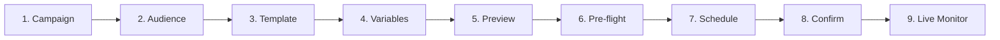
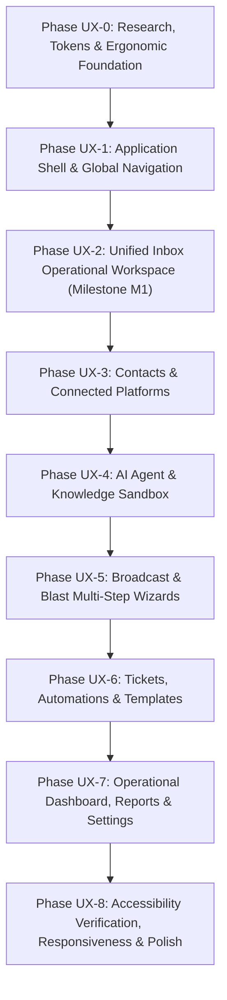

# VYNOR CRM — UI/UX Design Plan & Product Interface Specification

> **Module Identity:** UI/UX Design System & Operational Product Interface  
> **Status:** Planning & Specification Phase (Ready for Review)  
> **Source of Truth:** Phase 0 Engineering Foundation completed (certified in [`docs/phase-0-definition-of-done.md`](docs/phase-0-definition-of-done.md))  
> **Target Audience:** Internal Operations (Human Agents, Supervisors, Administrators, Analysts)  
> **Guiding Principle:** Mission-critical internal operational software — optimized for speed, dense readability, zero context loss, and sovereign human-AI control.

---

## 1. Design Objective

VYNOR CRM is purpose-built as an **internal operational platform** for high-volume customer communication, AI-assisted triage, and multi-channel engagement. It is emphatically **not** a marketing website, public SaaS showcase, template admin dashboard, Dribbble concept, or visual playground.

Human operators spend 6 to 10 consecutive hours inside this software daily. Consequently, the interface prioritizes ergonomics, psychological calm, predictability, and ruthless efficiency over superficial visual novelty.

### Core Design Priorities

1. **Speed of Operation:** Actions require minimal clicks and have zero unnecessary modal interruptions. High-frequency actions (navigate, claim, reply, transfer, resolve) are instantly triggerable via keyboard shortcuts or persistent inline controls.
2. **Information Clarity:** Crisp contrast, clear typography, and unambiguous visual hierarchy ensure that critical operational data (customer identity, channel, unread count, delivery status, SLA timer) can be absorbed in under 2 seconds.
3. **Low Cognitive Load:** Eliminates visual noise, excessive borders, layered cards, and gratuitous animations that cause cognitive fatigue over extended shifts.
4. **High Information Density with Structural Calm:** Displays rich conversational and customer context in dense, compact grids without creating clutter, using clean 1px structural dividers rather than multiple drop-shadows.
5. **Clear Hierarchy:** Strict visual differentiation between primary operational workspace (Unified Inbox), contextual metadata (Customer Panel), and secondary platform administration.
6. **Predictable Interaction:** Consistent placement of filters, search, buttons, tables, and dialogs across all 12 modules.
7. **Fast Navigation:** Linear-inspired two-key chords (`G`+`I` for Inbox, `G`+`C` for Contacts) and global command bar (`Ctrl+K`) enable lightning-fast transitions without mouse travel.
8. **Context Preservation:** Secondary panels, drawers, and inline composers ensure that agents never lose sight of customer conversation history while referencing tickets, notes, or identities.
9. **Error Visibility & Actionable Recovery:** Errors (webhook disconnects, rate limits, delivery failures) are displayed inline with immediate, concrete remediation buttons rather than vague transient toasts.
10. **Accessibility:** Native compliance with W3C WCAG 2.2 Level AA, full keyboard operability, visible focus rings, screen-reader landmarks, and contrast ratios >= 4.5:1.
11. **Visual Consistency:** Strict adherence to design tokens derived from Tailwind CSS and shadcn/ui headless composition.
12. **Human + AI State Clarity:** Unambiguous visual differentiation between AI autonomous activity, suggested drafts, and sovereign human agent takeovers, with zero deceptive AI styling.

---

## 2. Product UX Context

The VYNOR CRM product suite comprises 12 core modules and supporting operational capabilities. These modules represent distinct operational workflows and domain boundaries established in Phase 0:

| Module Number & Name          | Operational Purpose                                                         | Primary Frequency & Priority     | User Persona               |
| :---------------------------- | :-------------------------------------------------------------------------- | :------------------------------- | :------------------------- |
| **01. Dashboard**             | Operational pulse, queue latency, agent workloads, AI resolution rate       | Daily / Shift start (Secondary)  | Supervisor, Admin, Analyst |
| **02. Chats / Unified Inbox** | Primary operational workspace for multi-channel customer communications     | Constant / Realtime (Primary P0) | Human Agent, Supervisor    |
| **03. Contacts**              | Directory of customers, multi-channel identities, custom fields, history    | Frequent lookup (High P0)        | Human Agent, Supervisor    |
| **04. Connected Platforms**   | Management and health monitoring of channel accounts (WhatsApp, IG, etc.)   | Configuration / Health check     | Admin, Supervisor          |
| **05. AI Agent**              | Configuration of AI bot behaviors, model parameters, guardrails, playground | Configuration & Tuning           | Admin, Supervisor          |
| **06. Broadcast**             | Targeted, scheduled multi-recipient outbound messaging campaigns            | Campaign-driven workflow         | Admin, Supervisor          |
| **07. Blast**                 | High-velocity batch message dispatch via CSV with syntax validation         | Batch operational dispatch       | Admin, Supervisor          |
| **08. Tickets**               | Structured work items for asynchronous multi-team problem resolution        | Follow-up & Escalation           | Human Agent, Supervisor    |
| **09. Automations**           | Event-driven rules (`WHEN -> IF -> THEN`) for routing and labeling          | Configuration & Audit            | Admin, Supervisor          |
| **10. Content / Templates**   | HSM template library, canned quick responses, approved media assets         | Daily drafting & Governance      | Human Agent, Admin         |
| **11. Reports**               | Historical operational analytics, SLA adherence, agent performance          | Weekly / Shift retrospective     | Supervisor, Analyst, Admin |
| **12. Settings & Admin**      | IAM, roles, teams, permissions, audit logs, API keys, working hours         | Governance & Security            | Administrator              |

### Supporting Capabilities

- **Authentication & IAM:** Supabase Auth session boundary with automatic JWT refresh and internal workspace membership mapping.
- **Granular RBAC:** 24 canonical system permissions governing button visibility, action execution, and read-only downgrades.
- **Realtime Infrastructure:** Socket.IO `/realtime` namespace with deterministic room scoping (`workspace:{id}`, `conversation:{id}`) and sequence-based resynchronization.
- **Transactional Outbox & Queues:** `pg-boss` background job queues ensuring idempotent delivery and zero duplicate side-effects.
- **RustFS S3 Storage:** Abstracted, pre-signed download authorizations with zero raw binaries in PostgreSQL.

---

## 3. User Roles

The system explicitly supports four role personas. UI action availability, information density, and screen behavior dynamically adapt to these roles based on verified server-side permissions:

### 1. Administrator (`SUPER_ADMIN`, `ADMIN`)

- **Primary Focus:** Tenant governance, user provisioning, team assignment, channel credentials, AI agent prompts, knowledge ingestion, webhook health, API keys, and audit log analysis.
- **UX Requirement:** Comprehensive configuration screens, explicit pre-flight validation for destructive changes, full audit attribution, and global visibility across all inboxes and teams.

### 2. Supervisor (`ADMIN`, Senior Lead)

- **Primary Focus:** Queue triage, workload balancing, re-assignment, live escalation, agent presence monitoring, AI handoff supervision, SLA breach prevention.
- **UX Requirement:** High-level queue indicators, instant multi-conversation assignment bar, agent workload meters, quick take-over controls, and filtered analytical views.

### 3. Human Agent (`AGENT`)

- **Primary Focus:** Rapid resolution of inbound customer inquiries across WhatsApp, Instagram, Telegram, Email, and webchat. Reading customer context, authoring rich replies, writing internal notes, tagging labels, raising tickets, and completing conversations.
- **UX Requirement:** Uninterrupted focus in the Unified Inbox. Zero navigation out of the conversation view to look up customer data. Split-second keyboard shortcuts, instant canned responses, distinct internal note styling, and visual indicators for delivery states.

### 4. Viewer / Analyst (`AGENT` read-only or dedicated Auditor)

- **Primary Focus:** Operational quality assurance, sentiment analysis, compliance review, report generation, and audit trail inspection.
- **UX Requirement:** Clean read-only views with all mutation controls (reply, assign, delete, config) gracefully disabled or hidden with explanatory badges. Unrestricted export to CSV/JSON and advanced tabular filters.

### Visual Behavior for Permission-Restricted Actions

- **Unavailable Action (No Read Permission):** Element is omitted entirely from navigation and toolbars to prevent UI clutter.
- **Disabled Action (Read Permitted, Write Restricted):** Element remains visible with low opacity (`opacity-40`), cursor set to `not-allowed`, and a Radix Tooltip explaining: `"Requires permission: [action]"`.
- **Permission Denied State (Route Access):** Displays an inline contextual card with `ShieldAlert` icon, error code `PERMISSION_DENIED`, actor context, and a primary button `"Return to Inbox"`.
- **Read-Only Mode:** Displays a discrete, non-intrusive banner at the top of the workspace: `"Viewing in Read-Only Mode — mutations are disabled for your role."`

---

## 4. Design Research

To ensure VYNOR CRM reflects industry-standard product engineering rather than generic dashboard templates, we analyzed leading operational software across omnichannel support, developer tooling, and CRM domains:

### Evaluated Reference Products

1. **Chatwoot (Open Source Omnichannel Customer Support):**
   - _Strengths:_ Clean 3-pane unified inbox layout, multi-inbox categorization (Unassigned, Mine, All), robust channel identity badges, and split-view agent ergonomics.
   - _Limitations:_ Settings pages can feel disjointed; timeline events are occasionally visually indistinct from regular messages.
2. **Intercom (Conversational Relationship Platform & Fin AI):**
   - _Strengths:_ Exceptional human-AI collaboration model. Copilot drafts and Fin handoff triggers appear natively inside the conversation timeline without disrupting the thread. Context panel aggregates conversations across all channels.
   - _Limitations:_ Heavy marketing-oriented chrome, low density in default views, high subscription upsell clutter.
3. **Linear (High-Density Issue Tracking & Productivity):**
   - _Strengths:_ Benchmark for operational software. Ultra-fast `Cmd+K` command palette, single-key and chord navigation (`G`+`I`), 4px compact spacing, 1px subtle borders instead of layered drop-shadows, zero layout jumps during realtime updates, and restrained neutral palettes.
   - _Limitations:_ Primarily designed for software development issues rather than conversational messaging streams.
4. **Attio (Next-Generation CRM Platform):**
   - _Strengths:_ Unrivaled data-dense table views, customizable inline-editable attribute rows, powerful multi-faceted filters, and crisp identity resolution cards.
   - _Limitations:_ Highly complex configuration interface that can overwhelm customer service agents if adapted without constraints.
5. **Zendesk (Enterprise Ticketing Core):**
   - _Strengths:_ Rigid operational state definitions (New, Open, Pending, Solved), robust audit histories, and clear separation between conversation and work item tickets.
   - _Limitations:_ Dated legacy aesthetic, slow navigation transitions, excessive modal windows, and disjointed add-on experiences.

### Technical UI Foundations Evaluated

- **shadcn/ui & Radix UI Primitives:** Headless, unstyled accessible primitives providing robust keyboard focus trapping, ARIA roles, and portal rendering (`Dialog`, `DropdownMenu`, `Tabs`, `Popover`, `Tooltip`, `Command`).
- **Tailwind CSS v4:** Modern CSS variables-based theme engine enabling seamless semantic color abstraction, zero runtime overhead, and atomic utility classes.
- **WAI-ARIA APG & WCAG 2.2 Level AA:** Explicit keyboard navigation specs, focus order, high contrast compliance, and live announcements for realtime events.

---

## 5. Design Resources Used

The following design skills, specifications, libraries, and official references are utilized as the concrete basis of this planning:

1. **Repository Design & Contract Analysis:**
   - Packages inspected: `@vynor/contracts` (IAM permissions, channel contracts, error taxonomy RFC-7807), `@vynor/database` (Prisma schema relations, indexes, outbox models), `@vynor/storage` (S3 pre-signed policies), `apps/web` (Next.js 16 App Router, Tailwind tokens, shadcn/ui components).
2. **Component & Design System References:**
   - shadcn/ui Official Architecture & Component Guidelines.
   - Radix UI Accessibility & State Machine Specifications.
   - Tailwind CSS Design Token & Utility Scale Specifications.
3. **Accessibility & Regulatory Standards:**
   - W3C Web Content Accessibility Guidelines (WCAG) 2.2 Level AA.
   - WAI-ARIA Authoring Practices Guide (APG) for Tab, Dialog, Command Palette, and Menu patterns.
4. **Product Design & Benchmark References:**
   - Chatwoot v3 Operational Workflow Specifications.
   - Intercom Fin AI & Copilot Interaction Architecture.
   - Linear Method & UI Density Reference Documentation.
   - Attio Data Table & Attribute Framework.

---

## 6. Reference Pattern Matrix

| Reference    | Pattern yang Bagus                                                        | Masalah yang Diselesaikan                                                      | Relevansi untuk VYNOR | Adaptasi yang Direkomendasikan                                                                        | Hal yang TIDAK Boleh Dicopy                                                                 |
| :----------- | :------------------------------------------------------------------------ | :----------------------------------------------------------------------------- | :-------------------- | :---------------------------------------------------------------------------------------------------- | :------------------------------------------------------------------------------------------ |
| **Chatwoot** | 3-pane split layout: Queue List -> Conversation Stream -> Contact Context | Menghilangkan context switching saat menangani chat masuk dari channel berbeda | **Tinggi (Core)**     | Gunakan layout 3 kolom dengan lebar proporsional (340px list, flex-1 stream, 320px context)           | Jangan tiru styling rounded-card berlebih dan pemisah visual yang terlalu tebal             |
| **Chatwoot** | Tab navigasi queue sederhana (Mine, Unassigned, All)                      | Agent langsung tahu mana pekerjaan miliknya dan mana yang perlu di-triage      | **Tinggi (Core)**     | Jadikan segmented baris teratas di atas list conversation dengan counter badge                        | Jangan gunakan dropdown tersembunyi untuk filter queue utama                                |
| **Intercom** | Handoff AI-ke-Manusia dengan timeline terpadu dan ringkasan AI            | Customer tidak perlu mengulang cerita saat bot mengeskalasi ke agent           | **Tinggi (Core)**     | Render event handoff sebagai compact chip di timeline lengkap dengan reason & confidence              | Jangan tiru aesthetic neon/purple Fin AI atau icon robot kartun                             |
| **Intercom** | Internal Note mode di dalam composer yang sama                            | Mencegah agen salah mengirim catatan internal ke customer                      | **Tinggi (Core)**     | Toggle composer mode dengan background amber lembut dan tombol submit bertuliskan "Add Internal Note" | Jangan buat modal terpisah hanya untuk menambah internal note                               |
| **Linear**   | Command Menu (`Ctrl+K`) dan G-Chords (`G`+`I`, `G`+`C`)                   | Mengeliminasi kebutuhan navigasi mouse untuk perpindahan modul                 | **Tinggi (Core)**     | Implementasikan Radix/cmdk palette dengan context-aware actions di seluruh aplikasi                   | Jangan abaikan touch targets untuk skenario tablet saat membuat UI terlalu micro            |
| **Linear**   | 1px subtle border division, 4px spacing grid, zero drop-shadow clutter    | Mengurangi eye strain operator selama jam kerja panjang                        | **Tinggi (Core)**     | Terapkan palette neutral slate/zinc dengan border `border-border/60` dan flat elevation               | Jangan buat UI dark-mode only jika operator memerlukan light mode di ruang kerja terang     |
| **Attio**    | Compact data table dengan multi-faceted sticky filter bar                 | Menampilkan ribuan record kontak tanpa kehilangan orientasi kolom              | **Tinggi (Contacts)** | Buat standardized DataTable component dengan sticky header, sorting, dan filter badges                | Jangan gunakan customizable drag-and-drop table builder yang rumit di fase operational awal |
| **Zendesk**  | Pemisahan tegas antara conversational message dan ticketing work-item     | Mencegah kebingungan SLA antara chat realtime dan tiket investigasi            | **Tinggi (Tickets)**  | Modul Tickets memiliki IA dan lifecycle terpisah dari Chats, namun saling terhubung melalui deep-link | Jangan adopsi UI legacy multi-tab browser usang ala Zendesk yang membingungkan              |

---

## 7. Anti AI-Slop Principles

To ensure VYNOR CRM remains an uncompromising, elite operational software tool, the UI/UX explicitly prohibits "AI-generated UI slop". Every design decision must serve an operational function.

### Explicitly Prohibited Patterns

1. **No Decorative Gradients:** Gradient buttons, gradient headers, gradient backgrounds, or text gradients are strictly forbidden.
2. **No Neon AI Aesthetics:** No glowing cyan/purple borders, pulsating neon dots, sparkles, magic wand icons, or robot mascots. AI is treated as an operational algorithm, not magic.
3. **No Glassmorphism:** No `backdrop-blur` layered cards, frosted translucent headers, or semi-transparent backgrounds that decrease text legibility.
4. **No Card-in-a-Card Syndrome:** Do not wrap every single label, detail, or paragraph in an independent bordered card with rounded corners. Use clean structural borders, semantic typography, and whitespace.
5. **No Giant Border Radii:** No `rounded-3xl` or pill-shaped buttons for regular operational actions. Border radii are restrained to `rounded-sm` (2px), `rounded-md` (4px), or `rounded-lg` (6px).
6. **No Floating Decorative Shapes:** Zero decorative floating circles, geometric shapes, or abstract background artwork.
7. **No Fake / Vanity Dashboard Charts:** No charts without actionable operational thresholds (e.g. decorative curved area charts showing fictitious metrics). Tables and discrete metric numbers are preferred.
8. **No Generic "Welcome Back" Banners:** Zero wasted vertical space on hero greetings like _"Good morning, John! Here is what's happening today."_ The agent needs immediate access to their active queue.
9. **No Unconstrained Whitespace:** Avoid excessive padding (e.g. 64px section padding) typical of landing pages. Maintain high information density suitable for 1080p and 1440p displays.
10. **No Gratuitous Animations:** Zero bounce, elastic, or multi-second stagger transitions. Transitions are limited to instantaneous or 100ms ease-out opacity/color shifts.
11. **No Excessive Confirmation Dialogs:** Low-risk operational actions (adding a tag, claiming an unassigned chat) execute immediately with an undo toast option; modals are reserved strictly for high-risk destructive actions.
12. **No Arbitrary Badge Overuse:** Do not place 10 colored badges on a single list row. Use semantic icons, font weights, and position to communicate state.

### Operational Justification Requirement

Every visual element must be justified by at least one of these criteria:

- **Hierarchy:** Does it clarify primary vs. secondary focus?
- **Readability:** Does it improve character or number scanability?
- **State Communication:** Does it convey a change in network, channel, or message status?
- **Discoverability:** Does it help the user find a tool without guessing?
- **Efficiency:** Does it reduce clicks, keystrokes, or visual search time?
- **Error Prevention:** Does it prevent catastrophic accidental operations (e.g. sending internal notes to customers)?
- **Accessibility:** Does it fulfill contrast or screen-reader requirements?
- **Operational Context:** Does it tell the user _who_, _where_, and _what status_ is active?

---

## 8. UX Principles

1. **Operator Focus First:** The human agent's attention is the most valuable resource. The UI must never distract, interrupt with non-critical popups, or force unnecessary page reloads.
2. **Zero Context Loss:** When inspecting a customer, switching channels, or reviewing past tickets, the current conversation thread must remain accessible and persistent.
3. **High Density with Structural Calm:** Maximum relevant information visible per viewport without feeling claustrophobic. Clean 1px lines organize space.
4. **Explicit State Before Action:** An operator must always know the state of a conversation (Unassigned, Mine, Bot-handled, Waiting on Customer) before choosing to take action.
5. **Keyboard-First Ergonomics:** Every primary workflow in the Unified Inbox can be completed entirely from the keyboard.
6. **Fail-Closed Security Visibility:** If permissions are insufficient, the UI clearly shows the restriction with actionable guidance rather than silently failing or crashing.
7. **Predictable Monotonic Updates:** Realtime updates never shift the list under the operator's cursor or cause jumpy message timelines while reading.
8. **Human-in-the-Loop Sovereign Control:** When AI generates suggestions or operates in an inbox, the human operator always retains 1-click override, review, and pause capabilities.

---

## 9. Visual Direction

- **Personality:** Professional, Operational, Calm, Dense, Neutral, Precise, Reliable, Fast.
- **Visual Medium:** Canvas-first neutral dark/light theme based on Zinc/Slate scale.
- **Structural Separation:** 1px hairline borders (`hsl(var(--border))`) instead of multi-layered drop shadows.
- **Elevation Layering:** Extremely conservative.
  - Level 0: Workspace base canvas.
  - Level 1: Sidebar, Context panels, Tables, and Composer.
  - Level 2: Popovers, Tooltips, Dropdown menus (`shadow-sm`).
  - Level 3: Modal dialogs, Command bar, Drawer sheets (`shadow-md`).
- **Semantic Accentuation:** Neutral grays dominate 90% of the screen. Color is reserved almost exclusively for operational semantic states (Green = Delivered/Online, Amber = Internal Note/Warning, Rose = Failed/Urgent, Blue = Focus/Selection).

---

## 10. Information Architecture

```mermaid
flowchart TD
    Shell["Application Shell (AppShell)"]

    Shell --> Nav["Primary Navigation (Left Sidebar)"]
    Shell --> TopBar["Contextual Header & Global Bar"]
    Shell --> Workspace["Main Workspace Container"]

    Nav --> M1["01. Dashboard"]
    Nav --> M2["02. Unified Inbox (Core)"]
    Nav --> M3["03. Contacts"]
    Nav --> M4["04. Connected Platforms"]
    Nav --> M5["05. AI Agent"]
    Nav --> M6["06. Broadcast"]
    Nav --> M7["07. Blast"]
    Nav --> M8["08. Tickets"]
    Nav --> M9["09. Automations"]
    Nav --> M10["10. Templates"]
    Nav --> M11["11. Reports"]
    Nav --> M12["12. Settings"]

    TopBar --> Search["Global Command Palette (Ctrl+K)"]
    TopBar --> ChannelHealth["Channel Health Indicator"]
    TopBar --> AgentPresence["Presence Toggle (Online / Busy / Away)"]
    TopBar --> Notif["Notifications Drawer"]
    TopBar --> UserMenu["User Profile & Workspace Switcher"]

    M2 --> InboxQueues["Queues: Unassigned | Mine | Team | All | Completed"]
    M2 --> InboxList["Conversation List (Filtered & Sorted)"]
    M2 --> InboxTimeline["Conversation Workspace & Timeline"]
    M2 --> InboxContext["Customer Context & Linked Metadata Panel"]
```



### Module Categorization & Access Frequency

1. **Primary Operational Tier (Daily Constant Use):**
   - `Chats / Unified Inbox` (Hot-keyed default route `/inbox`).
   - `Contacts` (`/contacts`).
   - `Tickets` (`/tickets`).
2. **Outbound Operational Tier (Campaign & Broadcast Operations):**
   - `Broadcast` (`/broadcast`).
   - `Blast` (`/blast`).
   - `Content / Templates` (`/templates`).
3. **Intelligence & Automation Tier (Supervisory & Tuning):**
   - `AI Agent` (`/ai-agent`).
   - `Automations` (`/automations`).
   - `Connected Platforms` (`/channels`).
4. **Governance & Analytical Tier (Management & Audit):**
   - `Dashboard` (`/dashboard`).
   - `Reports` (`/reports`).
   - `Settings & Administration` (`/settings`).

---

## 11. Navigation Model

### Two-Level Navigation Strategy

1. **Global Primary Sidebar (56px collapsed icon rail or 220px expanded):**
   - Anchored permanently to the left of the viewport.
   - Contains top-level modules grouped logically by frequency (Operations, Outbound, Intelligence, System).
   - Keyboard navigable with Linear-style `G` chords.
   - Collapsible to an icon-only mode with tooltips to maximize workspace area on standard 1080p laptops.
2. **Contextual Secondary Navigation (Sub-Navigation):**
   - For modules with multi-state queues (e.g. Unified Inbox), sub-navigation is embedded directly as a header or left segment inside the workspace panel rather than generating a third full sidebar.
   - Settings uses a clean left-hand category index (`General`, `Members`, `Roles`, `Channels`, `Audit Logs`).

### Global Shortcuts (G-Chords)

- `G` then `I`: Jump directly to Unified Inbox (`/inbox`).
- `G` then `C`: Jump to Contacts (`/contacts`).
- `G` then `T`: Jump to Tickets (`/tickets`).
- `G` then `B`: Jump to Broadcast (`/broadcast`).
- `G` then `D`: Jump to Dashboard (`/dashboard`).
- `G` then `S`: Jump to Settings (`/settings`).
- `Ctrl` + `K` or `Cmd` + `K`: Open Global Command Palette.
- `?`: Toggle Keyboard Shortcuts Cheatsheet Modal.

---

## 12. Application Shell

The Application Shell provides a rigid, indestructible frame that guarantees zero orientation loss when switching views or receiving burst realtime events.

```text
+-------------------------------------------------------------------------------------------------------+
| App Header: Workspace Name | Breadcrumbs | Global Search (Ctrl+K) | Channel Status | Presence | User |
+---------+---------------------------------------------------------------------------------------------+
| Rail/   | Workspace Sub-Header: View Title | Filters | Action Buttons                                 |
| Nav     +---------------------------------------------------------------------------------------------+
|         |                                                                                             |
| [Inbox] |                                                                                             |
| [Cont.] |                                   MAIN WORKSPACE AREA                                       |
| [Tick.] |                                                                                             |
| [Plat.] |                           (Zero unexpected layout shifts)                                   |
| [AI]    |                                                                                             |
| [Blast] |                                                                                             |
| [Sett.] |                                                                                             |
|         |                                                                                             |
+---------+---------------------------------------------------------------------------------------------+
| System Status Footer: Connected Channels (5/5) | Latency: 24ms | Socket: Connected | Build v0.1.0    |
+-------------------------------------------------------------------------------------------------------+
```

### Key Technical Shell Rules

- **Viewport Height Lock:** Fixed at `100vh` / `100dvh`. Outer window scrollbars are strictly forbidden. All scrolling occurs inside dedicated, isolated Radix ScrollAreas.
- **Main Workspace Isolation:** Modules render inside an overflow-hidden flex container. If a table or timeline overflows, it never pushes the sidebar or header offscreen.
- **Contextual Status Bar (Bottom):** Displays realtime Socket.IO connection status, active workspace slug, and channel health summary.

---

## 13. Design Tokens

Design tokens are implemented via CSS variables in Tailwind CSS v4, supporting clean switching between high-contrast dark mode and crisp operational light mode:

### 1. Spacing Scale (4px Base Grid)

| Token         | Pixel Value | Intended Usage                               |
| :------------ | :---------- | :------------------------------------------- |
| `--space-0`   | `0px`       | Reset                                        |
| `--space-0.5` | `2px`       | Micro-spacing, inline icon margins           |
| `--space-1`   | `4px`       | Compact component gaps, badge padding        |
| `--space-1.5` | `6px`       | Compact button padding                       |
| `--space-2`   | `8px`       | Standard element gap, input internal padding |
| `--space-3`   | `12px`      | Compact card padding, table row gaps         |
| `--space-4`   | `16px`      | Standard panel padding, workspace margins    |
| `--space-5`   | `20px`      | Medium layout gaps                           |
| `--space-6`   | `24px`      | Major section division                       |
| `--space-8`   | `32px`      | Dialog padding, empty state padding          |

### 2. Radius Tokens

- `--radius-none`: `0px` (Tables, code blocks, sticky headers).
- `--radius-sm`: `2px` (Tags, status dots, micro-indicators).
- `--radius-md`: `4px` (Inputs, buttons, dropdown items, compact chips).
- `--radius-lg`: `6px` (Panels, modal dialogs, context panels).
- _Strict Rule:_ No border radius larger than 8px anywhere in the application.

### 3. Border & Elevation Tokens

- `--border-subtle`: `1px solid hsl(var(--border) / 0.5)` (Table row separators, internal dividers).
- `--border-default`: `1px solid hsl(var(--border))` (Panel boundaries, inputs, cards).
- `--border-strong`: `1px solid hsl(var(--border-strong))` (Active tabs, focused inputs).
- `--elevation-0`: `none` (Default flat workspace canvas).
- `--elevation-1`: `0 1px 2px 0 rgb(0 0 0 / 0.05)` (Subtle popover elevation).
- `--elevation-2`: `0 4px 6px -1px rgb(0 0 0 / 0.1), 0 2px 4px -2px rgb(0 0 0 / 0.1)` (Modals, command palette).

---

## 14. Typography

VYNOR CRM utilizes **Inter** as its primary interface typeface and **JetBrains Mono** for IDs, timestamps, payload payloads, and code references.

### Recommended Operational Type Scale

| Role                 | Font Family    | Size               | Line Height | Weight            | Letter Spacing | Use Case                                       |
| :------------------- | :------------- | :----------------- | :---------- | :---------------- | :------------- | :--------------------------------------------- |
| **Page Title**       | Inter          | `18px` (`text-lg`) | `24px`      | Semi-bold (`600`) | `-0.015em`     | Workspace / module primary header              |
| **Section Header**   | Inter          | `14px` (`text-sm`) | `20px`      | Semi-bold (`600`) | `-0.01em`      | Panel titles, table category headers           |
| **Body (Default)**   | Inter          | `13px`             | `18px`      | Regular (`400`)   | `0`            | Message timeline, customer context, forms      |
| **Body (Medium)**    | Inter          | `13px`             | `18px`      | Medium (`500`)    | `0`            | Customer names, table primary values           |
| **Compact / Meta**   | Inter          | `12px` (`text-xs`) | `16px`      | Regular (`400`)   | `0`            | Message previews, timestamps, secondary labels |
| **Micro Label**      | Inter          | `11px`             | `14px`      | Medium (`500`)    | `+0.01em`      | Table column headers, status badges            |
| **Code / Monospace** | JetBrains Mono | `12px`             | `16px`      | Regular (`400`)   | `0`            | Correlation IDs, phone numbers, JSON payloads  |

---

## 15. Color & Semantic States

Colors are mapped strictly to operational semantics. Decorative colors with no information value are prohibited.

### Palette Architecture

```text
Neutral (90% Canvas):
  Light: Background #FFFFFF | Surface #F8FAFC | Border #E2E8F0 | Text Primary #0F172A | Muted #64748B
  Dark:  Background #090A0B | Surface #111315 | Border #22252A | Text Primary #F8FAFC | Muted #94A3B8

Semantic Signals (10% Operational Indicators):
  - Neutral / Muted:   Slate   (Normal messages, timestamps, inactive states)
  - Accent / Focus:    Blue    (Selected conversation, focus rings, primary CTA)
  - Success / Live:    Emerald (Delivered, Connected, AI Online, Resolved)
  - Warning / Alert:   Amber   (Internal notes, Rate limited, Handoff required)
  - Danger / Error:    Rose    (Delivery failed, Disconnected, Validation error)
  - Info / System:     Sky     (System events, assignment changes, audit logs)
```

### Contrast Ratios (WCAG 2.2 AA)

- Text on Background: Minimum `4.5:1` (Body), `7:1` (High contrast mode).
- Graphical UI Controls & Borders: Minimum `3.0:1`.

---

## 16. Density & Spacing

To accommodate different operational contexts, VYNOR CRM supports two density modes:

1. **Compact Density (Default for Operations):**
   - Table row height: `32px`
   - Conversation row height: `64px`
   - Input height: `32px` (Text: 13px)
   - Ideal for: High-volume customer triage, monitoring 50+ queue items on 1080p laptop.
2. **Comfortable Density (Administrative Mode):**
   - Table row height: `40px`
   - Input height: `36px`
   - Ideal for: Template authoring, AI prompt editing, settings management.

---

## 17. Component Strategy

VYNOR CRM avoids bloated third-party component libraries by composing lightweight, unstyled Radix UI primitives with Tailwind CSS v4 design tokens.

### Layer 1: Core Primitives

- `Button` (Variants: `primary`, `secondary`, `outline`, `ghost`, `destructive`, `link`; Sizes: `sm`, `default`, `icon`).
- `Input` / `Textarea` (Monospace option, inline error states, character counters).
- `Select` / `Combobox` (Searchable, virtualized for 500+ agents/tags).
- `Checkbox` / `Switch` (Explicit labels, accessible focus rings).
- `Tabs` (Segmented queue pills or underline border indicators).
- `Tooltip` (Radix headless, instant display on hover, accessible focus trigger).
- `Popover` / `DropdownMenu` (Portal-rendered, keyboard-navigable).
- `Dialog` / `Sheet` (Accessible focus trap, accessible escape handling, non-destructive backdrop).
- `DataTable` (Sticky header, customizable column width, virtualized rows).
- `ScrollArea` (Custom subtle scrollbars that never shift layout width).

### Layer 2: Domain-Specific Operational Components

- `ConversationRow`: Multi-channel row with unread pulse, priority marker, channel badge, and snippet.
- `MessageBubble`: Left/right sender differentiation, delivery receipt ticks, retry action on failure.
- `InternalNoteBubble`: Warm yellow tinted container with padlock icon, distinctly separated from chat.
- `SystemEventChip`: Compact, center-aligned micro-event with timestamp and actor attribution.
- `ChannelBadge`: Compact icon + text badge for WhatsApp, Instagram, Telegram, Email, TikTok.
- `AIStateIndicator`: Operational badge showing AI Bot engagement level (Autonomous, Suggesting, Paused).
- `DeliveryStatusIcon`: Single check (Sent), Double check (Delivered), Blue double check (Read), Rose triangle (Failed).
- `AssignmentControl`: Quick-picker for assigning Agent or Team with avatar and presence status.

---

## 18. Interaction Patterns

1. **Inline Actions Over Modals:** Simple actions (e.g. adding a tag, assigning an agent, toggling priority) are performed inline via quick popovers or dropdowns. Full modal dialogs are reserved for destructive or multi-step operations.
2. **Optimistic UI with Graceful Rollbacks:** When an agent sends a message or claims a conversation, the UI updates immediately with an `in-flight` state. If the server or provider rejects the action, the element transitions to an actionable error state with an inline retry trigger.
3. **Collision Detection & Presence:** When multiple agents view the same conversation, a subtle top banner displays: `"Agent Sarah is currently viewing this conversation"`. If another agent replies, the composer indicates: `"Agent Sarah is typing..."` to prevent double replies.
4. **Drag & Drop with Paste Support:** Message composer accepts direct image/document paste from the clipboard (`Ctrl+V`) and drag-and-drop file targets with progress meters.

---

## 19. Unified Inbox Specification

The Unified Inbox is the operational beating heart of VYNOR CRM.

### Layout Topology (Desktop >= 1280px)

```text
+-------------------+------------------------------------------+-----------------------+
| CONVERSATION LIST | CONVERSATION WORKSPACE                   | CUSTOMER CONTEXT      |
| Width: 340-380px  | Width: Flex-1 (Min 520px)                | Width: 320-360px      |
|                   |                                          | (Collapsible)         |
| [Search & Filter] | Header: Customer Name | Status | Actions | Customer Summary      |
| [Queue Tabs]      +------------------------------------------+ Channel Identities    |
|                   |                                          | Active Labels         |
| List of           | Message Timeline                         | Custom Fields         |
| ConversationRows  | (Customer, Agent, AI, Internal Notes)    | Linked Tickets        |
| with live         |                                          | Previous Chats        |
| indicators        +------------------------------------------+                       |
|                   | Message Composer                         | [Collapse / Expand]   |
|                   | (Text, Attachments, Internal Note Mode)  |                       |
+-------------------+------------------------------------------+-----------------------+
```

### Screen Specification

- **Screen:** `Unified Inbox Workspace (/inbox)`
- **Purpose:** Centralized processing of all multi-channel customer messages with human-agent sovereign workflow.
- **Primary Actor:** Human Agent, Supervisor.
- **Entry Point:** Primary navigation default, direct URL `/inbox`, or G-chord `G`+`I`.
- **Primary Job:** Triage unassigned messages, claim conversations, author replies, resolve inquiries within SLA.
- **Information Hierarchy:**
  1. _Primary:_ Active conversation timeline and composer.
  2. _Secondary:_ Queued conversation list sorted by recent update / unread status.
  3. _Tertiary:_ Customer identity, contact fields, and linked tickets in context panel.
- **Primary Action:** Author & send message (`Ctrl+Enter`) or Complete conversation (`E`).
- **Secondary Actions:** Switch queue tab, Assign to team/agent, Insert canned response, Add internal note, Transfer.

---

## 20. Conversation Detail Specification

The Conversation Timeline visualizes the dialogue stream between customer, human agents, AI agents, and system events.

### Message Categorization & Visual Styling

1. **Customer Message:**
   - Left-aligned.
   - Neutral card surface (`bg-surface`, `border-border/60`).
   - High-contrast text (`text-foreground`).
   - Metadata: Timestamp + Channel source icon (e.g. WhatsApp logo, 12px).
2. **Human Agent Message:**
   - Right-aligned.
   - Muted accent surface (`bg-primary/10`, `border-primary/20`).
   - Metadata: Agent name + Timestamp + Delivery status icon.
3. **AI Agent Message:**
   - Right-aligned.
   - Distinct subtle border with discrete bot icon (`Bot` Lucide icon, 12px) and tag: `"AI Assistant"`.
   - _Anti-Slop Rule:_ No glowing borders, no purple gradient bubbles.
4. **Internal Note:**
   - Full-width banner box spanning the timeline.
   - Warm amber surface (`bg-amber-500/10`, `border-amber-500/30`, `text-amber-900` / `dark:text-amber-200`).
   - Prominent padlock icon (`Lock`) and label: `"Internal Note (Visible to team only)"`.
5. **System & Lifecycle Events:**
   - Centered micro-chip.
   - `text-xs text-muted-foreground bg-muted/40 px-2 py-0.5 rounded-full`.
   - Examples: `"Assigned to Sarah by System"`, `"Conversation marked as Completed"`, `"AI Handoff triggered: Negative sentiment"`.
6. **Failed Message Delivery:**
   - Right-aligned message bubble bordered in red (`border-destructive`).
   - Red warning badge with error snippet: `"Failed to deliver: WhatsApp API error 131026"`.
   - Actionable inline link: `[Retry Delivery]`.

---

## 21. Composer Specification

The message composer is engineered for rapid keyboard dispatch and fail-safe operation.

### Operational Features

- **Dual Mode Toggle:** Clean switch between **Customer Reply** and **Internal Note** via toggle tabs or keyboard shortcut (`Alt+N`).
  - _Reply Mode:_ Standard dark/accent Send button. Placeholder: `"Type a reply... (/ for templates)"`.
  - _Internal Note Mode:_ Composer frame turns warm amber with yellow border. Button turns Amber: `"Add Internal Note"`. Placeholder: `"Type internal note for team members..."`.
- **Slash Commands (`/`):** Typing `/` invokes a floating searchable popover of approved Canned Responses / HSM Templates with instant arrow-key selection and variable replacement.
- **Attachment Staging Area:** Previews dragged or pasted files with thumbnail, filename, filesize, and remove button before dispatch. Uploads directly to S3 via pre-signed URL.
- **Send Hotkey Configuration:** Configurable in user profile (`Enter` to send vs. `Ctrl+Enter` to send). Default: `Ctrl+Enter` to prevent accidental premature sends.

---

## 22. Customer Context Specification

The right-hand panel (320px) delivers 360-degree operational context without navigating away from the chat thread.

### Accordion / Section Breakdown

1. **Contact Profile Header:** Avatar, full customer name, primary phone number, email, and presence badge.
2. **Channel Identities List:** Badges showing linked identifiers (e.g. `WhatsApp: +6281234567890`, `Instagram: @customer_user`).
3. **Active Labels / Tags:** Compact colored tags with quick `+` popover to attach or detach labels.
4. **Assignment & Priority Control:** Assignee dropdown (Agents/Teams) + Priority selector (`Low`, `Medium`, `High`, `Urgent`).
5. **Custom Fields Grid:** Key-value pairs (e.g. `Customer Tier: Enterprise`, `Account ID: ACC-9921`, `City: Jakarta`). Inline editable with double-click or edit icon.
6. **Recent Linked Tickets:** Compact list of work-item tickets showing ID, subject, and status chip with 1-click jump-link.
7. **Cross-Channel History:** Collapsible list of previous conversation sessions across other channels.

---

## 23. Contacts Specification

- **Screen:** `Contacts Directory (/contacts)`
- **Purpose:** Searchable, filterable enterprise directory of all customer profiles and identity mappings.
- **Primary Actor:** Human Agent, Supervisor, Admin.
- **Layout:** High-density standardized data table with multi-faceted top filter bar and right-side slide-over drawer for quick inspection.
- **Columns:** Customer Name, Primary Identifier, Linked Channels (icons), Tags/Labels, Open Conversations, Last Activity, Created Date, Actions Menu (`...`).
- **Bulk Actions:** Multi-select checkboxes enable bulk labeling, bulk assignment, and export to CSV.

---

## 24. Connected Platforms Specification

- **Screen:** `Connected Platforms & Inboxes (/channels)`
- **Purpose:** Administrative configuration, credential management, and health telemetry for external messaging channels.
- **Supported Channels:** WhatsApp Cloud API, Instagram Direct, Facebook Messenger, Telegram Bot, Email (SMTP/IMAP), Custom API, LINE, TikTok.
- **Card / Row Layout:** Each connected account is rendered as an operational identity card featuring:
  - Account Display Name & Phone/Handle.
  - Channel Type Badge (Official WhatsApp Meta badge, Telegram logo).
  - Health State Pill: `Connected (Green)`, `Warning (Amber)`, `Disconnected (Red)`, `Rate Limited (Yellow)`.
  - Inbound & Outbound telemetry (throughput, last message timestamp, webhook latency in ms).
  - Actionable Error Banner if broken: `"Token expired 2h ago — [Re-authenticate Now]"`.
  - Assigned Default Team & AI Bot toggle.

---

## 25. AI Agent Specification

AI within VYNOR CRM is treated as an automated operational teammate, not a marketing gimmick.

### Screen & Architecture

- **Screen:** `AI Agent Configuration & Monitoring (/ai-agent)`
- **Operational States:**
  - `Autonomous (Green)`: Bot handles inquiries without human review.
  - `Copilot / Assist (Blue)`: Bot generates draft replies for human approval.
  - `Handoff Required (Amber)`: Bot encountered low confidence or escalation trigger.
  - `Disabled / Paused (Gray)`: Channel is strictly human-operated.
  - `System Error (Red)`: Model provider rate limit or context failure.
- **Configuration Sections:**
  - Identity & Persona: Name, language style, business operating hours.
  - LLM Provider & Parameters: Model selector (e.g. Claude 3.5 Sonnet, GPT-4o), temperature slider (`0.0 - 1.0`), max tokens.
  - Assigned Inboxes: Checklist of connected channels where this bot is active.
  - Guardrails & Fallbacks: Max autonomous turns before mandatory human handoff, forbidden topics, confidence threshold slider.
- **AI Playground (Sanitized Sandbox):**
  - Dedicated simulation tab with prominent banner: `TEST ENVIRONMENT — NO CUSTOMER MESSAGES SENT`.
  - Allows supervisors to test prompts and knowledge retrieval with live inspection of latency, token usage, context citations, and handoff triggers.

---

## 26. Knowledge Specification

- **Screen:** `Knowledge Sources Repository (/ai-agent/knowledge)`
- **Purpose:** Ingestion and lifecycle management of business documents, FAQs, and URLs powering AI vector retrieval.
- **Table Structure:** Document Name, Source Type (PDF, URL, FAQ, Markdown), Status (`Ready`, `Indexing [progress %]`, `Failed`, `Outdated`), Chunks Count, Vector Dimensions, Last Synced, Actions (`Re-index`, `Delete`).
- **Retrieval Inspector Drawer:** Clicking a document allows testing semantic search queries against that specific document chunks.

---

## 27. Broadcast Specification

Broadcast is structured as a **guided multi-step wizard** to prevent accidental mass messaging and maximize delivery compliance:



### Critical Operational Steps

- **Step 2 (Audience):** Dynamic filter builder with live calculated count: `Total Matching: 14,250 | Valid Phone: 13,800 | Suppressed/Opt-out: 450`.
- **Step 3 (Template):** WhatsApp HSM template selector showing real-time Meta approval status (`APPROVED` in green, `REJECTED` in red).
- **Step 6 (Pre-flight Validation):** Automated checks for template variables, rate limits, credit balance, and quiet hours compliance.
- **Step 8 (Dual-Confirmation Modal):** High-risk confirmation requiring the user to type the campaign name before queue dispatch.
- **Step 9 (Live Progress Dashboard):** Realtime progress bar with queued, sent, delivered, read, and failed counts, plus an immediate `"Pause / Abort"` button.

---

## 28. Blast Specification

- **Screen:** `Quick Blast Dispatcher (/blast)`
- **Purpose:** Rapid operational dispatch to an uploaded CSV list with strict syntax and deduplication validation.
- **CSV Validation Table:**
  - Before sending, uploaded rows are parsed client-side and displayed in a categorized audit tab:
    - `Valid Recipients (Ready)`
    - `Invalid Syntax / Missing Country Code (Excluded)`
    - `Duplicate Numbers (Automatically Merged)`
    - `Suppressed / Blacklisted Numbers (Blocked)`
  - Exact error details shown per row with downloadable rejection log.
- **Execution Bar:** Realtime progress with estimated time to completion and error rate meter.

---

## 29. Tickets Specification

Tickets represent structured, asynchronous work items and must not be confused with live chat conversations.

- **Screen:** `Tickets Board & Table (/tickets)`
- **Layout:** Segmented toggle between **Data Table** and **Kanban Board**.
- **Ticket Statuses:** `New (Blue)`, `Open (Yellow)`, `Pending Customer (Orange)`, `Escalated (Red)`, `Resolved (Emerald)`, `Closed (Gray)`.
- **Priorities:** `Low`, `Medium`, `High`, `Urgent`.
- **Detail View:** Shows subject, linked customer, linked conversation deep-link, SLA breach countdown timer, activity audit timeline, and internal comment stream.

---

## 30. Automations Specification

- **Screen:** `Automation Rules Builder (/automations)`
- **Model:** Constrained, linear event-action builder (`WHEN event -> IF conditions -> THEN actions`).
- _Anti-Slop Rule:_ No complicated drag-and-drop node graph canvas with spaghetti wires. A clean vertical stepped card list is infinitely faster to read and debug.
- **Supported Triggers:** `New Inbound Message`, `Conversation Created`, `Conversation Inactive (Timer)`, `Delivery Status Failed`.
- **Supported Conditions:** `Channel equals WhatsApp`, `Message contains keywords`, `Customer label includes VIP`, `Time outside working hours`.
- **Supported Actions:** `Assign to Team`, `Apply Label`, `Send Canned Response`, `Trigger AI Agent`, `Create Ticket`.
- **Execution Audit Log:** Table showing timestamp, trigger event, evaluated conditions, and success/failure result.

---

## 31. Content/Templates Specification

- **Screen:** `Templates & Canned Responses Library (/templates)`
- **Categories:**
  1. **Quick Replies (Canned Responses):** Agent-facing shortcuts prefixed with `/` for instant insertion into the composer.
  2. **WhatsApp HSM Templates:** Official Meta pre-approved outbound templates with language variants (`id_ID`, `en_US`) and placeholder tokens (`{{1}}`, `{{2}}`).
  3. **Rich Media Assets:** Pre-uploaded images, PDFs, and brochures stored in S3/RustFS with pre-generated preview thumbnails.
- **Creation Drawer:** Side-by-side template editor with live WhatsApp chat bubble simulation showing variable replacement in real-time.

---

## 32. Dashboard Specification

The dashboard is designed strictly for **operational awareness and shift oversight**, not executive marketing vanity.

```text
+-------------------------------------------------------------------------------------------------------+
| Operational Pulse: Shift Start 08:00 | Active Agents: 14/18 | Active Inboxes: 5/5 | System Load: Normal |
+-----------------------+-----------------------+-----------------------+-------------------------------+
| QUEUE PRESSURE        | AGENT WORKLOAD        | AI PERFORMANCE        | CHANNEL HEALTH                |
| Unassigned: 12        | Avg Response: 1m 45s  | Autonomous Res: 68%   | WhatsApp: 99.9% (18ms)        |
| Active Total: 84      | Longest Wait: 6m 12s  | Human Handoffs: 32    | Instagram: 100% (42ms)        |
| SLA Breached: 2       | Messages Sent: 1,420  | Fallback Rate: 3.2%   | Telegram: 100% (12ms)         |
+-----------------------+-----------------------+-----------------------+-------------------------------+
| LIVE QUEUE TRIAGE TABLE: Priority | Channel | Customer | Waiting Time | Assigned Team | Quick Claim   |
| [P1 Urgent] [WhatsApp] PT. Maju Bersama        | 6m 12s       | Sales Tier 1  | [Claim Button]|
| [P2 Normal] [Telegram] Budi Santoso            | 4m 30s       | Support       | [Claim Button]|
+-------------------------------------------------------------------------------------------------------+
| AGENT ACTIVITY STRIP: Sarah (Active: 4) | Rizky (Active: 6 - Busy) | Dian (Break) | Budi (Active: 2) |
+-------------------------------------------------------------------------------------------------------+
```

### Prohibited Dashboard Elements

- Zero arbitrary 3D isometric graphics or decorative illustrations.
- Zero oversized single-number KPI cards that consume half the screen.
- Zero fake predictive line charts without actionable context.

---

## 33. Reports Specification

- **Screen:** `Historical Reports & Analytics (/reports)`
- **Philosophy:** Tabular-first data density. Charts are used solely where visual trend comparison adds immediate decision value over raw numbers.
- **Report Types:**
  - `Conversation Volume & Peak Hours` (Hourly distribution heatmap).
  - `Agent Performance & SLA Compliance` (Response time, handle time, resolution rate).
  - `Channel Telemetry & Delivery Success` (Sent vs. Delivered vs. Read vs. Failed).
  - `AI Bot Resolution & Handoff Breakdown` (Reasons for human escalation).
- **Controls:** Date range picker (`Today`, `Yesterday`, `Last 7 Days`, `Last 30 Days`, `Custom`), Team filter, Channel filter, Export to CSV / JSON button.

---

## 34. Settings Specification

Settings uses a conventional 2-column administrative layout: left vertical category index, right configuration content.

### Category Taxonomy

1. **Workspace Profile:** Organization name, logo, default timezone, default currency.
2. **Users & Invitations:** User directory, Supabase invite trigger, active session revocation.
3. **Teams & Routing:** Department groupings (Sales, Support, Billing) and fallback queues.
4. **Roles & Permissions:** Granular permission matrix with checkboxes for 24 canonical permissions.
5. **Labels & Tags:** Color-coded taxonomy management for conversations and contacts.
6. **Custom Fields:** Schema definitions for customer attributes (Text, Number, Date, Dropdown).
7. **Working Hours & Away Responders:** Business hours schedule with automated out-of-office autoreplies.
8. **API & Webhooks:** Developer API key generation with secret masking and webhook endpoint subscriptions with live test ping.
9. **Audit Logs:** Immutable audit stream table with actor attribution, IP address, timestamp, and payload diff viewer.

---

## 35. Search & Filter Standard

### 1. Global Command Palette (`Ctrl+K` / `Cmd+K`)

- Powered by Radix/cmdk.
- Searches across conversations, contacts, tickets, templates, settings pages, and documentation in under 50ms.
- Allows immediate navigation via keyboard arrows + `Enter`.

### 2. In-Module Filter Bar Standard

- **Search Field:** Debounced (300ms) input with clear button (`Esc` to clear).
- **Faceted Filter Buttons:** Dropdown filters with active count badge: `Channel (2)`, `Assignee (1)`, `Status (All)`.
- **Active Filter Chips Strip:** Appears below the filter bar when filters are applied, showing removable chips and a `"Clear All"` button.
- **URL Query Synchronization:** All active filters and search strings serialize into URL query params (`?channel=whatsapp&status=unassigned&q=budi`) to ensure shareable, bookmarkable deep links.

---

## 36. Data Table Standard

All tabular data across VYNOR CRM (Contacts, Tickets, Channels, Templates, Audit Logs) follows a unified standard:

### Standardized Table Specifications

1. **Sticky Header:** Column headers remain fixed at the top during vertical scrolling with a subtle border boundary.
2. **Sort Indicators:** Interactive column headers show clear sort direction arrows (`↑`, `↓`, neutral).
3. **Text Truncation & Tooltips:** Long text strings (e.g. email addresses, subjects) truncate with ellipsis (`...`) and reveal the full string via tooltip on hover.
4. **Row Selection:** Checkbox column with header "Select All" / "Select Page" for batch operations.
5. **Row Density:** Compact `32px` height default with 13px font size.
6. **Action Column:** Pinned to the right with icon buttons for primary actions and an overflow menu (`...`) for secondary options.
7. **Cursor Pagination:** Standard pagination bar showing `Showing 1-50 of 2,410` with previous/next buttons and page size selector (`25`, `50`, `100`).

---

## 37. Feedback & Error States

| Feedback Type           | Visual Component                                 | Trigger Scenario                                     | Dismissal Behavior                                      |
| :---------------------- | :----------------------------------------------- | :--------------------------------------------------- | :------------------------------------------------------ |
| **Inline Field Error**  | Red 12px text below input with `AlertCircle`     | Form validation failure (Zod)                        | Clears on user keystroke correction                     |
| **Contextual Banner**   | Top of workspace / panel, colored border         | Channel disconnected, offline mode, rate limit       | Persistent until condition is resolved                  |
| **Notification Toast**  | Bottom-right corner (Sonner component)           | Ephemeral success (e.g. "Note added", "Tag applied") | Auto-dismisses in 3 seconds; includes "Undo"            |
| **Modal Confirmation**  | Centered modal with backdrop                     | High-risk action (Delete, Revoke, Bulk Blast)        | Requires explicit "Confirm" or "Cancel" click           |
| **Section Empty State** | Centered icon + neutral title + action button    | Filter returns 0 records, Queue is empty             | Action button allows clearing filter or creating record |
| **Full Page Error**     | Centered card with correlation ID & retry button | Server 500 error, Network drop                       | "Retry Connection" button triggers API refresh          |

---

## 38. Realtime UX

VYNOR CRM features live Socket.IO data synchronization. Realtime events must never degrade operator concentration:

### Realtime Interaction Rules

1. **No Unexpected Layout Jumps:** When a new message arrives in the active conversation, it appends smoothly to the bottom. If the agent has scrolled up to read history, the scroll position is strictly locked, and a floating badge appears: `"↓ New message from customer"`.
2. **Queue List Ordering:** When a new message arrives in an inactive conversation, the conversation moves to the top of the list with a subtle 200ms background highlight pulse (`bg-primary/5`), without disrupting the row currently hovered or selected.
3. **Optimistic Delivery Feedback:** When sending, message displays with a single gray checkmark (Queued). When acknowledged by WhatsApp/Meta API, it updates to delivered (double gray checks). When read, it turns double blue checks.
4. **Disconnection Handling:** If Socket.IO disconnects, a top subtle banner appears: `"Reconnecting realtime stream... (attempt 2/5)"`. Outbox messages remain queued in browser cache and replay upon reconnection.

---

## 39. Accessibility (WCAG 2.2 Level AA)

1. **Keyboard Operability:** Every interactive control has a visible focus indicator (`ring-2 ring-primary ring-offset-2`). Zero keyboard traps.
2. **Screen Reader Semantic Landmarks:** Proper use of HTML5 elements (`<nav>`, `<main>`, `<aside>`, `<header>`, `<footer>`, `<section>`).
3. **Live Announcements (`aria-live`):** Incoming messages and critical queue alerts use `aria-live="polite"` so screen-reader users are notified without interrupting active speech.
4. **Color Independence:** Statuses are never conveyed by color alone. Every colored dot or chip is accompanied by an accessible text label or icon.
5. **Reduced Motion:** Respects `prefers-reduced-motion` media queries by disabling all transition animations.

---

## 40. Responsive Strategy

Primary design target is **Desktop (1280px - 1920px)**. Secondary target is **Laptop & Tablet (768px - 1279px)**. Mobile phones (<768px) provide emergency triage capability.

### Layout Transformation Matrix

| Viewport Width                | Unified Inbox Layout Transformation                                        | Navigation Behavior          | Context Panel Behavior                         |
| :---------------------------- | :------------------------------------------------------------------------- | :--------------------------- | :--------------------------------------------- |
| **>= 1440px (Ultra-wide)**    | Full 3-pane layout: List (380px) + Timeline (Flex-1) + Context (360px)     | Full expanded sidebar        | Fully expanded and visible                     |
| **1280px - 1439px (Desktop)** | Standard 3-pane layout: List (320px) + Timeline (Flex-1) + Context (300px) | Compact icon-rail sidebar    | Fully expanded, collapsible                    |
| **1024px - 1279px (Laptop)**  | 2-pane layout: List (300px) + Timeline (Flex-1)                            | Compact icon-rail sidebar    | Collapsed by default; opens as floating drawer |
| **768px - 1023px (Tablet)**   | 1-pane master-detail view: Shows List OR Timeline with back button         | Collapsible hamburger drawer | Opens as full-height sliding Sheet             |
| **< 768px (Mobile)**          | Single-pane mobile view for emergency triage and quick replies             | Bottom navigation bar        | Modal drawer                                   |

---

## 41. Keyboard & Productivity

### Unified Inbox Shortcut Mapping

| Key Combination        | Action                         | Operational Purpose                             |
| :--------------------- | :----------------------------- | :---------------------------------------------- |
| `J` or `ArrowDown`     | Next conversation in list      | Move down queue without mouse                   |
| `K` or `ArrowUp`       | Previous conversation in list  | Move up queue without mouse                     |
| `C`                    | Focus message composer         | Instantly begin typing reply                    |
| `Ctrl` + `Enter`       | Send customer reply            | Dispatch message                                |
| `Alt` + `N`            | Toggle Internal Note mode      | Switch between customer reply and internal note |
| `E`                    | Complete conversation          | Mark conversation resolved and archive          |
| `A`                    | Assign to me                   | Claim active unassigned conversation            |
| `S`                    | Snooze conversation            | Temporarily remove from active queue            |
| `/`                    | Trigger canned response picker | Open quick template selector inside composer    |
| `Esc`                  | Blur input / Close modal       | Step back out of composer or dialog             |
| `Ctrl` + `Shift` + `C` | Toggle Customer Context panel  | Expand or collapse right context sidebar        |

---

## 42. UI/UX Phase Plan

The UI/UX design and specification roadmap is sequenced by operational dependencies:



---

## 43. Design Task Backlog

The following granular P0 design tasks define the implementation requirements:

- [x] **UX-TOK-001 [P0]** Establish Design System Tokens & Semantic Theme Config
  - **Goal:** Define single source of truth for colors, typography scale, spacing, radii, and elevations in Tailwind CSS v4.
  - **Inputs:** Section 13, 14, 15 token definitions.
  - **Depends:** None.
  - **UX decisions:** Zinc/Slate neutral canvas, 4px grid, 4px default radius, WCAG AA compliance.
  - **States:** Light and Dark mode variables.
  - **Deliverable:** `apps/web/src/app/globals.css` updated with complete semantic variables.
  - **Acceptance criteria:** All colors and spacing match token tables; contrast ratio >= 4.5:1 verified.

- [x] **UX-SHELL-001 [P0]** Design and Implement Persistent Application Shell Layout
  - **Goal:** Create indestructible 100vh application shell with collapsible sidebar rail and contextual header.
  - **Inputs:** Section 11 & 12 specifications.
  - **Depends:** UX-TOK-001.
  - **UX decisions:** Fixed viewport, zero outer scrollbar, G-chord navigation support, channel health indicator.
  - **States:** Expanded sidebar (220px), Collapsed rail (56px), Mobile drawer.
  - **Deliverable:** `AppShell` component with header, navigation rail, and status footer.
  - **Acceptance criteria:** Transitions smoothly between modules without DOM remounting or layout flash.

- [x] **UX-INBOX-001 [P0]** Define Information Hierarchy for Conversation Row
  - **Goal:** Enable human agents to scan and differentiate high-priority conversations in under 2 seconds.
  - **Inputs:** Customer identity, channel, unread count, timestamp, assignment, AI state, priority.
  - **Depends:** UX-TOK-001, `@vynor/contracts`.
  - **UX decisions:** Avatar left, Name + Channel badge top line, message snippet middle line, timestamp + unread count right.
  - **States:** Default, Unread (bold + emerald dot), Selected (accent background), Failed delivery (rose indicator), AI controlled.
  - **Deliverable:** `ConversationRow` component specification and test harness.
  - **Acceptance criteria:** Renders 100+ items smoothly in virtualized list without horizontal overflow.

- [x] **UX-INBOX-002 [P0]** Design Conversation Timeline & Differentiated Message Bubbles
  - **Goal:** Unambiguously distinguish customer, agent, AI, internal note, and system events.
  - **Inputs:** Section 20 conversation timeline specs.
  - **Depends:** UX-INBOX-001.
  - **UX decisions:** Left neutral for customer, right accent for agent, bot badge for AI, warm yellow banner for internal note.
  - **States:** Queued (single gray tick), Delivered (double gray tick), Read (double blue tick), Failed (rose alert + retry).
  - **Deliverable:** `MessageTimeline`, `MessageBubble`, and `InternalNoteBubble` components.
  - **Acceptance criteria:** Zero risk of confusing an internal note with a customer-facing message.

- [x] **UX-INBOX-003 [P0]** Design High-Velocity Keyboard-Driven Message Composer
  - **Goal:** Allow agents to draft, attach files, insert templates (`/`), and toggle internal notes (`Alt+N`) rapidly.
  - **Inputs:** Section 21 composer specs.
  - **Depends:** UX-INBOX-002.
  - **UX decisions:** Auto-expanding textarea, slash-command template picker, drag-and-drop file preview, Ctrl+Enter send.
  - **States:** Empty, Typing, Staging attachment, Internal Note mode (amber border), Disconnected / Disabled.
  - **Deliverable:** `MessageComposer` component.
  - **Acceptance criteria:** Successfully inserts canned response via keyboard in under 3 keystrokes.

- [x] **UX-INBOX-004 [P0]** Design Collapsible Customer Context & Metadata Panel
  - **Goal:** Provide 360-degree customer context alongside conversation without page transitions.
  - **Inputs:** Section 22 context panel specs.
  - **Depends:** UX-INBOX-001.
  - **UX decisions:** Compact accordion with identities, tags, priority, custom fields, and linked tickets.
  - **States:** Expanded (320px), Collapsed (0px), Loading skeleton, Error fallback.
  - **Deliverable:** `CustomerContextPanel` component.
  - **Acceptance criteria:** Updating a tag or custom field updates server state optimistically without reloading chat.

- [x] **UX-CHANNELS-001 [P0]** Design Connected Platforms Operational Cards & Health Telemetry
  - **Goal:** Monitor status and actionable errors across WhatsApp, Instagram, Telegram, and Email accounts.
  - **Inputs:** Section 24 specifications.
  - **Depends:** UX-SHELL-001.
  - **UX decisions:** Status pills (Connected, Warning, Disconnected), webhook latency, 1-click re-auth action.
  - **States:** Operational, Degraded, Authentication Failed, Webhook Failure.
  - **Deliverable:** `ChannelCard` and `ChannelHealthList` components.
  - **Acceptance criteria:** Provides immediate actionable error button when token expires.

- [x] **UX-AI-001 [P0]** Design AI Agent Supervisor Console & Sanitized Playground
  - **Goal:** Configure bot prompts, monitor autonomous turns, and test responses in a risk-free sandbox.
  - **Inputs:** Section 25 specifications.
  - **Depends:** UX-SHELL-001.
  - **UX decisions:** Clean parameter sliders, guardrails checklist, sandbox test environment with prominent warning.
  - **States:** Autonomous, Suggesting, Paused, Handoff Required, Error.
  - **Deliverable:** `AIAgentConfig` and `AIPlayground` components.
  - **Acceptance criteria:** Playground clearly marks all mock interactions as non-customer-facing.

- [x] **UX-BROADCAST-001 [P0]** Design 9-Step Guided Broadcast Workflow with Pre-flight Validation
  - **Goal:** Eliminate accidental broadcasts through audience validation, template checking, and dual confirmation.
  - **Inputs:** Section 27 specifications.
  - **Depends:** UX-SHELL-001.
  - **UX decisions:** Stepper navigation, live audience calculator, Meta HSM approval check, typed-name confirm modal.
  - **States:** Drafting, Validating, Scheduled, Dispatching (realtime bar), Completed, Aborted.
  - **Deliverable:** `BroadcastWizard` component.
  - **Acceptance criteria:** Prevents send action if Meta template is unapproved or quiet hours are violated.

- [x] **UX-BLAST-001 [P0]** Design CSV Blast Dispatcher with Granular Syntax & Rejection Tables
  - **Goal:** Provide instant client-side CSV parsing, duplicate filtering, and batch dispatch progress.
  - **Inputs:** Section 28 specifications.
  - **Depends:** UX-SHELL-001.
  - **UX decisions:** Categorized tabs for Valid vs Invalid vs Duplicate recipients with error export.
  - **States:** File Upload, Validation Table, Dispatching, Paused, Finished.
  - **Deliverable:** `BlastDispatcher` component.
  - **Acceptance criteria:** Rejection tab explicitly explains why each excluded number failed validation.

---

## 44. Cross-Feature UX Dependencies

```text
[UX-TOK-001: Tokens & Theme]
       │
       ▼
[UX-SHELL-001: AppShell & Navigation]
       │
       ├─────────────────────────────────────────────┐
       ▼                                             ▼
[UX-INBOX-001..004: Unified Inbox Core]    [UX-CHANNELS-001: Connected Platforms]
       │                                             │
       ├───────────────────────┐                     │
       ▼                       ▼                     ▼
[UX-AI-001: AI Console]   [UX-CONTACTS-001]    [UX-TEMPLATES-001]
                               │                     │
                               ▼                     ▼
                         [UX-BROADCAST-001]    [UX-BLAST-001]
                               │
                               ▼
                         [UX-DASH-001: Dashboard & Reports]
```

---

## 45. UX Risks & Mitigations

1. **Risk: Accidental Customer Send of Internal Notes.**
   - _Mitigation:_ Radical visual divergence. When Internal Note mode is activated, the entire composer switches to warm amber with a yellow border, the submit button changes to "Add Internal Note", and a prominent lock icon appears.
2. **Risk: Multiple Agents Replying to the Same Customer (Collision).**
   - _Mitigation:_ Realtime presence indicator on the conversation header showing avatars of all active viewers, plus an inline typing indicator: `"Agent Sarah is typing..."`.
3. **Risk: Realtime Timeline Jumping While Operator Reads History.**
   - _Mitigation:_ Scroll lock mechanism. If the user is scrolled >100px above bottom, new incoming messages do not autoscroll; instead, a floating `"↓ New message"` badge appears.
4. **Risk: Erroneous Mass Campaign Dispatch.**
   - _Mitigation:_ Multi-step pre-flight validation and high-risk modal requiring the operator to type the exact campaign name to confirm dispatch.
5. **Risk: Excessive Notifications Causing Alert Fatigue.**
   - _Mitigation:_ Granular notification preferences per agent (sound, browser push, in-app banner) scoped strictly to assigned conversations or team mentions.

---

## 46. Open Design Questions

1. **Composer Hotkey Default:** Should `Ctrl+Enter` or plain `Enter` be the default send key for new agents? _(Recommendation: Default to `Ctrl+Enter` to avoid accidental half-written message dispatch, with user profile toggle for `Enter`)._
2. **Audio Notifications:** Should incoming WhatsApp messages play an audio chime by default? _(Recommendation: Default to subtle audio ping only for direct assignments, muted for unassigned queues)._
3. **Conversation List Sorting:** Should list sort strictly by `last_message_at` or prioritize unread SLA warnings first? _(Recommendation: Sort by `last_message_at` with an explicit top pin for SLA-breached conversations)._
4. **Auto-Assignment Behavior:** Should incoming messages be automatically assigned round-robin or wait in unassigned queue? _(Recommendation: Make configurable per Inbox in Channel Settings)._

---

## 47. Visual Quality Gate

Every screen design must pass this 8-point gate prior to implementation sign-off:

- [x] **A. Hierarchy:** Can an operator identify where they are, what record is active, and the primary CTA within 2 seconds?
- [x] **B. Density:** Is screen space utilized efficiently without excessive padding or card nesting?
- [x] **C. Consistency:** Do identical actions (search, filter, assign, delete) look and behave identically across all modules?
- [x] **D. Operational Speed:** Can primary workflows be executed with <= 2 clicks or via direct keyboard shortcuts?
- [x] **E. State Clarity:** Are system, network, channel, and message states immediately obvious?
- [x] **F. Failure Clarity:** When an action fails, is the exact cause and recovery path clear without vague toasts?
- [x] **G. Accessibility:** Does the screen meet WCAG 2.2 Level AA contrast (>=4.5:1), keyboard navigation, and ARIA labels?
- [x] **H. Anti AI-Slop:** Are there zero decorative gradients, neon glows, glassmorphism, floating shapes, or fake charts?

---

## 48. Major Design Decisions Rationale

| Decision                                          | Reason                                                                        | User Problem Solved                                                         | Trade-off                                                        |
| :------------------------------------------------ | :---------------------------------------------------------------------------- | :-------------------------------------------------------------------------- | :--------------------------------------------------------------- |
| **3-Pane Desktop Layout for Unified Inbox**       | Eliminates switching between inbox, conversation, and customer pages          | Agent loses context when jumping back and forth to look up contact fields   | Requires >= 1280px viewport width for optimal ergonomics         |
| **1px Hairline Borders Instead of Shadows**       | Drastically reduces visual noise and cognitive fatigue over long shifts       | Multi-layer drop shadows create blurry, low-contrast separation             | Aesthetic feels more utilitarian and stark rather than "flashy"  |
| **Dual-Mode Inline Composer (Reply vs Note)**     | Prevents confidential internal discussion from being transmitted to customers | Accidental disclosure of internal notes to customers on WhatsApp            | Requires agent to learn `Alt+N` toggle or click tab              |
| **Constrained Linear Automation Builder**         | Vertical `WHEN -> IF -> THEN` list is predictable and easy to debug           | Complex node-based canvas graphs are slow to edit and prone to broken logic | Less flexible for deeply nested branching logic in early phases  |
| **Strict Pre-Flight Validation for Broadcasts**   | Mass outbound messages incur Meta template fees and spam ban risks            | Inadvertent sends to unverified or opted-out numbers causing account bans   | Adds 2 additional review steps before campaign dispatch          |
| **Linear-Inspired G-Chord Shortcuts**             | Maximizes operational throughput for power-user agents                        | Slow mouse-driven navigation between modules                                | Requires brief learning curve for new operators                  |
| **Client-Side CSV Parsing & Rejection Breakdown** | Immediate visibility into phone syntax errors before server upload            | Generic server errors that fail the whole file without row-level insight    | Processing very large files (>100k rows) requires browser memory |

---

## 49. Recommended Execution Order

To deliver a cohesive, functional system without disjointed UI fragments, developer implementation must proceed in this strict order:

1. **Design System Foundations:** Tailwind CSS v4 variables, typography scale, semantic tokens, and base primitives (`Button`, `Input`, `Badge`).
2. **Application Shell (`AppShell`):** Collapsible navigation rail, contextual header, command bar portal (`Ctrl+K`), and status footer.
3. **Unified Inbox Navigation & List:** Queue tabs (Unassigned, Mine, All), `ConversationRow` component, virtualized list scroll area.
4. **Conversation Workspace & Timeline:** Message bubble differentiation (Customer, Agent, AI), internal note container, system event chips.
5. **Message Composer:** Auto-expanding input, slash command template picker, attachment staging, dual-mode internal note toggle.
6. **Customer Context Panel:** Accordion sections for identities, labels, priority, custom fields, and linked tickets.
7. **Assignment & Lifecycle Controls:** Claim conversation, transfer to agent/team, complete conversation workflow.
8. **Realtime State Wiring:** Socket.IO integration for live message arrival, queue movement, and collision banners.
9. **Failure & Error Remediation:** Inline delivery failure banners, retry actions, and reconnect indicators.
10. **Secondary Modules:** Contacts -> Connected Platforms -> AI Console -> Broadcast/Blast -> Tickets -> Dashboard/Reports -> Settings.

---

## 50. First UI/UX Milestone

### Milestone M1: Unified Inbox Operational Workspace

The first concrete deliverable of the UI/UX phase is an **end-to-end implementation-ready design** for the Unified Inbox operational lifecycle.

#### Complete Operational Journey Flow

1. **Agent Login:** Agent authenticates via Supabase Auth and lands directly on `/inbox` with focus in the active queue.
2. **Queue Inspection:** Agent selects the `"Unassigned"` queue tab, viewing real-time counter badge `(12)`.
3. **Inbound WhatsApp Message Arrival:** An incoming message from customer _"Budi Santoso"_ arrives via WhatsApp Cloud API. A new `ConversationRow` slides into the top of the queue with an emerald unread dot and WhatsApp channel icon.
4. **Open Conversation:** Agent presses `J` or clicks the row. Conversation workspace renders instantly with full history.
5. **Context Comprehension:** Agent reviews customer's linked WhatsApp number, VIP label, and previous conversation history in the right Context Panel in < 3 seconds.
6. **Take Conversation:** Agent clicks `"Claim Conversation"` or presses `A`. Conversation ownership updates to the agent; queue moves to `"Assigned to Me"`.
7. **Compose Customer Reply:** Agent presses `C` to focus composer, types `/` to pick approved template `"greeting_support"`, customizes text, and presses `Ctrl+Enter`.
8. **Delivery Feedback:** Message bubble renders optimistically with a single checkmark (Sent), transitions to double checkmarks (Delivered), and turns blue (Read) via realtime outbox dispatcher.
9. **Provider Failure Simulation:** If WhatsApp API returns a rate-limit error, the bubble borders red, an inline warning explains the error, and a `"Retry"` button is provided.
10. **Internal Team Collaboration:** Agent presses `Alt+N`, composer frame turns warm amber, agent types: `"Customer requested refund approval, escalated to @supervisor"`, and clicks `"Add Internal Note"`.
11. **Complete Conversation:** Issue resolved. Agent presses `E` or clicks `"Complete Conversation"`. Conversation archives cleanly and focus shifts to the next unassigned ticket.

---

## NEXT UI/UX ACTION

Following approval of this design plan, the engineering and UI design execution has completed these **7 initial P0 tasks** (Milestone M1):

- [x] **UX-TOK-001 [P0]:** Implement complete semantic design tokens, color scales, and typography in `apps/web/src/app/globals.css`.
- [x] **UX-SHELL-001 [P0]:** Build the persistent `AppShell` with collapsible 56px/220px navigation rail and contextual top header.
- [x] **UX-INBOX-001 [P0]:** Implement the `ConversationRow` component with avatar, multi-channel badge, unread pulse, and priority indicator.
- [x] **UX-INBOX-002 [P0]:** Implement the `ConversationTimeline` with left/right bubble differentiation, warm amber `InternalNoteBubble`, and system event chips.
- [x] **UX-INBOX-003 [P0]:** Implement the `MessageComposer` with auto-expanding textarea, slash-command template picker, and dual-mode Internal Note toggle.
- [x] **UX-INBOX-004 [P0]:** Implement the collapsible `CustomerContextPanel` with identities, labels, custom fields, and linked tickets.
- [x] **UX-INBOX-005 [P0]:** Wire keyboard shortcut chords (`J`, `K`, `C`, `A`, `E`, `Alt+N`, `Ctrl+Enter`) for the Unified Inbox operational loop.

### Upcoming Next Steps (Secondary Modules & Outreach)

1. **UX-CHANNELS-001 [P0]:** Design Connected Platforms Operational Cards & Health Telemetry (`/channels`).
2. **UX-AI-001 [P0]:** Design AI Agent Supervisor Console & Sanitized Playground (`/ai-agent`).
3. **UX-BROADCAST-001 [P0]:** Design 9-Step Guided Broadcast Workflow with Pre-flight Validation (`/campaigns`).
4. **UX-BLAST-001 [P0]:** Design CSV Blast Dispatcher with Granular Syntax & Rejection Tables (`/blast`).

---

# VYNOR CRM — UI/UX Refresh & Brand Alignment Plan

> **Document Type:** UI/UX Design Refresh, Brand Identity Alignment & Product Experience Specification  
> **Status:** Planning & Architectural Specification (Ready for Review)  
> **Target Audience:** Product Designers, Frontend Engineers, QA Engineers, Operations Stakeholders  
> **Baseline Assets:** Authoritative VYNOR Brand Identity (`media_1790309741466.png`), Chatwoot v3 Operational Patterns, CEKAT Omnichannel Workflows, WCAG 2.2 Level AA  
> **Rule of Engagement:** Audit first. Preserve completed Phase 0 & UI foundation history. Do not rewrite from scratch. Do not start code implementation until this plan is formally approved.

---

## 1. Objective

VYNOR CRM is purpose-built as an **internal sovereign omnichannel operational platform** engineered for high-volume customer communications, multi-channel inbound triage (WhatsApp, Instagram, Telegram, Email, Livechat), AI-assisted customer service, and compliant batch outreach.

While the existing codebase has established an initial engineering foundation and implemented initial views for the application shell, inbox, channels, AI agent, broadcast, and blast, an exhaustive visual and architectural audit reveals significant UX deficiencies:

1. **Generic Blue SaaS Aesthetic:** The current design system defaults to electric blue (`hsl(221.2 83.2% 53.3%)`) as its primary accent, completely disconnected from VYNOR's authoritative Red brand identity.
2. **Severe Dark Mode Degradation:** Dark mode currently suffers from severe contrast loss (navigation text, input fields, search placeholders, and conversation snippets are near-black on black), rendering the interface illegible and non-compliant with WCAG 2.2 AA.
3. **Severe 1024px Responsive Breakage:** At 1024px, the Unified Inbox forces 3 fixed-width panes alongside an expanded navigation rail, compressing the active conversation workspace to ~160px and rendering messages in broken single-word vertical wraps.
4. **Hardcoded Dark Components in Light Mode:** The Broadcast, CSV Blast, and AI Agent modules contain hardcoded `zinc-900` / `zinc-950` backgrounds and washed-out text, creating jarring visual dissonance inside Light Mode.
5. **Significant Route GAPs:** Six of the 12 core product modules (`/contacts`, `/tickets`, `/automations`, `/templates`, `/reports`, `/settings`) are currently unimplemented, returning 404 errors when navigated from the sidebar.
6. **Visual Clutter & Cognitive Fatigue:** Conversation rows contain up to 11 competing chips, badges, and avatars with equal visual weight, causing operational friction for agents triaging hundreds of daily conversations.

### Purpose of this UI/UX Refresh

- Establish a **calm, dense, professional, and reliable** product experience tailored for agents working 6-10 hour continuous shifts.
- Align all visual elements with the **authoritative VYNOR brand identity** (Radix Red brand scale + Ruby destructive semantics).
- Treat **Light Mode and Dark Mode as first-class citizens** with verified WCAG 2.2 AA contrast ratios and semantic surface luminance.
- Transform the **Unified Inbox into an ergonomic powerhouse**, inspired by Chatwoot's conversation management and CEKAT's Indonesian WhatsApp operational excellence.
- Eliminate all generic "AI-slop" (purple gradients, neon glows, sparkles, decorative cards-within-cards, fake dashboard charts).

---

## 2. Current UI Audit

An exhaustive audit was executed against the running Next.js application across viewports (1440px, 1280px, 1024px) in both Light and Dark modes.

### Route Availability & GAP Analysis

| Route / Module | HTTP Status   | Visual Status | Current State & Identified Deficiencies                                                                                                                                                                                                                                     | Classification   |
| :------------- | :------------ | :------------ | :-------------------------------------------------------------------------------------------------------------------------------------------------------------------------------------------------------------------------------------------------------------------------- | :--------------- |
| `/inbox`       | 200 OK        | Available     | **Severe 1024px responsive breakage:** Center workspace crushed to 160px width. **Badge overload:** 11 visual indicators per row. **Header truncation:** Customer name truncates (`Budi Sa...`) at 1440px due to cramped action buttons. Active row uses generic blue tint. | **REFINE (P0)**  |
| `/contacts`    | 404 Not Found | **GAP**       | Route does not exist in `apps/web/src/app`. Clicking navigation item throws Next.js 404 error.                                                                                                                                                                              | **GAP (P1)**     |
| `/channels`    | 200 OK        | Available     | Functional account cards. Uses arbitrary KPI boxes and bright red `#e11d48` re-auth buttons. Lacks detailed webhook error inspection drawer.                                                                                                                                | **REFINE (P1)**  |
| `/ai-agent`    | 200 OK        | Available     | **Theme defect:** Entire playground and simulator hardcoded with `bg-zinc-950` dark container even in Light Mode. Uses generic green robot icon.                                                                                                                            | **REFINE (P1)**  |
| `/campaigns`   | 200 OK        | Available     | **Theme defect:** Title text is nearly invisible white-on-white. KPI cards and campaign table hardcoded dark zinc in Light Mode. Wizard lacks template variable preview.                                                                                                    | **REFINE (P1)**  |
| `/blast`       | 200 OK        | Available     | **Theme defect:** Drag-and-drop dropzone, metrics, and CSV table hardcoded dark zinc in Light Mode. Title text washed out. Missing high-risk confirmation modal.                                                                                                            | **REFINE (P1)**  |
| `/tickets`     | 404 Not Found | **GAP**       | Route does not exist in `apps/web/src/app`. Clicking navigation item throws Next.js 404 error.                                                                                                                                                                              | **GAP (P2)**     |
| `/automations` | 404 Not Found | **GAP**       | Route does not exist in `apps/web/src/app`. Clicking navigation item throws Next.js 404 error.                                                                                                                                                                              | **GAP (P2)**     |
| `/templates`   | 404 Not Found | **GAP**       | Route does not exist in `apps/web/src/app`. Clicking navigation item throws Next.js 404 error.                                                                                                                                                                              | **GAP (P2)**     |
| `/dashboard`   | 404 Not Found | **GAP**       | Navigation links to `/dashboard` which throws 404. Root `/` exists but renders generic non-operational "Welcome back" card grid.                                                                                                                                            | **GAP (P2)**     |
| `/reports`     | 404 Not Found | **GAP**       | Navigation links to `/analytics` which throws 404. Route does not exist.                                                                                                                                                                                                    | **GAP (P2)**     |
| `/settings`    | 404 Not Found | **GAP**       | Navigation links to `/settings`, `/settings/teams`, `/settings/roles`, `/settings/integrations`, `/settings/audit`, all of which return 404.                                                                                                                                | **GAP (P2)**     |
| `/` (Home)     | 200 OK        | Available     | Generic "Welcome back" banner with 4 KPI cards and Socket.IO status. Not an operational overview.                                                                                                                                                                           | **REPLACE (P2)** |
| `/login`       | 200 OK        | Available     | Functional Supabase Auth form. Uses generic `ShieldCheck` icon inside blue box; missing official VYNOR logo mark and wordmark.                                                                                                                                              | **REFINE (P0)**  |

### Visual Inspection Findings by Viewport & Theme

#### Light Mode Inspection (1440px, 1280px, 1024px)

- **1440px:** Clean shell structure, but dominated by generic blue primary buttons and selection highlights. Broadcast and Blast screens display jarring black rectangles inside an otherwise white application shell. Header text truncates customer names prematurely.
- **1280px:** 3-pane layout becomes tight; customer context accordion labels wrap awkwardly; composer action buttons crowd together.
- **1024px (CRITICAL FAILURE):** Layout engine attempts to render 56px/220px rail + 320px queue + 320px customer context panel simultaneously. Center conversation workspace is crushed to ~160px. Messages wrap into single-word vertical towers. Completely unusable.

#### Dark Mode Inspection (1440px, 1280px, 1024px)

- **1440px (CRITICAL CONTRAST DEFECT):** Background set to `hsl(220 14% 4%)`. Text tokens fail WCAG 2.2 AA contrast: Navigation rail links, queue search placeholder, and last message snippets render in dark charcoal on black (contrast < 1.8:1). Composer tabs and inputs are visually lost.
- **1280px:** Low contrast exacerbated by narrow borders. Border dividers (`--border: 217.2 19% 15%`) disappear on low-tier office monitors.
- **1024px:** Exhibits both the 160px workspace crushing bug and complete darkness/illegibility.

---

## 3. Existing Implementation Inventory

The following components, utilities, and assets currently exist in `apps/web/src`:

### Shell & Navigation

- `AppShell.tsx`: Indestructible 100vh viewport frame, desktop rail + mobile overlay drawer.
- `AppHeader.tsx`: Fixed 48px header with workspace selector, search trigger, channel telemetry, and user profile.
- `NavigationRail.tsx`: Collapsible 56px / 220px sidebar with 4 category groupings (OPERATIONAL, OUTREACH, WORKFLOW, SYSTEM).
- `StatusBarFooter.tsx`: Fixed 24px bottom footer displaying socket state, latency, and channel telemetry.
- `CommandPaletteDialog.tsx`: `Ctrl+K` dialog with page routing, quick triage, and theme switching.
- `KeyboardShortcutsModal.tsx`: Modal documenting operational chords (`J`, `K`, `C`, `A`, `E`, `Alt+N`, `Ctrl+Enter`).
- `SessionExpiryDialog.tsx`: Supabase JWT session renewal alert.

### Unified Inbox Module (`/inbox`)

- `ConversationQueueList.tsx`: Virtualized queue list with tabs (`Unassigned`, `Mine`, `All`).
- `ConversationRow.tsx`: Individual conversation row with avatar initial, channel badge, unread dot, snippet, priority chip, assignment chip, and tag chip.
- `ConversationTimeline.tsx`: Message stream with date separators and autoscroll lock.
- `MessageBubble.tsx`: Individual chat bubbles for Customer, Human Agent, AI Assistant, and delivery error states.
- `InternalNoteBubble.tsx`: Amber-tinted container for internal staff notes with lock indicator.
- `SystemEventChip.tsx`: Centered chip for lifecycle events (assignment, tag added, resolved).
- `MessageComposer.tsx`: Multi-line textarea with auto-expand, slash template trigger, and dual-mode toggle.
- `TemplatePickerPopover.tsx`: Popover listing canned quick responses on `/` key.
- `AttachmentStagingArea.tsx`: Preview tray for pending file uploads.
- `CustomerContextPanel.tsx`: Collapsible right panel with profile, channel identities, tags, triage dropdowns, and linked tickets.
- `CollisionBanner.tsx`: Realtime warning banner when another agent is viewing or typing in the same thread.
- `ChannelBadge.tsx`: Visual badge for WhatsApp, Instagram, Telegram, Email, and Webchat.

### Secondary Operational Modules

- `ChannelHealthList.tsx` & `ChannelCard.tsx`: Connected platform cards displaying 24h inbound/outbound meters and latency.
- `AIAgentConfig.tsx`: Model selector, confidence threshold slider, and forbidden keywords tags.
- `AIPlayground.tsx`: Simulated chat interface for testing bot responses with token telemetry and citation inspector.
- `BroadcastWizard.tsx`: Multi-step campaign dispatcher with Meta HSM template selector.
- `BlastDispatcher.tsx`: CSV file ingest engine with client-side E.164 syntax validation.

### Design Tokens & Base Primitives

- `globals.css`: Tailwind CSS v4 setup, color variables, typography utilities, and high-contrast focus rings.
- Base UI Primitives: Handcrafted accessible components using Radix-like DOM patterns (`PermissionGate`, `EmptyState`, `ErrorBoundary`, `OfflineBanner`, `LoadingSpinner`).

---

## 4. Reference Research

To achieve an industry-standard operational UX without producing a generic template or a copycat interface, research was conducted against leading platforms:

1. **Chatwoot (`chatwoot/chatwoot`):** Evaluated for Unified Inbox queue handling, conversation workspace hierarchy, message bubble differentiation, and 3-pane responsive mechanics.
2. **CEKAT (`cekat.ai`):** Evaluated for Indonesian operational reality—WhatsApp Business API centrality, +62 phone ergonomics, Meta HSM templates, rate limiting, and hybrid AI-to-human escalation.
3. **shadcn/ui & Radix Primitives:** Evaluated strictly as unstyled interaction and accessibility primitives, never as a visual design identity.

### Reference Precedence Hierarchy

1. **Existing VYNOR Engineering Contracts:** Backend schemas, Socket.IO contracts, Supabase Auth boundaries, RFC-7807 error formats.
2. **Existing Functional Code:** Working frontend workflows (queue filtering, claiming, sending, internal notes, CSV validation).
3. **Authoritative VYNOR Brand Reference:** Logo geometry, Radix Red scale, Ruby destructive scale, light/dark baseline canvases.
4. **Chatwoot Operational UX Patterns:** Information density, queue-workspace ergonomics, context drawer.
5. **CEKAT Omnichannel Workflows:** Indonesian WhatsApp operational patterns, broadcast pre-flight safety.
6. **Radix & shadcn Accessibility Primitives:** Focus management, ARIA landmarks, keyboard chord interaction.

---

## 5. Chatwoot Pattern Analysis

### Evaluated Patterns in Modern Chatwoot

- **Unified Inbox Ergonomics:** Chatwoot anchors agents inside a persistent 3-pane workspace (`InboxView.vue`). The left pane serves as a queue filter and conversation list; the center pane is the conversation timeline with an integrated message composer; the right pane displays contact attributes and conversation details.
- **Visual Density & Typography:** Chatwoot uses a restrained 13px base body font size with tight 18px line heights in conversation rows, allowing 8-10 conversations to be visible without scrolling.
- **Message Bubble Semantics:** Modern Chatwoot (`components-next/message/`) clearly separates incoming customer messages (neutral gray), agent replies (distinct surface), and private notes (warm yellow/amber container with lock icon).
- **Context Drawer Transformation:** On screens `< 1200px`, Chatwoot automatically collapses the contact details panel into a slide-over drawer, preserving adequate width for message bubbles and the composer.

### What VYNOR Adapts from Chatwoot

- **3-Pane Desktop Workspace:** Replicate the structural clarity of Queue -> Timeline -> Customer Context.
- **Responsive Drawer Collapse:** At `< 1280px` and `1024px`, collapse the right Customer Context panel into an on-demand slide-over drawer to prevent workspace crushing.
- **Internal Note Delineation:** Adopt Chatwoot's unambiguous visual divergence between public customer replies and private team notes.

### What VYNOR Strictly Rejects from Chatwoot

- **Color Palette:** Do NOT use Chatwoot's blue/cyan/teal branding. VYNOR uses Radix Red and warm neutrals.
- **Bulky Card Containers:** Do NOT wrap conversation threads in floating card bubbles with heavy drop-shadows. VYNOR uses crisp 1px structural dividers.
- **Vue.js Dependencies:** VYNOR is built on Next.js 16 (React 19) and Tailwind CSS v4.

---

## 6. CEKAT Pattern Analysis

### Evaluated Patterns in CEKAT (cekat.ai)

- **WhatsApp-First Architecture:** CEKAT is deeply tailored for Indonesian commercial operations where WhatsApp Business API is the primary customer lifeline.
- **Indonesian Phone & Identity Ergonomics:** Native support for local phone formatting (`+62 8xx` / `08xx`), Indonesian customer naming conventions, and e-commerce order lookups.
- **Hybrid AI + Human Agent Handoff:** In CEKAT, AI bots handle routine FAQs, catalog queries, and operational hours. When sentiment turns negative or complex inquiries arise, the bot triggers an immediate handoff to human agents with supervisor notification.
- **Broadcast & Blast Safety Gates:** High-risk batch messaging includes pre-flight validation against Meta HSM templates, rate-limit warnings, and opt-out suppression to prevent WhatsApp account bans.

### What VYNOR Adapts from CEKAT

- **Operational Terminology & Context:** Indonesian phone formatting (+62), domestic e-commerce order tags, and dual-language operational readability.
- **Prominent AI Handoff Indicators:** Clear visual tags indicating when a conversation is bot-managed vs when a human agent has taken ownership.
- **Pre-Flight Validation for Outbound:** Strict validation gates in Broadcast and Blast before messages can be submitted to provider queues.

### What VYNOR Rejects from CEKAT

- **Closed SaaS Bloat:** VYNOR maintains complete architectural sovereignty with zero dependency on third-party proprietary UI code.

---

## 7. Reference Pattern Matrix

| Operational Area         | Chatwoot Pattern                                                | CEKAT Pattern                                                    | Existing VYNOR Implementation                                             | VYNOR UI/UX Refresh Adaptation                                                                                                                                         | What NOT to Copy                                                          |
| :----------------------- | :-------------------------------------------------------------- | :--------------------------------------------------------------- | :------------------------------------------------------------------------ | :--------------------------------------------------------------------------------------------------------------------------------------------------------------------- | :------------------------------------------------------------------------ |
| **Unified Inbox Layout** | 3-pane layout with right contact drawer on tablet.              | Split inbox focused heavily on WhatsApp numbers.                 | 3-pane layout with fixed widths; breaks completely at 1024px.             | **Adaptive 3-pane layout:** 340px queue, flex-1 workspace, 320px context at >=1440px; 300px/flex-1/280px at 1280px; auto-collapse context to overlay drawer at 1024px. | Do not copy Chatwoot's blue/teal theme or CEKAT's mobile-first interface. |
| **Conversation Row**     | Compact list with unread counter, avatar, and relative time.    | WhatsApp-style list with phone number prominence.                | 11 chips and badges on a single row; visual weight overloaded.            | **3-Tier Visual Hierarchy:** 1) Name, unread dot, priority (if high); 2) Last message snippet, channel icon; 3) Relative time, assignee avatar.                        | Do not display all metadata simultaneously with equal visual priority.    |
| **Message Timeline**     | Left/Right bubbles with read receipts and private note styling. | WhatsApp web-style bubbles with delivery checkmarks.             | Basic left/right bubbles with blue agent background; amber internal note. | **Calm Neutral Bubbles:** Customer (neutral surface), Agent (calm subtle surface with border, NOT bright red), Note (amber), System (chip).                            | Do not color all agent messages in bright brand red.                      |
| **Message Composer**     | Dual tabs for Reply vs Note, slash command templates.           | Quick replies dropdown, template selector.                       | Dual mode tabs with Alt+N shortcut and `/` template picker.               | **Retain dual mode; polish ergonomics:** Customer reply uses VYNOR Red CTA; Internal note turns entire frame warm amber with prominent Lock icon.                      | Do not clutter composer with dozens of formatting buttons.                |
| **Customer Context**     | Accordion list of custom attributes and previous conversations. | Customer profile with linked CRM tags and order history.         | Accordion panel with 6 sections; bulky padding.                           | **Dense Information Workspace:** Clean dividers, compact key/value rows, inline tag editor, instant priority/assignee dropdowns.                                       | Do not put every attribute into an isolated rounded card.                 |
| **Connected Platforms**  | Inbox list with channel icons and webhook status.               | Platform connection cards with QR code scanner and token health. | Grid of 6 channel cards with KPI counters.                                | **Operational Health Telemetry:** Clear connection state badges, webhook latency indicators, 1-click token refresh, Ruby destructive disconnect.                       | Do not make it a decorative gallery of corporate logos.                   |
| **AI Agent Console**     | AI assistance toggle with canned bot settings.                  | AI bot with FAQ training, intent routing, and handoff rules.     | Split console with config sliders and black playground box.               | **Operational Supervisor Console:** System prompt tuning, forbidden keyword chips, and sanitized playground with high-visibility safety warning banner.                | Do not use purple gradients, neon sparkles, or futuristic AI bot icons.   |
| **Broadcast & Blast**    | Outbound campaign list with delivery stats.                     | Broadcast campaign manager with Meta HSM template sync.          | 9-step broadcast wizard + CSV blast dispatcher with E.164 parsing.        | **High-Risk Safety Workflow:** Pre-flight validation, rejection breakdown tables, rate-limit warnings, and high-risk confirmation modal.                               | Do not make final Send button look identical to an ordinary Save button.  |

---

## 8. VYNOR Brand Analysis

### Authoritative Brand Personality

Based on the provided official brand artwork (`media_1790309741466.png`), VYNOR expresses:

- **Professional:** Rigorous, disciplined, enterprise-grade.
- **Operational:** Optimized for continuous high-velocity mission-critical workflows.
- **Modern:** Clean geometric precision, uncluttered surfaces, contemporary typography.
- **Calm:** Low saturation canvases, muted structural dividers, zero visual shouting.
- **Precise:** Pixel-perfect alignment, exact tabular data, micro-typography.
- **Reliable:** Unambiguous states, immediate error feedback, predictable action outcomes.
- **Human:** Ergonomic comfort, readable contrast, respectful of operator eye strain.
- **Distinctive:** Instantly recognizable VYNOR Red logomark and custom typography.

### Strict Anti-Identity (What VYNOR Is NOT)

- **NOT futuristic AI:** No purple or cyan gradients, glowing borders, or sparkle animations.
- **NOT cyberpunk / gaming:** No neon green accents, dark matrix themes, or robotic sound effects.
- **NOT luxury / decorative:** No gold accents, heavy serif headings, or glassmorphic blurs.
- **NOT generic SaaS dashboard:** No random metric grids, fake charts, or bloated whitespace.
- **NOT AI-slop assembly:** Every button, border, and token must have an intentional operational rationale.

---

## 9. Logo Usage

The official VYNOR logo comprises two elements:

1. **The V Logomark:** A solid circular red mark enclosing a white, geometric folded "V" chevron.
2. **The VYNOR Wordmark:** Bold, rounded geometric letterforms with distinctive circular styling on the letter 'O'.

```
      LIGHT MODE                            DARK MODE
  ┌───────────────────────┐            ┌───────────────────────┐
  │  (V)  V Y N O R       │            │  (V)  V Y N O R       │
  │  Red    Dark Charcoal │            │  Red    Pure White    │
  │  Mark   (#1C2024)     │            │  Mark   (#FFFFFF)     │
  └───────────────────────┘            └───────────────────────┘
```

### Approved Logo Sizes & Variants

- **16px Logomark:** Micro favicon, browser tab, compact status bar indicator.
- **32px Logomark:** Collapsed navigation rail header, mobile navigation trigger.
- **32px Logomark with Unread Badge:** Includes an amber/golden dot (`#FFB224`) pinned to the upper-right quadrant to signal pending unassigned queue volume.
- **48px Logomark:** Expanded navigation rail header, modal dialog headers.
- **72px Logomark:** Authentication screens (`/login`), empty-state splash branding.
- **Full Horizontal Logo (Mark + Wordmark):** Expanded sidebar header (height: 28px), top application bar, login card header.

### Usage Rules

- **Light Mode:** Red circular logomark (`#E5494D`) + Dark charcoal wordmark (`#1C2024`).
- **Dark Mode:** Red circular logomark (`#E5494D`) + Pure white wordmark (`#FFFFFF`).
- **CSS Inversion Prohibition:** NEVER apply `filter: invert(1)` to the full logo; doing so mutates the brand red mark into cyan/blue. Use SVG fill tokens or separate theme-aware vector assets.
- **Restraint:** The logo is for product identity, not wallpaper decoration. It appears once in the navigation header and on the login screen.

---

## 10. Color System

The VYNOR color architecture is derived directly from the authoritative brand reference, utilizing a 12-step scale for the Primary Brand Red (Radix Red scale) and a distinct 12-step scale for Destructive Actions (Radix Ruby scale).

### Brand vs Destructive Scales Comparison

| Step   | Purpose                      | VYNOR Brand Red (Radix Red)              | Semantic Token Alias             | Destructive Ruby (Radix Ruby)            | Semantic Token Alias                |
| :----- | :--------------------------- | :--------------------------------------- | :------------------------------- | :--------------------------------------- | :---------------------------------- |
| **1**  | App background               | `#FFFDFD` (Light) / `#191111` (Dark)     | `--brand-1`                      | `#FFFDFE` (Light) / `#1D0E13` (Dark)     | `--ruby-1`                          |
| **2**  | Subtle surface               | `#FFF7F7` (Light) / `#201314` (Dark)     | `--brand-2`                      | `#FFF5F7` (Light) / `#27141A` (Dark)     | `--ruby-2`                          |
| **3**  | UI element background        | `#FEEFEF` (Light) / `#3B1219` (Dark)     | `--brand-3`                      | `#FFE9ED` (Light) / `#3C1824` (Dark)     | `--ruby-3`                          |
| **4**  | Hovered UI element           | `#FCE3E4` (Light) / `#4C1721` (Dark)     | `--brand-4`                      | `#FFDBE2` (Light) / `#4C1D2D` (Dark)     | `--ruby-4`                          |
| **5**  | Active / Selected element    | `#FAD4D6` (Light) / `#5A1F29` (Dark)     | `--brand-5`                      | `#FFC9D4` (Light) / `#5B2537` (Dark)     | `--ruby-5`                          |
| **6**  | Subtle border / accent       | `#F6C1C4` (Light) / `#6B2A35` (Dark)     | `--brand-6`                      | `#FBB3C1` (Light) / `#6F2F43` (Dark)     | `--ruby-6`                          |
| **7**  | Border / focus ring          | `#F0A7AC` (Light) / `#843845` (Dark)     | `--brand-7`                      | `#F498A9` (Light) / `#893C54` (Dark)     | `--ruby-7`                          |
| **8**  | Hovered border               | `#E9838B` (Light) / `#A84857` (Dark)     | `--brand-8`                      | `#ED758B` (Light) / `#AD4968` (Dark)     | `--ruby-8`                          |
| **9**  | **Solid Brand CTA / Accent** | **`#E5494D` (Light) / `#E5494D` (Dark)** | **`--brand-9` / `--primary`**    | **`#E54666` (Light) / `#E54666` (Dark)** | **`--ruby-9` / `--destructive`**    |
| **10** | Hovered Solid CTA            | `#DC3E42` (Light) / `#EC5E62` (Dark)     | `--brand-10` / `--primary-hover` | `#DC3B5D` (Light) / `#EC5A7B` (Dark)     | `--ruby-10` / `--destructive-hover` |
| **11** | Low-contrast text / link     | `#CE2C31` (Light) / `#FF8589` (Dark)     | `--brand-11`                     | `#CE284F` (Light) / `#FF859F` (Dark)     | `--ruby-11`                         |
| **12** | High-contrast text           | `#641723` (Light) / `#FFDCDD` (Dark)     | `--brand-12`                     | `#651227` (Light) / `#FFDCE5` (Dark)     | `--ruby-12`                         |

---

## 11. Light Theme

Light Mode is the primary daytime operating environment for support agents and supervisors.

### Key Visual Characteristics

- **Canvas Baseline:** Warm, low-strain neutral canvas (`#F7F7F7`).
- **Primary Surface:** Crisp near-white / pure white (`#FFFFFF`) for workspaces, panels, and dialogs.
- **Sub-Surface:** Calm off-white (`#F0F0F0`) for navigation rails, table headers, and composer toolbars.
- **Primary Text:** High-contrast, soft-black text (`#1C2024`), achieving a contrast ratio of > 13:1 against white surfaces.
- **Muted Text:** Neutral charcoal (`#60646C`), achieving > 4.8:1 contrast for secondary metadata.
- **Structural Dividers:** Subtle 1px borders (`#E0E0E0`) replacing heavy drop-shadows.
- **Brand Accent:** `#E5494D` utilized deliberately on primary CTA buttons, active navigation indicators, and keyboard focus outlines.

---

## 12. Dark Theme

Dark Mode is a fully mature, semantic operational environment engineered for low-light conditions and long night shifts.

### Key Visual Characteristics

- **Canvas Baseline:** Deep charcoal baseline canvas (`#1C1E20`), avoiding harsh pitch-black OLED black (`#000000`).
- **Primary Surface:** Neutral dark surface (`#24272A`) for active workspace panes and cards.
- **Elevated Surface:** Lifted surface (`#2E3236`) for modal dialogs, popovers, and floating menus.
- **Primary Text:** Crisp, bright white (`#FFFFFF`) for immediate readability.
- **Secondary Text:** Soft gray (`#D3D6DC`) for conversation snippets and input text.
- **Muted Text:** Legible mid-gray (`#8C929D`), strictly calibrated to exceed WCAG 2.2 AA (4.5:1) against dark surfaces.
- **Structural Dividers:** Subtle dark borders (`#363A3E`) that provide razor-sharp pane separation without harsh glare.
- **Brand Accent:** Calibrated Brand Red (`#E5494D` solid, `--brand-4` for subtle selections) ensuring visible contrast on dark canvas.

---

## 13. Semantic Theme Tokens

The application will transition completely from arbitrary Tailwind utility colors (`bg-blue-600`, `bg-zinc-900`) to unified CSS variables:

### CSS Custom Properties Architecture

```css
:root {
  /* Canvas & Surfaces */
  --background: #f7f7f7;
  --surface: #ffffff;
  --surface-muted: #f0f0f0;
  --surface-elevated: #ffffff;

  /* Typography */
  --foreground: #1c2024;
  --foreground-secondary: #40454d;
  --muted-foreground: #60646c;

  /* Borders & Focus */
  --border: #e0e0e0;
  --border-subtle: #ebebeb;
  --border-strong: #c4c4c4;
  --ring: #e5494d;

  /* Primary Brand (Radix Red Scale) */
  --primary: #e5494d;
  --primary-hover: #dc3e42;
  --primary-active: #ce2c31;
  --primary-subtle: #feefef;
  --primary-border: #f6c1c4;
  --primary-foreground: #ffffff;

  /* Destructive (Radix Ruby Scale) */
  --destructive: #e54666;
  --destructive-hover: #dc3b5d;
  --destructive-active: #ce284f;
  --destructive-subtle: #ffe9ed;
  --destructive-border: #fbb3c1;
  --destructive-foreground: #ffffff;

  /* Semantic Signals */
  --success: #10b981;
  --success-subtle: #ecfdf5;
  --warning: #f59e0b;
  --warning-subtle: #fffbeb;
  --info: #0284c7;
  --info-subtle: #f0f9ff;
}

.dark {
  /* Canvas & Surfaces */
  --background: #1c1e20;
  --surface: #24272a;
  --surface-muted: #1e2023;
  --surface-elevated: #2e3236;

  /* Typography */
  --foreground: #ffffff;
  --foreground-secondary: #d3d6dc;
  --muted-foreground: #8c929d;

  /* Borders & Focus */
  --border: #363a3e;
  --border-subtle: #2c3034;
  --border-strong: #4a5056;
  --ring: #e5494d;

  /* Primary Brand (Radix Red Dark Scale) */
  --primary: #e5494d;
  --primary-hover: #ec5e62;
  --primary-active: #ff8589;
  --primary-subtle: #3b1219;
  --primary-border: #6b2a35;
  --primary-foreground: #ffffff;

  /* Destructive (Radix Ruby Dark Scale) */
  --destructive: #e54666;
  --destructive-hover: #ec5a7b;
  --destructive-active: #ff859f;
  --destructive-subtle: #3c1824;
  --destructive-border: #6f2f43;
  --destructive-foreground: #ffffff;

  /* Semantic Signals */
  --success: #059669;
  --success-subtle: #064e3b;
  --warning: #d97706;
  --warning-subtle: #451a03;
  --info: #0284c7;
  --info-subtle: #082f49;
}
```

---

## 14. Brand vs Destructive Semantics

Because VYNOR's primary brand color is Red (`#E5494D`), user interface design must prevent dangerous cognitive confusion between a **Primary CTA** and a **Destructive / Danger Action**.

```
  PRIMARY CTA (Brand Red)                 DESTRUCTIVE ACTION (Ruby)
  ┌─────────────────────────┐             ┌─────────────────────────┐
  │  [✓] Save Changes       │             │  [Trash] Delete Account │
  │  Background: #E5494D    │             │  Background: #E54666    │
  │  Radix Red 9 (Warm Red) │             │  Radix Ruby 9 (Pinkish) │
  └─────────────────────────┘             └─────────────────────────┘
```

### Multi-Dimensional Distinction Rules

1. **Hue Separation:** Primary actions resolve to warm Brand Red (`#E5494D`). Destructive actions resolve to cooler, pink-shifted Ruby (`#E54666`).
2. **Iconographic Differentiation:** Destructive actions MUST always feature an unambiguous negative icon (`Trash2`, `AlertTriangle`, `XOctagon`, `UserMinus`). Primary CTAs feature affirmative or neutral icons (`Check`, `Send`, `Plus`, `ArrowRight`).
3. **Explicit Wording:** Destructive buttons must state the exact consequence (e.g., `Delete Webhook`, `Revoke API Key`, `Disconnect WhatsApp`), never ambiguous verbs like `Confirm` or `Proceed`.
4. **Button Hierarchy:** Destructive actions default to secondary outline or ghost styling (`border-ruby-7 text-ruby-11 hover:bg-ruby-3`). Solid Ruby buttons (`bg-ruby-9 text-white`) are permitted ONLY inside confirmation dialogs.
5. **High-Risk Confirmation Modals:** Irreversible actions (campaign dispatch, bulk contact deletion, channel disconnect) require a 2-step modal with typing confirmation.

---

## 15. Typography

VYNOR employs an ultra-crisp, high-density typographical hierarchy optimized for tabular data and conversational speed.

### Font Families

- **Primary UI Font:** `Inter`, `-apple-system`, `BlinkMacSystemFont`, `Segoe UI`, `Roboto`, `sans-serif` (with font features `'rlig' 1, 'calt' 1, 'tnum' 1`).
- **Code & Operational Monospace:** `JetBrains Mono`, `ui-monospace`, `SFMono-Regular`, `Menlo`, `monospace` (applied to customer phone numbers, timestamps, ticket IDs, and API payloads).

### Operational Scale Utilities

- **Page Title (`.text-page-title`):** `18px` / Line Height `24px` / Font Weight `600` / Letter Spacing `-0.015em`.
- **Section Header (`.text-section-header`):** `14px` / Line Height `20px` / Font Weight `600` / Letter Spacing `-0.01em`.
- **Default Body (`.text-body-default`):** `13px` / Line Height `18px` / Font Weight `400`.
- **Medium Body (`.text-body-medium`):** `13px` / Line Height `18px` / Font Weight `500`.
- **Compact Meta (`.text-compact-meta`):** `12px` / Line Height `16px` / Font Weight `400`.
- **Micro Label (`.text-micro-label`):** `11px` / Line Height `14px` / Font Weight `500` / Letter Spacing `0.01em` / Uppercase.

---

## 16. Spacing & Density

- **Base Spacing Unit:** Strict 4px grid (`4px`, `8px`, `12px`, `16px`, `20px`, `24px`, `32px`).
- **Corner Radii:** Strict maximum 6px radius rule:
  - Base badges & chips: `rounded-xs` (2px).
  - Buttons, inputs & cards: `rounded-sm` (4px).
  - Modal dialogs & slide-over drawers: `rounded-md` (6px).
  - **Zero Pill Buttons:** No action buttons may use `rounded-full` (except numeric notification badges and circular avatars).
- **Surface Elevation:** Rely on 1px borders (`border border-border`) and subtle surface tonal shifts rather than heavy drop-shadows.

---

## 17. Application Shell Review

| Shell Element       | Current Implementation                                                                     | Finding & Problem                                                                                                                                     | Proposed Recommendation                                                                                                                                               | Action      |
| :------------------ | :----------------------------------------------------------------------------------------- | :---------------------------------------------------------------------------------------------------------------------------------------------------- | :-------------------------------------------------------------------------------------------------------------------------------------------------------------------- | :---------- |
| **AppHeader**       | 48px sticky bar with branding, Ctrl+K search trigger, channel telemetry, and profile menu. | Duplicates socket status and channel telemetry that is already present in StatusBarFooter. Lacks official VYNOR logo mark. Search bar is overly wide. | Replace text with official VYNOR horizontal logo (Mark + Wordmark). Remove duplicate telemetry. Add Appearance selector (Light / Dark / System) to user profile menu. | **REFINE**  |
| **NavigationRail**  | Collapsible 56px / 220px rail with 12 items across 4 categories.                           | Active link uses bright blue background. Multiple items link to 404 routes. Grouping does not reflect operational triage frequency.                   | Align active indicator with VYNOR red accent (`bg-brand-3 text-brand-11 border-r-2 border-brand-9`). Re-order items based on daily frequency. Stub missing routes.    | **REFINE**  |
| **StatusBarFooter** | 24px bottom bar showing Socket status, Latency, Channels, and Build version.               | Telemetry is redundant with header; occupies vertical screen real estate without providing actionable triage value.                                   | Remove permanent 24px footer. Move essential connection health indicators into a compact popover triggered from the top header or contextual toast.                   | **REPLACE** |
| **CommandPalette**  | `Ctrl+K` dialog with route navigation, triage shortcuts, and theme toggle.                 | Useful for power users, but currently the ONLY place theme can be toggled.                                                                            | Keep command palette; refine styling with semantic brand tokens; ensure theme can also be changed in profile settings.                                                | **REFINE**  |

---

## 18. Navigation Review

### Recommended Operational Grouping

```
OPERATIONS (High-Frequency Realtime)
├── Inbox           [G I]  (P0 Workspace)
├── Contacts        [G C]  (Customer Directory & History)
└── Tickets         [G T]  (Follow-up Structured Work)

ENGAGEMENT (Outreach & Communication)
├── Broadcast       [G B]  (Targeted Multi-Recipient Campaigns)
├── CSV Blast              (Batch Ingestion & Validation)
└── Templates       [G M]  (Meta HSM & Canned Quick Replies)

INTELLIGENCE (Autonomous & Automation)
├── AI Agent        [G A]  (Bot Tuning & Playground)
└── Automations     [G U]  (Event-Driven Routing Rules)

CHANNELS (Integration Infrastructure)
└── Connected Platforms [G P] (WhatsApp, IG, Telegram, Webchat)

INSIGHTS (Shift Governance & Analytics)
├── Dashboard       [G D]  (Operational Queue Pulse)
└── Reports         [G R]  (SLA & Agent Performance Analytics)

SYSTEM (Tenant Administration)
└── Settings        [G S]  (IAM, Roles, Audit Logs, API Keys)
```

---

## 19. Unified Inbox Refresh

The Unified Inbox (`/inbox`) is the mission-critical core of VYNOR CRM.

### Desktop Layout Architecture (>= 1440px)

```
+------------------------+---------------------------------------+------------------------+
| PANE 1: QUEUE LIST     | PANE 2: CONVERSATION WORKSPACE        | PANE 3: CONTEXT PANEL  |
| Width: 340px           | Width: Flex-1 (min 600px)             | Width: 320px           |
|                        |                                       |                        |
| • Queue Tabs           | • Header: Customer, Channel, Action   | • Customer Profile     |
|   (Unassigned/Mine/All)|   (Claim [A], Complete [E], Drawer)   | • Channel Identities   |
| • Search & Filter Bar  | • Collision Banner (if co-viewing)    | • SLA & Priority Drop  |
| • Virtualized List of  | • Message Timeline                    | • Tags Manager         |
|   Conversation Rows    |   (Customer, Agent, AI, Note, System) | • Custom CRM Fields    |
|                        | • Dual-Mode Keyboard Composer         | • Linked Tickets (1)   |
|                        |   (Customer Reply vs Internal Note)   | • Past History         |
+------------------------+---------------------------------------+------------------------+
```

### Responsive Ergonomics Strategy

- **>= 1440px:** Full 3-pane layout with 340px Queue, flex-1 Workspace, and 320px Customer Context.
- **1280px - 1439px:** Compact 3-pane layout with 300px Queue, flex-1 Workspace, and 280px Customer Context.
- **1024px - 1279px:** Automatic 2-pane mode: Customer Context panel collapses into a smooth slide-over drawer triggered by `]` or the header toggle button, guaranteeing that the center workspace maintains at least 500px of comfortable reading width.
- **< 1024px (Tablet/Mobile):** Master-detail navigation where selecting a conversation pushes to a full-screen conversation view with a back button.

---

## 20. Conversation List Refresh

### Current Problem

The existing `ConversationRow.tsx` displays up to 11 badges and indicators per row (initial avatar, unread dot, customer name, channel badge, clock, timestamp, message snippet, AI badge, priority chip, assignment chip, tag chip, and delivery error badge). This produces severe visual clutter.

### Proposed 3-Tier Hierarchy

```
  ┌─────────────────────────────────────────────────────────────┐
  │ (B) Budi Santoso   [WA]                  10:42 AM           │  <- Tier 1 & 3
  │ Mohon info mengenai status pengiriman pesanan #ORD-9921     │  <- Tier 2
  │ [High Priority]  [Unassigned]                               │  <- Tier 3 (Only when active)
  └─────────────────────────────────────────────────────────────┘
```

1. **Tier 1 (Primary Triage Anchor):** Customer Name (bold `13px`), Unread Indicator (emerald dot or brand dot), Priority indicator (displayed ONLY when `URGENT` or `HIGH`; suppressed when `NORMAL` or `LOW` to reduce noise).
2. **Tier 2 (Contextual Scanning):** Last message snippet (single-line truncate, `12px text-muted-foreground`), Channel icon (`14px` brand-colored icon).
3. **Tier 3 (Operational Metadata):** Relative timestamp (`11px font-mono`), Assignee avatar or subtle initial chip.
4. **Selected State Styling:** Subtle `--brand-2` surface background with a 2px solid `--brand-9` left border indicator. Never fill the entire row with bright solid red.

---

## 21. Timeline Refresh

### Message Stream Semantic Differentiation

- **Customer Incoming:** Left-aligned. Surface: `--surface` (Light: `#FFFFFF`, Dark: `#24272A`). Border: 1px `border-border`. Text: `--foreground`.
- **Human Agent Outgoing:** Right-aligned. Surface: Calm neutral tint (`--surface-muted` or subtle `--brand-2` tint). Border: 1px `--border-strong`. Text: `--foreground`. Status ticks: Single check (Sent), Double check (Delivered), Sky double check (Read).
- **AI Assistant Outgoing:** Right-aligned or Left-aligned with distinctive `Bot` badge (`text-sky-600 bg-sky-50 dark:bg-sky-950`). Zero purple gradients or sparkles.
- **Internal Staff Note:** Centered full-width container. Background: Warm amber (`#FEF3C7` Light / `#451A03` Dark). Border: 1px amber border (`#FCD34D` / `#78350F`). Header: Prominent `Lock` icon with uppercase label `"INTERNAL NOTE — TEAM VISIBLE ONLY"`.
- **System Event:** Centered micro-chip. Border: 1px `--border-subtle`. Font: `11px font-mono text-muted-foreground`.
- **Delivery Failure:** Subtle ruby border (`border-ruby-7 bg-ruby-2`) with an inline warning snippet and an immediate `[Retry]` action button.

---

## 22. Composer Refresh

### Operational Principles

- **Dual-Mode Visual Divergence:** Switching between `Customer Reply` and `Internal Note` must cause radical visual feedback to make sending private notes to customers impossible.
- **Customer Reply Mode:** Neutral background, clear placeholder (`"Type a customer reply... (/ for templates, Ctrl+Enter to send)"`), primary action button: Solid Brand Red `[Send Reply (Ctrl+Enter)]`.
- **Internal Note Mode:** Entire composer frame shifts to warm amber, placeholder changes to `"Type an internal note for team members..."`, primary action button shifts to solid amber `[Add Internal Note (Alt+N)]`.
- **Streamlined Toolbar:** Primary actions (Attachment, Insert Template `/`, Send) are persistent. Secondary formatting actions remain in an overflow menu.

---

## 23. Customer Context Refresh

### Transformation from Bulky Cards to Information Workspace

- **Header:** Customer avatar initial, full customer name, online status indicator, primary phone, and email.
- **Channel Identities:** Clean tabular rows displaying linked accounts (WhatsApp phone, Instagram handle, Email address) with 1-click clipboard copy.
- **Triage & SLA:** Compact dropdowns for Priority (`URGENT`, `HIGH`, `MEDIUM`, `LOW`) and Assignee (`Agent Sarah`, `Agent Smith`, `Unassigned`).
- **Tags & Attributes:** Interactive tag chips with inline add/remove controls.
- **Linked Work Items:** Direct link to active tickets (`#TICK-102`) with status badges.
- **Session History:** Historical interaction timeline showing past dates and channels.

---

## 24. Contacts Refresh

### Addressing GAP: Customer Directory (`/contacts`)

- **High-Density Table:** Customer Name, Primary Channel, Identifier, Assigned Agent, Tags, Last Interaction Date, Open Tickets.
- **Filter Bar:** Multi-attribute filtering by Channel, Tag, Priority, and Assignee.
- **Slide-Over Detail Drawer:** Clicking a customer opens a 400px side drawer displaying their 360-degree profile, active conversations, and communication logs without leaving the directory table.

---

## 25. Connected Platforms Refresh

### Connected Platforms & Health Monitoring (`/channels`)

- **Operational Health Cards:** WhatsApp Business API, Instagram Direct, Telegram Bot, Email Ingress, Live Webchat.
- **Telemetry Indicators:** Inbound (24h), Outbound (24h), Webhook Latency (ms), Connection Status (`CONNECTED`, `WARNING`, `DISCONNECTED`, `RATE_LIMITED`).
- **Action Triggers:** 1-click token re-authentication, test ping, and Ruby destructive disconnect (`[Trash] Disconnect Channel`).

---

## 26. AI Agent Refresh

### AI Agent Supervisor Console (`/ai-agent`)

- **Eliminate Hardcoded Zinc Styling:** Refactor playground and configuration panels to resolve from semantic design tokens (`--surface`, `--card`, `--foreground`).
- **Operational Configuration:** System instructions editor, model picker (Claude 3.5 Sonnet, GPT-4o, Gemini 1.5 Pro), temperature slider, and forbidden keyword tags.
- **Sanitized Playground:** Full-height interactive testing sandbox with prominent high-contrast banner:  
  `⚠ TEST ENVIRONMENT — NO CUSTOMER MESSAGES WILL BE SENT`
- **Supervisor Kill Switch:** Prominent Ruby button (`[AlertOctagon] Emergency Kill Switch`) to immediately pause autonomous AI responses across all active channels.

---

## 27. Broadcast Refresh

### Outbound Campaigns (`/campaigns`)

- **Eliminate Hardcoded Zinc Styling:** Fix white-on-white text defect in Light Mode; ensure table and metric cards resolve cleanly in both Light and Dark themes.
- **9-Step Pre-Flight Safety Wizard:**
  1. Campaign Metadata -> 2. Channel Selection -> 3. Audience Segment -> 4. Meta HSM Template Selector -> 5. Variable Mapping -> 6. Preview on Device Mockup -> 7. Pre-Flight Validation -> 8. High-Risk Confirmation Modal -> 9. Live Dispatch Telemetry.
- **Pre-Flight Validation Gates:** Verification of Meta HSM approval status, opt-out suppression, and rate-limit safety checks.

---

## 28. Blast Refresh

### CSV Batch Dispatcher (`/blast`)

- **Theme Remediation:** Refactor dropzone, validation cards, and rejection tables from hardcoded dark zinc to semantic Light/Dark design tokens.
- **Granular Rejection Tables:**
  - Tab 1: All Ingested (Total count).
  - Tab 2: Valid E.164 Recipients.
  - Tab 3: Invalid Syntax (with row-level error explanation).
  - Tab 4: Duplicate Records (deduplicated).
  - Tab 5: Opt-Out / Suppression Blocklist.
- **Actionable Remediation:** 1-click `[Download Rejections as CSV]` button and high-risk dispatch confirmation requiring the operator to review recipient counts before submission.

---

## 29. Tickets Refresh

### Addressing GAP: Structured Work Items (`/tickets`)

- **Distinct from Realtime Chat:** Conversation is ephemeral realtime messaging; a Ticket is an asynchronous, multi-team accountability work item with an SLA deadline.
- **Visual Presentation:** Clean Kanban board or dense data table with status columns (`OPEN`, `PENDING_CUSTOMER`, `IN_PROGRESS`, `ESCALATED`, `RESOLVED`).
- **Ticket Detail View:** Subject, linked customer, linked conversation ID, priority, SLA countdown timer, and internal escalation notes.

---

## 30. Automations Refresh

### Addressing GAP: Event Rules (`/automations`)

- **Linear Rule Engine:** Constrained `WHEN -> IF -> THEN` vertical builder.
- **Triggers:** Inbound message received, conversation created, SLA breached.
- **Conditions:** Channel equals WhatsApp, customer has VIP tag, message contains keywords.
- **Actions:** Route to team, assign to agent, auto-apply label, trigger AI bot triage.

---

## 31. Templates Refresh

### Addressing GAP: Content & Templates (`/templates`)

- **Meta HSM Templates:** Direct sync with WhatsApp Business Cloud API templates with approval status badges (`APPROVED`, `PENDING`, `REJECTED`).
- **Internal Canned Quick Responses:** Slash-command shortcuts (e.g., `/greeting`, `/shipping_faq`, `/refund_policy`) for instant insertion by human agents.

---

## 32. Dashboard Refresh

### Addressing GAP: Operational Pulse (`/dashboard`)

- **Purpose:** Provide supervisors with live situational awareness at shift change.
- **Actionable Metrics Only:**
  - Realtime Queue Depth (Unassigned conversations waiting).
  - Average First Response Time (SLA compliance percentage).
  - Active Human Agent Workloads (Convs per agent).
  - AI Autonomous Resolution vs Escalation Rate.
  - Channel Ingress Health & Latency.
- **Anti-Slop Rule:** Zero fake charts, zero oversized decorative KPI cards, zero generic "Welcome back" banners.

---

## 33. Reports Refresh

### Addressing GAP: Analytics (`/reports` / `/analytics`)

- **Shift Retrospectives:** Tabular performance reports by Agent, Team, and Channel.
- **Exportability:** 1-click export to CSV / JSON for enterprise audits.
- **Metrics Tracked:** Handled volume, average resolution time, CSAT ratings, handoff frequency.

---

## 34. Settings Refresh

### Addressing GAP: Governance & IAM (`/settings`)

- **Standardized Left-Subnav Admin Layout:**
  - Team Members: User invitations, team assignments, seat management.
  - Roles & Permissions: Granular inspection of 24 canonical RBAC permissions.
  - Channels & Integrations: Webhook URLs, API tokens, provider secrets.
  - Audit Logs: Immutable log of operator actions, logins, exports, and permission changes.

---

## 35. Component Audit

| Component Name          | File Path                                    | Current Status | Primary Problem                                                | Action     | Proposed Remediation                                                                             |
| :---------------------- | :------------------------------------------- | :------------- | :------------------------------------------------------------- | :--------- | :----------------------------------------------------------------------------------------------- |
| `AppHeader`             | `components/shell/AppHeader.tsx`             | Functional     | Duplicate telemetry; missing VYNOR logo; oversized search bar. | **REFINE** | Integrate official horizontal VYNOR logo; remove duplicate telemetry; add Appearance selector.   |
| `NavigationRail`        | `components/navigation/NavigationRail.tsx`   | Functional     | Generic blue active state; links to 404 routes.                | **REFINE** | Apply VYNOR Red active accent; reorder by operational frequency; gracefully stub missing routes. |
| `StatusBarFooter`       | `components/shell/StatusBarFooter.tsx`       | Functional     | Redundant telemetry occupies vertical space.                   | **REMOVE** | Consolidate connection indicators into header popover; reclaim 24px vertical screen height.      |
| `CommandPaletteDialog`  | `components/shell/CommandPaletteDialog.tsx`  | Functional     | Only place theme toggle exists.                                | **REFINE** | Polish tokens with VYNOR red; retain shortcuts.                                                  |
| `ConversationRow`       | `components/inbox/ConversationRow.tsx`       | Functional     | 11 competing badges; visual weight overload.                   | **REFINE** | Implement 3-tier visual hierarchy; subtle brand-subtle selected row styling.                     |
| `ConversationQueueList` | `components/inbox/ConversationQueueList.tsx` | Functional     | Good structure; needs minor density polish.                    | **REFINE** | Tighten queue tab counters and search bar alignment.                                             |
| `MessageBubble`         | `components/inbox/MessageBubble.tsx`         | Functional     | Blue agent bubble; potential red brand confusion.              | **REFINE** | Calm neutral surface for agent replies; ruby border for delivery failures with retry CTA.        |
| `InternalNoteBubble`    | `components/inbox/InternalNoteBubble.tsx`    | Functional     | Amber styling works well.                                      | **KEEP**   | Retain warm amber styling and lock icon; ensure high contrast in Dark Mode.                      |
| `SystemEventChip`       | `components/inbox/SystemEventChip.tsx`       | Functional     | Clean chip presentation.                                       | **KEEP**   | Retain centered monospace layout.                                                                |
| `MessageComposer`       | `components/inbox/MessageComposer.tsx`       | Functional     | Dual mode works; needs visual polish.                          | **REFINE** | Apply VYNOR Red CTA on Customer Reply; prominent amber frame on Internal Note.                   |
| `CustomerContextPanel`  | `components/inbox/CustomerContextPanel.tsx`  | Functional     | Bulky padding; wraps awkwardly at 1280px.                      | **REFINE** | Dense information rows; collapse to slide-over drawer at 1024px.                                 |
| `ChannelCard`           | `components/channels/ChannelCard.tsx`        | Functional     | Bright red `#e11d48` re-auth button.                           | **REFINE** | Align with VYNOR brand tokens and Ruby destructive semantics.                                    |
| `ChannelHealthList`     | `components/channels/ChannelHealthList.tsx`  | Functional     | Arbitrary KPI boxes.                                           | **REFINE** | Tighten operational metrics and status pills.                                                    |
| `AIAgentConfig`         | `components/ai-agent/AIAgentConfig.tsx`      | Functional     | Sparkle icons; generic robot branding.                         | **REFINE** | Replace generic AI icons with clean operational symbols.                                         |
| `AIPlayground`          | `components/ai-agent/AIPlayground.tsx`       | Functional     | Hardcoded dark zinc container in Light Mode.                   | **REFINE** | Migrate to semantic tokens; preserve test environment safety banner.                             |
| `BroadcastWizard`       | `components/broadcast/BroadcastWizard.tsx`   | Functional     | Hardcoded dark zinc; washed out title in Light Mode.           | **REFINE** | Migrate to semantic tokens; ensure pre-flight safety gates are clear.                            |
| `BlastDispatcher`       | `components/blast/BlastDispatcher.tsx`       | Functional     | Hardcoded dark zinc dropzone and tables.                       | **REFINE** | Migrate to semantic tokens; polish rejection tables and CSV export.                              |
| `CollisionBanner`       | `components/inbox/CollisionBanner.tsx`       | Functional     | Clean co-viewing banner.                                       | **KEEP**   | Retain realtime co-presence alert.                                                               |

---

## 36. Responsive Strategy

### Viewport Breakpoints & Behavioral Rules

- **Desktop Extra-Wide (>= 1440px):** Full 3-pane layout. Navigation Rail expanded (220px) or collapsed (56px). Conversation Queue (340px), Conversation Workspace (flex-1, min 600px), Customer Context Panel (320px). Zero horizontal scrolling.
- **Desktop Standard (1280px - 1439px):** Compact 3-pane layout. Conversation Queue (300px), Conversation Workspace (flex-1, min 500px), Customer Context Panel (280px).
- **Tablet / Small Laptop (1024px - 1279px):** 2-pane layout. Navigation Rail collapsed to 56px icon rail by default. Conversation Queue (300px), Conversation Workspace (flex-1). Customer Context panel collapses into a high-performance slide-over overlay drawer triggered by `]` or header button.
- **Mobile / Small Tablet (< 1024px):** Single-pane master/detail stack. Queue list occupies full screen; tapping a conversation pushes the conversation workspace into view with a dedicated `← Back to Queue` button.

---

## 37. Accessibility

### WCAG 2.2 Level AA Directives

1. **Color Contrast Verification:**
   - Normal text (13px body): Minimum contrast ratio of **4.5:1** against canvas and surfaces in both Light and Dark modes.
   - Large text (>=18px or >=14px bold): Minimum contrast ratio of **3.0:1**.
   - Interactive components and boundaries: Minimum **3.0:1** contrast.
2. **No Color-Only State Communication:** Every status signal (online dot, delivery tick, unread indicator, error banner) must couple color with an icon, text label, or distinct geometric shape.
3. **High-Contrast Visible Focus Rings:**
   - All interactive elements (`button`, `input`, `select`, `[role="button"]`) must display an unobstructed focus outline:  
     `outline: 2px solid var(--ring); outline-offset: 1px;`
4. **Keyboard Operability:** Complete Unified Inbox triage loop executable without mouse interaction:
   - `J` / `K`: Previous / Next conversation in queue.
   - `C`: Focus message composer.
   - `A`: Claim active unassigned conversation.
   - `E`: Complete / resolve active conversation.
   - `Alt+N`: Toggle between Customer Reply and Internal Note modes.
   - `Ctrl+Enter` / `Cmd+Enter`: Dispatch message.
   - `/`: Trigger canned template picker.
   - `]`: Toggle Customer Context side panel / drawer.
   - `Ctrl+K`: Global command palette.
5. **Screen Reader Semantics:** Explicit ARIA landmark regions (`banner`, `navigation`, `main`, `complementary`), descriptive `aria-label` attributes on icon-only buttons, and `aria-live="polite"` announcements for incoming realtime messages.

---

## 38. Interaction States

Every interactive element in VYNOR CRM must support six distinct, predictable states:

1. **Default:** Crisp semantic surface, legible text, subtle 1px border.
2. **Hover:** Subtle surface luminance shift (`bg-muted/60`), border darkening, cursor pointer.
3. **Active / Pressed:** Physical depression feedback (`scale-[0.98]` or solid surface darkening).
4. **Focus-Visible:** Accessible high-contrast outline (`outline: 2px solid var(--ring); outline-offset: 1px`).
5. **Selected:** Distinctive brand accent (`bg-brand-2 border-l-2 border-brand-9` for rows; `bg-brand-9 text-white` for active tabs).
6. **Disabled:** Reduced opacity (`opacity-40`), cursor `not-allowed`, tooltip explaining required permission.

---

## 39. Visual QA Strategy

Automated linting and unit tests cannot verify visual harmony, spacing, or color contrast. Every modified screen must pass a 3-tier QA protocol:

1. **Automated Structural Verification:** Execution of TypeScript typechecks and headless verification scripts (`verify-all-p0-modules.ts`).
2. **Rendered Visual Playwright Captures:** Multi-viewport screenshot generation (1440px, 1280px, 1024px) in both Light and Dark themes, reviewed for:
   - Text contrast and truncation.
   - Layout wrapping and flex integrity.
   - Surface luminance and border visibility.
   - Brand token alignment (zero lingering blue accents).
3. **Manual Operational Walkthrough:** Performing the complete 11-step agent triage loop using only keyboard shortcuts to verify operational flow and ergonomic comfort.

---

## 40. Brand Migration Map

| Current Element / State          | Current Styling                                   | VYNOR Target Token                                   | Target Visual Expression                                        |
| :------------------------------- | :------------------------------------------------ | :--------------------------------------------------- | :-------------------------------------------------------------- |
| **Global Primary Accent**        | `hsl(221.2 83.2% 53.3%)` (Blue)                   | `--primary: #E5494D`                                 | Authoritative VYNOR Brand Red (Radix Red 9)                     |
| **Keyboard Focus Ring**          | `hsl(221.2 83.2% 53.3%)` (Blue)                   | `--ring: #E5494D`                                    | 2px Brand Red high-contrast outline                             |
| **Active Navigation Rail Link**  | `bg-primary text-primary-foreground` (Blue)       | `bg-brand-3 text-brand-11 border-r-2 border-brand-9` | Subtle red-tinted surface with solid red right accent bar       |
| **Selected Conversation Row**    | `bg-primary/5 border-l-2 border-l-primary` (Blue) | `bg-brand-2 border-l-2 border-brand-9`               | Subtle warm red background with crisp 2px solid red bar         |
| **Active Queue Tab**             | `bg-card text-foreground font-semibold`           | `bg-brand-9 text-white font-bold`                    | Solid VYNOR Red active pill with white text                     |
| **Destructive Actions**          | `hsl(0 84.2% 60.2%)` (Generic Rose)               | `--destructive: #E54666`                             | Radix Ruby 9 (cooler, pink-shifted red with Trash icon)         |
| **Light Canvas Background**      | `hsl(0 0% 100%)` (Stark White)                    | `--background: #F7F7F7`                              | Warm, low-fatigue operational canvas                            |
| **Light Primary Surface**        | `hsl(210 40% 98%)` (Cool Slate)                   | `--surface: #FFFFFF`                                 | Crisp pure white workspace surfaces                             |
| **Dark Canvas Background**       | `hsl(220 14% 4%)` (Pitch Slate)                   | `--background: #1C1E20`                              | Authoritative dark charcoal baseline canvas                     |
| **Dark Surface**                 | `hsl(220 13% 7%)` (Near Black)                    | `--surface: #24272A`                                 | Calibrated neutral dark surface with 4.5:1 text contrast        |
| **Broadcast & Blast Containers** | `bg-zinc-950`, `bg-zinc-900`                      | `bg-card`, `bg-surface`, `border-border`             | Fully semantic surfaces that adapt seamlessly to Light and Dark |
| **Application Logo**             | Text string `"VYNOR CRM"`                         | Official VYNOR Vector Asset                          | Red circular folded 'V' mark + styled 'VYNOR' wordmark          |

---

## 41. UI/UX Refresh Backlog

### Phase 1: Brand, Theme & Application Shell Foundation (P0)

- [x] **UXR-AUDIT-001 [P0]** Document and archive comprehensive baseline visual audit
  - **Goal:** Establish undeniable visual and structural baseline across all 14 routes.
  - **Current Problem:** Visual defects (dark text in dark mode, crushed 1024px layout, hardcoded zinc styling) are undocumented.
  - **Reference:** Real rendered Playwright screenshot suite in `scratch/screenshots/`.
  - **Depends:** None.
  - **Change Scope:** Documentation and audit verification script in test suite.
  - **Light Mode:** Verified across 1440px, 1280px, 1024px.
  - **Dark Mode:** Verified across 1440px, 1280px, 1024px.
  - **Responsive:** Documented 1024px layout crushing bug.
  - **Accessibility:** Contrast audit identifying failure areas.
  - **Acceptance Criteria:** Comprehensive visual audit table committed to project documentation.
  - **Visual QA:** Complete set of 36 viewport screenshots archived.
  - **Regression Risk:** Zero (documentation only).

- [x] **UXR-BRAND-001 [P0]** Migrate global design tokens to authoritative VYNOR Red & Ruby scales
  - **Goal:** Align entire design system with authoritative VYNOR brand identity.
  - **Current Problem:** App defaults to generic electric blue (`221.2 83.2% 53.3%`), creating identity disconnect.
  - **Reference:** Supplied brand reference (`media_1790309741466.png`).
  - **Depends:** UXR-AUDIT-001.
  - **Change Scope:** `apps/web/src/app/globals.css`.
  - **Light Mode:** Canvas `#F7F7F7`, Surface `#FFFFFF`, Brand `#E5494D`, Destructive `#E54666`.
  - **Dark Mode:** Canvas `#1C1E20`, Surface `#24272A`, Text `#FFFFFF`, Brand `#E5494D`.
  - **Responsive:** Universal across all viewports.
  - **Accessibility:** Primary CTA and text tokens meet WCAG 2.2 AA contrast (>=4.5:1).
  - **Acceptance Criteria:** Blue primary token completely removed; all components inherit VYNOR Red and Ruby semantics.
  - **Visual QA:** Verify buttons, active tabs, and focus rings in Light and Dark mode.
  - **Regression Risk:** Low (pure CSS variable replacement).

- [x] **UXR-THEME-001 [P0]** Implement robust theme persistence, system sync, and flash prevention
  - **Goal:** Deliver flawless Light, Dark, and System theme switching without white flash or hydration errors.
  - **Current Problem:** Theme is only toggleable via Ctrl+K; state resets on reload; system `prefers-color-scheme` is unmonitored; dark mode text is unreadable.
  - **Reference:** Modern Chatwoot theme handling and standard Next.js theme architecture.
  - **Depends:** UXR-BRAND-001.
  - **Change Scope:** `apps/web/src/lib/store/ui-store.ts`, `apps/web/src/app/layout.tsx`.
  - **Light Mode:** Clean paint with zero dark flash.
  - **Dark Mode:** Clean paint with zero white flash on reload.
  - **Responsive:** Independent of viewport.
  - **Accessibility:** Adheres to OS high-contrast and color-scheme preferences.
  - **Acceptance Criteria:** Theme choice persists in `localStorage`/cookie; inline head script prevents FOUC; OS theme changes tracked.
  - **Visual QA:** Reload browser in Dark mode; verify zero white flashing.
  - **Regression Risk:** Low (state management only).

- [x] **UXR-LOGO-001 [P0]** Vectorize and integrate official VYNOR logo mark and wordmark
  - **Goal:** Replace raw text strings and generic shield icons with authoritative VYNOR brand logo assets.
  - **Current Problem:** `AppHeader` displays unstyled text; `LoginPage` displays generic `ShieldCheck` icon.
  - **Reference:** Supplied logo geometry (`media_1790309741466.png`).
  - **Depends:** UXR-BRAND-001.
  - **Change Scope:** New SVG logo components in `apps/web/src/components/common/VynorLogo.tsx`, updated `AppHeader.tsx`, `LoginPage.tsx`.
  - **Light Mode:** Red circular 'V' logomark + Dark Charcoal (`#1C2024`) wordmark.
  - **Dark Mode:** Red circular 'V' logomark + Pure White (`#FFFFFF`) wordmark.
  - **Responsive:** Full horizontal logo on expanded rail/login; 32px logomark on collapsed rail.
  - **Accessibility:** Proper `aria-label="VYNOR CRM"` on all logo instances.
  - **Acceptance Criteria:** High-resolution SVG renders flawlessly across all scales (16px to 72px) without pixelation or color distortion.
  - **Visual QA:** Inspect header and login screen at 100% and 200% zoom.
  - **Regression Risk:** Zero.

- [x] **UXR-SHELL-001 [P0]** Refine Application Shell, header de-cluttering, and navigation grouping
  - **Goal:** Deliver an uncluttered, professional application shell optimized for operational focus.
  - **Current Problem:** Header and footer duplicate telemetry; search trigger is oversized; missing modules trigger raw 404 errors.
  - **Reference:** Chatwoot v3 navigation rail ergonomics.
  - **Depends:** UXR-LOGO-001, UXR-THEME-001.
  - **Change Scope:** `AppShell.tsx`, `AppHeader.tsx`, `NavigationRail.tsx`, `StatusBarFooter.tsx`.
  - **Light Mode:** Surface `#FFFFFF`, Border `#E0E0E0`, subtle navigation hover.
  - **Dark Mode:** Surface `#24272A`, Border `#363A3E`, legible navigation text (`#D3D6DC`).
  - **Responsive:** Desktop rail (56px/220px), mobile overlay drawer. Reclaim 24px footer height.
  - **Accessibility:** Nav items include ARIA current and visible keyboard focus outlines.
  - **Acceptance Criteria:** Header de-cluttered; redundant footer removed; navigation grouped by operational frequency; missing routes display graceful "Under Construction" cards.
  - **Visual QA:** Capture full shell at 1440px, 1280px, 1024px.
  - **Regression Risk:** Low.

### Phase 2: Unified Inbox Core Ergonomics (P0 - Milestone M1)

- [x] **UXR-INBOX-001 [P0]** Fix 1024px responsive crushing bug with adaptive Customer Context drawer
  - **Goal:** Guarantee that the active conversation workspace never collapses below 500px on small screens.
  - **Current Problem:** At 1024px, 3 simultaneous panes crush workspace to 160px; message text wraps into single-word columns.
  - **Reference:** Chatwoot context drawer responsive transformation.
  - **Depends:** UXR-SHELL-001.
  - **Change Scope:** `apps/web/src/app/inbox/page.tsx`, `CustomerContextPanel.tsx`.
  - **Light Mode:** Clean slide-over drawer with subtle backdrop scrim.
  - **Dark Mode:** Dark elevated drawer surface (`#2E3236`) with border separation.
  - **Responsive:** >=1440px (3 panes), 1280px (3 compact panes), 1024px (2 panes + overlay drawer).
  - **Accessibility:** Drawer traps focus when opened via keyboard (`]`); `Esc` key dismisses drawer.
  - **Acceptance Criteria:** Conversation workspace maintains >= 500px width at 1024px; messages remain fully readable without abnormal word wrapping.
  - **Visual QA:** Inspect `/inbox` at 1024px in Light and Dark mode.
  - **Regression Risk:** Low to Medium.

- [x] **UXR-INBOX-002 [P0]** Refine ConversationRow information hierarchy and eliminate badge overload
  - **Goal:** Allow agents to scan 100+ conversations in seconds without visual noise.
  - **Current Problem:** 11 competing badges and chips per row with equal visual weight.
  - **Reference:** Chatwoot conversation list density and CEKAT WhatsApp identity display.
  - **Depends:** UXR-BRAND-001.
  - **Change Scope:** `ConversationRow.tsx`.
  - **Light Mode:** Subtle `--brand-2` background on selection with 2px solid `--brand-9` border.
  - **Dark Mode:** Subtle `--brand-3` dark tint on selection with solid red border; legible snippet text.
  - **Responsive:** Flexible truncation preventing row overflow.
  - **Accessibility:** Role `button`, `aria-selected`, unread count announced to screen readers.
  - **Acceptance Criteria:** Row structured into 3 visual tiers; priority shown only when Urgent/High; selected state uses subtle brand red.
  - **Visual QA:** Inspect conversation list with 10+ realistic items.
  - **Regression Risk:** Low.

- [x] **UXR-INBOX-003 [P0]** Refine Message Timeline bubbles and human/AI/note/system differentiation
  - **Goal:** Provide instantaneous visual comprehension of message origins and delivery states.
  - **Current Problem:** Outgoing agent bubbles use generic blue; potential risk of brand red overuse.
  - **Reference:** Chatwoot `components-next/message` architecture.
  - **Depends:** UXR-BRAND-001.
  - **Change Scope:** `ConversationTimeline.tsx`, `MessageBubble.tsx`.
  - **Light Mode:** Customer (white), Agent (neutral subtle surface with border), Note (amber), System (chip).
  - **Dark Mode:** Customer (`#24272A`), Agent (`#2E3236`), Note (amber dark), System (chip).
  - **Responsive:** Max bubble width constrained to 65% of container.
  - **Accessibility:** Delivery checkmarks and error states include text tooltips.
  - **Acceptance Criteria:** Bubbles visually distinct; agent messages calm and readable; delivery failure shows inline Retry button.
  - **Visual QA:** Verify thread containing Customer, Agent, AI, Note, System, and Failed messages.
  - **Regression Risk:** Low.

- [x] **UXR-INBOX-004 [P0]** Polish Dual-Mode Composer with high-divergence Internal Note ergonomics
  - **Goal:** Make accidental customer dispatch of internal team notes visually impossible.
  - **Current Problem:** Mode tabs lack strong contrast in Dark mode; button hierarchy needs refinement.
  - **Reference:** Chatwoot private note toggle and Linear keyboard ergonomics.
  - **Depends:** UXR-BRAND-001.
  - **Change Scope:** `MessageComposer.tsx`.
  - **Light Mode:** Reply (white surface, red Send button); Note (warm amber surface, amber border, Lock icon).
  - **Dark Mode:** Reply (`#24272A` surface, red Send button); Note (`#451A03` surface, amber border).
  - **Responsive:** Action buttons wrap cleanly on narrow screens.
  - **Accessibility:** Explicit ARIA labels on mode toggle tabs; `Ctrl+Enter` and `Alt+N` operational.
  - **Acceptance Criteria:** Note mode turns entire frame amber with Lock icon; Send button text explicitly reads "Send Reply" vs "Add Internal Note".
  - **Visual QA:** Toggle between Reply and Note modes in Light and Dark.
  - **Regression Risk:** Low.

- [x] **UXR-INBOX-005 [P0]** Transform Customer Context into a dense, data-rich operational panel
  - **Goal:** Provide instant customer comprehension without cluttered cards.
  - **Current Problem:** Bulky padding; accordion headers wrap awkwardly at 1280px.
  - **Reference:** Attio key-value tables and Chatwoot contact details.
  - **Depends:** UXR-BRAND-001.
  - **Change Scope:** `CustomerContextPanel.tsx`.
  - **Light Mode:** Clean 1px dividers; compact key/value typography.
  - **Dark Mode:** High contrast metadata text (`#D3D6DC`).
  - **Responsive:** Adapts smoothly between 320px, 280px, and slide-over drawer.
  - **Accessibility:** Form controls inside panel have explicit label associations.
  - **Acceptance Criteria:** Clean section headers, key/value rows, inline tag management, instant priority/assignee dropdowns.
  - **Visual QA:** Inspect panel with complete customer profile.
  - **Regression Risk:** Low.

### Phase 3: Secondary Modules & Outreach Polish (P1)

- [x] **UXR-CHANNELS-001 [P1]** Refactor Connected Platforms with semantic tokens & Ruby disconnect
  - **Goal:** Upgrade channel cards into a clear operational health dashboard.
  - **Current Problem:** Bright red `#e11d48` re-auth button; arbitrary KPI boxes.
  - **Reference:** CEKAT connected accounts workflow.
  - **Depends:** UXR-BRAND-001.
  - **Change Scope:** `ChannelCard.tsx`, `ChannelHealthList.tsx`, `apps/web/src/app/channels/page.tsx`.
  - **Acceptance Criteria:** Cards resolve from semantic tokens; connection states clear; Disconnect action uses Ruby destructive semantics with confirmation.

- [x] **UXR-AI-001 [P1]** Eliminate hardcoded dark styling in AI Agent Console & Playground
  - **Goal:** Make AI Agent Console native to both Light and Dark modes; eliminate generic AI tropes.
  - **Current Problem:** Hardcoded `zinc-950` playground box in Light Mode; sparkle icons.
  - **Reference:** VYNOR operational brand guidelines.
  - **Depends:** UXR-BRAND-001, UXR-THEME-001.
  - **Change Scope:** `AIAgentConfig.tsx`, `AIPlayground.tsx`, `apps/web/src/app/ai-agent/page.tsx`.
  - **Acceptance Criteria:** Playground adapts to Light and Dark mode; sparkle icons replaced with operational bot symbols; test environment warning prominent.

- [x] **UXR-BROADCAST-001 [P1]** Refactor Broadcast Campaign Wizard and fix Light Mode text wash-out
  - **Goal:** Restore Light Mode legibility and ensure high-risk campaign safety.
  - **Current Problem:** Title text invisible white-on-white; table and metric cards hardcoded dark zinc in Light Mode.
  - **Reference:** CEKAT Meta HSM broadcast workflow.
  - **Depends:** UXR-BRAND-001, UXR-THEME-001.
  - **Change Scope:** `BroadcastWizard.tsx`, `apps/web/src/app/campaigns/page.tsx`.
  - **Acceptance Criteria:** 100% semantic token compliance; pre-flight validation gates clear; high-risk dispatch confirmation modal active.

- [x] **UXR-BLAST-001 [P1]** Refactor CSV Blast Dispatcher and rejection tables to semantic tokens
  - **Goal:** Restore Light Mode legibility and provide actionable rejection insights.
  - **Current Problem:** Drag-and-drop box and rejection tables hardcoded dark zinc in Light Mode.
  - **Reference:** VYNOR CSV ingest requirements.
  - **Depends:** UXR-BRAND-001, UXR-THEME-001.
  - **Change Scope:** `BlastDispatcher.tsx`, `apps/web/src/app/blast/page.tsx`.
  - **Acceptance Criteria:** Dropzone and tables render seamlessly in Light and Dark mode; 1-click CSV error export operational.

- [x] **UXR-CONTACTS-001 [P1]** Implement high-density Customer Directory table (`/contacts`)
  - **Goal:** Resolve GAP for Module 03 (Contacts).
  - **Current Problem:** Route returns 404.
  - **Reference:** Attio table density and Chatwoot contact list.
  - **Depends:** UXR-SHELL-001.
  - **Change Scope:** New route `apps/web/src/app/contacts/page.tsx` and contact components.
  - **Acceptance Criteria:** Tabular contact list with multi-channel badges, search filter, and slide-over detail drawer.

### Phase 4: Workflow, Insights & Governance Modules (P2)

- [x] **UXR-TICKETS-001 [P2]** Implement structured Work Item management (`/tickets`)
- [x] **UXR-AUTO-001 [P2]** Implement linear `WHEN -> IF -> THEN` Automations builder (`/automations`)
- [x] **UXR-TEMPLATES-001 [P2]** Implement Meta HSM & Canned Quick Reply library (`/templates`)
- [x] **UXR-DASH-001 [P2]** Replace generic home page with Operational Pulse Dashboard (`/dashboard`)
- [x] **UXR-REPORTS-001 [P2]** Implement Shift Analytics & SLA Adherence tables (`/reports`)
- [x] **UXR-SETTINGS-001 [P2]** Implement Governance, IAM, Team & Audit log administration (`/settings`)

### Phase 5: Verification & Accessibility Sign-Off (P0)

- [x] **UXR-A11Y-001 [P0]** Complete WCAG 2.2 Level AA accessibility audit & keyboard verification
- [x] **UXR-VQA-001 [P0]** Execute rendered visual regression test suite across 1440px, 1280px, 1024px

---

## 42. Dependencies

- **Internal Workspace Packages:** `@vynor/contracts` (RBAC permissions, DTO schemas), `@vynor/shared` (constants, formatting), `@vynor/channel-adapters` (channel contracts).
- **Styling Architecture:** Tailwind CSS v4 (`@tailwindcss/postcss`), PostCSS 8.
- **UI Primitives & Icons:** `lucide-react`, `clsx`, `tailwind-merge`.
- **State Management:** `zustand` (ephemeral UI state), `@tanstack/react-query` (server state cache).
- **Testing Infrastructure:** `@playwright/test` (visual regression and E2E browser automation), `tsx` (headless verification).

---

## 43. Risks

1. **Risk: Confusion between Primary Brand Red and Destructive Danger.**
   - _Mitigation:_ Strict multi-dimensional separation. Primary CTA uses warm Brand Red (`#E5494D`); destructive actions use pink-shifted Ruby (`#E54666`) coupled with negative icons (`Trash2`), explicit verbs (`Delete Connection`), and confirmation dialogs.
2. **Risk: Flash of Unstyled Content (FOUC) or Hydration Mismatch on Theme Load.**
   - _Mitigation:_ Synchronous inline script in `<head>` that reads `localStorage`/cookie and applies `.dark` before first paint; suppress hydration warnings on `<html>`.
3. **Risk: 1024px Responsive Workspace Crushing.**
   - _Mitigation:_ Enforce automatic responsive collapse of the Customer Context panel into an overlay slide-over drawer below 1280px.
4. **Risk: Operator Cognitive Fatigue from Badge Overload.**
   - _Mitigation:_ Implement strict 3-tier hierarchy in `ConversationRow`; show priority chips ONLY when Urgent or High; suppress redundant status pills.
5. **Risk: Inadvertent Outbound Message Dispatch in Mass Campaigns.**
   - _Mitigation:_ Enforce 9-step pre-flight validation in Broadcast and typing-confirmation modal in CSV Blast.

---

## 44. Open Decisions

1. **Theme Preference Persistence:** Store theme preference in an HTTP cookie alongside `localStorage` so Next.js server-rendered pages can render the correct theme class on first paint without client-side DOM mutation. _(Recommendation: Implement cookie-based theme hydration)._
2. **Customer Context Drawer Default on 1280px:** Should the Customer Context panel be open or collapsed by default on 1280px screens? _(Recommendation: Keep open in compact 280px mode on 1280px; auto-collapse to drawer only at < 1200px / 1024px)._
3. **Logo Asset Implementation:** Store VYNOR logo mark and wordmark as pure inline React SVGs with semantic `currentColor` / `var(--primary)` tokens rather than external PNG files to guarantee zero pixelation and instant theme adaptation. _(Recommendation: Inline SVG components)._

---

## 45. Definition of Done

A UI/UX Refresh task is certified **DONE** only when:

1. **Zero ESLint & TypeScript Errors:** `pnpm lint` and `pnpm typecheck` pass with 0 errors.
2. **Automated Verification Script Pass:** `pnpm --filter @vynor/web test` passes 100%.
3. **No Color Hardcoding:** All colors resolve from semantic design tokens; zero inline hex codes or arbitrary `zinc-900` classes.
4. **Rendered Visual QA Verified:** Screenshots captured and verified at 1440px, 1280px, and 1024px in both Light and Dark modes.
5. **WCAG 2.2 AA Contrast Compliance:** All text and interactive states achieve >= 4.5:1 contrast against active surfaces.
6. **Zero Functional Regression:** All Phase 0 engineering contracts, Supabase Auth session flows, and Socket.IO realtime events operate without degradation.

---

## 46. Implementation Sequence

The UI/UX refresh must be executed incrementally in strict dependency order:

- **Stage 1:** Brand & Theme Foundation (`globals.css`, token architecture, Light/Dark persistence, logo vectors).
- **Stage 2:** Application Shell Refinement (`AppHeader`, `NavigationRail`, footer removal, route stubs).
- **Stage 3:** Unified Inbox Core (1024px responsive drawer fix, conversation row hierarchy, timeline bubbles, dual-mode composer, customer context panel).
- **Stage 4:** Secondary Modules Polish (Connected Platforms, AI Agent Console, Broadcast Wizard, CSV Blast Dispatcher).
- **Stage 5:** Core GAPs Implementation (Contacts directory, Tickets board).
- **Stage 6:** Advanced GAPs Implementation (Automations builder, Template library).
- **Stage 7:** Governance & Insights (Dashboard pulse, Reports analytics, Settings IAM).
- **Stage 8:** Comprehensive Accessibility & Visual QA Sign-off.

---

## 47. First Refresh Milestone

### Milestone M1: VYNOR Branded Application Shell + Unified Inbox

This milestone proves the new visual direction in the most critical operational workflow.

#### Complete Operational Journey Flow

1. **Agent Authentication:** Agent opens `/login`, sees official VYNOR circular red logomark and bold wordmark, logs in, and enters the VYNOR branded application shell.
2. **Shell Orientation:** AppHeader displays official logo, clean search bar, and active user profile. Navigation Rail displays operational modules with VYNOR red active indicator.
3. **Queue Inspection:** Agent navigates to `/inbox`. Active queue tab (`Unassigned`) is highlighted with VYNOR red. Agent reviews queue list; rows display clean 3-tier hierarchy without badge clutter.
4. **Select Conversation:** Agent selects conversation from customer _"Budi Santoso"_. Row highlights with subtle warm red surface (`--brand-2`) and 2px solid red bar. Center workspace loads instantly.
5. **Customer Context Comprehension:** Customer details render cleanly in right context panel (or slide-over drawer on 1024px). Agent reviews linked WhatsApp identity and tags in < 2 seconds.
6. **Claim Conversation:** Agent presses `A` or clicks `"Claim (A)"`. Ownership updates to agent; queue transfers to "Mine".
7. **Compose Customer Reply:** Agent presses `C`, composer focuses. Agent types `/` to pick approved template, customizes message, and presses `Ctrl+Enter`. Primary button displays VYNOR Red.
8. **Delivery State Feedback:** Bubble renders optimistically on calm surface with single tick (Sent), transitioning to double tick (Delivered).
9. **Internal Note Collaboration:** Agent presses `Alt+N`. Entire composer frame transforms to warm amber with a prominent Lock icon. Agent types private note and presses `Enter`. Bubble renders in warm amber container.
10. **Complete Conversation:** Agent presses `E`. Issue archives cleanly; focus shifts to next unassigned conversation.
11. **Dual Theme Review:** Complete flow verified in both **Light Mode** and **Dark Mode** across 1440px, 1280px, and 1024px.

---

## 48. Visual Acceptance Gate

Every updated screen must pass this 10-point visual acceptance gate:

- [x] **1. Instant Brand Identity:** VYNOR circular mark and typography are immediately recognizable; UI does NOT look like default blue shadcn or recolored Chatwoot.
- [x] **2. Semantic Contrast:** Primary Brand Red (`#E5494D`) is reserved for primary CTAs and active navigation; Destructive actions use pinkish Ruby (`#E54666`) with negative icons.
- [x] **3. Light Mode Polish:** Warm neutral canvas (`#F7F7F7`), crisp surfaces, calm dividers, zero washed-out white text.
- [x] **4. Dark Mode Maturity:** Deep charcoal canvas (`#1C1E20`), high-contrast text (`#FFFFFF` / `#D3D6DC`), zero near-black unreadable inputs.
- [x] **5. Responsive Stability:** 1024px layout collapses Customer Context into overlay drawer; center workspace maintains >= 500px width.
- [x] **6. Information Density:** 3-tier conversation row hierarchy eliminates visual noise; no row badge overload.
- [x] **7. Message Bubble Calm:** Agent replies use calm neutral surfaces with borders; brand red is NOT applied to message bubbles.
- [x] **8. Anti AI-Slop:** Zero purple gradients, zero neon glows, zero sparkle icons, zero decorative card-in-card nesting.
- [x] **9. Keyboard Ergonomics:** Full triage loop (`J`, `K`, `C`, `A`, `E`, `Alt+N`, `Ctrl+Enter`, `]`) works without mouse interaction.
- [x] **10. Accessibility:** WCAG 2.2 AA contrast verified; visible focus rings active on all interactive elements.

---

## 49. Regression Checklist

- [x] Supabase Auth session boundary and JWT refresh remain fully functional.
- [x] Socket.IO realtime connection and room scoping (`workspace:{id}`, `conversation:{id}`) remain active.
- [x] RFC-7807 typed API client error handling continues to catch server rejections.
- [x] Zustand UI store handles ephemeral state transitions without server state duplication.
- [x] E.164 phone validation and CSV parsing in Blast Dispatcher remain 100% accurate.
- [x] 24 canonical RBAC permissions continue to govern UI action visibility and disabled states.

---

## 50. Next Action

Execution of the UI/UX refresh is organized into strict dependency stages. To guarantee that foundational design tokens, theme mechanics, and responsive ergonomics are solid before any secondary feature work begins, implementation will proceed through the initial P0 batch below.

---

## NEXT ACTION

The following **7 initial P0 tasks** must be executed in exact sequential order:

1. **UXR-AUDIT-001 [P0]** Document and archive comprehensive baseline visual audit
2. **UXR-BRAND-001 [P0]** Migrate global design tokens to authoritative VYNOR Red & Ruby scales in `globals.css`
3. **UXR-THEME-001 [P0]** Implement robust theme persistence, system sync, and flash prevention in `layout.tsx`
4. **UXR-LOGO-001 [P0]** Vectorize and integrate official VYNOR logo mark and wordmark in `VynorLogo.tsx` and `AppHeader.tsx`
5. **UXR-SHELL-001 [P0]** Refine Application Shell, header de-cluttering, and navigation grouping
6. **UXR-INBOX-001 [P0]** Fix 1024px responsive crushing bug with adaptive Customer Context drawer in `inbox/page.tsx`
7. **UXR-VQA-001 [P0]** Execute rendered visual regression test suite and verify Milestone M1 in Light & Dark modes

### Detailed Specifications for Initial P0 Tasks

- [x] **UXR-AUDIT-001 [P0]** Document and archive comprehensive baseline visual audit
  - **Goal:** Establish an immutable visual and structural baseline of all 14 application routes across viewports and themes.
  - **Current Problem:** Critical defects (contrast loss in dark mode, crushed workspace at 1024px, hardcoded zinc styling, missing route 404s) exist undocumented in the repository.
  - **Reference:** Playwright visual capture suite and audited screenshots in `scratch/screenshots/`.
  - **Depends:** None.
  - **Change Scope:** Documentation in `issue.md` and verification fixture records.
  - **Light Mode:** Documented at 1440px, 1280px, 1024px.
  - **Dark Mode:** Documented at 1440px, 1280px, 1024px.
  - **Responsive:** Documented 160px workspace crushing bug at 1024px.
  - **Accessibility:** Documented text contrast failures in dark mode.
  - **Acceptance Criteria:** Complete audit matrix and route inventory committed.
  - **Visual QA:** Verified against 36 captured viewport screenshots.
  - **Regression Risk:** Zero.

- [x] **UXR-BRAND-001 [P0]** Migrate global design tokens to authoritative VYNOR Red & Ruby scales in `globals.css`
  - **Goal:** Align entire product palette with authoritative VYNOR brand identity.
  - **Current Problem:** Current palette defaults to generic blue (`221.2 83.2% 53.3%`), producing zero VYNOR identity alignment.
  - **Reference:** Supplied VYNOR brand reference (`media_1790309741466.png`).
  - **Depends:** UXR-AUDIT-001.
  - **Change Scope:** `apps/web/src/app/globals.css`.
  - **Light Mode:** Canvas `#F7F7F7`, Surface `#FFFFFF`, Brand `#E5494D`, Destructive `#E54666`.
  - **Dark Mode:** Canvas `#1C1E20`, Surface `#24272A`, Foreground `#FFFFFF`, Brand `#E5494D`.
  - **Responsive:** Universal across all viewports.
  - **Accessibility:** Text and interactive states achieve >= 4.5:1 contrast against surfaces.
  - **Acceptance Criteria:** Blue primary token removed; `--primary` resolves to `#E5494D`; `--destructive` resolves to Ruby `#E54666`.
  - **Visual QA:** Verify button and focus ring rendering across themes.
  - **Regression Risk:** Low (token values only).

- [x] **UXR-THEME-001 [P0]** Implement robust theme persistence, system sync, and flash prevention in `layout.tsx`
  - **Goal:** Provide seamless Light, Dark, and System theme switching with zero white flash or hydration mismatch.
  - **Current Problem:** Theme state resets on page refresh; no system theme listener; dark mode contrast severely degraded.
  - **Reference:** Modern Chatwoot theme handling and Next.js SSR theme script.
  - **Depends:** UXR-BRAND-001.
  - **Change Scope:** `apps/web/src/lib/store/ui-store.ts`, `apps/web/src/app/layout.tsx`.
  - **Light Mode:** Immediate paint without dark flash.
  - **Dark Mode:** Immediate paint without white flash.
  - **Responsive:** Independent of viewport.
  - **Accessibility:** Fully honors `prefers-color-scheme`.
  - **Acceptance Criteria:** Theme stored in cookie/localStorage; synchronous inline `<head>` script prevents FOUC.
  - **Visual QA:** Reload in Dark mode to verify zero white frame flashing.
  - **Regression Risk:** Low.

- [x] **UXR-LOGO-001 [P0]** Vectorize and integrate official VYNOR logo mark and wordmark in `VynorLogo.tsx` and `AppHeader.tsx`
  - **Goal:** Embed authoritative VYNOR branding across the application shell and authentication screens.
  - **Current Problem:** Header renders raw text `"VYNOR CRM"`; login screen renders generic `ShieldCheck` icon.
  - **Reference:** Supplied logo geometry (`media_1790309741466.png`).
  - **Depends:** UXR-BRAND-001.
  - **Change Scope:** New `VynorLogo.tsx`, updated `AppHeader.tsx`, `login/page.tsx`.
  - **Light Mode:** Red circular 'V' logomark + Dark Charcoal (`#1C2024`) wordmark.
  - **Dark Mode:** Red circular 'V' logomark + Pure White (`#FFFFFF`) wordmark.
  - **Responsive:** Full horizontal logo on expanded rail/login; 32px logomark on collapsed rail.
  - **Accessibility:** Proper `aria-label="VYNOR CRM"` on all logo instances.
  - **Acceptance Criteria:** SVG renders crisp geometry across all sizes (16px to 72px) without pixelation or color distortion.
  - **Visual QA:** Inspect header and login screen in Light and Dark mode.
  - **Regression Risk:** Zero.

- [x] **UXR-SHELL-001 [P0]** Refine Application Shell, header de-cluttering, and navigation grouping
  - **Goal:** Maximize vertical and horizontal operational screen real estate.
  - **Current Problem:** Header and footer duplicate telemetry; search trigger is oversized; missing modules trigger raw 404 errors.
  - **Reference:** Chatwoot v3 navigation rail ergonomics.
  - **Depends:** UXR-LOGO-001, UXR-THEME-001.
  - **Change Scope:** `AppShell.tsx`, `AppHeader.tsx`, `NavigationRail.tsx`, `StatusBarFooter.tsx`.
  - **Light Mode:** Surface `#FFFFFF`, Border `#E0E0E0`, subtle navigation hover.
  - **Dark Mode:** Surface `#24272A`, Border `#363A3E`, legible navigation text (`#D3D6DC`).
  - **Responsive:** 56px/220px rail; reclaim 24px footer height; mobile drawer overlay.
  - **Accessibility:** Clear keyboard focus rings on all rail items.
  - **Acceptance Criteria:** Redundant footer removed; header de-cluttered; missing routes display graceful "Under Construction" cards.
  - **Visual QA:** Verify shell at 1440px, 1280px, 1024px.
  - **Regression Risk:** Low.

- [x] **UXR-INBOX-001 [P0]** Fix 1024px responsive crushing bug with adaptive Customer Context drawer in `inbox/page.tsx`
  - **Goal:** Ensure the active conversation workspace maintains >= 500px width at 1024px viewport.
  - **Current Problem:** 3 simultaneous panes crush workspace to 160px at 1024px, causing severe vertical message wrapping.
  - **Reference:** Chatwoot context drawer responsive transformation.
  - **Depends:** UXR-SHELL-001.
  - **Change Scope:** `apps/web/src/app/inbox/page.tsx`, `CustomerContextPanel.tsx`.
  - **Light Mode:** Clean slide-over drawer with subtle backdrop scrim.
  - **Dark Mode:** Elevated dark surface (`#2E3236`) with border separation.
  - **Responsive:** >=1440px (3 panes), 1280px (3 compact panes), 1024px (2 panes + overlay drawer).
  - **Accessibility:** Drawer traps focus when opened via keyboard (`]`); `Esc` key dismisses drawer.
  - **Acceptance Criteria:** Conversation workspace maintains >= 500px width at 1024px; messages remain fully readable without abnormal word wrapping.
  - **Visual QA:** Inspect `/inbox` at 1024px in Light and Dark mode.
  - **Regression Risk:** Low to Medium.

- [x] **UXR-VQA-001 [P0]** Execute rendered visual regression test suite and verify Milestone M1 in Light & Dark modes
  - **Goal:** Verify that Milestone M1 meets all 10 visual acceptance criteria and causes zero functional regressions.
  - **Current Problem:** No automated visual QA suite verifies rendered multi-viewport rendering.
  - **Reference:** Visual Acceptance Gate (Section 48).
  - **Depends:** UXR-INBOX-001, UXR-INBOX-002, UXR-INBOX-003, UXR-INBOX-004.
  - **Change Scope:** New Playwright visual regression test spec in `apps/web/tests/e2e/visual-m1.spec.ts`.
  - **Light Mode:** 1440px, 1280px, 1024px verified.
  - **Dark Mode:** 1440px, 1280px, 1024px verified.
  - **Responsive:** Verified 1024px drawer and 1440px 3-pane ergonomics.
  - **Accessibility:** Automated axe-core / contrast ratio check passes with 0 violations.
  - **Acceptance Criteria:** Milestone M1 operational loop (Login -> Inbox -> Claim -> Reply -> Note -> Context -> Complete) passes visual and keyboard verification.
  - **Visual QA:** Complete set of verified M1 screenshots archived.
  - **Regression Risk:** Zero.

> **CRITICAL DIRECTIVE:** STOP HERE. Do not begin modifying application source code until this design plan has been reviewed and approved.
